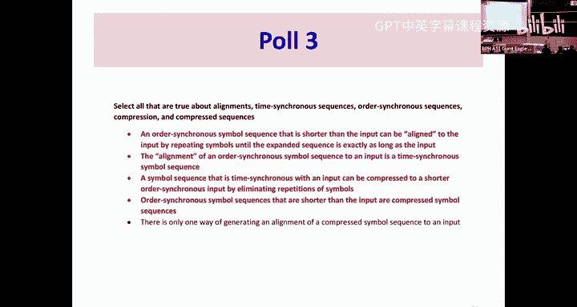
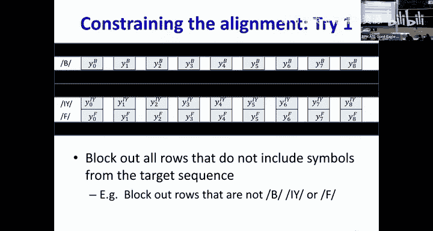
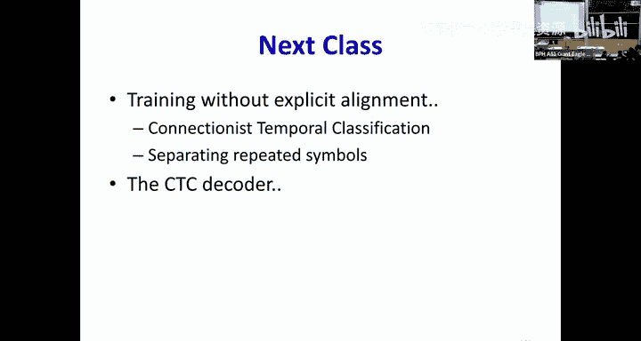

# 15：循环神经网络（RNN）第三部分 🧠

在本节课中，我们将学习如何将循环神经网络应用于输出与输入**异步**的问题，例如语音识别。我们将重点探讨当不知道输出符号在输入序列中的确切位置（即“对齐”信息）时，如何训练模型。

---

## 概述：从同步到异步输出

上一节我们介绍了门控机制（如LSTM、GRU）如何解决RNN的稳定性问题。本节中，我们来看看当输出序列与输入序列在时间上**不同步**时带来的挑战。

在诸如股票预测或词性标注等任务中，每个输入都对应一个输出，这是**时间同步**的。然而，在语音识别或手写识别中，输入是一长串信号（如音频帧），而输出是较短的符号序列（如单词），我们并不知道每个输出符号应该在输入的哪个时刻产生。这就是**顺序同步但时间不同步**的问题。

---

## 将问题转化为时间同步格式

一个直接的思路是尝试将异步输出问题转化为我们熟悉的时间同步问题，以便于训练。

### 通过重复符号进行扩展

假设我们有一个输入序列 `X0...XT` 和一个目标符号序列（例如单词 “but”）。虽然我们不知道 `B`、`U`、`T` 这三个音素在输入时间轴上的确切位置，但我们可以假设：**在属于某个音素的时间段内，网络应该持续输出该音素**。

这意味着，我们可以将短的目标序列（如 `B, U, T`）**扩展**成一个与输入等长的时间同步序列，方法是在未知的对应时间段内重复每个符号。例如，一个可能的扩展是 `B, B, B, U, U, T, T`。

**核心转换**：
- **压缩序列**：顺序同步的短序列（如 “but”）。
- **扩展序列**：通过重复符号得到的、与输入等长的时间同步序列。
- **对齐**：指的就是一个具体的扩展序列，它定义了每个输入时刻“应该”输出哪个符号。

通过这种转换，我们就可以为每个时间步定义一个目标输出，从而将序列级的损失函数转化为各时间步损失之和，便于通过反向传播训练。

---

## 挑战：对齐信息未知

然而，在实际训练数据中，我们**只有输入序列和压缩后的目标序列（如文本转录），并没有对齐信息**。我们不知道 `B`、`U`、`T` 具体应对应到哪些输入帧。

以下是解决此问题的两种思路：

1.  **猜测一个对齐**：使用启发式方法初始化一个对齐，然后迭代优化。
2.  **考虑所有可能对齐**：在计算损失时，不依赖单一对齐，而是考虑所有可能对齐的总体效应。

本节课我们主要探讨第一种方法。

---

## 迭代对齐与训练

我们可以通过一个迭代过程来同时学习模型参数和对齐。

### 算法步骤

以下是该过程的核心步骤：

1.  **初始化对齐**：对于每个训练样本，使用简单启发式方法（如均匀拉伸）生成一个初始的时间同步对齐序列。
2.  **训练模型**：使用当前对齐序列作为每个时间步的目标，以时间同步的方式训练RNN。损失函数是各时间步交叉熵损失之和。
    *   对于目标类别 `c`，在时间步 `t` 的损失为：`L_t = -log(y_t^c)`，其中 `y_t^c` 是网络对类别 `c` 预测的概率。
    *   该损失对网络输出 `y_t` 的梯度是一个向量，仅在目标类别 `c` 对应的位置为 `-1 / y_t^c`，其余位置为0。
3.  **重新估计对齐**：使用当前训练好的模型，为每个输入寻找**最可能**的对齐序列（即最可能的扩展序列）。
4.  **迭代**：用新估计的对齐替换旧的对齐，回到步骤2，重复此过程直至收敛。

这个过程的核心在于第3步：**如何利用当前模型找到最可能的一个对齐？** 这需要一个高效的搜索算法。

---

## 维特比算法：寻找最优对齐

我们需要在**所有可能的扩展序列（即所有有效对齐）** 中，找到概率最高的那一个。这可以建模为一个在**概率网格**中寻找最优路径的问题。

### 构建概率网格

1.  对于给定的输入序列和压缩目标序列（如 “B, E, F, E”），运行当前RNN，得到每个时间步 `t` 上所有符号的概率分布。
2.  构建一个网格，其**行**对应目标序列的每个符号（按顺序，重复的符号占多行），**列**对应输入时间步。
3.  网格节点 `(t, s)` 的分数即为模型在时间 `t` 预测符号 `s` 的概率 `y_t^s`。

### 路径与约束

一条从网格左上角到右下角的路径代表一种可能的对齐。路径需遵循规则：在每一步，只能向右（延长当前音素）或向右下（转移到下一个音素）移动。这保证了路径产生的符号序列在压缩后能得到原始目标序列。

路径的概率是其经过所有节点的概率的乘积。我们的目标是找到概率最大的路径。

### 动态规划求解

直接枚举所有路径是指数级的。我们可以使用**维特比算法**，这是一种动态规划算法，用于高效寻找最优路径。

**算法核心思想**：
- 到达当前节点 `(t, s)` 的最优路径，必然是通过其前驱节点 `(t-1, s)`（来自同一符号）或 `(t-1, s-1)`（来自上一个符号）的最优路径扩展而来。
- 因此，我们只需为每个节点保存两个信息：
    1.  **到达该节点的最高分数**。
    2.  **得到该分数的前驱节点**（用于回溯得到完整路径）。
- 从左到右、从上到下遍历网格，递推计算每个节点的这两个信息。
- 最终，右下角节点的分数即为最优路径分数，通过回溯其前驱节点即可得到完整对齐序列。

**递推公式（取对数后变为加法，更稳定）**：
`score(t, s) = y_t^s * max( score(t-1, s), score(t-1, s-1) )`

---

## 方法总结与局限

本节课我们一起学习了一种处理输出异步问题的经典方法：

1.  **核心思路**：通过将短目标序列扩展为与输入等长的序列，把异步问题转化为时间同步问题。
2.  **训练挑战**：真实数据缺少扩展序列（对齐）信息。
3.  **解决方案**：采用**迭代对齐训练**：
    *   初始化对齐（如均匀对齐）。
    *   训练RNN模型。
    *   用训练好的模型和**维特比算法**重新估计最优对齐。
    *   迭代上述步骤。
4.  **潜在问题**：这种方法严重依赖于初始对齐的质量，容易陷入局部最优。如果初始模型很差，可能导致学习失败。

---

## 展望

下一节课，我们将探讨一种更优雅、不需要显式迭代对齐的解决方案——**连接主义时间分类**。它将所有可能对齐的贡献考虑在内，直接优化目标序列的整体概率，从而避免了初始对齐偏差和局部最优问题，是处理此类异步序列任务的强大工具。