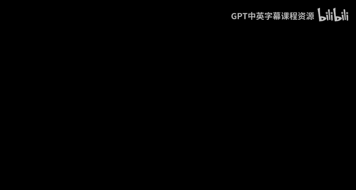
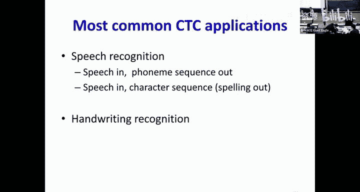

# 16：序列到序列模型 🧠

在本节课中，我们将学习如何使用循环神经网络将一种序列转换为另一种序列。我们将重点关注输出与输入顺序对齐但时间不同步的问题，例如语音识别。我们将探讨如何训练此类模型，特别是当训练数据没有提供精确的时间对齐信息时。

---

## 概述

序列到序列转换是深度学习的核心任务之一。输入是一个序列（如音频帧），输出是另一个序列（如单词）。这两个序列的长度可能不同，并且没有直接的、时间同步的对应关系。本节课，我们将深入探讨一种专门处理此类问题的模型：连接时序分类模型。

---

## 序列到序列问题分类

我们可以将序列到序列转换问题大致分为两类：

1.  **顺序对齐但时间不同步**：输出的顺序与输入的顺序大致对应，但每个输出符号的持续时间可能不同。例如，在语音识别中，说出的单词顺序与识别的文本顺序相同，但每个音素或单词的时长不同。
2.  **无顺序对应关系**：输入和输出序列之间没有直接的顺序对应关系。例如，在机器翻译中，一种语言的句子结构可能与另一种语言完全不同。

本节课我们主要讨论第一类问题。

---

## 训练对齐已知的模型

首先，我们考虑一种理想情况：在训练时，我们不仅知道输入序列 `X1, X2, ..., XN` 和输出符号序列 `Y1, Y2, ..., YM`，还知道每个输出符号 `Yk` 具体对应输入序列中的哪一段时间。

在这种情况下，训练变得相对简单。我们可以通过重复每个输出符号，使其覆盖它所对应的输入时间段，从而将问题转化为一个时间同步的分类问题。

网络的损失函数（散度）是每个时间步上，网络分配给目标符号的负对数似然之和：

**公式：** `D = - Σ_t log( P(Y_target(t) | X) )`

其中，`P(Y_target(t) | X)` 是网络在时间步 `t` 分配给目标符号的概率。

这个损失函数关于网络输出的导数也很容易计算：对于目标符号，导数是 `-1 / P(Y_target)`；对于其他符号，导数为0。

---

## 训练对齐未知的模型（迭代对齐）

然而在现实中，我们通常只有输入和输出序列，而不知道精确的时间对齐信息。如何训练模型呢？

一种方法是**迭代对齐**，步骤如下：

1.  **初始化对齐**：为训练数据提供一个初始的（可能是粗糙的）时间对齐。
2.  **训练模型**：使用这个对齐，像上一节那样训练一个初始模型。
3.  **重新估计对齐**：使用训练好的模型和维特比算法，为每个训练样本找出新的、最可能的时间对齐路径。
4.  **迭代优化**：用新的对齐更新模型，再用更新后的模型重新估计对齐，如此反复，直到收敛。

这种方法虽然有效，但严重依赖于初始对齐的质量。如果初始对齐很差，模型可能会陷入较差的局部最优解。

---

## 训练对齐未知的模型（考虑所有对齐）

为了避免对单一对齐的依赖，我们可以采用一种更优雅的方法：**考虑所有可能的时间对齐**，并优化所有对齐上的**期望损失**。

以下是具体思路：

1.  **构建概率表**：将输入序列通过网络，得到一个概率表，其中包含了每个时间步上每个可能符号的概率。
2.  **提取目标行**：根据输出符号序列（例如 “B E E”），从概率表中提取对应符号的行，构建一个新的表格。这个表格的每一行代表一个输出符号在不同时间步的概率。
3.  **定义对齐图**：这个新表格可以看作一个图。图中的每个节点 `(t, r)` 表示在时间 `t` 输出第 `r` 个目标符号。从左上角到右下角的任何一条路径都代表一种可能的时间对齐方式。
4.  **计算期望损失**：我们不只取最可能的路径，而是计算所有可能路径的损失，并按其概率加权平均。这等价于计算每个时间步上，每个节点损失的期望值。

为了高效计算这个期望损失，我们需要两个关键算法：**前向算法**和**后向算法**。

---

### 前向算法（Forward Algorithm）

前向算法用于计算从图起点到达某个节点 `(t, r)` 的所有路径的概率总和，记为 `α(t, r)`。

**计算规则（递归）**：
`α(t, r) = [α(t-1, r) + α(t-1, r-1)] * y(t, r)`
其中 `y(t, r)` 是节点 `(t, r)` 本身的概率（即网络在时间 `t` 输出第 `r` 个目标符号的概率）。

我们从左向右计算，初始化 `α(0, 0) = 1`（或根据实际情况初始化第一列）。最终，右下角节点的 `α` 值就是整个输出序列对应输入的总概率。

---

### 后向算法（Backward Algorithm）

后向算法用于计算从某个节点 `(t, r)` 到图终点的所有路径的概率总和，记为 `β(t, r)`。我们通常先计算包含当前节点概率的 `β_hat(t, r)`。

**计算规则（递归）**：
`β_hat(t, r) = y(t, r) * [β_hat(t+1, r) + β_hat(t+1, r+1)]`
然后，`β(t, r) = β_hat(t, r) / y(t, r)`。

我们从右向左计算，初始化最后一列的 `β_hat` 值。最终，我们可以得到每个节点的 `β` 值。

---

### 计算后验概率与损失

有了 `α` 和 `β`，我们可以计算对于给定的输入和输出序列，在时间 `t` 对齐到第 `r` 个符号的后验概率 `γ(t, r)`：

**公式：** `γ(t, r) = α(t, r) * β(t, r) / Z`
其中 `Z` 是一个归一化因子，确保每一列（同一时间步）的 `γ` 之和为1。`Z` 通常就是该列所有 `α*β` 的乘积之和。

最终，我们的损失函数（所有对齐的期望负对数似然）可以简洁地表示为：

**公式：** `L = - Σ_t Σ_r γ(t, r) * log( y(t, r) )`

这个损失函数关于网络输出 `y(t, r)` 的导数近似为 `-γ(t, r) / y(t, r)`。这个近似忽略了 `γ` 对 `y` 的依赖，但在实践中效果很好，并且使得反向传播可以顺利进行。

---

## 处理重复符号：空白符号（Blank）

上述方法还有一个问题：如何区分输出中的重复字符？例如，路径 “R R E E D D” 压缩后是 “RED” 还是 “REED”？

解决方案是引入一个特殊的**空白符号（blank）**，通常用 “-” 表示。这个符号是“不可见”的，在最终输出时会被移除。

**规则如下**：
*   网络在每个时间步也会输出空白符号的概率。
*   在构建对齐图时，我们在输出符号序列的每个符号之间以及首尾插入可选的空白符号。
*   **关键规则**：如果两个相邻的真实符号相同（如 “DD”），则它们之间**必须**有一个空白符号，否则在压缩时两个 “D” 会合并成一个。如果两个符号不同，则空白符号是可选的。

引入空白符号后，对齐图会变得更大（包含了空白节点），但前向-后向算法和损失计算的过程完全不变，只是图的连接规则根据上述规则进行了调整。

---

## 推理：如何从模型得到输出序列

训练好模型后，我们如何进行推理（解码）？即给定一个输入序列，如何得到最可能的输出符号序列？

1.  **贪婪解码**：最简单的方法是每个时间步都选择概率最高的符号（包括空白），然后将得到的序列进行压缩（合并重复字符并移除空白）。这种方法速度快，对于CTC模型通常效果不错。
2.  **束搜索解码**：为了找到全局最优的序列，我们需要考虑所有可能的输出序列。直接计算所有序列的概率是指数级的，不可行。因此，我们使用**束搜索**。
    *   在束搜索中，我们不是展开所有可能的序列，而是在每个时间步只保留概率最高的 `K` 个候选序列（`K` 是束宽）。
    *   我们扩展这些候选序列，再次评估并保留最好的 `K` 个，直到处理完整个输入序列。
    *   最后，从最终的 `K` 个候选序列中选出总概率最高的一个（注意：不同对齐可能对应同一输出序列，需要将其概率相加）。

束搜索在计算效率和结果质量之间取得了很好的平衡。

---

## 总结

本节课我们一起学习了连接时序分类模型，这是一种用于处理顺序对齐但时间不同步的序列到序列转换问题的强大工具。

我们重点掌握了：
*   当训练数据没有对齐信息时，通过考虑**所有可能对齐的期望损失**来训练模型。
*   使用**前向-后向算法**高效计算用于损失函数的后验概率 `γ(t, r)`。
*   引入**空白符号**来解决输出中重复字符的歧义问题。
*   模型推理时，可以使用**贪婪解码**或更精确的**束搜索**来获得输出序列。

CTC模型在语音识别、手写识别等任务中有着广泛的应用。理解其核心思想，对于掌握更复杂的序列到序列模型（如下节课将讲的编码器-解码器架构）至关重要。