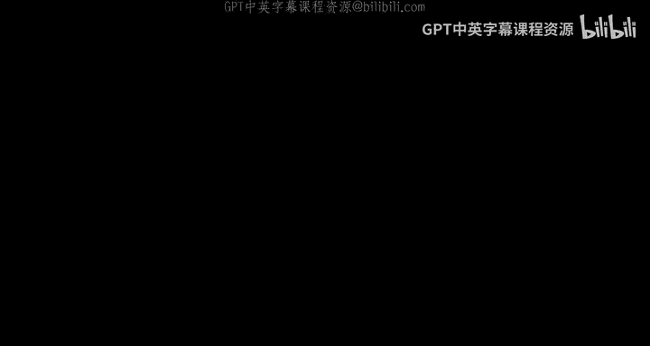
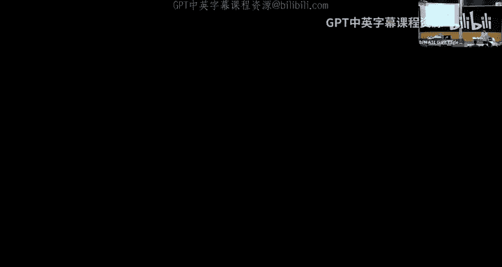
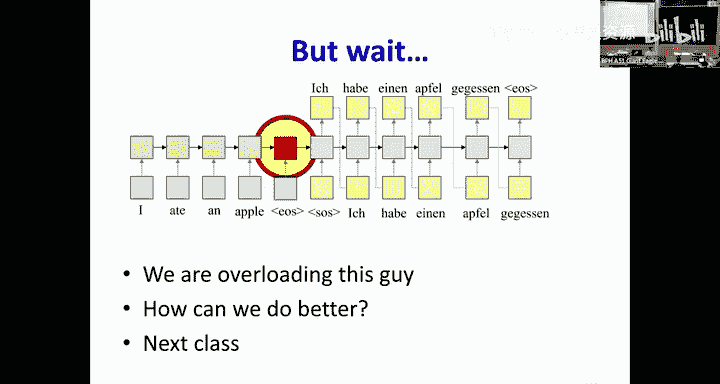

# 17：循环网络 - 语言建模与序列到序列模型 🧠➡️🗣️






在本节课中，我们将学习如何使用循环神经网络来建模语言，并构建一个基础的序列到序列模型。我们将从理解语言建模的核心概念开始，逐步深入到如何将这种模型应用于机器翻译、对话生成等任务。

---

## 语言建模 📚

上一节我们介绍了循环神经网络处理序列数据的能力。本节中，我们来看看如何利用这种能力来建模语言。

语言建模的核心目标是**对语言中所有可能的符号序列（如单词序列）的概率分布进行建模**。一个语言模型可以计算给定符号序列的概率，也可以从这个分布中生成新的序列。

然而，直接对整个序列的概率分布 `P(w1, w2, ..., wN)` 进行建模非常困难，因为可能的序列数量是无限的。为了解决这个问题，我们使用贝叶斯规则将其分解：

**公式：**
`P(w1, w2, ..., wN) = P(w1) * P(w2|w1) * P(w3|w1, w2) * ... * P(wN|w1, ..., wN-1)`

这样，建模整个序列的问题就转化为了一个更简单的问题：**在给定所有历史词的情况下，预测下一个词的概率**，即 `P(下一个词 | 历史词)`。这正是循环神经网络或卷积神经网络（有限历史窗口）可以处理的任务。

以下是语言建模的两个主要应用：
*   **计算序列概率**：通过将序列输入模型，并逐词读取模型预测的“下一个词”的概率，然后将这些概率相乘，即可得到整个序列的概率。
*   **生成新序列**：从起始标记开始，模型每一步都根据当前历史预测下一个词的概率分布，然后从这个分布中采样得到下一个词，并将其反馈给模型，重复此过程直到生成结束标记。

为了使模型知道句子的开始和结束，我们需要在序列中添加特殊的标记：
*   **`<SOS>` (Start of Sequence)**：表示序列开始。
*   **`<EOS>` (End of Sequence)**：表示序列结束。

---

## 词嵌入与表示 🔤➡️🔢

在将词输入神经网络之前，我们需要将其转换为数值表示。最直接的方法是**独热编码**，即每个词用一个很长的向量表示，其中只有对应词索引的位置为1，其余为0。

**代码示例（独热编码概念）：**
```python
# 假设词汇表为 [“cat”, “dog”, “fish”]
“cat” -> [1, 0, 0]
“dog” -> [0, 1, 0]
“fish” -> [0, 0, 1]
```

然而，独热编码有两个主要缺点：
1.  **维度灾难**：词汇表很大时，向量维度极高，非常稀疏且低效。
2.  **缺乏语义**：任意两个不同词向量的距离都相同，无法体现词之间的语义关系（如“国王”与“王后”的相似性）。

为了解决这些问题，我们引入**词嵌入**。其核心思想是通过一个可学习的线性层（一个矩阵），将高维的独热向量投影到一个低维的连续空间中。

**公式：**
`embedding = W * one_hot_vector`

这个投影矩阵 `W` 可以在训练语言模型（如下一个词预测任务）的过程中一同学习。神奇的是，在这个学习到的低维空间中，语义相近的词（如“国王”和“王后”）会彼此靠近，并且词向量之间的算术运算可以捕捉语义关系（如 `king - man + woman ≈ queen`）。

---

## 序列到序列模型 🔄

上一节我们介绍了如何用循环网络建模单一语言。本节中我们来看看如何将其扩展，用于处理输入序列和输出序列可能长度不同、且没有直接对齐关系的任务，例如机器翻译。

我们需要的模型结构是：先完整读取输入序列，然后基于对输入的理解生成输出序列。这引出了**编码器-解码器**架构。

以下是该模型的工作流程：
1.  **编码器**：一个循环神经网络，逐词读取输入序列 `X`，直到遇到 `<EOS>`。编码器最终隐藏状态（图中红框）旨在**概括整个输入序列的信息**。
2.  **解码器**：另一个循环神经网络，它是一个**条件语言模型**。它的初始隐藏状态是编码器的最终状态。解码器以 `<SOS>` 作为第一个输入，开始生成输出序列。
3.  **生成过程**：解码器每一步都基于当前隐藏状态和上一步生成的词，计算下一个词的概率分布。从这个分布中采样（或选择）一个词，作为当前输出，并**反馈给解码器作为下一步的输入**，重复此过程直到生成 `<EOS>`。

**重要**：在训练时，为了稳定学习过程，我们采用“教师强制”策略。即，在解码器的每一步，我们**不**使用上一步模型自己的输出，而是直接使用**真实目标序列中对应的上一个词**作为输入。这确保了训练初期模型也能接收到正确的信号。

---

## 解码策略：从贪婪到束搜索 🧭

模型每一步都会输出一个概率分布，我们如何根据这个分布决定最终的输出序列呢？有以下几种策略：

以下是几种常见的解码策略：
*   **贪婪解码**：每一步都选择概率最高的词。这种方法简单高效，但可能因为早期的局部最优选择而导致最终序列整体概率并非最高。
*   **随机采样**：每一步根据概率分布随机采样下一个词。这种方法能产生更多样化的输出，有时比贪婪解码的结果更流畅、自然，但不保证输出是最优的。
*   **束搜索**：一种折中的启发式方法。它维护一个大小为 `k`（束宽）的候选序列集合。在每一步，对每个候选序列扩展所有可能的下一词，但只保留总体概率（序列所有词概率的乘积）最高的 `k` 个新序列。当有候选序列生成 `<EOS>` 时，可将其作为输出或继续搜索。

束搜索通常比贪婪解码效果更好，但它倾向于生成更短的序列（因为更长的序列概率乘积会累积更多小于1的因子），因此在实际中常需要长度归一化等启发式方法进行调整。

---

## 模型训练与应用 🏋️

序列到序列模型的训练目标是最小化模型预测的分布与真实目标词分布之间的差异（如交叉熵损失）。由于采用了“教师强制”，训练过程是高效且稳定的。

这种简单的编码器-解码器架构非常强大，可以应用于多种任务：

以下是序列到序列模型的一些应用场景：
*   **机器翻译**：编码器读源语言句子，解码器生成目标语言句子。
*   **文本摘要**：编码器读长文章，解码器生成简短摘要。
*   **对话系统**：编码器读用户问题，解码器生成系统回复。
*   **图像描述**：编码器替换为CNN处理图像，解码器生成描述图像的文本。

---

## 总结 ✨

本节课中我们一起学习了循环神经网络在语言建模和序列到序列任务中的应用。我们从统计语言建模的基本概念出发，理解了如何通过下一个词预测来建模整个语言。接着，我们探讨了词嵌入的重要性，它能将离散的符号转化为富含语义的连续向量。

然后，我们重点介绍了**编码器-解码器**架构，这是处理非对齐序列转换任务（如机器翻译）的核心框架。编码器负责压缩输入信息，解码器作为条件语言模型负责生成输出。我们还讨论了不同的解码策略，包括贪婪解码、随机采样和更优的束搜索。



最后，我们看到了这种简单而强大的模型在机器翻译、图像描述等领域的成功应用。然而，这种基础模型有一个关键限制：**编码器需要将整个输入序列的信息压缩到一个固定长度的向量中**，这对于长序列来说是一个信息瓶颈。在下一节课中，我们将学习如何通过“注意力机制”来突破这一限制。