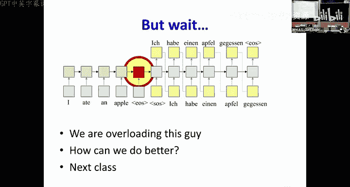

# 19：循环网络 - 语言建模与序列到序列模型 🧠➡️📝


在本节课中，我们将学习如何使用循环神经网络（RNN）来建模语言，并构建一个基础的序列到序列（Seq2Seq）模型。我们将从统计语言建模的基本概念开始，逐步深入到如何构建一个能够将一种序列（如英语句子）转换为另一种序列（如德语句子）的模型。

---

## 概述：什么是语言建模？

语言建模的核心目标是**对语言中所有可能的符号序列（如单词序列）的概率分布进行建模**。简单来说，一个好的语言模型应该能够判断一个句子（如“I ate an apple”）在真实语言中出现的可能性是高还是低，同时也能生成听起来自然的新句子。

然而，直接对整个无限可能的句子空间建模是极其困难的。因此，我们将其分解为一个更易处理的问题：**预测序列中的下一个符号**。给定到目前为止的所有单词，模型需要预测下一个最可能出现的单词是什么。

---

## 从有限历史到循环网络

上一节我们介绍了语言建模的目标。本节中，我们来看看如何用神经网络来实现它。

最初，我们可以尝试使用一个**有限历史模型**，例如一个时间延迟神经网络（TDNN）。它假设下一个单词的概率仅取决于前N个单词。

**公式表示：**
`P(W_n | W_0, W_1, ..., W_{n-1}) ≈ f(W_{n-N}, ..., W_{n-1})`

这里，`f` 可以是一个神经网络。单词通常首先被表示为**独热编码（one-hot）向量**。例如，在一个包含5个单词的词汇表中，“apple”可能被表示为 `[0, 0, 1, 0, 0]`。

然而，独热编码存在两个主要问题：
1.  **维度灾难**：词汇表越大，向量维度越高，且表示极其稀疏。
2.  **缺乏语义关系**：任意两个不同单词的独热向量之间的距离是恒定的（例如√2），无法体现“国王”和“王后”之间的语义关联。

为了解决这些问题，我们引入**词嵌入（Word Embedding）**。

---

## 词嵌入：从稀疏到稠密

为了解决独热编码的问题，我们通过一个可学习的**投影矩阵（线性层）** 将高维的独热向量映射到一个低维的稠密向量空间。

**代码描述（概念）：**
```python
# 假设 vocab_size=10000, embedding_dim=300
embedding_layer = nn.Linear(vocab_size, embedding_dim, bias=False)
# 输入是独热向量，输出是300维的词嵌入
word_embedding = embedding_layer(one_hot_vector)
```

这个投影矩阵是在训练语言模型（即执行“下一个词预测”任务）的过程中**同时学习到的**。神奇的是，在这个学习到的低维空间中，语义相似的单词会彼此靠近，并且还能捕捉到诸如“国王 - 男人 + 女人 ≈ 王后”这样的向量关系。

---

## 循环神经网络作为语言模型

有限历史模型仍然受限于窗口大小。为了考虑**整个历史**，我们自然需要使用**循环神经网络（RNN）**。

一个RNN语言模型在每个时间步 `t` 接收当前的单词输入（或其嵌入）和之前的隐藏状态，然后输出一个**在所有可能单词上的概率分布**，预测下一个单词。

**训练**：我们可以轻松地从大量文本中创建训练数据。给定一个句子“Betty Botter bought butter”，我们可以生成训练样本：
- 输入 `[<SOS>, Betty]`，目标输出 `Botter`
- 输入 `[<SOS>, Betty, Botter]`，目标输出 `bought`
- 以此类推...

其中 `<SOS>` 是代表句子开始的特殊符号。

**两个核心应用**：
1.  **计算序列概率**：要计算整个句子“W1, W2, W3, W4”的概率，只需让RNN依次处理该序列，并在每个时间步 `t` 记录模型分配给实际下一个词 `W_{t+1}` 的概率值，最后将所有概率相乘。
    `P(句子) = P(W1) * P(W2|W1) * P(W3|W1,W2) * P(W4|W1,W2,W3)`
2.  **生成新序列**：从 `<SOS>` 开始，将模型预测的概率分布作为下一个词的抽样依据，抽出的词作为下一步的输入，重复此过程直到抽到 `<EOS>`（句子结束符）。

---

## 序列到序列模型：编码器-解码器架构

上一节我们学习了如何用RNN建模单一语言序列。本节中，我们将其扩展，解决更通用的**序列到序列转换问题**，例如机器翻译、对话生成。

在这种任务中，输入和输出序列之间没有直接的、逐词的对应关系（例如“I ate an apple” -> “Ich aß einen Apfel”）。我们需要一个能先理解整个输入，再生成整个输出的模型。

这就是**编码器-解码器（Encoder-Decoder）架构**，也称为Seq2Seq模型。

以下是该模型的工作流程：

1.  **编码器（Encoder）**：一个RNN（如LSTM）逐词读取输入序列，直到遇到 `<EOS>`。最终时刻的隐藏状态（图中红框）旨在**编码整个输入句子的语义信息**。
2.  **解码器（Decoder）**：另一个RNN负责生成输出序列。它从编码器的最终隐藏状态开始初始化，并以 `<SOS>` 作为第一个输入。
3.  **解码步骤**：在每一步，解码器基于其当前隐藏状态和上一步生成的单词，计算下一个词的概率分布。从这个分布中**采样**（或选择）一个词，并将其作为下一步的输入，循环直至生成 `<EOS>`。

**关键点**：解码器本质上是一个**条件语言模型**。它与普通语言模型的区别在于，它的概率预测以编码器提供的输入序列表示（红框向量）为条件。
`P(Y1, Y2, ... | X) = Π P(Y_t | X, Y1, ..., Y_{t-1})`

---

## 解码策略：如何选择生成的词

在生成输出序列的每一步，我们都有一个概率分布。如何选择下一个词呢？有以下几种策略：

以下是几种常见的解码策略：

*   **贪婪解码（Greedy Decoding）**：每一步都选择概率最高的词。这种方法简单高效，但可能导致“局部最优”而非“全局最优”的序列，因为早期的高概率选择可能将后续引向低概率区域。
*   **随机采样（Random Sampling）**：根据模型输出的概率分布随机抽取下一个词。这能增加生成的多样性，可能产生更流畅、更有创意的文本，但不保证输出是最可能的序列。
*   **束搜索（Beam Search）**：一种折中的方法。它维护一个大小为 `k`（束宽）的候选序列列表。在每一步，它扩展所有候选序列，但只保留总体概率（从序列开始到当前步的概率乘积）最高的 `k` 个。当有候选序列生成 `<EOS>` 时，它可能被输出。束搜索比贪婪解码更可能找到高概率序列，但计算量更大。

---

## 模型训练与总结

**训练方法**：Seq2Seq模型的训练采用一种“教师强制（Teacher Forcing）”策略。即在训练解码器时，我们不使用它上一步**预测**的词作为输入，而是直接使用**真实目标序列**中对应的上一个词作为输入。这确保了训练过程的稳定性，即使模型早期预测不准，也能接收到正确的学习信号。

**损失计算**：在每个解码时间步，我们将模型输出的概率分布与真实的下一个词（独热编码）计算交叉熵损失，然后将所有时间步的损失求和或平均，通过反向传播同时训练编码器和解码器。

**本节课总结**：
在本节课中，我们一起学习了：
1.  **统计语言建模**的本质是对符号序列的概率分布进行建模，通常通过“下一个词预测”任务来实现。
2.  **词嵌入**是将离散符号转化为稠密、富含语义的向量表示的关键技术。
3.  **RNN**是建模序列数据的强大工具，既能计算序列概率，也能生成新序列。
4.  **编码器-解码器架构**是解决序列到序列转换问题的核心框架，其中编码器压缩输入信息，解码器作为条件语言模型生成输出。
5.  生成输出时，可以采用**贪婪解码、随机采样或束搜索**等不同策略，各有利弊。



然而，基础的Seq2Seq模型有一个显著缺陷：编码器需要将**整个输入序列的信息压缩到一个固定维度的向量（红框）中**，这对于长序列来说是一个信息瓶颈。在下一节课中，我们将学习**注意力机制（Attention Mechanism）**，它通过允许解码器在生成每个词时动态地回顾编码器的全部隐藏状态，从而优雅地解决了这个问题。