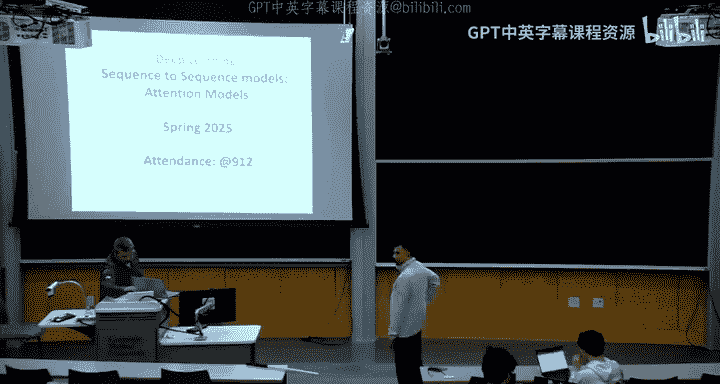
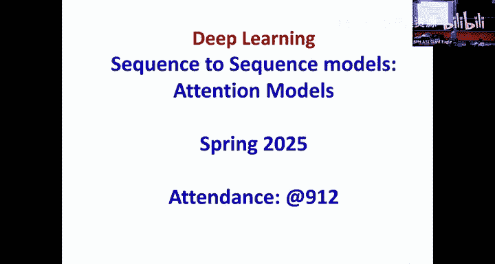
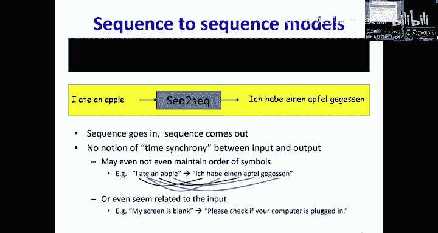
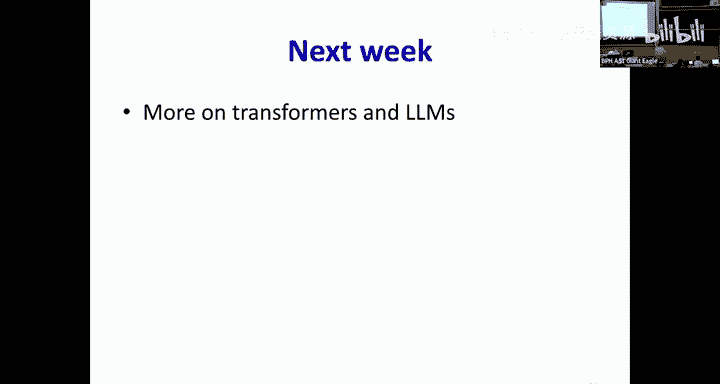

# 20：序列到序列模型：注意力模型 🧠 

## 📖 概述
在本节课中，我们将学习序列到序列模型，特别是注意力模型。我们将探讨如何将输入序列转换为输出序列，即使输入和输出之间没有直接的对应关系或顺序。我们将从基础的编码器-解码器架构开始，逐步引入注意力机制，并最终讨论自注意力与Transformer模型。

---

## 🔄 从基础序列到序列模型开始
上一节我们介绍了序列到序列模型的基本概念。这种模型旨在将一个输入序列转换为另一个输出序列，而输入和输出之间不一定存在一一对应或顺序关系。例如，在英语到德语的翻译中，单词“I”可能对应“Ich”，而单词“ate”可能对应两个不同的德语单词。因此，我们需要一种更灵活的模型来处理这种复杂的映射关系。

我们之前看到的模型是延迟序列到序列模型。整个输入首先由网络的前半部分（编码器）处理，计算出一个最终的隐藏表示，该表示捕获了输入的本质。然后，这个表示由网络的后半部分（解码器）转换以生成输出。

在朴素实现中，我们遇到了一个问题：在解码过程中，通过采样生成的任何单词都不会影响后续的输出。为了解决这个问题，我们将生成的单词反馈回解码器，从而形成了最终的模型架构。

### 基础翻译模型架构
以下是我们的简单翻译模型：
*   **输入序列**：输入到一个循环结构中。
*   **编码器**：循环结构由一个显式的序列结束标记终止，此时我们得到一个捕获所有输入信息的隐藏表示。
*   **解码器**：第二个RNN使用编码器在最终时间步的隐藏激活，以自回归的方式生成输出。它使用该隐藏状态生成第一个单词，然后将该单词反馈回去生成第二个单词，依此类推，直到最终生成序列结束标记。

我们确定了模型的两个不同部分：处理输入的部分称为**编码器**，它把输入编码成一些隐藏表示；生成输出的部分称为**解码器**，它将这些隐藏表示解码为输出。

这个模型可以训练，并且效果不错。然而，它存在一个问题。

---

## ⚠️ 基础模型的问题与改进思路
基础模型的问题是，所有关于输入的信息都存储在解码器初始接收的这一个隐藏向量中。这个隐藏向量随后会沿着解码器的循环结构传递下去。

这里存在两个问题：
1.  **编码器侧的信息稀释**：随着输入序列变长，隐藏表示（尤其是简单RNN）会存在“近期偏向”，即更倾向于表示最近的输入，而较早的输入信息可能会被稀释甚至遗忘。
2.  **解码器侧的信息稀释**：当这个初始隐藏表示沿着解码器循环传递时，每一步解码器都会对其进行处理并融入新生成的单词信息。因此，当解码到序列后部时，初始隐藏向量中的信息可能已被大量遗忘，解码器主要是在响应之前已生成的单词。

让我们逐一解决这些问题。首先考虑第二个问题：初始隐藏向量在解码过程中被稀释。

### 解决解码器侧的信息稀释
一个简单的解决方案是：**在解码器的每一步，都直接将编码器的最终隐藏表示作为输入的一部分**，而不仅仅是第一步。这样，解码器在生成每一个单词时，都能直接访问到编码器的总结信息，从而避免了信息在解码循环中被逐步稀释。

然而，我们仍然面临第一个问题：编码器将所有输入信息压缩到一个静态向量中，远程的、早期的输入信息可能完全丢失。

---

## 🎯 引入注意力机制
实际上，编码器在每个时间步都会产生一个隐藏表示。例如，处理单词“I”时产生一个表示，处理“ate”时在“I”的上下文中产生一个表示，依此类推。每个隐藏框都承载着信息。

此外，观察输出可以发现，输出中的不同单词与输入中的不同单词相关。例如，生成“apple”主要依赖于输入中的单词“apple”，而对其他输入的依赖很小。如果我们将所有信息塞进一个最终的隐藏向量，这种对应关系就丢失了。

### 加权上下文向量
我们如何解决这个问题呢？我们不再仅仅依赖最终的隐藏向量，而是考虑所有隐藏表示的某种加权组合或平均值。这意味着每个隐藏表示都不会被稀释，它们都被平等地呈现给解码器。

但这仍然缺失了一个关键点：单词“apple”与输入中的“apple”更相关，而不是与单词“an”相关。如果只是简单地将所有隐藏表示平均在一起，这种对应关系就丢失了。

因此，我们真正需要的是更高级的东西：**为每个输出单词计算一个不同的加权和**。

这个在每一步输入到解码器的加权和，我们现在称之为**上下文向量**。上下文向量是所有编码器隐藏表示的加权和。

这里的核心思想是：**用于组合这些隐藏表示的权重集，对于每个输出单词都是不同的**。例如，当生成第一个单词“Ich”时，使用权重集 W0 进行组合；当生成“habe”时，使用不同的权重集 W1；生成“einen”时，又使用另一组权重。

如果权重能够以某种方式被计算出来，使得模型学会关注输入中正确的部分，那么这将非常有效。例如，在生成“Apfel”时，我们希望模型关注输入中的“apple”，这意味着“apple”对应的权重应该很高，而其他权重应该很低。生成“gegessen”时，则应关注“ate”。

这意味着权重必须是**动态计算**的，因为每个输出都需要输入的不同加权组合。因此，权重必须是解码器状态的函数。如果模型训练得当，我们期望它能自动突出输入的相关部分。

---

## ⚖️ 如何计算注意力权重？
我们已经确定权重必须动态计算。那么，计算权重时有哪些变量可用呢？在生成某个输出单词时（例如生成“einen”之后），解码器可用的信息是它最新的隐藏状态 S_t。因此，权重必须是 S_t 的函数。

同时，权重也必须依赖于编码器的各个隐藏表示 H_i，因为权重 H_i（例如对应“apple”的 H_3）必须同时依赖于解码器状态 S_t 和 H_i 本身。

因此，在输出时间步 t，对于输入 i 的权重，是 S_{t-1} 和 H_i 的函数。

### 权重的约束条件
权重可以是任意的吗？不能。考虑所有编码器隐藏状态 H_i 存在于某个向量空间区域。如果我们计算它们的加权和作为上下文向量 C，并且希望 C 能合理地代表这些 H_i，那么理想情况下，C 应该位于这些 H_i 所张成的凸包内部。如果某个权重是100，而其他权重是0，C 可能会远远超出这个区域。

如何确保上下文向量保持在这个区域内呢？**让权重为正且和为1**。这样，加权和（即上下文向量）就保证位于这些 H_i 的凸包内部。因此，权重实际上构成了一个概率分布。

### 从原始分数到归一化权重
我们如何得到一组和为1的正权重呢？我们可以通过一个两步骤的过程：
1.  首先，使用一个任意选择的函数 `a`，结合解码器状态 S 和编码器隐藏状态 H，为每个输入计算一个原始分数（或称为“能量值”）。
2.  然后，将这些原始分数通过一个 **Softmax** 函数，转换成一个概率分布（即所有权重为正且和为1）。

这个函数 `a` 可以是简单的内积（如果 S 和 H 维度相同），或者通过一个可学习的矩阵进行变换以使维度匹配（如果 S 和 H 维度不同）。更复杂的函数如小型神经网络也可以，但实践发现简单的矩阵变换效果很好。

---

## 👀 注意力框架与工作流程
为什么称之为“注意力”框架？因为这些权重通过在某些词上赋予高权重、在其他词上赋予低权重，来决定模型在生成当前输出时应该“关注”输入的哪些部分。因此，权重被称为**注意力权重**。

在注意力框架下，我们在每个输出时间步计算一个不同的上下文向量。上下文不是简单地选择权重最高的输入向量，而是所有输入向量的加权组合。对任何输入词的注意力权重，都是该词的编码器隐藏表示与最新解码器状态的函数。

### 带注意力的解码过程
让我们以一个具体例子（“I ate an apple”）来看带注意力的解码过程：
1.  **编码器**：处理整个输入序列，直到序列结束标记，为每个输入词（包括结束标记）计算一个隐藏状态 H_i。
2.  **解码器初始化**：解码器有自己的初始隐藏状态 S_0（例如可以设为0或通过其他可学习机制设置）。S_0 很重要，因为它将用于计算第一个输出词的注意力权重。
3.  **第一步解码**：
    *   使用 S_0 和所有编码器隐藏状态 H_i 计算第一组注意力权重（W0）。
    *   用 W0 对 H_i 加权求和，得到第一个上下文向量 C_0。
    *   解码器的初始输入通常是一个“序列开始”标记。
    *   将 C_0 和“序列开始”标记一起输入解码器，解码器计算第一个输出词的概率分布（例如“Ich”），并从中采样得到第一个词 y_0。
    *   解码器更新其隐藏状态到 S_1。
4.  **后续解码步骤**：
    *   在时间步 t，使用最新的解码器状态 S_{t-1} 和所有 H_i 计算新的注意力权重。
    *   用新权重计算新的上下文向量 C_t。
    *   将 C_t 和上一步生成的词 y_{t-1} 一起输入解码器。
    *   解码器输出当前词的概率分布，采样得到 y_t，并更新隐藏状态到 S_t。
5.  **终止**：重复此过程，直到解码器生成“序列结束”标记。

---

## 🔑 查询、键与值（Query, Key, Value）
在更精细的注意力实现中，我们通常不会直接使用原始的隐藏状态 H。考虑生成“einen”时，我们需要判断“an apple”中的“apple”是食物。这涉及两个层面的信息：一是类别信息（这是食物），二是具体信息（这是苹果）。

为了做这种区分，我们喜欢将 H 投影到两个不同的子空间：
*   **键**：一个更粗略的投影，用于获取类似类别的信息（例如“这是食物”）。键用于计算注意力权重。
*   **值**：一个更详细的变换，用于获取具体信息（例如“这是苹果”）。值用于在计算上下文向量时进行加权求和。

因此，我们使用加权和的值，而不是原始的 H。同时，在解码器侧，我们通常也将解码器状态 S 投影到一个与键维度相同的向量，称为**查询**。

在特殊情况下，如果查询、键、值和 H 都相同，那就是我们之前用于说明的简单形式。但在实际实现中，通常会从隐藏表示中派生出独立的键和值。

### 计算过程
1.  从编码器隐藏状态 H_i 通过可学习矩阵 W^K 和 W^V 分别计算键 K_i 和值 V_i。
2.  从解码器状态 S_{t-1} 通过可学习矩阵 W^Q 计算查询 Q_t。
3.  使用查询 Q_t 和所有键 K_i 计算相似度分数（例如点积），然后通过 Softmax 得到注意力权重。
4.  使用注意力权重对所有的值 V_i 进行加权求和，得到上下文向量 C_t。

---

## 🎯 训练：教师强制（Teacher Forcing）
这个模型的训练目标是什么？对于机器翻译，我们希望找到给定英语句子下最可能的德语句子。输出序列的概率是解码器分配给序列中每个词的概率的乘积。

然而，直接找到最可能的序列需要在所有可能的序列上进行评估，这是不可行的。因此，我们使用**束搜索**作为启发式方法，在每一步只保留概率最高的 K 个候选序列。

### 训练挑战与教师强制
在标准神经网络训练中，我们进行前向传播，将输出与目标比较，计算损失并反向传播。但对于序列到序列模型，在训练初期，模型性能很差，无论输入什么，都可能生成乱码。如何将这种乱码输出与目标序列“Ich habe einen Apfel gegessen”进行比较呢？没有明显的对应关系。

为了解决这个问题，我们在训练时**引导解码器**。具体方法是：在解码器的每一步，我们不是将解码器自己上一步生成的词（可能是错误的）作为输入，而是将**真实的目标词**作为输入。这被称为**教师强制**。

这就像学骑自行车时，有人扶着车帮你保持平衡。没有这种引导，模型在初期很难学会生成有意义的序列。

### 教师强制比率与课程学习
但是，如果训练时一直使用真实目标词（即一直扶着自行车），模型在推理时（需要自己生成输入）可能会表现不佳，因为它从未练习过在之前可能出错的条件下继续生成。

因此，我们需要引入**课程学习**的思想。随着模型训练得越来越好，我们逐渐降低使用真实目标词（教师强制）的频率，而是以一定概率使用模型自己上一步生成的词作为输入。这个概率就是**教师强制比率**。在训练初期，该比率较高（更多引导）；随着训练进行，该比率逐渐降低（更多让模型自己尝试）。

当使用模型自己生成的词时，采样过程是不可微分的。为了在训练中也能反向传播，我们可以使用**Gumbel-Softmax重参数化技巧**，它提供了一种可微分的近似采样方法。

---

## 👁️ 注意力权重的可视化
我们如何知道注意力机制是否有效？一个很好的方法是**可视化注意力权重**。例如，在机器翻译任务中，我们可以绘制一个对齐图，横轴是输入词，纵轴是输出词，每个单元格的亮度表示生成某个输出词时对某个输入词的注意力权重。

在早期的注意力论文中，可以清晰地看到，当翻译英语“European Economic Area”为法语“zone économique européenne”时，注意力权重的路径会反转，以匹配法语中形容词后置的语序。这种可视化是调试模型和理解其行为的强大工具。

注意力模型也被成功应用于图像描述生成等任务，其中编码器是卷积神经网络，解码器是RNN。可视化显示，当生成“girl”时，模型关注图像中女孩的区域；生成“trees”时，则关注背景中的树木区域。

---

## 🧠 从注意力到自注意力与Transformer
我们有了基于注意力的编码器-解码器模型。但这里有一个问题：如果解码器可以通过注意力单独关注编码器的每一个隐藏状态，那么我们是否还需要编码器中的循环结构？循环的目的是将信息向前推送并累积。但如果编码器要对每个输入步骤单独关注，我们还需要这种推送吗？

不一定需要。但编码器中的循环有一个重要作用：**为每个单词提供上下文信息**。例如，单词“apple”的含义（是水果还是公司？）需要根据其相邻单词（如“ate”）来判断。如果不使用循环，我们如何让单词的表示包含其上下文信息呢？

答案就是使用**注意力机制本身**。我们可以让输入序列中的每个词，通过注意力机制，去关注序列中的所有其他词（包括自己），从而更新自己的表示。这被称为**自注意力**。

### 自注意力块的工作方式
1.  对于输入序列中的每个词，首先通过一个嵌入层得到初始表示。
2.  从每个词的表示中，计算出查询、键和值（通过不同的可学习投影矩阵）。
3.  为了更新词“I”的表示，我们使用“I”的查询与所有词的键（包括“I”自己的键）计算注意力权重。
4.  然后，用这些注意力权重对所有词的值进行加权求和，得到“I”更新后的表示。
5.  对序列中的每个词并行地重复此过程。

这个过程允许每个词直接访问序列中任何位置的词的信息，不受距离限制，从而更好地捕获长距离依赖。

### 多头注意力
我们可以将上述过程重复多次，每次使用不同的、独立的查询、键、值投影矩阵。每一次称为一个**注意力头**。每个头可能会学习关注不同方面的信息（例如语法、语义、指代等）。然后将所有头输出的更新表示拼接起来，再通过一个前馈神经网络（通常是带有一个隐藏层的MLP）进行混合和变换。这就是**多头注意力**。

由自注意力层和前馈层组成的模块，可以堆叠多次，构成一个强大的序列处理器。

---

## 📍 位置编码（Positional Encoding）
自注意力有一个明显的缺陷：它本身是**排列等变的**。也就是说，打乱输入序列的顺序，输出序列的表示也会以同样的方式被打乱，但模型无法感知原始的单词顺序。然而在语言中，顺序至关重要。

如何将位置信息注入到模型中呢？我们需要一种方法，使得在计算两个词的注意力时，能考虑到它们之间的距离。我们希望距离较远的词，获得的注意力权重通常应该更低（尽管不是强制为零）。

一种巧妙的方法是**位置编码**。我们将一个依赖于位置的向量 P_t 添加到每个词的初始嵌入向量中。这个位置向量需要设计成具有以下性质：两个位置编码向量的内积 P_i · P_j 仅依赖于它们的位置差 |i - j|。

### 正弦位置编码
一个经典的解决方案是使用**正弦和余弦函数**来构造位置编码。对于位置 `pos` 和维度 `i`：
*   偶数维：`PE(pos, 2i) = sin(pos / 10000^(2i/d_model))`
*   奇数维：`PE(pos, 2i+1) = cos(pos / 10000^(2i/d_model))`

这种编码方式使得模型能够轻松地学习到相对位置关系。通过将位置编码与词嵌入相加，自注意力机制在计算相似度时，就会自然地包含位置信息，从而让模型知道“an”紧挨着“apple”与远离“apple”是不同的。

---

## 🎭 编码器与解码器中的自注意力
现在，我们可以用一系列的多头自注意力块和前馈层来构建**编码器**，完全取代循环网络。

对于**解码器**，我们也可以做类似的事情，但有一个关键区别：在生成某个输出词时，解码器不能“看到”未来的词（即尚未生成的词）。因此，解码器中使用的是**掩码多头自注意力**。具体做法是，在计算注意力权重时，将当前时间步之后的所有位置的权重设置为负无穷（在Softmax前），这样经过Softmax后，这些位置的注意力权重就变成了0。这确保了自回归属性。

解码器通常由掩码自注意力层、编码器-解码器注意力层（即标准的注意力，查询来自解码器，键和值来自编码器）以及前馈层组成。

---

## 🤖 Transformer：注意力即一切
将基于自注意力的编码器和解码器堆叠起来，就构成了**Transformer**模型（“Attention Is All You Need”论文）。它完全摒弃了循环，实现了高度的并行化，训练速度极大提升。

Transformer催生了现代大语言模型的两大主流架构：
*   **仅解码器模型**：如GPT系列。它们只使用Transformer的解码器部分（带掩码的自注意力），通过自回归方式生成文本，在大量文本上预训练后，在众多任务上表现出色。
*