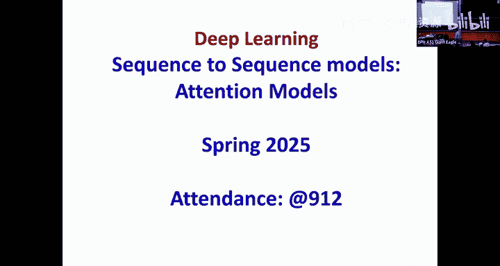
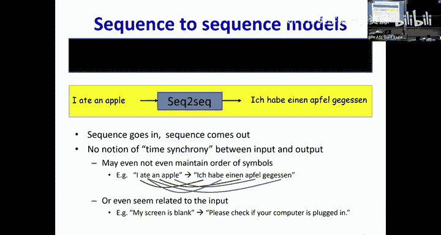
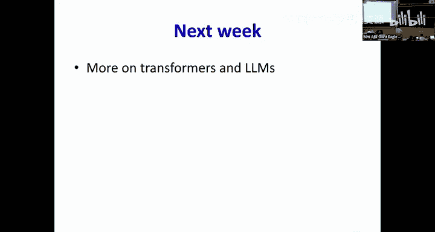

# 21：序列到序列模型与注意力机制 🧠

在本节课中，我们将要学习序列到序列模型的核心架构，特别是如何通过注意力机制来解决传统编码器-解码器模型在处理长序列时信息丢失的问题。我们将从基础的延迟序列到序列模型出发，逐步引入注意力框架，并最终理解其如何演变为强大的Transformer模型。

## 概述

上一节我们介绍了基础的序列到序列模型，它通过一个编码器处理输入，一个解码器生成输出。本节中我们来看看这种基础模型在处理长序列时面临的核心挑战，以及注意力机制如何巧妙地解决这些问题。

## 基础序列到序列模型及其问题

我们之前看到的模型是一种延迟序列到序列模型。整个输入序列首先被网络的前半部分（编码器）处理，计算出一个最终的隐藏表示，用以捕捉输入的本质。随后，网络的第二部分（解码器）将这个表示转换为输出序列。

这个简单的循环神经网络实现有一个问题：在解码过程中，通过采样生成的任何一个词都不会直接影响后续的输出。因此，我们实际上让生成的词反馈回去，从而得到了我们最终的模型。

以下是我们的简单翻译模型结构：
*   输入序列送入一个循环结构。
*   循环结构以一个显式的序列结束标记终止，此时你得到一个捕捉了所有输入信息的隐藏表示。
*   然后，第二个RNN使用这个最终时刻的隐藏激活，以自回归的方式生成输出。用它生成第一个词，该词接着用于生成第二个词，依此类推，直到最终生成序列结束标记。

我们还将模型划分为两个不同的组件：处理输入的部分称为**编码器**，它将输入编码为一些隐藏表示；生成输出的部分称为**解码器**，它将编码器计算的隐藏表示解构为输出。

这个模型存在一个问题。所有关于输入的信息都存储在这个单一的隐藏向量（红框内）中。然后，这个隐藏向量被传递给解码器循环网络，并一直传递到最后。这里有两个问题：
1.  **编码器侧**：随着输入越来越长，隐藏表示（如我们所知）总是存在“近期偏向性”。它们会更倾向于表示最近的输入，而淡化甚至遗忘遥远过去的信息。这意味着，当关于“I”的信息到达这里时，该信息可能已经被稀释甚至遗忘了。如果输入很长，这将是一个问题。
2.  **解码器侧**：这个隐藏表示在解码器侧的循环中传递时，每次传递解码器都会对其进行一些处理，因此信息被转换并有所减弱。因为解码器不断从这些生成的词中收集额外的输入，所以当你到达输出序列末尾时，红框中的内容在很大程度上被遗忘了，你实际上只是在响应解码器侧之前生成的内容。

## 注意力机制的引入

让我们逐一解决这些问题。首先考虑第二个问题：隐藏表示在网络传递过程中被稀释。如何解决？

一个简单的解决方案是：在解码器的每一步，不仅将上一步生成的词作为输入，还将编码器的最终隐藏表示（红框）也作为输入。这意味着，解码器侧的“近期偏向性”被消除了。这是我们想要做的。

但你仍然有另一个问题：在输入侧，信息在不断传入时被稀释。你将所有关于输入的信息压缩到一个单一的向量中。这个向量以某种静态方式打包了一切，而关于遥远过去（即开头）的信息可能完全丢失了。这个向量信息过载。

实际上，编码器每一步的隐藏表示都承载着信息。例如，第一个隐藏框承载关于单词“I”的信息，第二个在“I”的上下文中承载关于单词“ate”的信息，第三个在“I ate”的上下文中承载关于单词“an”的信息，等等。每一个框都代表着信息。

此外，如果你观察输出，会发现输出中的不同词与输入中的不同词相关。例如，生成“Apfel”很大程度上依赖于输入中的“apple”，而对输入的其他部分依赖很小。然而，如果我将所有信息塞进那个单一的红框，这个对应关系就丢失了。

如何解决这个问题？首先考虑输入侧信息不断被稀释的事实。

我可以这样做：我不只读取最终的红框，而是考虑所有这些隐藏表示的某种加权和或平均值。这意味着它们都没有被削弱，每一个都平等地呈现给解码器。

但这仍然遗漏了一个关键点：当生成“Apfel”时，它更多地与“apple”相关，而不是与单词“an”相关。仅仅将它们全部平均在一起，这种对应关系就丢失了。

因此，我们真正需要的是稍微更高级的东西。像这样：我们为每一个输出词，计算这些隐藏表示的不同加权和。

在这里，我们在每个时间步输入的内容现在被称为**上下文向量**。上下文是所有输入隐藏表示的加权和。这里的核心思想是，对于每个输出词，组合这些隐藏表示的权重集合是不同的。

例如，当生成第一个词“Ich”时，它们以某种权重W0组合。当生成“habe”时，它们使用另一组权重W1组合。对于“einen”，又有一组不同的权重。因此，对于每一个输出，你都会查看隐藏表示的不同加权和来计算上下文，然后用它来生成输出。

如果权重能够以某种方式被神奇地计算或推导出来，使得模型学会关注正确的事物，那么这将起作用。例如，在生成“Apfel”时，你希望关注输入侧的哪个部分？是“apple”。这对权重意味着什么？对应于“apple”的权重必须高，而其他权重必须低。另一方面，如果生成“gegessen”，我必须关注什么？是“ate”。这意味着你希望“ate”的权重高，其他权重低。

因此，权重必须是动态计算的。因为在每个输出时刻，你都需要输入的不同加权组合。所以，权重必须作为解码器状态的函数动态计算。如果模型训练良好，我们期望这将自动突出输入的相关部分。

## 注意力权重的计算

那么，这些权重是如何计算的呢？首先，我们已经确定权重必须是动态计算的。

让我们看看在计算权重时，我们有哪些可用的变量。当我们计算权重时，依赖于训练这个神奇的过程来找出如何使用我们提出的程序正确计算权重。

在生成“einen”之后的词时，解码器可用的信息是什么？解码器唯一可用的信息是最新的隐藏状态S2。因此，这些权重必须是S2的函数。同时，权重也必须是这些编码器隐藏状态H的函数。例如，计算对应于“apple”的权重时，它必须依赖于S2，也必须依赖于H3，因为H3是从编码器侧的“apple”派生出来的。

这意味着，在每个输出时刻T，对应于输入的权重是S_{T-1}和所有H的函数。

但还有一个要求：权重可以是任意的吗？不能。因为权重代表一个分布，它们必须都是正数，并且和为1。如果你使权重和为1，那么你就能保证加权和位于所有H的外壳（凸包）内。这样，它们对于相关部分会很高，对于其他部分则很低。

如何使一堆权重既是正数又和为1？我可以使用softmax函数。因此，我将通过一个两步过程计算权重：首先，使用我选择的任意函数（该函数结合了解码器侧的S和编码器侧的H）计算一些原始权重。然后，我将它们通过一个softmax层，将它们转换为一个概率分布。

## 注意力框架

为什么我称之为注意力框架？这些权重在做什么？一旦这些权重成为一个分布，基本上，对于任何词，权重高意味着“关注”那个词，权重低意味着“较少关注”那些词。因此，你可以将权重看作是一种机制，用于确定应该关注输入的哪些部分。这就是注意力形式主义，权重被称为**注意力权重**。

在注意力框架中，我们在每个输出时间步计算一个不同的上下文向量。上下文不是选择具有最高权重的输入向量，而是选择所有输入的加权组合。对任何输入词的注意力权重是该词的编码器隐藏表示和最新解码器状态的函数。

注意力函数E是什么？有各种可能性。H是隐藏状态向量，S是另一个隐藏状态向量。如果两个向量长度相同，那么我可以直接计算两者之间的内积，得到一个标量。如果我有两个长度不同的向量，我可以计算矩阵内积，在两者之间插入一个矩阵以确保尺寸匹配。

如果S是一个m×1向量，H是一个n×1向量，我能直接计算它们的内积吗？不能，因为它们尺寸不同。如何将H转换为与S相同的大小？我可以将H乘以一个矩阵。如果H是n×1向量，W是m×n矩阵，那么S^T（1×m）乘以W（m×n）再乘以H（n×1），整个结果将变成一个标量。中间的矩阵是一个可学习的参数，它使两边尺寸匹配。

你可以有更复杂的函数，比如通过一个MLP。但我们发现简单的矩阵内积效果最好。所以，我们通常使用矩阵内积。

## 带注意力的解码过程

让我们以一个典型过程为例，假设使用矩阵内积作为注意力函数。
1.  输入“I ate an apple”通过编码器，编码器计算所有这些隐藏状态，直到序列结束标记被处理。
2.  在解码器侧，解码器现在独立于编码器，因此解码器的隐藏状态必须有自己的初始值。最简单的设置是将其设为零。
3.  这个初始状态S_{-1}很重要，因为它实际上用于计算解码器侧第一个词的所有输入的权重。
4.  一旦有了S_{-1}，你就可以计算所有输入词对应的权重W0。
5.  然后，你计算第一个上下文向量，作为所有输入词隐藏表示的加权和。
6.  解码器侧的初始输入将是一个开始序列标记，表示我们开始生成。
7.  以这两个（上下文和开始标记）作为输入，解码器现在计算词的概率分布。
8.  然后，你可以从这个概率分布中抽取下一个词，比如“Ich”。
9.  现在，这个词被反馈回去用于下一个时间实例。但然后我需要再次计算输入的注意力权重。为了计算注意力权重，我现在将使用S0。
10. 使用S0，我得到所有输入的注意力权重，计算一个新的上下文向量作为输入隐藏表示的加权和。
11. 新的上下文向量输入解码器。在下一个时间步，我再次计算一个概率分布，从中可以采样一个词。那个词被反馈回去。
12. 现在，S1是我可用的最新解码器状态。因此，S1将用于计算输入的注意力权重。
13. 然后，使用S1为输入计算的注意力权重将用于计算上下文向量C2，依此类推。
14. 你不断重复这个过程，直到最终生成一个序列结束标记。

## 键值对注意力

我们可以对此做一些小的修改。考虑一下，当我在“Ich habe einen”之后，想要决定下一个词必须是什么时，我必须计算注意力权重。当我在“einen”时，“我吃了一个苹果”这个事实与“它是一种可以吃的食物”这个事实一样重要吗？什么真正决定了注意力权重？我应该关注一般的食物，还是应该具体关注苹果？

为了弄清楚我要关注什么，我需要“类别”信息，知道它是一种食物。但一旦我弄清楚应该给予它多少关注，仅知道“这是一种食物”是否足够？还是我应该考虑它实际上是“一个苹果”这个事实？这是两个不同层次的信息。

为了区分这一点，我们喜欢将H投影到两个不同的子空间。一个更粗略的投影将其转换为“食物”级别，这就是我们所说的**键**。一个更详细的转换说明“这是一个苹果”，这就是我们所说的**值**。因此，我们不是直接使用原始的H，而是喜欢将其投影到更简单的东西上。

我们使用一个投影矩阵从H派生出称为“键”的东西。但一旦你计算出注意力权重，为了知道你要翻译的到底是什么，你需要知道它具体携带什么信息，所以你从H计算出称为“值”的东西。

因此，键实际上是用来计算注意力权重的，但一旦你计算出注意力权重，你要平均的项是值。这是有道理的。我们使用值的加权和。在查询侧也有一个相应的矩阵（通常不需要两个独立的矩阵），以确保查询降到与键相同的大小。

在K、V和H都相同的特殊情况下，这就是我目前用来举例的简单例子。那时我们不进行特定的投影。但请记住，当你实际实现这个机制时，你通常从这些隐藏表示中派生出独立的键和值。

## 训练与教师强制

整个过程的实际目标是什么？如果我像以前一样执行机器翻译，我想为这个特定的英语句子推导出最可能的德语句子。现在，输出上任何特定句子的概率是多少？这简单地是解码器分配给输出中每个词的概率的乘积。

像上一节课一样，天真地计算这个概率是具有挑战性的。由于自回归，每个词都被反馈回去，你必须整体考虑每个句子，计算其概率。这意味着找到最可能的句子需要你评估宇宙中每个句子的这个概率，并选择概率最高的那个。这是不可行的。我们如何解决？我们使用**束搜索**。

那么，我们如何训练网络？在神经网络的标准训练中，你执行推理，它生成一个输出。然后你将输出与目标输出进行比较，计算差异，并将其反馈回去。

如果你从这个角度看待这个网络，那么这个网络确实具有这样的结构。如果你使用传统的神经网络训练机制，对于每个训练实例，你只需传入输入，它会生成一些输出。然后你可以将输出与你真正想要的目标进行比较，计算差异并将其反馈回去。但这不是我们在这里所做的。我们将把它像语言模型一样对待。

你希望输入传入后，它生成一系列概率分布。你想计算与目标分布的差异，反向传播，并用它来更新解码器和编码器，以及注意力框架的任何参数（如果它有参数的话）。

挑战在于：如果我使用这个简单的机制，我传入一些输入，生成一些输出，然后尝试将输出与目标输出进行比较，在训练的初始阶段，模型将非常糟糕，无论你输入什么，它都会生成垃圾。如何将其与“Ich habe einen Apfel gegessen”进行比较？没有对应关系，没有一对一的对应关系，甚至没有明显的匹配机制来计算差异。

因此，我们将在训练期间引导解码器。我们以实际允许我们计算网络实际输出与期望输出之间一对一对应关系的方式来引导解码器，方法是在解码器侧输入实际的输出。

这意味着在解码器侧，这些输入的词不是从输出中抽取并反馈回去的，而是给出实际的输出。这意味着在这一点上，解码器实际上已经看到了“Ich habe einen”，并且知道下一个词必须是“Apfel”。然后，它可以将输出概率分布与单词“Apfel”进行比较，然后计算差异，这可以用来纠正网络。

所以，你通过提供这个额外的引导（即实际输出本身）来帮助网络。在某种意义上，这是“作弊”，因为你提供了很多在推理期间无法获得的引导。但没有它，我们实际上无法训练模型。这就是我们所说的**教师强制**。

从传统训练的角度来看，它在前向传递过程中作弊，因为真实标签与输入一起被输入。我们称之为教师强制，就像在教室里老师引导你完成过程一样。

我们也可以将其视为学习骑自行车。你第一次骑自行车时，是直接跳上去开始蹬吗？如果你那样做，会发生什么？你会摔倒。所以你做了什么？用了训练轮，或者让你的朋友或父亲扶着自行车帮你蹬。但如果你父亲总是扶着自行车让你蹬，你还能学会骑自行车吗？所以他每隔一段时间就会放手，当你开始摔倒时，他会再次抓住自行车。

我们想做一些类似的事情。这种引导就像你的父亲或朋友在你蹬车时扶着自行车。但每隔一段时间，你希望他们放手。那么他们什么时候开始放手？当他们确信你可以保持平衡一小会儿时。所以，相应的等价做法是，每隔一段时间，我们不给解码器实际的输出作为输入，而是从输出分布中抽取一个样本并输入那个。那可能是错误的，但尽管如此，这就像定期放开自行车一样。最终，模型实际上也会学会这一点。

那么，你多久会这样做一次？在早期阶段，模型状态很差，你一直引导它。随着它变得更好，你开始每隔一段时间放手，并进行纠正。你实际放手的频率，或者说你引导系统的频率，就是你的教师强制比率——你提供实际目标与抽取样本的频率之比。

这里有一个问题：当你从分布中抽取样本并反馈回去时，这个过程是不可微的。为了使其可微，你需要一些额外的技巧。这就是著名的Gumbel噪声技巧。事实证明，从分布中抽取是不可微的，但如果你使用带有对数概率作为参数的Gumbel分布，然后只选取峰值，这在统计意义上与从原始分布中抽样相同。一旦你将其转换为argmax，argmax可以转换为softmax，而softmax是可微的。这是当你想要在训练中引入抽样时经常使用的标准重参数化技巧。

## 注意力机制的可视化与扩展

我们如何知道这整个方案是否有效？如果我们检查注意力权重，我们可以判断。例如，我在进行机器翻译。如果我看注意力权重，我可以观察它是否确实关注了输入的正确区域。事实上，当你编码这个时，如果遇到问题，你总是想可视化你的注意力权重，以确保它们看起来没问题。如果它们看起来不对，那么无论模型生成什么，都说明你的模型有问题。

让我们看看这个东西是否真的学会了。以下是一些来自早期论文的例子（例如Bahdanau等人的论文），用于机器翻译。当生成法语句子的第一个词“L'”时，你最想关注什么？它最关注的是“agreement”。确实，它关注的是“agreement”。然后“accord”对应于“on”，它关注的是“on”。然后“sur”对应于“the”，它关注的是“the”。现在有一些有趣的事情：英语和法语之间的词序会发生变化。在英语中，你会说“European Economic Area”，而在法语中，你改变词序说“zone économique européenne”。所以，如果你看它在生成单词“zone”时关注什么，它关注的是“area”，但那不在对角线上。因此，在“European economic area”这一小部分，注意力模式反转了方向，沿着负对角线，正如它应该的那样。然后随后，它继续沿着对角线前进。这非常漂亮。

那么，我们如何训练网络？我们已经看到了训练网络如何执行推理，但训练是略有不同的事情。在神经网络的标准训练中，你执行推理，它生成一个输出。然后你将输出与目标输出进行比较，计算差异，并将其反馈回去。

## 自注意力与Transformer

如果我的解码器要单独关注这些编码器隐藏状态中的每一个，那么循环的意义是什么？我真的需要这个循环吗？循环的目的是不断向前推送信息，使其在传递过程中不断累积。但编码器将单独关注每个输入步骤。我们是否需要通过循环向前推送信息？从表面上看，这似乎不是必需的，所以我可以去掉这个循环。

但这有一个问题。问题在于，虽然你显然不需要在H4中存储关于单词“ate”的信息，但这些H实际上是什么？这些H是单词的表示。单词的表示取决于它的含义。单词“apple”是水果还是公司？在这个上下文中，它是什么？线索是“ate”，所以你必须考虑单词“ate”来决定隐藏表示必须是什么。有什么机制可以让你在不使用循环的情况下查看相邻单词来计算更新的表示？我可以使用注意力本身。

因此，使用注意力框架本身在嵌入中引入上下文特异性，这样序列到序列模型的编码器可以在没有循环的情况下组成。这被称为**自注意力**。Transformer使用的就是这种机制。

这是如何工作的？首先，对于输入序列中的每个单词，你可以计算初始隐藏表示（例如，使用一个MLP层）。然后，从每个单词中，你计算一个查询、一个键和一个值。为了更新单词“I”的表示，我将使用“