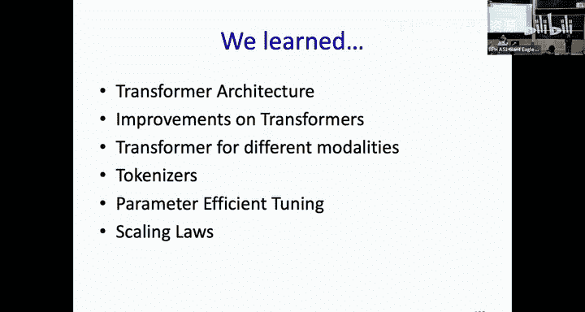
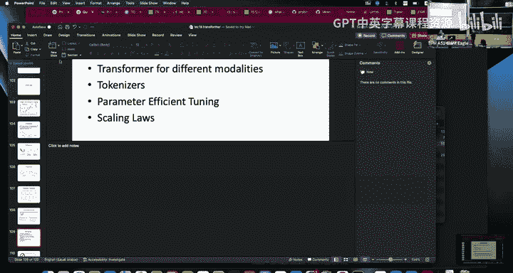

# 22：Transformer 与新型架构

## 📖 概述
在本节课中，我们将深入探讨 Transformer 架构，这是当今强大 AI 系统（如 ChatGPT）背后的核心构建模块。我们将从原始的 Transformer 架构开始，逐一剖析其每一层的工作原理，然后讨论针对不同组件的改进。我们还将深入研究注意力机制的变体，包括更高效的版本，并探索 Transformer 如何适配音频和图像处理。最后，我们将介绍参数高效微调技术，并讨论模型的缩放定律。

---

## 🤔 为什么学习 Transformer？
Transformer 之所以重要，是因为当前几乎所有先进的 AI 系统都基于它。它具备几个关键特性：
*   **架构灵活性**：Transformer 最初为自然语言处理（NLP）设计，但能轻松泛化到不同模态（如视觉、音频、机器人），只需对架构进行最小改动。
*   **可扩展性**：Transformer 的性能随着数据和参数的增加而提升，这种提升是可预测的。在规模足够大时，Transformer 会展现出无需显式训练即可解决任务的“涌现能力”。
*   **高效微调**：可以通过如 LoRA 等技术，高效地对预训练的 Transformer 进行下游任务微调。

---

## 🏗️ 原始 Transformer 架构解析
上图展示了2017年提出的用于机器翻译的原始 Transformer 架构。它基于多头注意力机制，并包含嵌入层、位置编码、前馈层和归一化层等核心组件。该图展示了编码器-解码器架构，但 Transformer 也可以仅使用编码器（左半部分）或仅使用解码器（右半部分），具体取决于任务。

接下来，我们将以文本模态为例，拆解 Transformer 架构的每一层。

### 1. 文本的数值化表示
首先需要将文本转换为 Transformer 可以处理的数值表示。前两个组件可能因模态而异，但其余组件是 Transformer 块的核心。

#### 分词
分词是将文本拆分为更小的单元（词元）并转换为整数的过程。这些单元可以是完整单词、子词或字符。现代模型大多使用子词分词，因为词级分词可能因拼写错误、词形变化或训练数据中未出现该词而引入问题。子词分词通过允许模型表示未见过的词来处理这些情况。

#### 词嵌入
使用分词器将词转换为整数后，我们通过嵌入层将这些离散的词元索引转换为连续的向量表示。该层就像一个查找表，每个词元都映射到一个唯一的向量表示。这些向量在训练过程中学习，以捕获词之间的关系。我们这样做是因为词元索引本身没有内在含义，词之间也没有直接关系。通过嵌入，我们创建了一个更有意义的表示，其中语义相似的词在嵌入空间中的向量表示也更接近。

我们也可以将嵌入层视为一个线性层：将索引转换为独热向量表示，然后将其乘以嵌入权重矩阵。

---

## ⚙️ 理解 Transformer 块
现在我们来讨论 Transformer 块中最有趣的部分：注意力机制及其变体。

### 自注意力机制
在上一讲中，你们在序列到序列模型的背景下学习了自注意力。简单来说，注意力机制允许模型确定输入序列中哪些部分与给定词元最相关。它通过计算注意力分数来实现，这些分数告诉我们应在每个词元上放置多少“焦点”。

自注意力的关键组件是查询、键和值向量：
*   **查询向量**：每个词元都有自己的查询向量，代表该词元在序列中“寻找”什么。例如，该词元是动词还是名词？
*   **键向量**：作为词元内容的标识符，它基本上回答了查询向量提出的问题。
*   **值向量**：包含将根据计算的注意力分数进行聚合的实际内容。

注意力机制将一个词元的查询与所有其他词元的键进行比较，以衡量它们之间的相似性。这是通过查询和键的点积，然后进行 Softmax 操作得到0到1之间的分数来实现的。最终输出是值向量的加权和，其中相关性更高的词元对最终表示的贡献更大。这个输出将与输入相加，产生一个更精细的表示。例如，在注意力操作之前，“station”这个词可能只表示一个车站；而在注意力操作之后，其嵌入将携带更精确的含义，表明它是“火车站”而不是其他车站。

在自注意力中，查询、键和值都来自输入嵌入 X，但分别乘以不同的权重矩阵（W_Q, W_K, W_V），这些矩阵在训练中学习。

### 多头注意力
我们讨论的自注意力有时被称为单头注意力。在多头注意力中，我们将输入表示（嵌入）分割成更小的维度或子空间，每个子空间对应一个“头”。每个头学习序列的不同方面，以捕获更多样化的信息。例如，一个头可能专注于动词，另一个头可能只专注于名词。在实践中，这些学习到的特征不一定与语法类别绑定。处理完后，所有头的输出被拼接并组合，以从不同角度丰富嵌入表示。

### 因果掩码与交叉注意力
Transformer 中的自注意力默认处理所有词元，这意味着每个词元都可以关注序列中的所有其他词元（双向）。这对于文本编码是有益的，但对于自回归解码（如语言模型），未来的词元不应影响当前的预测。因此，在解码器中，我们需要强制实施因果性，即每个词元只能关注过去和当前的词元，而不能关注未来的词元。这是通过使用三角掩码矩阵来实现的，该掩码将未来位置设置为0，防止模型关注它们。

解码器中还有第二个多头注意力层，其查询来自解码器，而键和值取自编码器，这被称为**交叉注意力**。在交叉注意力中，由于编码器的完整表示已经存在，因此不需要进行掩码。

---

## 📍 位置编码
我们需要在自注意力中添加位置信息，因为注意力本身是排列不变的。这意味着，如果我们改变序列的顺序，注意力分数将保持不变，但这会导致问题，因为序列的顺序可以完全改变含义。

为了解决这个问题，我们为每个词元添加位置信息，以捕获绝对或相对距离。原始 Transformer 使用的是**绝对位置编码**，序列中的每个位置都被分配一个唯一的向量。这些向量使用不同频率的正弦和余弦函数组合生成，如公式所示。这种周期性特性使得即使对于长序列，也能保持唯一的位置编码。

在公式中，对于嵌入维度索引 i，如果 i 是偶数，我们使用正弦函数；如果 i 是奇数，我们使用余弦函数。其中 t 是词元在序列中的位置，d_model 是嵌入维度，分母中的 10000 是一个超参数，可以根据任务调整。

添加位置信息后，不同顺序的相同词元序列将产生不同的注意力分数。

---

## 🧠 前馈层
前馈层本质上是一个多层感知机。通常，它会将输入维度扩展到原来的4倍，在中间应用一个激活函数，然后再降采样回输入维度。Transformer 的大部分参数都存在于这个前馈层中，它存储了从训练数据中学到的知识。一些研究发现，大语言模型中上下文学习和涌现能力实际上可能源于这一层。

---

## ➕ 残差连接与层归一化
在多头注意力和前馈层之间，存在跳跃连接和归一化层。跳跃连接是残差块，层归一化是针对每个样本沿维度进行的归一化，用于稳定训练。

归一化层在 Transformer 块中的放置方式有两种：
1.  **后置归一化**：在残差连接之后应用归一化。
2.  **前置归一化**：在多头注意力和前馈层之前应用归一化。

放置位置对训练稳定性和性能有重大影响。前置归一化通常更稳定，使训练更容易，它通过在处理输入前对其进行归一化来防止极端激活，确保层接收行为良好的输入，从而获得更好的收敛性。而后置归一化可能更难训练，但有时在下游任务中能产生更好的结果。另一种理解是，前置归一化使网络行为更接近恒等映射，信息在网络中流动更顺畅。

---

## 📤 输出层
最后一层是输出层，它只是一个投影层，用于将输出表示投影到任务词汇表的大小。

---

## 🔄 整合所有组件
现在让我们把所有组件整合起来。处理流程始于分词，然后是嵌入，接着添加位置编码以注入位置信息。之后，输入被传递给多头注意力层，以帮助词元之间交互。接着是前馈层，用于细化表示。层归一化和残差连接被添加到网络中以提高稳定性。最后一层是输出投影层。

---

## 🆕 Transformer 架构的变体与改进
上一节我们介绍了原始 Transformer 的各个组件，本节中我们来看看针对这些组件的神经结构改进。首先讨论不同类型的 Transformer 架构，然后谈谈相对位置编码，最后介绍注意力机制的高效变体。

### Transformer 架构的三种类型
1.  **编码器-解码器**：通常用于条件生成任务，如机器翻译或摘要生成。编码器可以完全编码输入（无掩码），然后解码器根据给定输入生成相应的输出。解码器通常是因果解码器。
2.  **仅解码器**：只包含解码器部分，没有编码器。用于概率分布建模和生成，是自回归的，逐个词元生成。GPT 系列就是例子。
3.  **仅编码器**：只包含编码器部分，注意力不是因果的，输入对注意力完全可见。适用于理解任务，通常用于分类或表示学习。BERT 就是例子。

### 相对位置编码
我们之前学习了绝对位置编码。然而，这种方法无法很好地泛化到训练中未见过的更长序列。一种提出的替代方案是使用词元之间的相对距离，并将其直接添加到注意力计算中，而不是使用固定的嵌入并添加到词元嵌入中。

以下是两种相对位置编码的例子：
*   **ALiBi（线性偏置注意力）**：在 Softmax 操作之前，向注意力矩阵添加一个与词元间相对距离成比例的偏置。这个偏置不是可学习的参数，而是一个超参数，不同注意力头可以有不同的值，以同时关注局部和长程依赖。
*   **RoPE（旋转位置编码）**：使用旋转矩阵，根据词元在序列中的位置旋转每个键和查询向量。它通过将词元嵌入在2D空间中旋转来纳入位置信息。RoPE 允许在训练后扩展序列长度，在推理时可以使用更长的序列。

### 高效注意力机制
注意力机制的一个问题是其计算复杂度是序列长度的二次方。有多次尝试来降低这种操作的复杂度，以下是五个例子：

1.  **线性注意力**：用线性操作近似相似性度量，通过使用核技巧重新排列计算顺序，将复杂度从关于序列长度的二次方降低为关于嵌入维度的二次方。
2.  **Flash Attention**：一种硬件感知的优化，通过将注意力计算重构为分块（tiling）处理，以最小化内存访问。它不改变注意力计算本身，而是更有效地利用 GPU 内存层次结构（如 SRAM 和 HBM），减少读写操作，从而加快计算速度。
3.  **多查询注意力 & 分组查询注意力**：通过让多个查询共享单一的键值对（多查询）或一组查询共享一组键值对（分组查询），来减少推理过程中需要缓存和计算的键值对数量，从而节省内存，但性能可能略有下降。
4.  **多潜在注意力**：通过一个投影矩阵压缩键和值的维度（而不是数量），只缓存压缩后的潜在向量。令人惊讶的是，其性能有时优于标准注意力，可能因为投影去除了向量中的噪声。

为了理解后三种技术，需要先了解 **KV 缓存**。对于解码器 Transformer 模型，解码是自回归的，每一步都在重新计算之前词元的注意力。KV 缓存的思路是缓存之前词元的键和值，只计算当前新词元的注意力，从而大幅提高推理效率。

---

## 🖼️🎵 Transformer 在多模态中的应用
Transformer 已被广泛应用于视觉和音频任务。接下来我们将学习如何使 Transformer 适配这些模态。

### 视觉 Transformer
将 Transformer 应用于图像的一种早期架构是 Vision Transformer。其思路是将图像分割成小块（patch），将这些块视为词元，而 Transformer 架构保持不变。这类似于 CNN 中使用固定大小的卷积核处理图像局部区域。在 ViT 中，图像被分割成基于所选块大小的小块，然后这些块被展平并通过一个全连接层（或使用卷积层）进行线性投影。由于分割图像块会丢失空间信息，因此需要为每个块添加一个可学习或固定的位置嵌入。一旦图像被转换为这些小块词元，剩余的架构就与原始 Transformer 相同。ViT 通常是一个仅编码器模型，用于分类任务。

与 CNN 相比，CNN 具有归纳偏置（如局部性、平移等变性），使其能高效处理图像。而 Vision Transformer 没有内置的归纳偏置，必须从头从数据中学习这些模式，这使得它非常灵活，但也需要大量数据才能有效学习。

### 音频 Transformer
Transformer 在音频领域的早期应用之一是语音识别。与 Vision Transformer 类似，主要改动在输入层，其余架构保持不变。例如，可以在 Transformer 编码器之前加入卷积层，以捕获声谱图的局部结构，并通过在时间轴上步进来解决长度不匹配问题。另一种方法是 Audio Spectrogram Transformer，它将音频转换为声谱图，并将其视为图像进行处理。还有 Conformer 模型，它结合了 Transformer 的全局依赖建模能力和 CNN 的局部特征捕获能力，在语音识别任务中表现出色。

### 分词器的作用
多模态方法的一个关键思想是将图像或音频等连续模态转换为离散的词元表示，然后像处理文本一样使用 Transformer 架构对这些词元进行建模。分词器可以针对不同目标进行训练，例如从图像中提取语义或空间信息，从音频中提取声学信息。

---

## 🎛️ 参数高效微调
参数高效微调的核心思想是，不微调预训练 Transformer 的所有参数，而只调整一小部分参数。以下是四种技术：

1.  **前缀微调**：在输入序列的嵌入前添加可训练的前缀嵌入向量，通常将这些参数添加到每一 Transformer 层的键和值权重矩阵中。每个任务有不同的前缀。
2.  **提示微调**：前缀微调的简化版本，只将提示嵌入添加到输入序列中，并且只微调这些嵌入，模型其余参数冻结。
3.  **适配器**：在预训练模型中插入新的小型前馈网络层（适配器），通常放在前馈层之后，并仅训练这些适配器用于下游任务。这样可以不破坏预训练模型的知识。
4.  **LoRA**：向原始权重矩阵添加低秩矩阵（适配器），仅训练这些低秩适配器。训练后，将这些适配器加到原始权重上。这些低秩适配器的维度通常很小（如8或16），能显著减少可训练参数量。

本质上，所有参数高效微调方法都做同样的事情：以最少的参数量修改前向传播的特征。它们通常能达到接近全参数微调的性能。

---

## 📈 缩放定律与涌现能力
Transformer 的魔力在于其性能随着数据、模型规模和计算资源的增加而可预测地提升。OpenAI 的《Scaling Laws》论文描述了这种缩放关系。缩放定律可用于通过在小规模实验上运行多个实验并拟合回归模型，来预测大规模训练的最佳超参数（如批大小、学习率），从而避免浪费计算资源去尝试大规模训练的不同配置。

最令人兴奋的能力之一是 Transformer 和大语言模型的**涌现能力**，即上下文学习。
*   **零样本学习**：只提供任务描述，模型必须找出正确答案。
*   **少样本学习**：除了任务描述，还提供少量任务示例，模型应从这些示例中学习。

当模型规模达到某个临界点时，其在各种任务上的性能会急剧提升，展现出这种能力。

---

## ✅ 总结
本节课中，我们一起深入学习了 Transformer 架构。我们从其核心组件（如注意力机制、位置编码、前馈网络）开始，理解了它是如何处理序列数据的。接着，我们探讨了 Transformer 的多种变体（编码器-解码器、仅编码器、仅解码器）以及如何将其成功应用于视觉和音频等多模态任务。我们还了解了提高注意力计算效率的技术（如 Flash Attention）和仅需微调少量参数的适配方法（如 LoRA）。最后，我们讨论了 Transformer 模型遵循的缩放定律及其带来的神奇涌现能力。Transformer 的灵活性、可扩展性和强大性能，使其成为当今人工智能领域的基石架构。