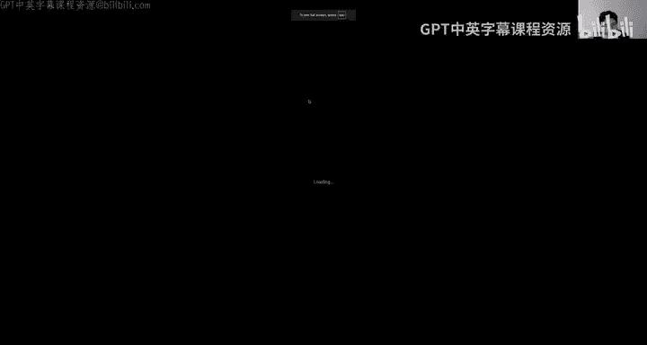
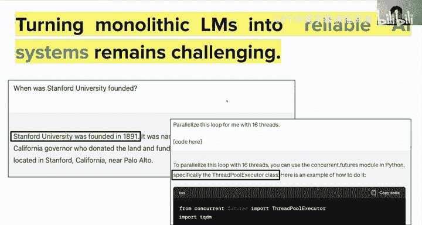
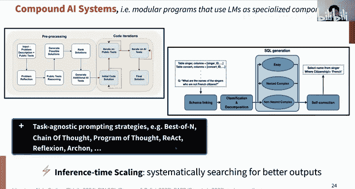
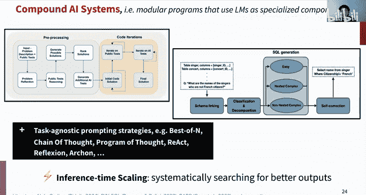
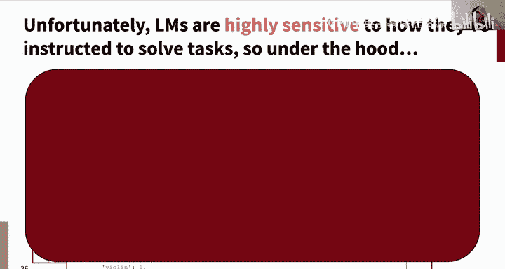
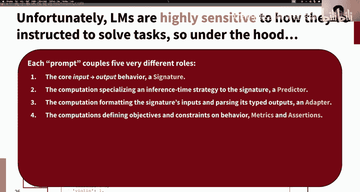
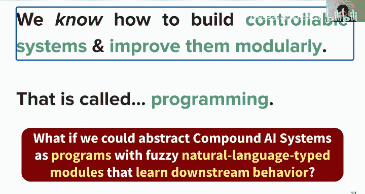
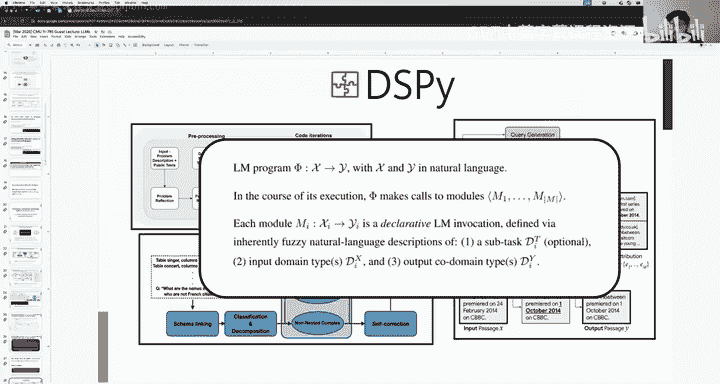
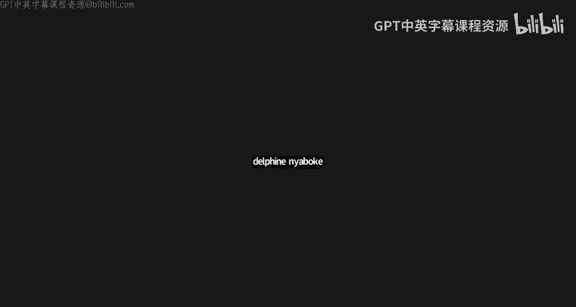

# 23：大语言模型与复合AI系统 🧠

在本节课中，我们将学习大语言模型（LLMs）的核心概念、它们如何通过预训练和对齐获得能力，以及如何利用它们构建更可靠、更可控的复合AI系统。我们将从基础的语言模型和Transformer架构开始，逐步深入到预训练、后训练（对齐）、强化学习，并最终探讨如何将这些模型组合成强大的软件系统。

---

## 语言模型与Transformer架构回顾

上一节我们介绍了课程的整体框架。本节中，我们来看看构建大语言模型的基础：神经语言模型和Transformer架构。

神经语言模型，特别是基于Transformer的模型，是当前许多AI进展的起点。Transformer架构，尤其是仅解码器（Decoder-only）的变体（如GPT系列），因其强大的序列建模能力而成为主流。

自回归解码是这一切的核心。其过程可以概括为以下步骤：

1.  **分词**：将输入文本（提示）分割成词元（tokens）。
2.  **前向传播**：将词元序列输入Transformer，计算每一层中每个词元的注意力键值。
3.  **预测下一个词元**：基于模型输出的最终嵌入，投影到整个词表的概率分布上。
4.  **采样**：根据概率分布采样出下一个词元。
5.  **循环**：将新采样的词元追加到序列末尾，重复步骤2-4，逐步生成完整的文本。

这个过程非常通用，几乎任何可以用自然语言描述的任务都可以纳入这个框架。它使学习过程变得易于推理和实现。

**编码器（Encoders）的补充说明**：虽然本节课主要关注解码器模型，但编码器模型（如BERT）在需要高质量文本表示的任务中仍然至关重要，例如信息检索和搜索。它们擅长将文档映射为密集向量，从而构建可扩展的搜索索引。

---

## 预训练：赋予模型广泛的知识

仅仅拥有Transformer架构是不够的。为了让模型变得“大”且“智能”，第一步是进行大规模预训练。预训练的目标是让一个初始时一无所知的Transformer，通过海量文本数据，获得关于语言、世界乃至初步推理能力的广泛知识。

预训练数据通常来自网络爬取、书籍、代码库（如GitHub）、学术论文（如PubMed）、法律文本等多种来源。关键在于既要数据量足够大，又要通过精心筛选确保数据质量，去除低质量或垃圾内容。

预训练的核心任务是**语言建模**，即让模型根据上文预测下一个词元。这是一个自监督学习任务，使用交叉熵损失函数。公式可以表示为：

**损失函数**：`L = -log P(w_t | w_1, w_2, ..., w_{t-1})`

其中，`w_t` 是目标词元，`w_1` 到 `w_{t-1}` 是上文。

通过在海量数据上完成这个看似简单的任务，模型能够隐式地学习到语法、事实、常识、推理模式，甚至代码结构和数学规律。这造就了所谓的“基础模型”，一个易于适应各种下游任务的通用“神器”。

**为什么预训练有效？** 有两个主要假设：一是它通过大量计算“暴力”地找到了一个有利于梯度流动的良好参数初始化点；二是它使模型初始就具备强大的泛化能力，因为其训练目标（预测任何上下文的下一个词）本身就极其通用。

**缩放定律**：模型性能（如困惑度）随着训练计算量、数据量和参数规模的增加而可预测地提升。然而，这种提升通常遵循“收益递减”规律，即需要指数级增加计算资源才能获得线性的性能提升。这凸显了单纯依赖扩大预训练规模的局限性。

---

## 后训练与对齐：从“玩具”到“助手”

预训练得到的模型虽然知识渊博，但通常并不“好用”。它只是一个强大的“下一个词预测器”，可能生成无关内容、重复语句或不安全的文本。为了让它成为遵循指令、有帮助且安全的“助手”，我们需要进行**后训练**或**对齐**。

后训练的核心是**大规模多任务学习**。我们收集大量涵盖各种任务的指令-输出对数据（例如，翻译、总结、问答、代码生成），并在此数据上继续训练模型。这教会模型理解并执行人类的指令。

然而，仅仅通过监督学习让模型模仿标准答案存在局限：对于复杂任务（如数学或编程），模型可能只是学会了“捏造”一个看起来合理的答案，而非真正学会解决问题的步骤。这引出了**强化学习**的应用。

**基于人类反馈的强化学习（RLHF）** 是让模型行为符合人类偏好的关键方法。其典型流程分为三步：

1.  **监督微调**：收集人类标注的优质指令-回复对，训练模型模仿这些行为。
2.  **奖励模型训练**：让模型生成多个回复，由人类标注员对这些回复进行排序。基于这些排序数据训练一个“奖励模型”，使其能够判断回复质量的优劣。
3.  **强化学习优化**：使用PPO等策略梯度算法，以奖励模型给出的分数为优化目标，进一步调整语言模型的参数，使其生成更受人类偏好的回复。

**基于可验证奖励的强化学习**：对于数学、编程等答案可明确验证的任务，我们可以绕过奖励模型，直接使用任务本身的成功与否（如代码通过测试、数学答案正确）作为强化学习的奖励信号。这种方法近年来取得了巨大进展，显著提升了模型在复杂推理任务上的能力。

**成功RL探索的前提**：要使强化学习有效，基础模型本身需要具备一定的“认知”或“推理”行为，例如能够进行思维链推理、自我检查或回溯。这样，模型才能在探索中偶然获得成功，从而让强化信号有迹可循。

---

## 复合AI系统：构建可靠、可控的应用

拥有了预训练和对齐后的大语言模型，我们就能构建用户可用的系统了吗？答案是：可以，但直接使用单体模型构建可靠系统非常困难。模型可能会产生看似合理实则错误的“幻觉”，且其黑箱特性使得调试、控制和迭代变得极具挑战性。

因此，研究者和工程师们开始构建**复合AI系统**。这类系统将大语言模型作为核心组件，而非最终产品，并将其与其他模块（可能是其他模型或传统软件）组合起来，形成模块化的软件架构。

一个经典例子是**检索增强生成（RAG）**：
1.  用户提出一个问题。
2.  **检索器**（可能是一个编码器模型）从可信的知识库中查找相关文档。
3.  **大语言模型**（解码器）基于检索到的文档生成答案，并可引用来源。

复合AI系统的优势包括：
*   **透明度**：可以检查是检索器还是生成器出了问题。
*   **可控性**：可以针对不同模块进行优化和调整。
*   **效率**：语言模型无需记忆所有知识，可以更专注于推理和合成。
*   **准确性**：通过引用来源，增加了答案的可信度。

更复杂的复合系统可以实现**深度研究**（让模型与搜索引擎等多轮交互）、**编码代理**（集成代码执行、测试和调试循环）等高级功能。

然而，当前构建复合AI系统面临一个主要挑战：**提示工程过于复杂**。开发者往往需要编写冗长、精细的提示文本来连接不同模块、定义行为约束和处理边界情况。这导致系统变得脆弱、难以维护，且与特定模型版本强耦合。

未来的方向是**将复合AI系统视为程序**。我们需要更高层次的抽象，将系统架构（模块、数据流）与具体的提示实现、模型调优分离开来。通过声明式的编程接口来定义系统行为，并利用机器学习算法（如自动提示优化、强化学习）自动寻找最优的模块实现方式（如最佳提示词或模型微调），从而构建出既强大又可迭代的AI软件。

---

## 总结

本节课中，我们一起学习了构建和应用大语言模型的完整路径：

1.  **基础**：Transformer架构，特别是仅解码器模型，通过自回归解码生成文本。
2.  **预训练**：在海量多样化文本数据上进行语言建模，赋予模型广泛的知识和基础能力，其性能遵循缩放定律。
3.  **后训练与对齐**：通过监督微调和强化学习（包括RLHF和基于可验证奖励的RL），将模型从“下一个词预测器”转变为有用、可靠、符合人类偏好的“助手”。
4.  **复合AI系统**：将大语言模型作为模块化软件中的组件，与其他模块组合，以构建更透明、可控、可靠的应用。未来的趋势是将其视为可通过编程和自动优化来管理的系统。

大语言模型是强大的基础，但将它们转化为真正可靠的AI系统，需要我们以软件工程的思维，构建精心设计的复合架构。