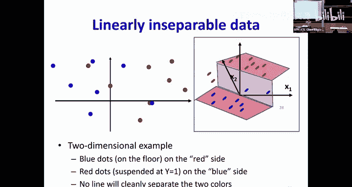
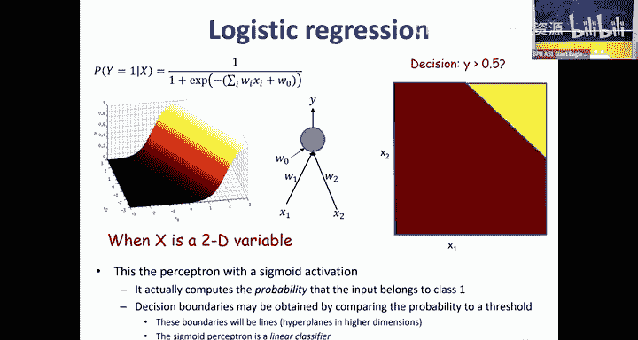
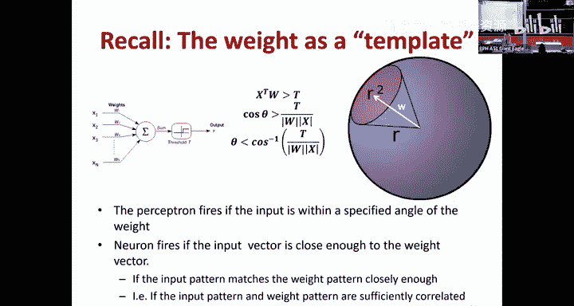
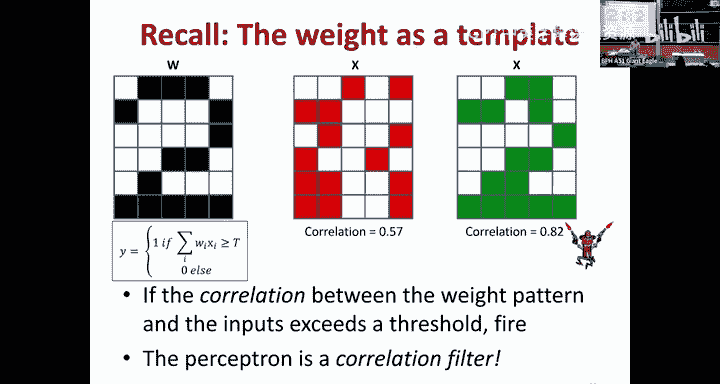
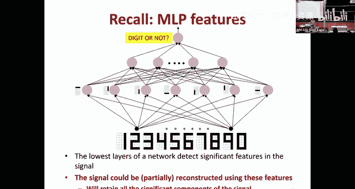
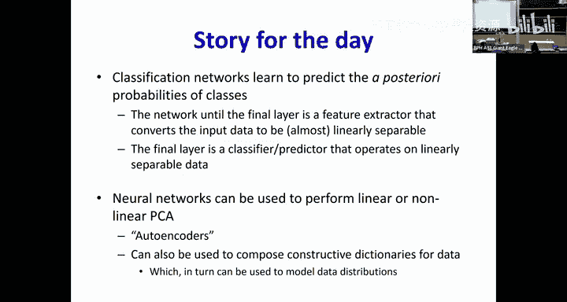
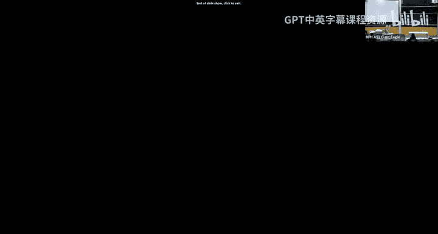

# 24：神经网络内部机制解析 🧠

## 概述

在本节课中，我们将深入探讨神经网络在训练过程中究竟学到了什么。我们将从简单的线性分类器开始，逐步理解神经网络如何将复杂数据转换为线性可分的特征，并最终学习到数据的统计分布。我们还将介绍自编码器的概念，并了解它如何学习数据的主流形。

---

## 神经网络的学习问题

我们首先回顾神经网络的基本学习问题。给定一组输入-输出对作为训练数据，我们的目标是学习一个函数，使其能够根据输入预测正确的输出。

在理想情况下，数据可能是清晰可分的。但在现实中，数据往往存在噪声和重叠。例如，在一个双五边形分类问题中，我们期望看到一些蓝色点出现在红色区域内，反之亦然。神经网络必须从这些不完美的数据中学习边界。

为了深入理解，让我们从一个非常简单的例子开始。

---

## 一维线性分类器与逻辑函数

考虑一个一维输入空间和两个类别（红色和蓝色）。一维的线性分类器就是一个阈值，它将空间的一侧分配给一个类别，另一侧分配给另一个类别。

然而，当数据点无法被一个清晰的阈值完美分开时，我们该怎么办？例如，在同一个x值处，我们可能有90个红色实例和10个蓝色实例。我们希望函数输出什么？

一个更合理的输出不是简单的类别标签，而是该类别的后验概率。在这个例子中，输出0.9（表示90%的概率是红色）比单纯输出“红色”提供了更多信息。这告诉我们，对于给定的输入x，类别1（红色）出现的概率。

当我们考虑输入值附近的一个小窗口，并计算该窗口内y值的平均值时，这个后验概率会平滑地变化。这个平滑变化的函数形状看起来非常熟悉。

**公式**：
`P(y=1|x) = 1 / (1 + e^{-(w_0 + w_1 x)})`

这正是**逻辑函数（Sigmoid）**。当x为很大的负值时，函数输出接近0；当x为很大的正值时，函数输出接近1。它平滑地从0过渡到1，完美地建模了给定输入x时，类别1的后验概率。

因此，一个使用逻辑激活函数的感知器，实际上是在建模目标类别的后验概率。

---

## 扩展到多维：线性分类器的本质

将问题扩展到二维。一个线性分类器试图用一条直线（或高维空间中的超平面）来分隔两个类别。即使数据不是完美线性可分，逻辑回归输出的概率值也会形成一个平滑的曲面，从一侧的0过渡到另一侧的1。

这个曲面的决策边界（即输出概率为0.5的地方）在哪里？

**公式**：
当 `w_0 + w_1 x_1 + w_2 x_2 = 0` 时，输出为0.5。

这是一个**直线方程**。因此，尽管概率函数本身是弯曲的，但类别之间的决策边界仍然是一条直线。这就是为什么逻辑回归被称为线性分类器。

---

## 最大似然训练与交叉熵损失

我们如何训练这个模型？给定训练数据 `(x_i, y_i)`，我们使用**最大似然估计**。我们的目标是找到模型参数（权重），使得观察到当前训练数据的概率最大。

假设数据点独立，联合概率是每个数据点概率的乘积。应用贝叶斯规则并取对数后，我们最大化对数似然函数。

**公式**：
最大化 `Σ_i log P(y_i | x_i)`

这等价于最小化负对数似然。如果我们仔细观察这个表达式，会发现它正是**KL散度**或**交叉熵损失**。

因此，当我们使用反向传播和交叉熵损失来训练逻辑函数时，实际上是在执行最大似然训练，以最佳地估计给定输入x时类别y的后验概率。

---

## 深度神经网络：特征提取与分类

现在，让我们考虑更复杂的网络，例如用于双五边形分类的网络。一个足够强大的网络可以完美分类。

我们可以将网络分为两个部分：
1.  **特征提取部分**：从输入层到倒数第二层的所有层。
2.  **分类部分**：最后一层（通常是逻辑回归或Softmax）。

如果网络能够完美分类，这意味着在倒数第二层，数据特征已经变得**线性可分**。然后，最后一层的线性分类器可以轻松地划出决策边界。

因此，特征提取部分的作用是**将原始输入数据转换（或“扭曲”）到一个新的特征空间**，在这个新空间中，不同类别的数据变得线性可分。最后一层则在这个线性可分的特征空间上进行分类。

即使网络结构不足以完美分离数据，或者数据本身不可分，特征提取部分也会尽力将数据转换，使得最后一层分类器能在其能力范围内达到最佳性能（即最小化错误）。整个网络仍然在努力估计后验概率 `P(y|x)`。

**总结一下**：分类神经网络是一个统计模型，它学习计算给定输入下各个类别的后验概率。训练网络以最小化交叉熵损失，等同于对该模型进行最大似然训练。

---

## 网络内部的逐层变换：流形假设

那么，网络中间的层具体在做什么呢？一个合理的假设是**流形假设**。

以二维圆形决策边界为例。我们训练一个网络，它有一个包含3个神经元的隐藏层（使用tanh激活函数），最后接一个逻辑输出层。

初始时，数据是二维的。第一层的权重矩阵（3x2）将数据**投影**到一个三维空间中的一个二维平面上。然后，tanh激活函数对这个平面进行**非线性扭曲**，使其变成一个弯曲的曲面。后续的层（权重矩阵）可以看作是在对这个曲面进行**投影**。

网络学习的目标是：通过调整各层的权重，扭曲并投影这个曲面，使得最终在投影后的特征空间里，属于不同类别的点能够被一条直线（或一个超平面）分开。

可视化训练过程显示，随着训练进行，数据在每一层之后都变得更加线性可分。更深层的网络可以将类别分得更开。有时，即使在中层网络特征已经线性可分后，更深层的网络还会继续工作，以增大类别间的“间隔”。

---

## 单个神经元的学习：模板匹配

现在，让我们深入到最基本的单元：一个使用阈值激活的感知器。

感知器计算输入向量 **x** 和权重向量 **w** 的点积（内积），并与阈值比较。在高维空间中，如果我们将向量长度归一化，点积主要反映的是两个向量之间的**夹角余弦（相似度）**。

**公式**：
输出 = 1，如果 **w·x** > 阈值

这等价于说：如果输入 **x** 与权重向量 **w** 的夹角小于某个值，则神经元激活。因此，权重向量 **w** 可以被视为该神经元要检测的**模板**或**典型模式**。

神经元的作用是计算输入与自身模板的**相关性**。如果相关性超过阈值，它就“激活”。

例如，要识别数字“2”，我们可以设置一个看起来像“2”的模板作为权重。输入图像与这个模板计算相关性，相关性高则判定为“2”。

在多层网络中，第一层的神经元学习成为基本的**特征检测器**（如检测水平线、垂直线）。后续层的神经元则检测这些基本特征的组合（如构成数字“1”或“2”的模式）。

---

## 自编码器：学习数据的主流形

如果我们截取一个训练好的分类网络的第一层，用其输出乘以权重的转置，会发生什么？

我们会**重建输入**，但重建的将是那些被神经元检测到的、与分类相关的特征。为了更完整地重建原始输入，我们可以设计一个专门的网络结构——**自编码器**。

自编码器由两部分组成：
1.  **编码器**：将输入压缩成一个低维的“编码”（潜在表示）。
2.  **解码器**：从这个编码试图重建原始输入。

网络通过最小化输入与重建输出之间的误差来训练。

**线性自编码器**：
假设编码器和解码器都是线性的，并且隐藏层只有一个神经元。那么，网络学习的是什么呢？

**公式**：
重建输出 = **w^T (w x)** = (**w^T w**) **x**

这实际上是在学习将数据投影到向量 **w** 所张成的一维直线上，并最小化投影误差。这正是**主成分分析（PCA）**——寻找数据中方差最大的方向。无论输入是什么，输出都只能落在这条直线上。

**非线性自编码器**：
当我们在解码器中引入非线性激活函数时，解码器可以将低维编码映射回一个**弯曲的流形**，而不仅仅是一个线性子空间。

这样的自编码器学习的是数据的**非线性主流行形**。解码器学会了如何根据编码（在流形上的位置）来生成数据。一个关键特性是：**无论你向训练好的解码器输入什么，它都只能生成位于这个学习到的流形上的数据**。

例如，在螺旋形数据上训练的自编码器，其解码器只能生成螺旋线上的点。在数字图像上训练的自编码器，其解码器只能生成像数字的图像。在音乐数据上训练的自编码器解码器，只能生成类似训练音乐的声音。

---

## 应用示例：基于字典的信号分离

自编码器的这种“流形生成”特性可以用于信号分离。假设我们想从混合音频中分离吉他和鼓声。

1.  分别用吉他音频和鼓声音频训练两个自编码器，得到吉他解码器和鼓声解码器。
2.  吉他解码器只能生成吉他般的声音，鼓声解码器只能生成鼓般的声音。
3.  给定一个混合信号，我们使用反向传播来优化：找到分别输入到两个解码器的编码，使得两个解码器的输出之和尽可能接近混合信号。
4.  优化后，吉他解码器的单独输出就是分离出的吉他声，鼓声解码器的单独输出就是分离出的鼓声。

这种方法利用了每个解码器只能生成特定流形上数据的特点，从而实现了源分离。

---

## 总结

本节课我们一起深入探索了神经网络的内部表示：

1.  **分类网络**学习预测类别的后验概率 `P(y|x)`。网络的末端是一个线性分类器，而此前的所有层共同构成一个特征提取器，致力于将数据转换为线性可分的特征。
2.  **逐层处理**的过程可以理解为将数据逐渐变换到更易于线性分离的空间，这符合流形假设。
3.  **单个神经元**学习的是输入数据的模板，通过计算输入与模板的相关性来决定是否激活。
4.  **自编码器**提供了一种无监督学习方式，用于捕捉数据的主流行形。编码器进行降维或特征提取，解码器则学习从低维表示重建数据，且只能生成在学习到的流形上的数据。
5.  这种对数据流形的理解是构建**生成模型**的基础，我们将在后续课程中继续探讨。

通过本讲，我们认识到神经网络不仅是强大的函数逼近器，更是有坚实统计基础的、能够学习数据底层结构与分布的模型。