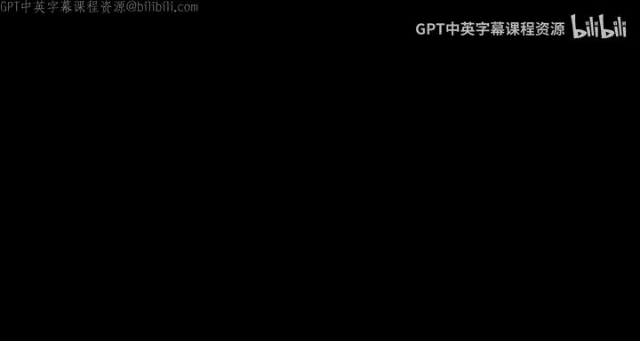
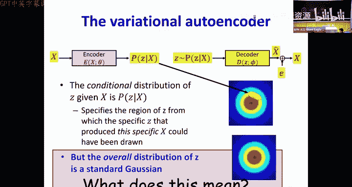
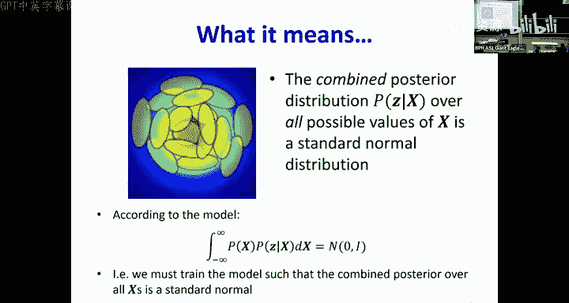
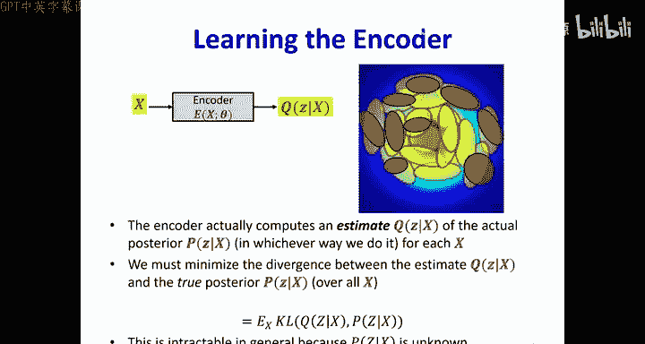
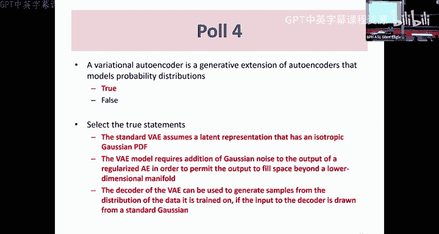
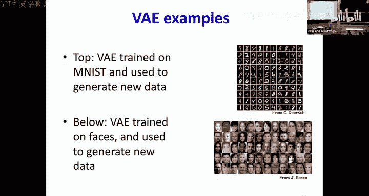
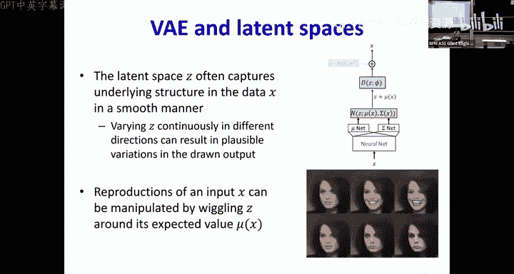
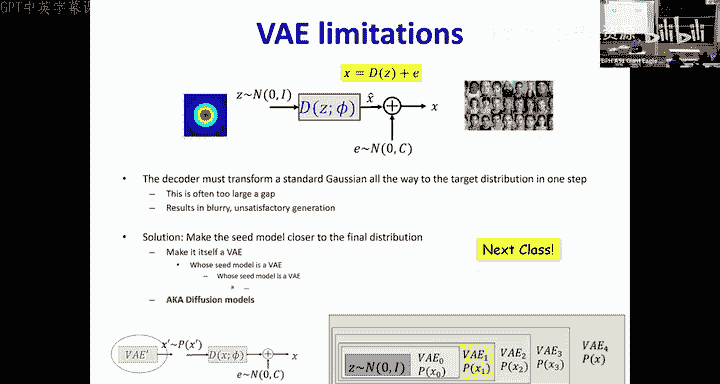
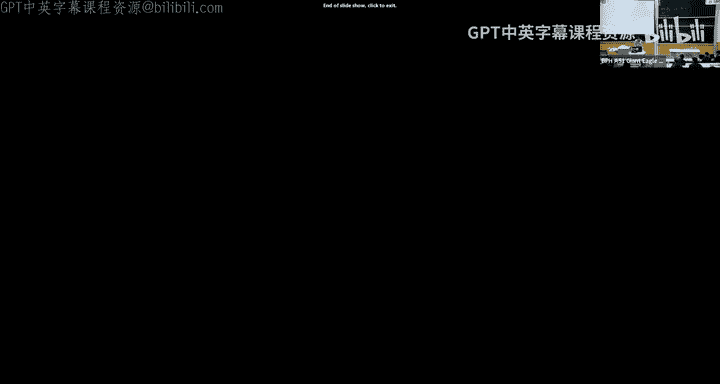

# 25：变分自编码器 (VAE) 🧠

## 概述
在本节课中，我们将学习**变分自编码器**。这是一种强大的生成模型，它不仅能学习数据的压缩表示，还能学习数据的潜在分布，从而能够生成新的、与训练数据相似的数据样本。我们将从标准自编码器的局限性开始，逐步推导出VAE的原理和训练方法。

---

## 从自编码器到数据生成

上一节我们介绍了自编码器如何学习数据的低维流形。本节中我们来看看如何利用自编码器来生成新数据。

深度神经网络可以作为分类器或预测器。我们即将处理一个新问题：如何生成数据。例如，给定大量人脸图像，我们能否训练一个网络来生成新的人像？这本质上是一个**表征数据分布**并从该分布中**采样**的问题。

数据可以被认为大致位于某种**流形**上。这个假设是成立的，因为只有**噪声**才会均匀地占据所有空间。一旦我们对数据施加结构，数据就会受到限制。因此，数百万像素的图像并非占据所有可能的高维空间，而是位于一个高度结构化的子空间中。

我们的假设是：数据分布在这个高维空间中的一个**弯曲或非线性的流形**上。自编码器的**解码器**部分就学会了捕获这个数据流形。如果自编码器经过适当训练，其解码器在接收到任意输入时，只能生成位于该流形上的数据。

然而，这里存在一个问题。即使解码器学会了在训练数据区域表征流形，但在训练数据未覆盖的区域，其行为可能变得不可预测。解码器可能会偏离预期的路径。

---

## 约束潜在空间

为了解决上述问题，我们需要确保输入解码器的潜在变量 `Z` 是“典型”的，即它们来自该数据类别的自然分布。但我们并不知道这个分布是什么。

一个解决方案是：在训练自编码器时，**显式地约束 `Z` 的分布**。一个典型的选择是**标准高斯分布**（均值为0，方差为1）。我们选择它是因为在给定方差下，高斯分布是**信息量最少**（熵最高）的分布，这意味着我们没有强加不必要的假设。

如果我们能约束模型，使 `Z` 值来自标准高斯分布，那么要生成新数据，我们只需从标准高斯分布中采样一个 `Z`，然后将其输入解码器。理论上，输出应该类似于训练数据。

那么，如何训练这个带有约束的模型呢？模型结构如下：
*   **编码器** `E` (参数 `θ`)：输入数据 `X`，输出潜在变量 `Z`。
*   **解码器** `D` (参数 `φ`)：输入 `Z`，输出重建数据 `X_hat`。

训练目标是：
1.  最小化输入 `X` 与重建输出 `X_hat` 之间的误差。
2.  同时，最小化 `Z` 的分布与标准高斯分布之间的差异。

这种差异可以用**KL散度**来衡量。对于标准高斯分布，最小化负对数似然等价于最小化 `Z` 的**平方范数** `||Z||^2`。

因此，整体的训练策略是寻找参数 `θ` 和 `φ`，以最小化以下损失函数：
`L = ||X - D(Z)||^2 + λ * ||Z||^2`
其中 `λ` 是一个权衡两项重要性的超参数。

---

## 处理流形外的变化

然而，上述模型并未捕获数据的全部变化。解码器只能生成位于**低维流形**上的数据，但真实数据可能围绕这个流形存在变化。此外，我们可能无法准确猜中流形的真实维度。

为了解释这种变化，我们扩展模型：假设观测到的数据 `X` 是通过向解码器的输出 `X_hat` **添加噪声** `ε` 而获得的。即：
`X = D(Z) + ε`
通常假设噪声 `ε` 是**各向同性的高斯噪声**（均值为0，协方差矩阵为对角阵）。这是合理的，因为任何有结构的噪声理论上都可以被解码器学习。

这个新模型意味着：对于任何输入 `Z`，由于噪声 `ε` 的存在，最终输出 `X` 可能不同。因此，解码器现在是一个**生成模型**，它描述了数据产生的过程：从高斯分布中采样 `Z`，通过解码器得到流形上的点，再加入高斯噪声得到最终数据。

---

## 变分自编码器的核心思想

现在面临一个训练难题：要训练解码器参数 `φ`，我们需要 `(Z, X)` 对。但 `Z` 是**隐变量**，我们无法直接观测。

我们可以用编码器来估计 `Z`。但由于噪声 `ε` 的存在，对于任何一个给定的 `X`，可能有**无数个** `Z` 值（通过添加不同的噪声）都能生成它。这些 `Z` 值构成一个**分布**。

因此，我们的编码器不应该输出一个确定的 `Z` 值，而应该输出一个**分布** `Q(Z|X)`，这个分布描述了哪些 `Z` 值最有可能生成了当前的 `X`。我们希望 `Q(Z|X)` 尽可能接近真实的**后验分布** `P(Z|X)`。

这就是**变分自编码器**的核心：编码器学习一个近似后验分布 `Q(Z|X)`，解码器则尝试将从这个分布中采样的 `Z` 转换回 `X`。

---

## VAE的模型设定与训练

我们如何表示这个分布 `Q(Z|X)`？根据之前关于各向同性高斯分布的讨论，我们可以合理地假设 `Q(Z|X)` 是一个**高斯分布**。这样，编码器只需要为每个输入 `X` 输出该高斯分布的**均值 `μ`** 和**方差 `σ^2`**（通常假设为对角阵以简化计算）。

以下是VAE的训练过程概览：

1.  **前向传播**：对于输入 `X`，编码器输出 `μ(X)` 和 `σ^2(X)`。
2.  **采样**：从分布 `N(μ, σ^2)` 中采样一个 `Z`。为了能够反向传播，我们使用**重参数化技巧**：
    `Z = μ + σ ⊙ ε`，其中 `ε ~ N(0, I)`
    这样，随机性被转移到 `ε`，而 `μ` 和 `σ` 是确定性的、可微的。
3.  **重建**：将采样的 `Z` 输入解码器，得到重建输出 `X_hat`。
4.  **计算损失**：VAE的损失函数由两部分组成：
    *   **重建损失**：衡量 `X_hat` 与原始 `X` 的差异。假设观测噪声是高斯分布，这通常等价于均方误差 `||X - X_hat||^2`。
    *   **KL散度损失**：衡量编码器输出的分布 `Q(Z|X)` 与先验分布 `P(Z)`（标准高斯分布）之间的差异。对于高斯分布，其KL散度有闭合形式：
        `KL = -0.5 * Σ (1 + log(σ_i^2) - μ_i^2 - σ_i^2)`
        其中求和是对 `Z` 的所有维度进行。
5.  **反向传播与优化**：总损失是重建损失与KL散度损失的加权和。通过反向传播同时更新编码器 (`θ`) 和解码器 (`φ`) 的参数。

训练完成后，我们可以丢弃编码器。**解码器就是我们需要的生成模型**。要生成新样本，只需从标准高斯分布 `N(0, I)` 中采样一个 `Z`，然后输入解码器即可。

---

## VAE的能力与局限性

VAE是一个强大的生成模型，其潜在空间 `Z` 能够捕获数据的内在结构。例如，在两个人脸对应的 `Z` 之间进行线性插值，解码后可以得到中间表情的人脸图像，这证明了潜在空间的连续性。

然而，VAE有两个主要的局限性：

1.  **近似后验的偏差**：我们使用简单的高斯分布 `Q(Z|X)` 来近似可能非常复杂的真实后验 `P(Z|X)`，这必然会引入偏差。一种改进思路是使用**归一化流**来构建更灵活、可逆的变换。
2.  **生成样本模糊**：VAE生成的图像常常看起来比较模糊。这是因为模型假设重建误差（噪声）是**各向同性、不相关的高斯噪声**。但实际上，图像中缺失的细节（如清晰边缘）具有高度结构性，这与模型的假设不符。这表明解码器未能完全解耦所有数据变化。

为什么解码器工作得如此“困难”？因为它需要将一个简单的标准高斯分布映射到极其复杂的数据分布。如果**先验分布 `P(Z)` 本身就更接近目标分布**，那么解码器的任务就会轻松很多。这种“用一系列简单的步骤逐渐逼近复杂分布”的思想，引出了著名的**扩散模型**。

---

## 总结

本节课中我们一起学习了**变分自编码器**。我们从标准自编码器生成数据时遇到的问题出发，引入了对潜在变量的分布约束。通过假设潜在变量服从高斯分布，并使用编码器来近似其后验分布，我们得到了VAE的框架。我们详细探讨了其损失函数（重建损失和KL散度损失）、训练中的重参数化技巧，以及它作为生成模型的工作原理。最后，我们也分析了VAE的优缺点，并指出了其与更先进模型（如归一化流和扩散模型）的联系。VAE是连接自编码器与复杂生成模型的重要桥梁。