# 26： 扩散模型 🌀

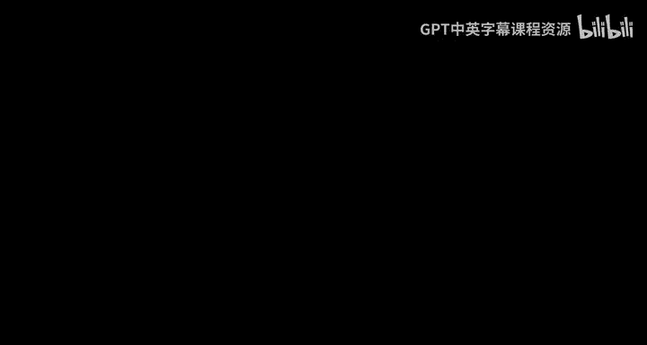

## 概述
在本节课中，我们将要学习扩散模型。这是一种通过逐步添加和去除高斯噪声来学习数据分布并生成数据的生成式模型。我们将从基础概念开始，逐步深入到其数学原理、训练方法、加速技术以及条件生成等高级主题。

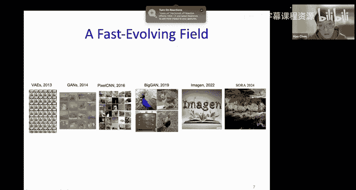

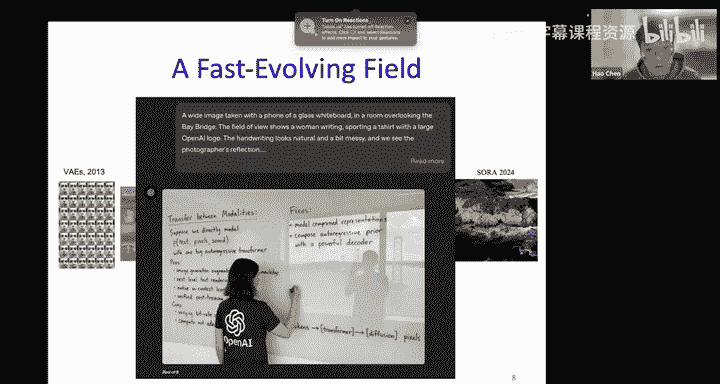

---

## 1. 扩散模型基础 🧱

上一节我们回顾了生成式模型与判别式模型的基本区别。本节中，我们来看看扩散模型如何作为一种特殊的生成式模型工作。

扩散模型本质上是一系列变分自编码器的堆叠。它包含两个核心过程：**前向扩散过程**和**反向去噪过程**。

*   **前向扩散过程**：这是一个固定的过程，它通过一系列固定的高斯转换，逐步向原始数据 `x0` 添加噪声，最终得到纯高斯噪声 `xT`。这个过程可以看作是VAE编码器部分的堆叠，但其参数是预先设定而非学习的。
*   **反向去噪过程**：这是一个可学习的过程，目标是从纯高斯噪声 `xT` 开始，通过一系列可学习的“解码器”逐步去除噪声，最终恢复出原始数据分布 `x0`。这个过程可以看作是VAE解码器部分的堆叠。

**公式**：前向过程中，任意时刻 `t` 的数据 `xt` 可以由初始数据 `x0` 通过以下闭式解得到：
`xt = sqrt(α_t_hat) * x0 + sqrt(1 - α_t_hat) * ε`，其中 `ε ~ N(0, I)`，`α_t_hat` 是由噪声调度 `β_t` 决定的累积乘积。

---

## 2. 训练与采样 🎯

理解了扩散模型的基本框架后，本节我们来看看如何训练它以及如何用它来生成新样本。

训练的核心目标是让神经网络学会预测在前向过程中添加到数据里的噪声。尽管推导过程涉及变分下界，但最终目标可以简化为一个简单的去噪任务。

以下是训练一个扩散模型的基本步骤：

1.  从数据集中采样一个干净样本 `x0`。
2.  随机选择一个时间步 `t`（1 到 T 之间）。
3.  从标准高斯分布采样一个噪声 `ε`。
4.  利用前向过程公式，计算加噪后的样本 `xt`。
5.  将 `xt` 和时间步 `t` 输入神经网络，让网络预测所添加的噪声 `ε_θ(xt, t)`。
6.  最小化预测噪声 `ε_θ(xt, t)` 与真实噪声 `ε` 之间的均方误差（MSE）。

**代码**：训练目标可以简化为：
`L_simple = E_{t, x0, ε}[|| ε - ε_θ(xt, t) ||^2]`

采样（生成）过程则是训练的逆过程：

1.  从标准高斯分布采样一个随机噪声 `xT`。
2.  从 `t = T` 开始，逐步迭代到 `t = 1`：
    *   用训练好的网络预测当前 `xt` 中的噪声 `ε_θ(xt, t)`。
    *   根据预测的噪声和噪声调度参数，计算出去除部分噪声后的前一步状态 `x_{t-1}`。
3.  最终得到生成的样本 `x0`。

---

## 3. 随机微分方程与得分匹配视角 📈

扩散模型的理论基础可以统一在随机微分方程的框架下。本节我们将从这个更一般的视角来理解扩散模型。

*   **前向SDE**：将离散的前向扩散过程视为连续时间下的随机微分方程。它描述了数据分布如何随时间“漂移”并注入噪声，最终演变为简单的高斯分布。
    `dx = f(x, t)dt + g(t)dw`，其中 `dw` 是维纳过程（高斯噪声）。
*   **反向SDE**：每个前向SDE都有一个对应的反向SDE。反向SDE描述了如何从高斯噪声出发，通过一个包含“得分函数”的漂移项，逐步演化回数据分布。
*   **得分函数**：定义为数据对数概率密度的梯度，`s(x) = ∇_x log p(x)`。在扩散模型中，我们需要估计每个噪声数据 `xt` 的得分函数。
*   **得分匹配**：训练神经网络 `s_θ(xt, t)` 来近似真实的得分函数。有趣的是，通过推导可以发现，**预测噪声**的目标与**得分匹配**的目标在数学上是等价的。

这个视角将扩散模型与另一类生成模型（得分匹配模型）联系起来，提供了更统一的理论解释。

---

## 4. 加速采样：DDIM 🚀

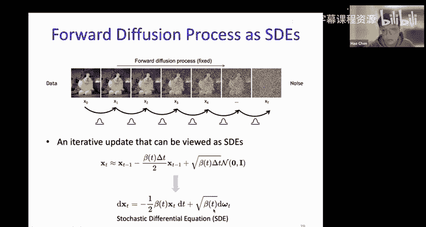

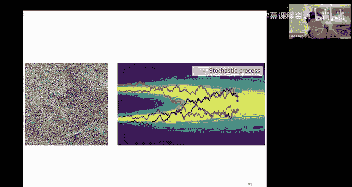

标准扩散模型（DDPM）的一个主要缺点是采样速度慢，需要迭代很多步（如1000步）。本节我们介绍一种名为DDIM的加速采样技术。

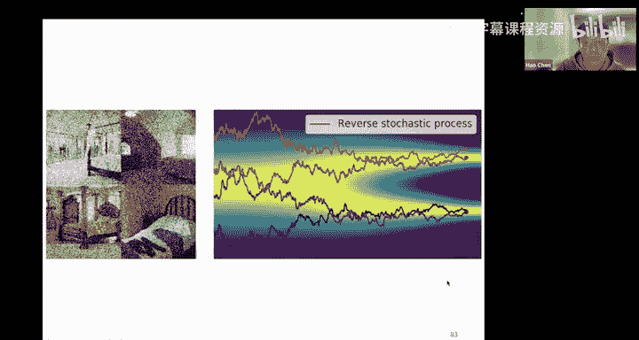

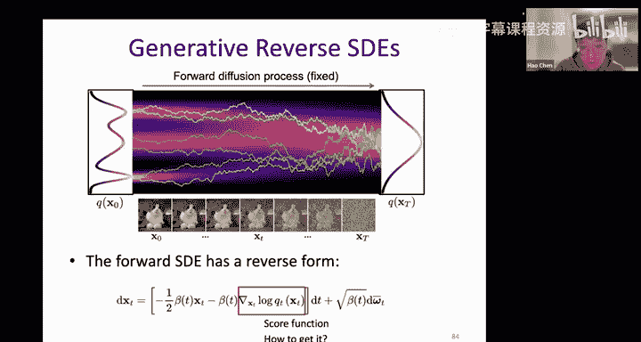

DDIM的核心思想是**构造一个非马尔可夫的前向过程**，使得在反向生成时，可以跳过一些中间步骤，用更少的迭代步数生成样本。

它与DDPM的关键区别在于采样方式：
*   **DDPM**：严格遵循马尔可夫链，必须一步步地从 `x_t` 预测 `x_{t-1}`。
*   **DDIM**：在每一步，它首先利用当前 `x_t` 和预测的噪声 `ε_θ` 来估计初始数据 `x0` 的一个近似值 `x0_hat`。然后，利用这个 `x0_hat` 和更早时间步的噪声，直接计算 `x_{t-1}`。

这种方法允许我们使用一个远小于训练步数 `T` 的子序列来进行采样（例如，只使用50或100步），从而大幅提升生成速度，且通常能保持不错的生成质量。

---

## 5. 条件扩散模型 🎨

到目前为止，我们讨论的都是无条件生成模型。本节我们看看如何引导扩散模型根据特定条件（如类别标签、文本描述）生成内容。

条件扩散模型学习的是条件分布 `p(x|y)`，其中 `y` 是条件信息。训练时，模型除了接收噪声数据 `xt` 和时间步 `t`，还会接收条件 `y` 的编码。

一种重要的技术是**无分类器引导**。它的训练和推理策略如下：

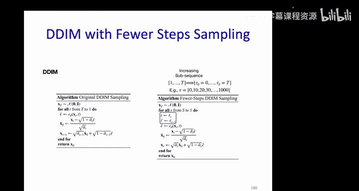

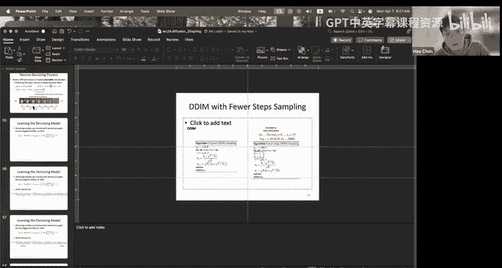

1.  **训练**：以一定概率（如10%）随机丢弃条件 `y`。这样，模型同时学会了**有条件生成** `(ε_θ(xt, t, y))` 和**无条件生成** `(ε_θ(xt, t, ∅))`。
2.  **推理**：通过引导尺度 `γ` 对有条件预测和无条件预测进行插值，得到最终的噪声预测：
    `ε_guided = ε_θ(xt, t, ∅) + γ * (ε_θ(xt, t, y) - ε_θ(xt, t, ∅))`
    增大 `γ` 可以增强模型对条件的遵循程度，但可能降低样本多样性。

这种方法避免了训练一个独立的分类器，更稳定且易于实现，被Stable Diffusion等现代模型广泛采用。

---

## 6. 近期进展与应用掠影 🚀

扩散模型领域发展迅速。本节我们将简要了解一些重要的架构和应用进展。

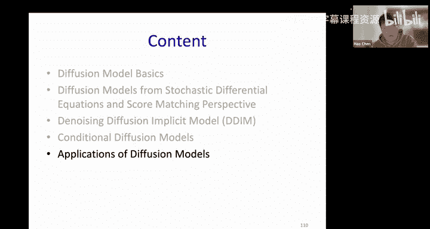

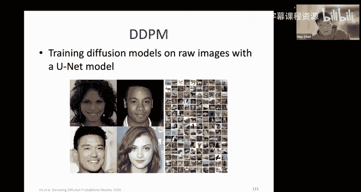

*   **潜在扩散模型**：不在高维像素空间直接操作，而是先使用一个预训练的VAE将图像压缩到低维潜在空间，然后在潜在空间训练扩散模型。这大大降低了计算成本，是Stable Diffusion等模型的核心。
*   **DiT**：将Transformer架构作为扩散模型的主干网络，取代了常用的U-Net，展示了出色的缩放能力。
*   **MAGE**：将扩散模型的训练目标（去噪）与自回归建模结合，在图像生成任务上取得了优异效果。

这些进展表明，扩散模型不仅是强大的生成工具，其思想（如逐步去噪）也可以灵活地与其他深度学习范式结合。

---

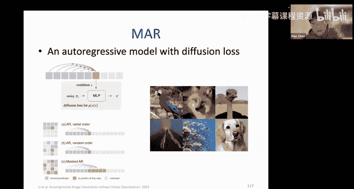

## 总结
本节课中我们一起学习了扩散模型。我们从VAE堆叠的视角理解了其基本框架，学习了通过预测噪声进行训练和采样的过程。随后，我们从随机微分方程和得分匹配的角度获得了更统一的理论认识。为了克服采样慢的缺点，我们探讨了DDIM加速技术。最后，我们学习了如何通过无分类器引导实现条件生成，并概览了潜在扩散、DiT等前沿进展。扩散模型因其强大的生成能力和理论美感，已成为当前生成式AI领域的基石之一。