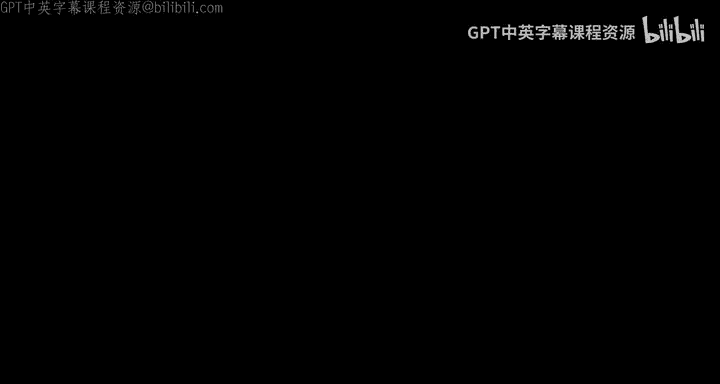
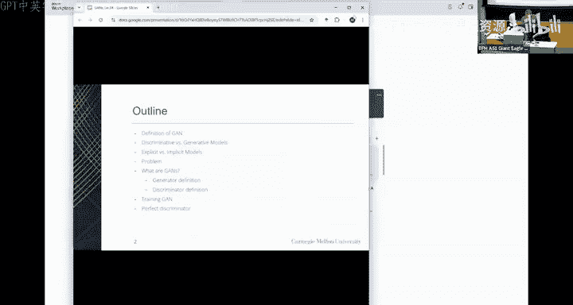
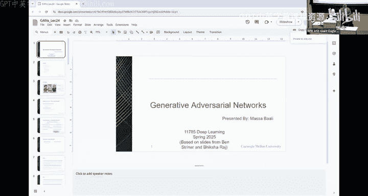
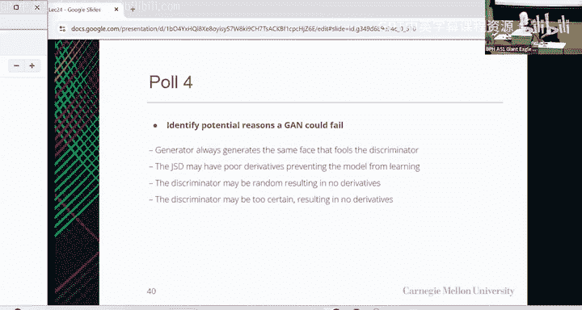
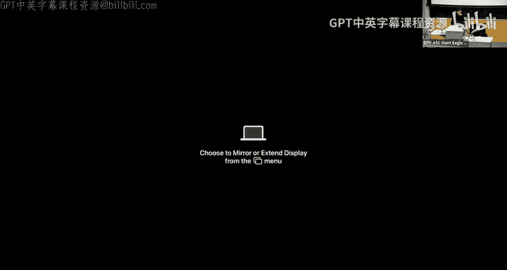
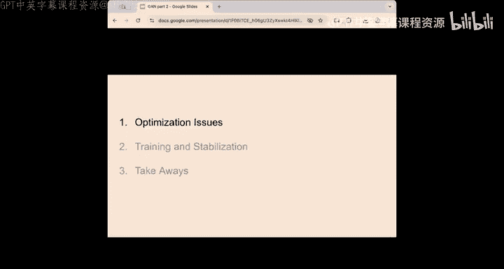
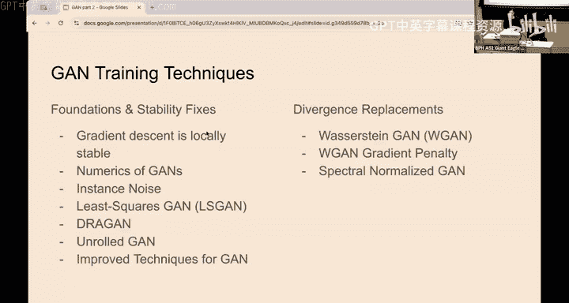

# 27：生成对抗网络 (GANs) 🎨🤖

在本节课中，我们将学习生成对抗网络（GANs）的核心概念。这是一种通过让两个神经网络相互对抗来生成逼真数据的强大技术。我们将从基本定义开始，逐步深入到其工作原理、训练过程以及面临的挑战。

---

## 概述：什么是生成对抗网络？

想象一下，你是一名正在学习绘画的艺术生。起初，你的作品粗糙且充满错误，但身边有一位严厉的艺术评论家不断指出你的不足。通过反复的试错，你不断精进技艺，直到你的画作逼真到连评论家都无法将其与真正的杰作区分开来。

这个过程就是生成对抗网络（GAN）的核心思想。GAN由两个神经网络组成：**生成器**试图创造逼真的内容（如图像、语音或视频），而**判别器**则扮演着严厉评论家的角色，拒绝任何看起来不真实的东西。

---

## 判别式模型 vs. 生成式模型

在深入GAN之前，我们需要理解两类基础模型。

*   **判别式模型**：学习如何区分。给定输入，它们确定其类别。它们计算的是条件概率 **P(Y|X)**。
    *   **特点**：学习类别间的决策边界。
    *   **例子**：逻辑回归、支持向量机（SVM）。
*   **生成式模型**：学习如何生成。它们产生类似于训练数据的新实例。它们计算并从中采样的是联合概率 **P(X, Y)**。
    *   **特点**：学习数据的实际概率分布。
    *   **例子**：朴素贝叶斯、高斯混合模型。

生成式模型是更困难的问题，因为它需要对数据分布有更深入的理解，而不仅仅是区分它们。

---

## 显式模型 vs. 隐式模型

生成式模型内部也有不同的建模方式。

*   **显式模型**：显式地定义并计算样本的概率分布 **P(X)**。
*   **隐式模型**：不直接计算概率分布，只允许你从分布中**抽取样本**。

上一节我们介绍了模型的基本分类，本节中我们来看看生成新数据时面临的核心问题。

---

## 核心问题：如何生成新数据？

假设我们有一个包含大量《辛普森一家》角色面部图像的数据集。我们的目标是训练一个能够生成全新肖像的网络。本质上，我们希望能够从面部图像（或任何数据）的分布中进行采样。

这面临两个根本性挑战：
1.  **高维空间**：图像数据存在于极高维的空间中（例如百万像素），直接刻画整个分布极其困难。
2.  **评估困难**：即使我们建立了一个模型，如何自动判断生成的结果是否像一张“脸”？手动检查不具可扩展性。

解决方案是**自动化评估过程**。我们可以用一个分类器（即判别器）来替代人类评估者，其任务是判断输入是“真实面部”还是“生成面部”。这个分类器的损失函数，我们称之为 **“D_loss”**（看起来像脸吗？）。

---

## GAN的构成与工作原理

现在，让我们正式定义GAN及其组件。

**GAN** 代表 **生成对抗网络**：
*   **生成式**：能够生成与训练数据相似的数据。
*   **对抗式**：由两个相互竞争、试图击败对方的网络组成。
*   **网络**：使用神经网络实现。

GAN于2014年被提出，其目标是建模分布 **P(X)** 以便从中生成样本。它通过让一对模型扮演对抗角色来训练：一个生成，一个判断。

以下是GAN的完整框架图：

*   **生成器**：接收一个随机噪声向量 **z**（来自先验分布 **P(z)**），并将其映射到数据空间，生成假数据 **G(z)**。生成器的目标是让输出分布 **P_G(x)** 尽可能匹配真实数据分布 **P_data(x)**。
*   **判别器**：接收数据（可以是真实数据 **x** 或生成数据 **G(z)**），并输出一个标量，表示输入是真实数据的概率。其任务是区分真实数据与生成数据。

如果存在一个完美的判别器，那么生成的数据将无法与真实数据区分。

---

## 如何训练GAN？

我们意识到需要同时训练生成器和判别器。
*   判别器被训练以区分生成器产生的假脸和真实的脸。
*   生成器被训练以“欺骗”判别器，使其认为生成的数据是真实的。

以下是训练目标：

**对于判别器 (D)**：
*   当看到**真实数据**时，希望输出接近1。目标：最大化 **log(D(x))**。
*   当看到**生成数据**时，希望输出接近0。目标：最大化 **log(1 - D(G(z)))**。

**对于生成器 (G)**：
*   希望判别器对生成数据的判断出错（即认为它是真实的）。目标：最小化 **log(1 - D(G(z)))**（等价于让 D(G(z)) 接近1）。

**整体损失函数（极小极大博弈）**：
将两者结合，GAN的训练可以被表述为一个极小极大优化问题：

**min_G max_D V(D, G) = E_{x~p_data(x)}[log D(x)] + E_{z~p_z(z)}[log(1 - D(G(z)))]**

**训练过程简述**：
1.  **初始化**：生成器产生随机噪声（无意义数据），判别器从零开始学习。
2.  **判别器学习**：判别器学习区分初始的假数据和真实数据。
3.  **生成器优化**：生成器利用判别器提供的“反馈”（梯度）更新自身，试图生成更能欺骗判别器的数据。
4.  **迭代对抗**：两者不断交替优化，判别器努力变得更强以识破骗局，生成器则努力生成更逼真的数据以通过检查。

---

## 理想判别器与训练动态

那么，一个理想的判别器是怎样的？

最优判别器 **D*(x)** 对于任意样本 **x**，会估计它来自真实分布而非生成分布的概率。根据贝叶斯规则，可以推导出：

**D*(x) = P_data(x) / [P_data(x) + P_G(x)]**

**训练动态可视化**：
1.  **初始**：判别器学习一个决策边界，分离差的生成数据和真实数据。
2.  **生成器更新**：生成器调整其输出分布，使其更靠近真实数据分布。
3.  **判别器再更新**：判别器重新学习新的决策边界。
4.  **收敛**：理想情况下，经过多次迭代，生成分布 **P_G(x)** 与真实分布 **P_data(x)** 完全重合。此时，对于任何输入 **x**，判别器都只能给出 **D(x) = 0.5**（即无法判断），训练达到均衡。

这种训练过程实际上是在最小化真实分布与生成分布之间的 **Jensen-Shannon散度**。

---

## 训练挑战与稳定化技巧

GAN的训练因其对抗性本质而充满挑战，容易出现不稳定、模式崩溃等问题。以下是研究人员提出的一些稳定化技巧的核心思想：

**1. 优化问题**
*   **原因**：生成器和判别器的同步更新是一个动态博弈，不一定收敛。
*   **例子**：就像“石头剪刀布”游戏，存在纳什均衡点（各出1/3），但梯度下降可能导致策略循环震荡，而非收敛。

**2. 稳定化技巧概览**
研究人员从不同角度提出了改进方案：

**基础与稳定性修复**：
*   **梯度惩罚**：约束判别器函数的梯度范数，使其更平滑，提供更有意义的梯度信号。
*   **实例噪声**：向真实和生成数据添加噪声，平滑判别器的学习空间。
*   **最小二乘GAN**：使用L2损失替代二元交叉熵损失，缓解梯度消失，训练更稳定。

**散度替代**：
*   **Wasserstein GAN**：使用Wasserstein距离（推土机距离）替代Jensen-Shannon散度作为衡量标准。即使两个分布没有重叠，它也能提供平滑的梯度。其核心是要求判别器（在WGAN中称为“评论家”）是一个**1-Lipschitz**函数。
    *   **实现挑战**：如何有效实施Lipschitz约束。
    *   **解决方案**：
        *   **权重裁剪**：原始方法，简单但可能导致优化问题。
        *   **梯度惩罚**：更有效的方法，直接对评论家相对于输入梯度的范数进行正则化，使其接近1。
        *   **谱归一化**：通过约束神经网络每一层权重矩阵的谱范数来保证整体函数的Lipschitz性质。

**前瞻性优化**：
*   **展开GAN**：生成器在更新时，会考虑判别器在未来几步内可能做出的反应，从而做出更不“贪婪”、更稳定的更新，有助于缓解模式崩溃。

---

## 要点总结与未来方向

本节课我们一起学习了生成对抗网络（GANs）的核心原理。

**关键要点**：
1.  GAN通过**生成器**和**判别器**的对抗博弈来学习数据分布。
2.  训练目标是**极小极大博弈**，旨在让生成分布匹配真实分布。
3.  原始GAN训练**不稳定**，易出现模式崩溃等问题。
4.  一系列技术通过**正则化**、**平滑损失曲面**、**替换散度度量**（如Wasserstein距离）和**约束网络复杂度**来稳定训练。

**当前趋势与挑战**：
*   研究致力于设计更好的**正则化方法**和**损失函数**。
*   一些方法（如展开GAN）理论效果好但**计算成本高**。
*   基于采样的方法在高维空间中可能**效率低下**。
*   基于约束的方法可能产生**次优解或伪影**。

**未来方向**：
一个核心的开放问题是：**如何设计神经网络架构，使其能自动学习一个更有意义的、可指导稳定训练的损失函数？** 这是推动GAN向前发展的关键。

---
*本教程根据CMU《深度学习导论》课程Lecture 24内容整理翻译而成，旨在提炼核心概念，供初学者学习参考。*