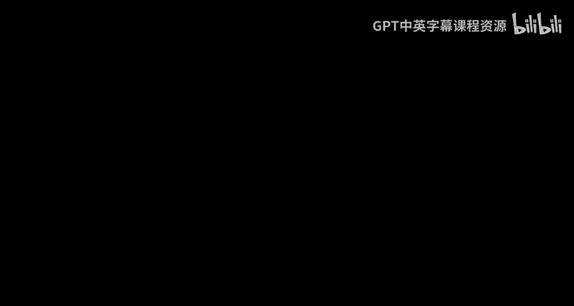
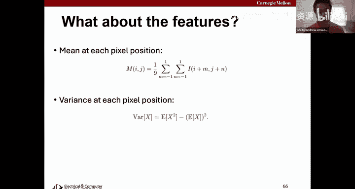
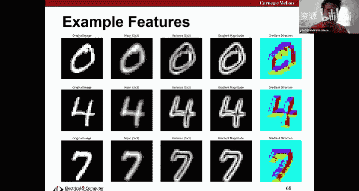
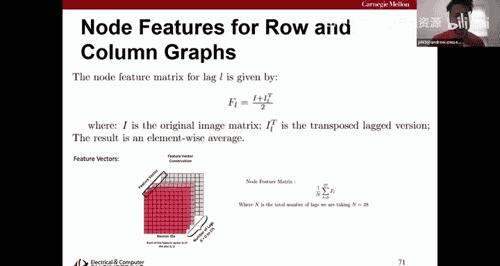
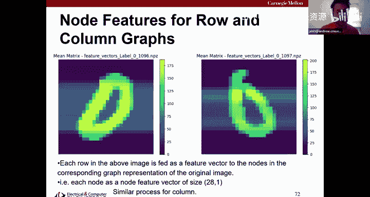
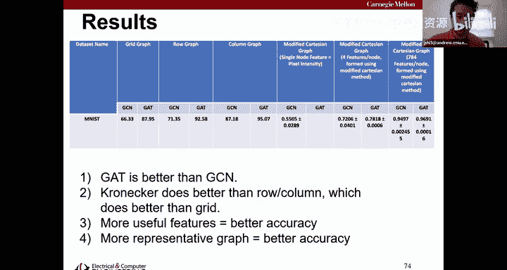

# 28：图神经网络 🧠

## 概述

在本节课中，我们将学习图神经网络。我们将探讨如何将深度学习技术应用于定义在不规则图结构上的数据，理解其核心概念、挑战以及解决方案。

---

## 从网格数据到图数据

在之前的课程中，我们主要处理的是定义在规则网格上的数据，例如时间序列或图像。这类数据具有自然的顺序。

然而，许多现实世界的数据，如社交网络、传感器网络、生物系统等，是定义在不规则的图结构上的。这类数据没有固定的顺序，这给传统的深度学习方法带来了挑战。

---

## 图数据的核心挑战

处理图数据主要面临两大挑战：

1.  **缺乏固定顺序**：对于一个图，没有像“左上角像素”或“t=0时刻”这样直观的排序。不同的节点排序方式不应影响模型的计算结果。
2.  **如何融入图结构信息**：模型需要一种机制来利用节点之间的连接关系（边），而不仅仅是节点自身的特征。

### 排列不变性

为了应对第一个挑战，我们对图数据进行的任何操作都必须是**排列不变**的。这意味着，无论我们如何给图中的节点编号，操作产生的数值结果（或经过相应排列后的结果）应该相同。

**公式**：设有一个排列矩阵 **P**（由单位矩阵行置换得到，满足 **P^T = P^{-1}**）。如果我们的操作 `f` 是排列不变的，那么对于图信号 **x** 和其排列版本 **x' = Px**，以及相应的邻接矩阵 **A** 和 **A' = PAP^T**，应有 `f(A', x')` 是 `f(A, x)` 的排列版本。

---

## 图信号处理基础

为了给图神经网络打下基础，我们先了解下图信号处理的一些核心概念。它试图将离散信号处理中的工具（如卷积、傅里叶变换）推广到图数据上。

*   **图信号**：定义在图节点上的一组数值，可以表示电压、社交网络中的好友数量等。它通常表示为一个向量 **x**。
*   **邻接矩阵 (A)**：表示图中节点连接关系的矩阵。在GSP中，通常约定 `A[i, j] = 1` 表示存在一条从节点 `j` 指向节点 `i` 的边。
*   **图移位**：这是GSP中的一个基本操作，类比于时间序列中的“延迟”。通过将邻接矩阵 **A** 乘以信号向量 **x**，即计算 **Ax**，信号值会沿着图的边传播到邻居节点。可以证明，图移位操作是排列不变的。

### 图卷积与图傅里叶变换

*   **图卷积**：在GSP中，一个线性移位不变的图滤波器被定义为邻接矩阵 **A** 的一个多项式。
    **公式**：`y = h(A)x = (∑_{k=0}^{K} h_k A^k) x`
    其中 `h_k` 是滤波器系数，`x` 是输入图信号，`y` 是输出图信号。这个操作也是排列不变的。
*   **图傅里叶变换 (GFT)**：通过对邻接矩阵 **A** 进行特征分解（**A = VΛV^{-1}**），其特征向量矩阵 **V^{-1}** 的转置构成了GFT的基。GFT将图信号从“节点域”变换到“谱域”（频率域）。
    **公式**：`x_hat = V^{-1} x` （GFT）
    **公式**：`x = V x_hat` （逆GFT）
    GFT同样是排列不变的操作。

---

## 图神经网络的任务

上一节我们介绍了处理图数据的理论基础，本节中我们来看看图神经网络具体能解决哪两类主要任务：

1.  **节点分类**：目标是预测图中每个节点的类别标签（例如，在论文引用网络中预测每篇论文的研究领域）。由于需要为每个节点输出结果，通常不进行池化操作。
2.  **图分类**：目标是预测整个图的类别标签（例如，判断一个分子结构是否具有致突变性）。每个数据样本是一个独立的图。这类任务可以进行图池化。

**为什么需要图结构？**
一个自然的疑问是：对于节点分类，为什么不直接使用多层感知机处理每个节点的特征？关键在于，图结构充当了“答题卡”的角色。即使只有很少的节点有标签（低标签率），模型也能利用节点之间的连接关系（同质性假设：相连的节点往往类别相似）来提升分类性能。研究表明，图的质量（是否真实反映节点关系）对最终准确率有巨大影响。

---

## 图卷积神经网络

现在，我们来看看如何将CNN的思想迁移到图数据上，构建图卷积神经网络。

GCN的核心结构类似于MLP，但将全连接层替换为**图卷积层**。一个典型的图卷积层操作可以分解为两步：
1.  **聚合**：对于目标节点，收集其所有邻居节点的特征信息。
2.  **组合**：将聚合得到的信息与目标节点自身的特征相结合，生成新的节点特征。

**代码/公式示例**：一个常见的图卷积层操作可以向量化地表示为：
`X^{(l+1)} = σ( D^{-1/2} A D^{-1/2} X^{(l)} W^{(l)} )`
其中：
*   `X^{(l)}` 是第 `l` 层的节点特征矩阵。
*   `A` 是带自环的邻接矩阵 (`A = A + I`)。
*   `D` 是 `A` 的度矩阵（对角矩阵）。
*   `W^{(l)}` 是可学习的权重矩阵。
*   `σ` 是非线性激活函数。

这里的 `D^{-1/2} A D^{-1/2}` 是对邻接矩阵的归一化，用于稳定训练。这个操作可以理解为在每个节点上应用一个共享权重的MLP，其“偏置”来自邻居节点的聚合信息。

### 图注意力网络

标准的GCN在聚合时给所有邻居分配固定的权重。图注意力网络引入了注意力机制，让模型学习为不同的邻居分配合适的权重。

**核心思想**：计算目标节点 `i` 与其邻居节点 `j` 之间的注意力系数 `α_{ij}`。
`α_{ij} = softmax_j ( LeakyReLU( a^T [W x_i || W x_j] ) )`
其中 `W` 是共享的权重矩阵，`a` 是注意力向量，`||` 表示拼接。然后使用学习到的 `α_{ij}` 进行加权聚合。

### 从节点特征到图特征（图池化）

对于图分类任务，我们需要将所有节点的特征汇总成一个代表整个图的特征向量，并且这个汇总操作必须是排列不变的。

以下是几种简单的全局池化方法：
*   **求和池化**：`z_G = sum( x_i )`，对所有节点特征求和。
*   **平均池化**：`z_G = mean( x_i )`，对所有节点特征求平均。
*   **最大池化**：`z_G = max( x_i )`，对所有节点特征逐元素取最大值。

更复杂的池化方法（如Top-K Pooling）则学习有选择地丢弃一些节点，并生成一个节点数更少的新图，类似于CNN中的空间下采样。

---

## 研究案例：为图像构建更好的图表示

最后，我们通过一个前沿研究案例，看看如何为传统任务（如图像分类）设计更有效的图表示，以提升GNN的性能。

**动机**：通常将图像表示为**网格图**（每个像素是一个节点，连接相邻像素）。但我们可以尝试构建更能捕捉图像语义结构的图。

**方法**：
1.  **行/列相关图**：将图像的每一行/列视为一个信号，计算行与行、列与列之间的相关性，通过聚类判断是否存在“边”，从而分别构建行关系图和列关系图（均为28x28的邻接矩阵，对应MNIST的28行/列）。
2.  **克罗内克积图**：为了得到一个能同时捕捉行和列关系的图（784x784，对应所有像素），我们对行图和列图进行**克罗内克积**操作，生成最终的图结构。
3.  **增强节点特征**：不仅使用原始像素值作为节点特征，还加入梯度、均值、方差等更多描述性特征。

**结果**：实验表明，使用克罗内克积生成的图结构，并结合更丰富的节点特征，能显著提升GCN和图注意力网络在MNIST图像分类任务上的准确率。这验证了“更好的图结构（答题卡）和更好的特征”对提升GNN性能至关重要。

---

## 总结

本节课中我们一起学习了图神经网络的核心知识。我们从图数据特有的挑战（排列不变性）出发，了解了图信号处理的基础工具（图移位、卷积、傅里叶变换）。接着，我们深入探讨了图卷积神经网络的工作原理，包括其聚合-组合的范式、具体的GCN和GAT实现，以及用于图分类的池化方法。最后，通过一个研究案例，我们看到了如何为特定任务设计更优的图表示，从而释放GNN的潜力。图神经网络是将深度学习威力应用于社交网络、化学分子、推荐系统等复杂关系数据的强大工具。