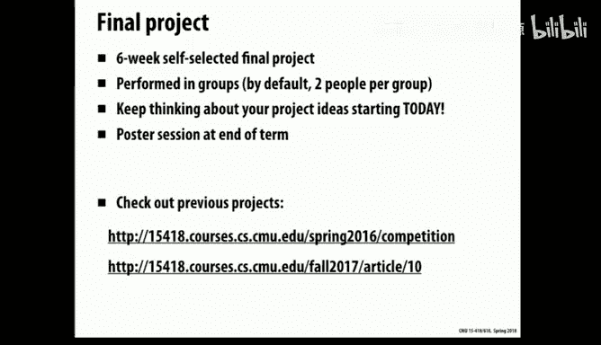
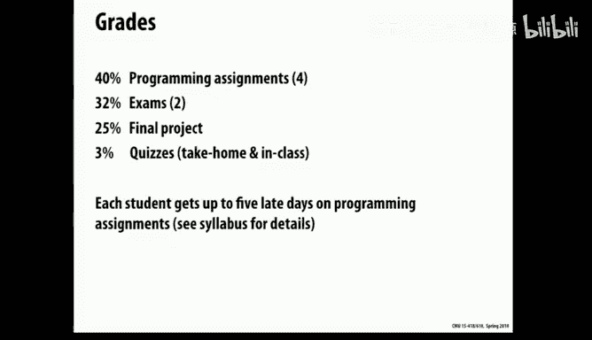
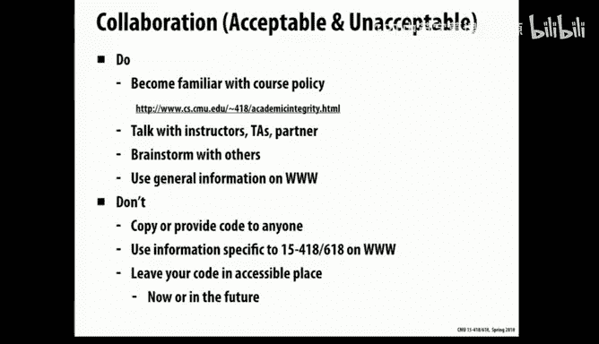
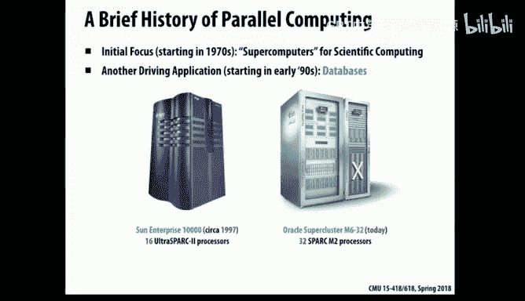
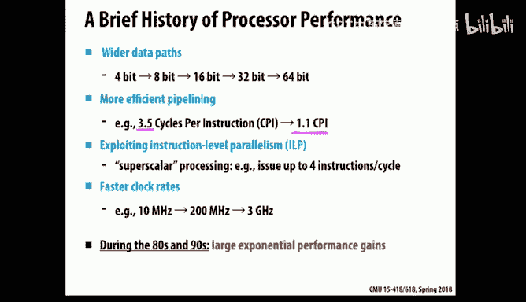
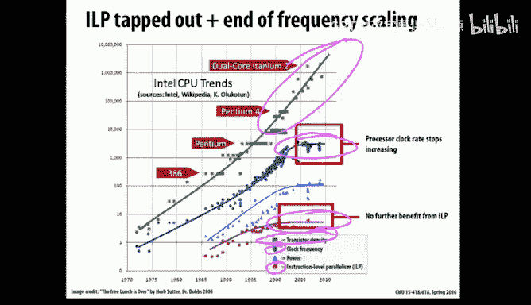
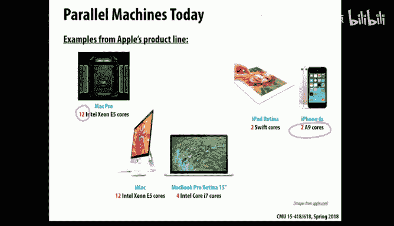
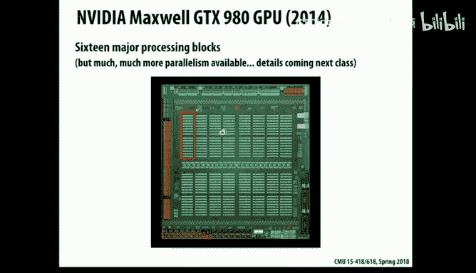
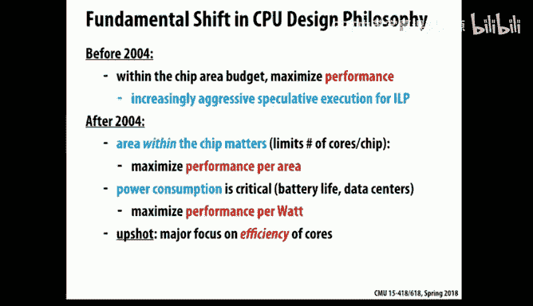

# 1：课程介绍与并行计算入门 🚀

在本节课中，我们将学习课程的基本信息、评分结构，并通过生动的例子初步了解并行计算的核心概念与挑战。

## 课程概述与人员介绍

我的名字是兰迪·布莱恩特，是15-418/618课程的讲师之一。今天和我一起的还有其他几位同事。这是我第三次教授这门课程。之前我曾与他人合教，但那位同事决定去阳光更充足的地方。因此，这次我邀请了格雷格·凯斯滕加入，他在克雷格街的信息网络学院工作。此外，托德·莫里将在本月的大部分时间里提供客座讲座。托德多年前创建了这门课程，并多次教授，他将在课程启动阶段提供帮助。

这是一门非常激动人心的课程，我们将深入进行并行计算的实践体验。我自己在两年前作为正式讲师时，完成了所有实验，并强迫自己不看答案，我发现这虽然困难，但让我学到了很多，对我非常有用。我相信你们也会有类似的体验。

## 课程注册与选课机制

教室里有很多人。这门课程有很长的候补名单。截至昨晚，有118名学生注册，但有172名学生在候补名单上。根据消防规定，这个教室最多容纳144人。因此，我们无法增加更多学生。这意味着目前有26个空位。

对于已经注册的学生，我希望你们真的想上这门课。如果你不确定是否有时间或可能负担过重，我真诚地希望你能做出承诺。虽然退课日期还很远，但如果你不打算坚持，请考虑在本月底退出，以便为候补学生腾出名额。为了班级的利益，我们虽然不能强迫你退课，但如果你还在犹豫，这将是一个好机会。

我们将使用第一次作业作为筛选机制。对于注册学生，虽然第一次作业在12天后才截止，但它很好地衡量了我们的期望和你们需要完成的工作量。我鼓励每个人都开始做这个作业，它能很好地校准这门课程的要求。

对于候补名单上的学生，这是你们展示自己的机会。作业已经发布。我们将查看一周后（1月24日）提交的所有作业，并进行非常活跃的评分。我们将根据这次作业的表现，决定谁能从候补名单中脱颖而出并注册课程。没有其他规则。这是一种非常严格的择优录取方式。我们不关心你在候补名单上的位置，不关心你是本科生还是研究生，也不关心这是否是你在卡内基梅隆大学的最后一个学期。这些因素都不会被考虑。决定因素100%基于这次作业的表现。

你们可以计算一下录取率。希望会有更多名额空出来。你们有一周的时间全力以赴完成这次作业，我们会看到结果。我无法向任何人承诺标准是什么，需要多好才能入选，我自己也不知道。但这就是门槛。所以，努力去做吧。没有隐藏的技巧，没有特殊交易，没有游说。我对送到家门口的巧克力或其他东西免疫，这些都没用。

## 课程内容与作业结构

这门课程是关于什么的？就你们要做的事情而言，你们会来听这样的讲座，但你们的大部分时间将花在完成作业和项目上。这是一门以实践为导向的课程，是一种相当极端形式的“做中学”。

具体来说，将有四次作业，每次大约持续两周。包括已经发布的第一份作业。有趣的是，这四次作业分别涵盖了计算机通过并行性实现加速的不同方式。这是这门课程的一个有趣方面：硬件制造商试图找出许多不同的方法来从他们能构建的硬件中榨取更多性能，他们通过提出非常不同类型的并行性来实现。因此，这门课程虽然涉及编写代码，但你必须理解和欣赏硬件才能有效地完成。

具体来说：
*   **第一次作业** 将利用当今几乎所有处理器芯片中都包含的并行性类型，即多核，以及核内算术单元可以并行执行多条指令（称为SIMD，单指令多数据）。你们将使用英特尔研究人员开发的一种名为ISPC的语言来探索如何利用这两种并行性。
*   **第二次作业** 涉及所谓的GPU或图形处理单元。GPU最初是为了加速图形处理而开发的技术，其主要市场是游戏机。一些聪明人发现可以创建专门的处理器来大幅加速图形处理，然后另一些聪明人意识到这种技术不仅适用于图形，于是开始使它们更具通用性，并使用不同的编程符号使其更可编程。现在，它们成为了从单芯片获得卓越性能的方式。
*   **第三次作业** 将研究所谓的**共享内存并行性**。这意味着，如果你将多核的概念扩展到拥有一组处理器，它们都可以执行独立的程序，但它们共享一个公共内存，一个处理器写入的数据可以被另一个处理器读取。
*   **最后一次作业** 将是解决相同类型的问题，但使用所谓的**消息传递**模型。同样，你有一个包含多个处理器的机器，但它们拥有独立的内存（或被视为拥有独立内存），如果它们想相互通信，必须显式地发送消息。

这两种模型，以及所有这些模型，都以各种形式内置在我们今天遇到的许多计算机中。所以，这是课程中非常重要的一部分。我想你会发现虽然会很忙，但如果你喜欢编程并喜欢让东西运行得更快，也会很有趣。

## 课程项目与评分

课程的另一个重要组成部分是期末项目。在这里，你可以设定自己的想法，决定你想做什么并从中获得收获。项目占你总成绩的四分之一，是一个重要部分。大致上，你应该将一个项目视为大约相当于两次作业的工作量。

项目范围很广，幻灯片中有一些链接展示了前两个学期的项目，可以给你一个概念。它们范围很广，例如：我有一个应用领域（如计算机视觉、图形学或分子模拟）可以从加速中受益，我想将其映射到我们已经研究过的某种类型的机器上并使其运行得更快，这是一个很好的项目类型。另一个是：我对课堂上讨论的锁定机制非常感兴趣，我想进行一些非常仔细的实验，比较它们在不同系统特性和运行数据下的表现。这是两种风格。

关于这个世界的一个有趣之处是，我们现在口袋里装的这些东西（手机）内置了很多并行计算能力。它们有多个处理器，也有GPU（虽然比英伟达的GPU更难编程，但可以做到）。因此，许多有趣的项目来自于在人们手机（特别是基于Android的系统）上运行的东西。所以，那里真的有很广泛的可能性。

我建议你从现在开始，直到你需要提出项目想法为止，留意各种想法。你对什么感到兴奋？有没有你想在课堂上更深入探索的东西？有没有来自这门课程之外的应用领域你想引入？这些都是值得思考的好事情。

## 测验、考试与评分细则

会有一些我称之为“测验”的东西，但这实际上只占你成绩的很小一部分。具体来说，我们会给你一些可以在考试前完成的带回家的问题，它们更像是考试准备材料，而不是我们真正关心你的答案。我们的评分基本上是“通过/不通过”。但这只是让你做好准备和思考的一种方式，因为正如你可能在其他课程中经历过的那样，如果你为一门课程编写了很多代码，然后参加考试，突然之间考试问题似乎与你实验中的体验大不相同。所以，这部分是为了让你思考如何看待问题并为考试做准备。

我们也会少量使用这些在线测验。我知道对我来说，我去年秋天在213课程中第一次使用它们，我认为它们是激励人们并实际上为讲师提供有用反馈以跟踪讲座材料进展的有用方式。这同样会在成绩中占一小部分。

所有这些加起来，总共只占这门课程100分中的3分。所以这不是你成绩的最大部分。它更多的是让你跟上并推进材料的方式。

以下是成绩分布（课程网页上有教学大纲，给出了所有细分）：
*   四次作业占 **40%**。
*   项目占 **25%**。
*   两次考试（课堂进行，时间表上有日期）占剩余部分。
*   课堂测验等活动占 **3%**。

作业和项目加起来占课程成绩的三分之二。这真的是主要焦点。考试将更多地涉及解决问题，推动课程的思想和概念，而不是你让代码运行和加速的能力。

还有一个关于迟交作业的方案（类似于213、513课程中的宽限期）。这有点复杂，无法在这里详细解释，但在网页上有相当清楚的描述。简而言之，有一个系统可以让你在提交作业时在时间安排上更灵活一些。

## 课程资源与协作政策

现在，昨天和今天，课程网页已经上线。有一个Piazza页面，任何人都可以注册账户，或者你基本上可以关注那个账户，使用我们的班级Piazza不需要做任何特别的事情。

这门课程没有教科书。教学大纲中给出了一些参考资料，但事实上，这个学科的一个特点是它发展得非常快，以至于教科书真的已经有些过时了。老实说，我们将使用这些幻灯片和演示材料，你在网上找到的材料将是课程的主要参考资料。

从第二次作业开始，你可以单独工作，也可以与另一个人合作。所以，你不必马上决定，我们不会在配对或帮助人们相处方面做任何事情，这完全取决于你。所以你可能在考虑可能的合作对象。

课程在周一、周三、周五上课。但在时间表上，你会看到有些课被指定为“复习课”。显然，这么大的教室不适合进行每个人都互动的复习课。但这些课的目的是针对一些作业，帮助你们掌握一些工具、理解和认识作业的要求。我认为去年我们尝试过，学生们觉得相当有帮助，所以我们也会采用某种形式。我们的想法不是呈现新材料，而是帮助你们更好地推进和适应作业。

最后两周，你们会看到没有课。我们试图做的是完成讲座材料，以便你们有时间弄清楚项目（其中一些将基于讲座材料），并腾出足够的时间，因为我们知道学期末学生们有多忙。我们希望你们在这些项目上付出相当大的努力，并确保你们有时间去做。在时间表中，你们会看到项目有多个检查点，我们计划积极跟踪你们的进展，这样你们就不会犯拖延到课程最后一周然后试图通宵完成一个不可能完成的项目这样的错误。我们希望这个项目对你们来说是一个巨大的成功，是你们多年后仍会记得的、真正伟大的经历。

## 学术诚信与有效协作

我想谈的最后一个部分是，我们不喜欢谈论但必须谈论的事情：什么样的合作是有效和无效的？同样，网页上有关于此的描述，也在教学大纲中。我们在这里说的没有什么不寻常的，但我想强调我们是认真的。

具体来说，这门课程中你们确实想互相交流。如果你们谈论的是高层次的想法，比如“我在想应该用这种方式还是那种方式并行”，这类问题是可以的。但我们不希望你们分享任何与如何实际实现代码的细节相关的内容，或者性能数据，或者互相帮助找出错误等。这些都不允许，真的不好。

另一方面，这门课程有很多材料，你们需要的很多资源都在网上。像英特尔和英伟达这样的公司有很多网页和数据，我们希望你们利用这些。Stack Overflow上有很多好东西，很多参考资料，人们的博客，网络上充满了材料。对于我们所有做这类工作的人来说，我们一直在网上搜索，试图弄清楚如何做X、Y或Z，或者这个的文档在哪里，我可以在哪里找到更多关于那个的信息。所以这是一个非常重要的工具，我们完全鼓励你们使用它。

另一方面，在人们的GitHub账户上，有作业的副本。如果你查看任何与这门课程现在或以前的实例相关的内容，那是绝对不允许的。如果你开始试图寻找别人的解决方案，你实际上会严重伤害自己。我告诉你，根据第一手经验，做这类事情是令人沮丧的。我的经验是：我尝试了一些我认为真的很棒的东西，结果在并行计算机上运行实际上比单核还慢。然后我不断努力，让它达到相同的速度。然后我继续努力，让它快了两倍。然后突然之间，它快了20倍。所以，这是一种你无法以某种线性形式衡量进展的事情。你有一个好主意，但结果行不通。然后你考虑另一个主意。你学习这些材料的方式就是通过实践。我们可以指导你，帮助你，试图避免一些死胡同或坏主意，但在很大程度上，这是你必须学会自己做的事情，因为这就是你进入世界后的方式。

所以，不要开始寻找GitHub账户和类似的东西。我说过有GitHub账户上有这些东西，但这并不意味着我们喜欢它。具体来说，我们认为，如果你将这些材料提供给未来的学生，无论是明确地还是无意地（因为你把它留在了GitHub账户上，因为你正在找工作，面试的公司说我们想看看你的代码，你能提供吗？你说当然，在GitHub上，看看吧），这是一种学术诚信违规。

如果这听起来像是可能真的发生过，那是因为它发生过很多次。在这种情况下，你是在向我们未来的学生提供材料，我们认为是学术诚信违规。我们可以而且实际上会追究前学生的责任。我们已经在其他课程中这样做过一点（不是这门课），我们全体教员打算现在对此更加严格。所以，你有义务以未来学生无法访问的方式保存自己的信息。

所以，这是课程中不那么有趣的部分，但却是需要理解的重要部分。

## 并行计算的历史背景

大家好，我是托德·莫里。正如兰迪所说，我教过这门课很多次，这是我最喜欢的课程之一。我现在要讲的是，我将从并行处理的历史以及我们如何发展到今天开始。

并行处理并不是新事物，它已经存在了几十年。它起源于一些人对快速计算有非常高需求的情况，例如物理学家试图模拟物理现象，他们需要大量数据，并且需要计算微分方程在多个时间步上的解。事实上，其中一些人在政府实验室工作，预算非常庞大，所以他们需要高性能，也有大量资金。人们开始使用多个处理器构建非常快的机器。事实上，第一台并行机器之一是在卡内基梅隆大学建造的，叫做C.mmp，我认为它的残骸实际上在韦恩大厅的某个地方。那是一台有16个处理器的机器。

另一个在80年代众所周知的例子是西摩·克雷，他设计了使用向量处理（我们下周会讨论）以及多CPU的超级计算机。他的机器非常昂贵且非常快，处理器数量相对较少，但每个都非常快。

然后有一家来自麻省理工学院的初创公司叫Thinking Machines，他们的机器设计非常不同。他们的方法是拥有大量非常弱的小处理器。例如，他们早期的一台机器中有65,000个单比特处理器。他们也非常擅长制造有很多闪烁灯的机器，这很适合演示，也适合科幻电影中人们想看到计算机在做某事。

最初，这完全是关于科学计算的，那些人仍然使用这些机器。但这类机器发展的下一步是，在20世纪90年代，数据库人员发现并行机器是进行事务处理的非常好的方式。他们弄清楚了如何将所有重要的算法和数据结构以及数据库分布在多个处理器上，这对于在线事务处理（例如，网络以及运行网站后端等的数据库）非常有用。例如，Oracle销售了很多运行数据库的机器，Sun Microsystems也是。Oracle是一家大型数据库公司，他们最近收购了Sun。所以，市场变得有趣的原因是，数据库市场比科学计算市场更大。突然间，这些东西作为实际业务变得更有趣了。

## 微处理器的发展与转折点

在谈论我们今天如何走到这一步之前，我想先谈谈通用微处理器随时间的发展。在你们出生之前，但在很多年里，处理器一直在呈指数级增长。例如，它们每三年大约快一倍。在计算机领域，我们有很多这样的指数曲线，例如内存变得指数级更大，磁盘变得指数级更大，等等。所以，这是另一个很好的指数曲线。

是什么让它变快？背后的原因是什么？一方面，它们有更宽的数据路径。同样，这在某种程度上是古老的历史了。很久以前，处理器一次只处理4位数据，然后发展到8位、16位、32位和64位。从16位到32位的跳跃在提高性能方面是一个大问题，32位到64位则不那么重要，大多数人用不到80亿字节的内存，当时的机器甚至没有那么多内存。所以，这是有所帮助的一点。

但另一个有很大帮助的是，在80年代和90年代，处理器设计者找到了更流线化的流水线设计方法，使得指令流经处理器时效率更高。他们使一切变得规整，这有助于将每条指令的执行时间从大约每条指令3.5个周期减少到接近每条指令1个周期。

在那之后的下一步是，他们希望超越这一点，开始让处理器同时执行多条指令。这今天仍在发生。其思想是硬件试图在指令流中向前看，找到独立的指令（彼此不依赖的指令），如果找到，它可能能够同时发出，比如最多四条指令。这在90年代尤其有助于提高性能。

但真正比其他任何东西都更有帮助的是时钟速率变得更快。时钟速率，有一个小晶体导致处理器在硬件中逐步执行其操作，时钟速率也在呈指数级增长。例如，在90年代初，处理器运行在大约10兆赫左右，然后在90年代，英特尔开展了一场巨大的营销活动，教每个人性能等于时钟速率。所以他们教所有消费者，你的100兆赫处理器现在是垃圾，因为我们的新200兆赫处理器已经出来了，所以你确实需要升级到新的200兆赫奔腾，等等。在很长一段时间里，时钟速率确实是驱动性能的主要因素，但后来发生了一些事情。

关于这个问题有一点预兆。例如，帕特·基辛格（他之前是英特尔的首席技术官，目前是VMware的首席执行官）在一次技术会议上发表演讲，在这个大事件发生之前，他谈到了……他展示了这张幻灯片，向人们展示了不同英特尔产品的功率密度数字。功率密度基本上是在芯片表面上每平方厘米产生多少瓦特。这很重要，因为当它变热时，你必须散热，否则东西会融化。在英特尔处理器的早期，你只有几瓦特，所以根本不热。但他指出，随着事物呈指数级改进，随着时钟速率上升，热密度也会上升。例如，英特尔奔腾处理器热得可以煎鸡蛋（我猜是一个小鸡蛋），它就像一个热板一样热。你可能听说过散热器这些东西，它们是处理器顶部的金属片，帮助散发其热量。这还不算太糟，虽然有点热，但展望未来，他说，好吧，时钟速率在呈指数级增长，但随着热密度开始继续呈指数级增长，我们芯片的表面将像核反应堆内部一样热，这听起来很热，很糟糕。然后我们将达到火箭喷嘴的水平，然后我们正在朝着达到太阳表面的热密度的路径前进。显然，有些事情可能会出错。

确实出错了。所以，大新闻是（这是2004年5月17日《纽约时报》的一篇文章），戏剧性的事件是：英特尔很清楚这个问题，但由于他们教每个人时钟速率等于性能，他们真的希望继续沿着时钟速率曲线前进，但他们不得不取消他们的两个旗舰项目，因为他们无法再解决如何冷却这些芯片而不使其熔化的技术问题。这是一件大事。实际上，我当时在英特尔工作。所以，之后的新世界是，既然我们不能让时钟速率更快，我们只能……不过，你能做的是在一个芯片上放置多个核心。世界一夜之间改变了。我知道那时你们大约在上一年级，所以这是很久以前的事了，但这就是为什么今天一切都与多核有关。

## 并行计算成为必然

如果你看这里的不同趋势，例如，时钟速率，就是这条曲线，它曾呈指数级上升，但已经趋于平稳。指令级并行性也已经趋于平稳。但有一件事没有趋于平稳，那就是芯片上的晶体管数量。所以我们有越来越多的硬件，但我们就是不能让单个处理器运行得更快。所以我们做的是在芯片上制造越来越多的处理器。

从软件人员的角度来看，这意味着什么？如果你想让你的软件运行得快，在旧时代（比如你出生的时候），你可以做的是，如果你想让你软件运行得更快，只需等六个月，买一台新机器，硬件就会运行得更快，一切都会更好。这很棒。但2004年后，世界改变了，现在买一台新机器，除非你实际改变你的软件以利用多核，否则它不会运行得更快，它会以相同的速度运行。这就是为什么这门课程很重要，因为我们将教你如何编写并行软件。

你们都很清楚这一点，但今天的每台计算机都是并行计算机，从高端机器一直到手机和手表等。我们今天有很多很多处理器。如果你看苹果的产品线，这范围从他们一些高端机器中的10个核心，到新手机（苹果X，我这里没有更新，但实际上我的稍旧手机有两个核心，而iPhone X有六个核心）。你的笔记本电脑和平板电脑也有很多核心。例如，英特尔的处理器有很多CPU直接印在芯片上，例如Skylake，它有许多CPU加上一个GPU，GPU本身可以用于进行大量处理，我们将在本课程中讨论，你们将在作业2中利用GPU。

还有另一个有趣的硬件，你们也将在本课程中使用。兰迪之前谈到GPU是并行计算能力的一个来源，但英特尔实际上做的是，他们采用了他们更老一代奔腾处理器的设计，并意识到那个东西非常简单和小，他们可以在一个芯片上制造很多个。所以有一种叫做Phi的东西，你们将使用它，它有60多个英特尔核心。

然后我们还将讨论本课程中的GPU。GPU有一种非常特定的执行模型，最初是为图形处理设计的，对于某些事情效果很好。所以，如果它很好地映射到你的问题，它可能是获得良好性能的非常好的方式，它们有很多很多计算单元。你在这里看到的每个小方块都是一个处理器，所以这些东西通常有数千个计算单元。

像手机和平板电脑这样的东西也有多个处理器。在这些设备中，我们通常谈论的是两到六个处理器，不是数千个，但它们也有GPU。所以这是另一个并行性来源。最后，为了好玩，如果我们看看真正的高端，这是今天美国橡树岭最快的超级计算机之一，它有18,000个16核处理器和18,000个GPU，所以它有数十万个处理器。总之，在当今世界，我们有很多很多并行机器。那么我们如何利用它们？我们如何利用它们？

## 并行计算的定义与挑战

在这门课上，我们将讨论并行性和并行计算。那么，什么使并行计算机与非并行计算机不同？是什么让并行计算机不同？是的，它里面有多个计算机。现在，你们每个人至少有一部手机，我看到一堆笔记本电脑等。所以在这个房间里，我们有很多很多不同的手机和笔记本电脑。这个房间里所有的计算机，它们是一台并行计算机吗？嗯，集体来说。所以我们这里有一台巨大的并行计算机。不一定，也许。所以，不仅仅是拥有一堆处理器。这是一个教科书式的并行计算机定义：它确实有多个处理元素，这是显而易见的部分，但使其有趣和具有挑战性的部分是，它们实际上不仅需要存在，还需要合作，需要共同工作以更快地解决某个单一问题。所以，并行性是关于利用许多处理器的力量使事情运行得更快，但这并不容易做到，而这正是本课程的重点。

## 互动演示：理解并行效率

现在，我们准备做一些并行编程，但接下来的四到五讲都将涉及与并行软件相关的问题。在那之前，我今天要做的是，我们将进行一些人类计算。在剩余的大部分时间里，我们将与来自听众的志愿者一起进行演示，信不信由你，我们将从这些演示中学到很多关于并行软件如何工作的知识。

我需要第一个演示的志愿者，唯一需要的技能是你能加一位数。我需要一个志愿者，有人能来这里吗？我将要求很多志愿者，所以你可能想早点完成志愿工作。太好了，谢谢。嘿，你叫什么名字？萨米？萨姆？我这里有……等一下。我要做的是，我要计时。但别担心，没有对错。嗯，答案有对有错。但我要做的是，我想看看需要多长时间。我们将以此作为我们的起点。我们将让萨姆把16个数字加起来，我们只是计算这需要多长时间。然后我们将开始并行地做这件事。这只是为了获得一个基准数字。那么，当你准备好了，你可以继续把它们加起来，6和9下面有横线。好的，开始吧。哦，心算，对不起，我意识到。好的。六十。对了，好的，好的，太好了，好的，谢谢。好的，那花了56秒。好的，所以这是我们计算的顺序版本，我们今天的计算是加16个数字。

现在让我们开始并行地做这件事。首先，我们将使用……我要拿一组不同的数字，这些都是一位数的集合。好的，那么，这次我们将用两个处理器来做，我需要一个来自后面某个地方的志愿者，我需要一个志愿者到教室前面来，首先，有人能上来吗？好的，太好了。嘿，你好吗？你叫什么名字？哦，很好，很高兴见到你。好的，所以我有了……等一下。我有一组数字要你加起来，我需要另一个志愿者，来自……更靠教室前面的。好的，太好了。你好吗？你叫什么名字？嘿，弗兰克。所以，弗兰克，我想让你站在这里，等我告诉你开始时，你开始加它们（还没开始），我想让你在这里把它们全部加起来，当你完成后，你可以上来。目标是，我们想知道总数，我给了你们每人一半的数字（每人8个一位数），唯一允许你们相互交流的方式是在这张纸上写字，所以你们不能互相交谈。所以，当你完成后，你可以上来写，你可以写，我们会得到总数。好的，那么，你准备好开始了吗？好的，开始。是的，对了，是的，好的，谢谢。好的，所以。你们可以坐下了，谢谢。那花了34秒。所以，34比56快，所以事情变快了。理想情况下，如果你有两倍多的计算机在工作，你希望这个计算快多少？也许快两倍，对吧？它快了两倍吗？不完全是，比两倍快慢一点。这在我们做并行软件时相当典型。我想指出的一点是，当我们谈论事情变快时，我们会使用一个数字，我们称之为**加速比**。

计算加速比的方式是：在一个处理器上花费的时间（在我们的例子中是56）除以在多个处理器上花费的时间（在这种情况下是两个）。所以我们有两个。那个数字是34，所以这个数字是……如果有人有计算器，你可以算出来，但大约是1.8左右。所以我们的加速比大约是1.8。

我们在这里注意到了什么？为什么没有快整整两倍？你们看到了一些低效的原因吗？是的，跑下楼梯的时间。完全正确。我让弗兰克从那里开始然后走到这里的原因是为了使这更符合实际处理器的实际情况，因为即使它们在同一个芯片上，当它们想相互通信时，它们必须通过电线传输信息，这实际上需要时间，所以有点像必须跑上来。你可能注意到的另一件事是，即使弗兰克上来了，他们还没有完成，他必须实际看看纸上有什么，加上那些数字并得到结果。这些是我们效率有点低的原因。

那很有趣，但现在我们要做两个处理器很好，但四个更好。所以现在我需要四个志愿者，因为我们要扩大规模。所以请四个人下来，那太好了。好的，这是一个。好消息是，当你做这个时，你需要加的数字更少。所以下来吧，我知道，我知道你被卡内基梅隆大学录取了，我相信你能处理这里的计算任务。太好了，好的，那是两个，好的，这边有人。也许格雷格可以帮我找人。好的。太好了，好的，那边有个楼梯，谢谢。太好了，谢谢。

好消息是，我不会让你们任何人站在上面，你们都可以聚集在桌子周围。我马上要做的是，我拿16个数字，把它们分成几堆，如果你们稍微分散一点，你们每人马上会得到一堆。所以是同样的交易，你们不能互相交谈，你们要把数字加起来，用那支笔和纸，你们要得到总数。让我在这里分发我的数字堆。好的，先别开始，等我一下。好的，我计时。准备好了吗？开始。等等，我丢了牛。好的，好吧，我们就假装你刚刚完成那里。好的，好吧，想象你刚刚完成那个。好的，别走，我们要……好吧，让我们为这里勇敢的志愿者们鼓掌。好的，那么，现在用四个处理器，花了39秒。好吧，这没有比那个快四倍，是吗？那么，发生了什么？你观察到这里发生了什么？为什么花了一段时间？是的，有一个瓶颈。是的，有一个瓶颈。具体来说，我对我们穿黑衬衫的朋友做了什么坏事？是的，功能失调。是的，你注意到我给他的数字比任何人都多得多吗？是的，所以我实际上总共有16个数字，但他最终拥有的远不止四个，实际上多得多。那么，我为什么这样做？因为实际上这在并行软件中经常发生，也就是你有工作要做，提前均匀地分配并不总是容易的。所以可能出错的一件事是，如果工作分配不均衡，一些处理器可能已经完成，就像你看到左边的三个人基本上完成了，然后他们在等待，而他们等待时，他们没有任何有用的事情可做，你必须等到最后一个完成才能继续，这是花费那么长时间的主要原因。你注意到其他任何低效来源吗？是的，所以不仅像以前一样两个人必须写东西，现在你们所有人都必须写东西。所以，你知道，我们必须去拿笔，然后加上所有那些数字。所以这是另一种瓶颈。

那么，好的，如果你们能留在这里，我们要再做一次，但这次我们要用不同的基本规则，也就是这次，我也要给你们数字堆，可能又不均匀地分配，但我要让你们想出一个更好的方法来做这件事，所以特别是，你们不限于只加我最初给你们的数字，所以也许你们四个可以互相交谈一会儿，想出一个策略，试图这次做得更快一点。所以，你们不能……是的，你们不能说话，但如果你们想，你们可以移动数字，你们现在可以说话，所以现在想，弄清楚你们可能做什么让它更快。我们有多少次尝试？好吧，我们只做这一次，那就是了。但也许你们可以在这个过程开始时协调一下。所以当我说开始时，你们实际上被允许……我们可以移动东西吗？但你们就是不能说话，只有16个数字。好的。好的，那么，你们准备好了吗？好的，我要分发这些，所以先别开始，但我会把堆放在你们面前。好的。好的，那么，准备好了吗？开始。哦，好的。太好了。那是……答案是什么？好的，那花了24秒，所以那实际上快了很多。那么，这次你们的策略是什么？我们看到了一点，但对于后面房间的人来说，我们可能没有看到，所以你们这次做了什么不同的事？我们喜欢把它分成四个数字。是的，只有一个人总计。是的。太好了，是的，所以那让它快了很多，总之谢谢你们志愿，你们可以回去坐下了。

所以，我们在那两个演示中看到的是，负载不平衡确实是主要挑战之一。有很多挑战，但真正导致性能下降的事情之一是，如果你没有均匀的工作量。所以在第二次尝试中，他们基本上重新平衡了工作，这样他们每人加四个数字，然后这帮助很大。现在一件事是，做那个重新平衡确实花了一点时间，所以这是一个额外的开销来源，但在这种情况下，它回报相当大，明显快了很多。

## 大规模并行演示与通信开销

现在你们所有人都在志愿，我们现在要进行一次大规模并行计算。我想知道的是，我想知道现在房间里你们每个人注册的课程总数，希望这些是单位数。好的，所以房间里大约有150人，所以我们现在要加大约150个数字。这里有一些基本规则：你只能与你的邻居交谈（左边、右边、前面或后面），不能在整个房间里大喊，可能也不会很好。那么，你准备好了吗？哦，不，你还没准备好。那么，我们怎么做？有什么想法、建议吗？是的，每个人沿着行传递累积的总和，在行的末尾，传递。好的，所以也许像这样在房间里横向相加，然后取那些数字，纵向加到前面，所以也许我们在这里得到一个答案，还有其他想法吗？是的，从两端开始。很好，那样你们就可以在同一行同时相加，所以也许从每一端向中间加，然后当它到达中间时，向前传递，然后有人可以告诉我总数。好的，那么，我们加了16个数字用了56秒。所以一个处理器大约是每个数字几秒。现在我们要加150个数字。大约是10倍多的数字，但我们有150个处理器。所以应该非常快。好的，那么，大家都准备好了吗？好的，那么，你知道算法，你要向中间加，然后中间的人要向前加。好的，好的，各就各位，预备，开始。你注册了多少门课？所以我们在加你注册了多少门课，对吧？好的。一百不，不，不，不。好的，太好了，谢谢。但那是错误的答案。不，我开玩笑的。我没有办法检查那个。好的，那花了95秒。所以，好吧，使用同样的比率，我们本应期望一个更快的数字，那有点慢，对吧？考虑到我们这里有150个处理器，你们每个人应该能够像每几秒加一个数字一样加数字，而我们只有……事实上，我们有150个数字，所以应该花了大约三、四秒来加所有这些数字，对吧？仅仅基于你们集体加数字的能力。类似这样。那么，为什么花了那么长时间？对我们来说太花时间了。对，是的，完全受限于通信，所以在95秒中，你有多少时间在做任何有用的事情？是的，比如几乎……你大部分时间都在坐着，所以那是一个我们基本上在整个房间进行大规模规约的情况，你必须……完全受限于通信，这就是它那么慢的原因。好的。

## 课程核心主题总结

实际上，在接下来的讲座中，当我们讨论并行软件时，我们将回顾我们在这些例子中看到的几件事。但总结一下，我将谈谈课程中的一些主题。其中之一是，我们希望你们学习如何编写可扩展的并行程序，即用更多处理器运行得更快，你们需要知道如何均匀地划分事物。事实证明，还有很多其他问题需要考虑，这是你们在四人演示中看到的一个，但它甚至比那更有趣得多。所以我们将讨论思考并行性的不同方式。事实上，正如兰迪所说，每次作业都有一个完全不同的抽象来思考并行性。

这门课程的下一件事是，你们需要了解一些并行硬件的工作原理，因为即使你们对硬件完全没有兴趣，事实证明，与在普通顺序机器上编写软件不同，当你试图在并行机器上让东西运行得更快时，硬件在底层做什么的细节对性能有非常大的影响。因此，出于这个原因，你们确实需要知道一些关于什么会限制性能、什么会导致瓶颈的重要事情，即使你们不打算设计硬件，这也是你们需要知道的。

班级的另一个重要主题是效率。目标不仅仅是快，还要高效。我们希望你们高效地使用计算资源。例如，一个问题是，如果你在上班或暑期实习，被要求并行运行这个问题，它在10个处理器上运行快了两倍，你的老板会给你大幅加薪还是解雇你？或者介于两者之间？但这会被认为是好是坏？是的，那要看情况。这是正确的答案。所以，可能你无论如何都有那10个处理器，比如想想你手机上的GPU，你反正有它。所以，如果你有资源，而你的软件没有达到实时帧率，通过让它快两倍现在达到了，那是一个巨大的成功，真的很好。但如果你在亚马逊网络服务上租用时间，你为10台机器付费，但你只从中得到一点点增益，那么也许这不是一件好事。但就你能高效而言，这很重要。对于硬件设计者来说，这也是非常重要的事情。所以，特别是在2004年这个大变化之前，如果我们继续提高时钟速率，一切都会开始融化，那时的游戏规则是，你得到一个芯片，只放一个处理器在上面，尽可能让它快，所以事情变得越来越投机、激进和低效。事实证明，只是为了挤出越来越多的性能。但今天，一切都是关于效率，因为一旦你开始在一个芯片上放置多个核心，每个处理器的面积就很重要，因为如果它更小，我们可以在上面放更多。所以，如今一个非常重要的指标是效率，即处理器单位面积的性能，能源效率也非常重要，因为对于移动设备（电池寿命很重要）和云中的服务器仓库（电力也很重要，因为建筑物只能获得这么多电力）都是如此。

## 总结

基本上，这是这里的最后一张幻灯片：单线程性能真的预计不会变得更快，所以一切都与并行性有关。这不是一件容易的事，这意味着好消息是，一旦你完成这门课程，与世界上的其他人相比，你将拥有一个秘密武器，那就是你实际上会理解这些问题。欢迎来到这门课，就这样。

---

**本节课中我们一起学习了**：课程的基本结构、评分方式、学术诚信政策，以及并行计算的历史背景、核心挑战（如负载均衡、通信开销）和基本概念（如加速比）。通过互动演示，我们直观地理解了编写高效并行程序所面临的实际问题。