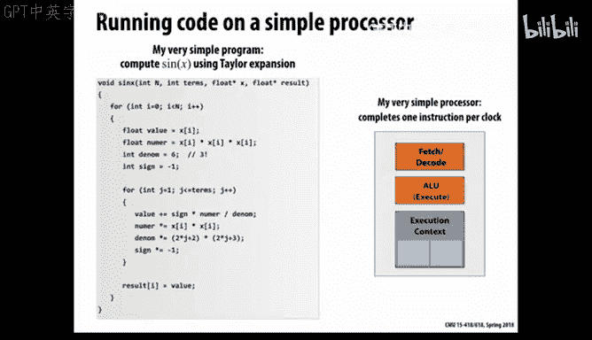

# 2：并行计算的硬件视角 🖥️

在本节课中，我们将从硬件角度探讨并行计算。我们将从你熟悉的笔记本电脑或台式机中的传统处理器开始，然后展示其如何被调整和修改，以创造出当今并行计算中非常重要的一类机器——图形处理单元（GPU）。本节课的核心主题是，为了利用并行性，硬件设计者在体系结构的不同层次上设置了并行计算的潜力，其中一些对程序员是透明的，而另一些则需要程序员或编译器显式生成相应的代码。因此，你需要充分理解硬件，才能编写出能让硬件发挥最大潜力的软件。

## 回顾与背景

上一节课我们讨论了2004年左右发生的变化，即芯片功耗墙的问题。一旦芯片功耗超过约100瓦，散热就变得极其困难。这彻底改变了计算机的发展方向，未来的性能提升将主要依赖于并行性。

我们还通过一个并行加法的物理演示，看到了并行编程中的一些挑战，如负载均衡、通信延迟以及集体工作时可能出现的利用率不足问题。

## 并行性示例：计算正弦值

让我们通过一个简单的代码示例来理解并行性。假设我们需要计算一个数组中每个元素的正弦值，使用泰勒级数展开。核心循环如下：

```c
for (int i = 0; i < n; i++) {
    float x = A[i];
    float term = x;
    float sum = term;
    for (int j = 1; j < num_terms; j++) {
        term = -term * x * x / ((2*j) * (2*j + 1));
        sum += term;
    }
    B[i] = sum;
}
```

这个循环的每个迭代 `i` 都是完全独立的，不依赖于其他迭代的结果。这种计算有时被称为“易并行”计算，意味着你可以根据可用资源尽可能多地并行执行这些独立任务。

## 从顺序执行到指令级并行

在传统的顺序执行模型中，处理器一次执行一条指令。然而，自20世纪90年代末以来，微处理器普遍采用了**超标量**架构，能够从单个指令流中提取并行性，这被称为**指令级并行**。

然而，在我们上面的代码中，指令之间存在数据依赖关系（例如，必须先读取内存才能进行乘法运算），这限制了ILP的发挥。为了克服这一点，现代处理器采用了**乱序执行**技术，通过复杂的硬件逻辑动态分析指令间的依赖关系，并调度到多个独立的功能单元上并行执行，同时保持程序语义不变。

## 多核与线程级并行

由于功耗墙和ILP提取的限制，硬件设计转向了**多核**架构。与其制造一个庞大、复杂且高功耗的单核，不如将芯片面积用于制造多个性能稍低但能并行工作的核心。

但是，要让一个纯顺序的程序在多核上运行得更快，我们需要将其分解为可以并行执行的多个部分。一种方法是使用线程，例如Pthreads。我们可以将数组分成两部分，让一个线程处理前半部分，主线程处理后半部分。

更理想的情况是，我们有一种编程语言或抽象，能够直接表达这种“易并行”的计算意图，例如一个 `parallel for` 循环。这样，编译器和运行时系统可以自动将其映射到多个线程或多个核心上执行。

## 单指令多数据（SIMD）并行

除了在“垂直”方向上将任务分给多个线程（线程级并行），我们还可以在“水平”方向上并行处理数据。这就是**单指令多数据** 并行。

SIMD允许一条指令同时对多个数据元素执行相同的操作。例如，一条加法指令可以同时将两个包含8个浮点数的向量相加。在x86架构中，这通过**AVX** 等扩展指令集实现。

对于我们的正弦计算循环，我们可以使用SIMD指令同时处理8个 `x` 值。但这通常需要显式地使用编译器**内部函数** 来编写代码，或者依赖编译器进行自动向量化（后者对于结构良好的简单循环可能有效，但通常需要很多提示和条件）。

### SIMD中的条件分支处理

如果循环内部存在条件分支（例如 `if (x > 0)`），SIMD如何处理？技术是使用**掩码**。对向量中的所有元素执行条件测试，生成一个真假掩码。然后，执行“真”分支的操作，但只对掩码为真的元素生效（通过禁用其他元素的写入）。接着，反转掩码，执行“假”分支的操作。这种方式将条件分支“扁平化”为顺序代码，但可能导致效率下降，因为部分ALU在某些步骤中可能闲置。

SIMD执行效率的关键概念是**一致性**：所有数据元素是否执行相同的操作路径。一致性越高，SIMD利用率越高。反之，则称为**发散**，会降低性能。

## 图形处理单元（GPU）：大规模并行

GPU将“多核”和“SIMD”的思想推向了极致。它移除了传统CPU中复杂的乱序执行、分支预测等控制逻辑，将芯片面积主要用于增加大量的、相对简单的计算核心，从而在单位面积内提供极高的**算术逻辑单元** 密度。

GPU的编程模型常被称为**单程序多数据**：许多线程（成百上千个）执行相同的程序（内核函数），但处理不同的数据。在底层，GPU使用宽SIMD（例如32个操作同时进行，称为一个**线程束**）来实现这些线程的高效执行。

为了隐藏内存访问延迟，GPU采用了极致的**多线程**技术。每个流多处理器可以同时管理数十个线程束的状态。当一个线程束因内存访问而停顿时，硬件会立即切换到另一个就绪的线程束，从而保持计算单元的繁忙，实现高**吞吐量**。

### 内存带宽：关键的瓶颈

无论是CPU还是GPU，一个常见的性能瓶颈是**内存带宽**。计算单元的速度可能远远超过将数据从内存传输到芯片的速度。例如，一个执行简单向量加法的内核（每个浮点运算需要读取两个数并写入一个数）可能完全受限于内存带宽，计算单元利用率很低。

因此，在并行编程中，优化内存访问模式、提高数据局部性、利用缓存以及有时甚至选择重新计算而非存储中间结果，都是至关重要的策略。


## 总结

本节课我们一起学习了并行计算的硬件基础。我们回顾了从顺序执行到指令级并行（ILP）的演进，探讨了通过多核实现线程级并行（TLP）的动机。我们深入了解了单指令多数据（SIMD）并行，包括其工作原理以及处理条件分支的掩码技术。最后，我们介绍了图形处理单元（GPU）作为一种极致的大规模并行架构，其设计哲学是牺牲单线程性能以换取极高的吞吐量和计算密度，并特别依赖于硬件多线程来隐藏内存延迟。



关键要点在于，现代硬件在多个层次上提供了并行性：指令级、数据级（SIMD）、线程级（多核）以及GPU中的大规模线程级。要编写高效的并行程序，必须理解这些硬件特性，并据此组织你的计算和数据访问，以充分利用硬件的潜力，同时避免由内存带宽和延迟带来的瓶颈。