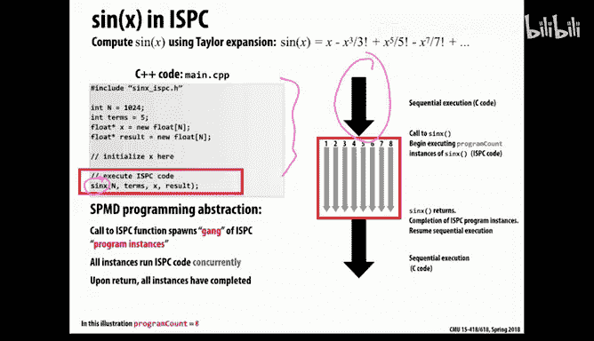
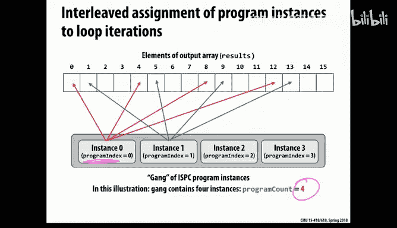
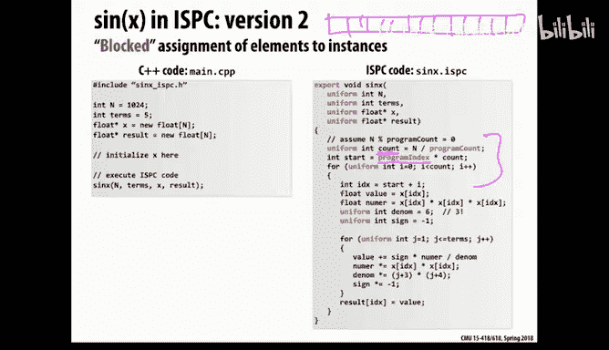
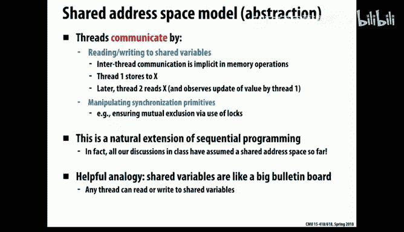
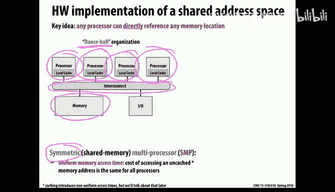
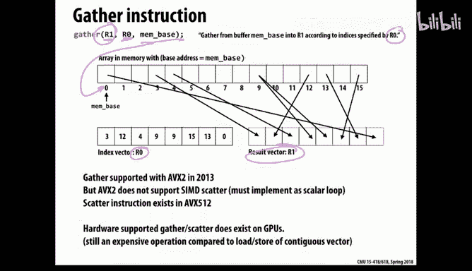

# 3：并行软件抽象与实现

在本节课中，我们将学习并行编程的核心抽象概念及其实现方式。我们将首先通过一个具体的语言（ISPC）来理解抽象与实现之间的区别，然后探讨三种主流的并行编程模型：共享地址空间、消息传递和数据并行。

---

## 抽象与实现：以ISPC为例



上一节我们介绍了并行硬件的基础。本节中，我们来看看如何编写并行软件。今天的核心主题是理解**抽象**与**实现**之间的区别。

*   **抽象**是程序员用来更轻松地表达代码、进行调试的工具。
*   **实现**是系统在底层实际执行这些抽象概念的方式。

在并行计算中，很容易混淆这两者，因为抽象用于表达并发和通信，而系统本身也在管理并发和通信。我们将通过一个具体的例子——Intel开发的并行语言ISPC——来阐明这一点。

### SPMD模型



ISPC采用了一种称为**SPMD**的抽象模型，即**单程序多数据**。这意味着所有并发执行的逻辑单元（可以理解为“线程”）都在运行相同的代码，但各自操作不同的数据片段，从而获得并行性。

以下是一个计算正弦值的串行C代码示例，我们将用它来演示并行化：


```c
void sinx(int N, int terms, float* x, float* result) {
    for (int i=0; i<N; i++) {
        float value = x[i];
        float numer = x[i] * x[i] * x[i];
        int denom = 6; // 3!
        int sign = -1;
        for (int j=1; j<=terms; j++) {
            value += sign * numer / denom;
            numer *= x[i] * x[i];
            denom *= (2*j+2) * (2*j+3);
            sign *= -1;
        }
        result[i] = value;
    }
}
```



### ISPC程序结构

在ISPC中，并行代码被放在扩展名为`.ispc`的独立文件中，并由主程序（如`main.cpp`）调用。其抽象模型如下：

*   主程序顺序执行，直到调用一个ISPC函数。
*   此时，系统会生成一个**程序实例组**来并发执行该ISPC函数。
*   ISPC函数执行完毕后，控制权返回主程序，恢复顺序执行。

在ISPC文件中，有两个关键的内建变量：
*   `programCount`: 当前组中并发程序实例的总数（由系统决定）。
*   `programIndex`: 当前程序实例的索引（从0到`programCount-1`）。

为了实现并行化，我们需要重写循环，让每个实例处理不同的数据。以下是并行化的`sinx`函数：

```ispc
export void sinx_ispc(uniform int N, uniform int terms, uniform float* x, uniform float* result) {
    // 假设 N % programCount == 0
    for (uniform int i=0; i<N; i+=programCount) {
        int idx = i + programIndex;
        float value = x[idx];
        float numer = x[idx] * x[idx] * x[idx];
        uniform int denom = 6; // 3!
        uniform int sign = -1;
        for (uniform int j=1; j<=terms; j++) {
            value += sign * numer / denom;
            numer *= x[idx] * x[idx];
            denom *= (2*j+2) * (2*j+3);
            sign *= -1;
        }
        result[idx] = value;
    }
}
```

注意代码中的`uniform`关键字，它是一个优化提示，表示该变量在所有程序实例中具有完全相同的值。

### 数据分配策略：交错访问与分块访问

在SPMD模型中，如何将数据分配给各个程序实例是关键。主要有两种策略：


1.  **交错访问**：每个实例以`programCount`为步长跳跃访问数据（如上例所示）。例如，4个实例会分别处理索引为0,4,8...、1,5,9...等的数据。
2.  **分块访问**：将数据分成连续的块，每个实例处理一个块。

以下是分块访问的代码示例：

```ispc
export void sinx_blocked(uniform int N, uniform int terms, uniform float* x, uniform float* result) {
    uniform int count = N / programCount;
    int start = programIndex * count;
    for (uniform int i=0; i<count; i++) {
        int idx = start + i;
        // ... 计算 sin(x[idx])，与之前类似 ...
        result[idx] = value;
    }
}
```

对于ISPC而言，**交错访问通常是更优的选择**。原因在于ISPC的底层实现。

### ISPC的底层实现与`foreach`原语

ISPC的抽象（程序实例组）在底层是通过**SIMD向量指令**实现的。编译器会将ISPC代码编译成使用这些指令的单线程程序。



*   `programCount`通常对应于机器的向量宽度。
*   在交错访问模式下，一次向量加载指令可以连续地读入内存中相邻的数据，效率极高。
*   在分块访问模式下，要同时加载不连续的数据（如0,4,8,12），需要使用速度较慢的**向量聚集指令**。



为了让程序员无需手动选择策略，ISPC提供了`foreach`原语。程序员只需指出循环迭代可以并行，系统会自动选择最高效的方式（通常是交错访问）来合成代码。


```ispc
export void sinx_foreach(uniform int N, uniform int terms, uniform float* x, uniform float* result) {
    foreach (i = 0 ... N) {
        float value = x[i];
        // ... 计算 sin(x[i]) ...
        result[i] = value;
    }
}
```

### 规约操作


当需要跨实例计算全局和（规约）时，不能简单地将一个变量声明为`uniform`并让所有实例累加。这会导致数据竞争。正确的做法是让每个实例先计算局部和，然后使用特殊的规约操作符（如`reduce_add`）合并结果。


```ispc
export uniform float sum_array(uniform float* input, uniform int N) {
    float local_sum = 0;
    for (uniform int i=0; i<N; i+=programCount) {
        local_sum += input[i + programIndex];
    }
    float total_sum = reduce_add(local_sum); // 跨实例规约
    return total_sum;
}
```


### 任务并行

上述ISPC代码仅利用了一个核心的向量单元。为了利用多核，ISPC引入了**任务**的概念。任务可以被调度到不同的核心上执行，实质上是操作系统线程。

---

## 三种主要的并行编程抽象

理解了抽象与实现的区别后，我们来看看三种广泛使用的并行编程模型。它们的核心区别在于并发实例之间如何**通信**与**协作**。

### 1. 共享地址空间 🧠

在这种抽象中，所有线程共享一个全局的、统一的地址空间（内存）。

*   **通信方式**：线程通过**读取和写入共享变量**进行通信。这类似于多个人在同一块白板上读写信息。
*   **同步需求**：由于存在并发访问，必须引入**同步机制**（如锁、屏障）来确保数据一致性和操作顺序。
*   **硬件实现示例**：
    *   **对称多处理**：所有处理器通过总线或交叉开关平等地访问同一内存。
    *   **非均匀内存访问**：每个处理器拥有部分本地内存，访问本地内存快，访问远程内存慢。现代多路服务器和大型机（如SGI Altix）采用此架构。
*   **挑战**：需要硬件支持**缓存一致性**，以确保所有处理器看到的内存视图是一致的。

### 2. 消息传递 📨

在这种抽象中，每个线程只拥有私有地址空间，没有共享内存。

*   **通信方式**：线程通过显式地**发送和接收消息**进行通信。发送方指定数据地址和接收方ID，接收方等待并处理消息。
*   **同步**：通信操作（发送/接收）本身通常就蕴含了同步。
*   **硬件实现示例**：任何具有网络的计算机集群都可以实现消息传递。高性能机器（如IBM Blue Gene）使用定制的高速互联网络。
*   **优势**：无需复杂的硬件缓存一致性支持，易于构建超大规模系统。
*   **灵活性**：消息传递的抽象可以在共享地址空间硬件上高效实现（例如，通过传递指针而非复制数据）。反之，在无硬件支持的机器上模拟共享地址空间则性能较差。

### 3. 数据并行 🔄

这种抽象适用于对大量数据应用相同操作的场景。

*   **核心思想**：将计算**映射**到数据集合上。计算被表达为作用于数据流的纯函数（内核）。
*   **编程模型**：如**流编程**。数据被组织成流，通过一系列无副作用的核函数进行处理。编译器或运行时系统负责安排并行执行。
*   **关键原语**：
    *   **Gather**：从内存的非连续位置收集数据到连续缓冲区。
    *   **Scatter**：将连续缓冲区的数据分散到内存的非连续位置。
*   **硬件实现示例**：**GPU**是数据并行架构的典型代表。早期的向量超级计算机也属于此类。
*   **适用性**：非常适合规则的计算问题（如图像处理、数值模拟），但对于控制流复杂的任务可能不适用。

---



## 总结与展望

本节课中，我们一起学习了：

1.  **抽象与实现的区别**：通过ISPC语言，我们看到了SPMD编程抽象如何通过底层的SIMD向量指令实现。
2.  **三种并行编程模型**：
    *   **共享地址空间**：通过共享变量通信，需要同步，硬件需支持缓存一致性。
    *   **消息传递**：通过发送/接收消息通信，易于构建大规模系统。
    *   **数据并行**：将函数映射到数据集合，适合规则计算，是GPU的编程基础。


在实践中，优秀的并行程序员需要掌握所有这些模型。现代计算系统通常是异构的：**在芯片内多核间使用共享地址空间，在跨节点间使用消息传递，同时利用GPU进行数据并行计算**。例如，十年前的世界第一超算“走鹃”就混合了Cell处理器（内部共享内存）和跨节点消息传递。

理解这些抽象及其实现，能帮助我们在不同的硬件平台上写出高效、正确的并行程序。在接下来的课程中，我们将深入探讨如何用这些模型编写具体的并行代码。