# 5：任务调度与负载均衡 🧩


在本节课中，我们将学习如何将工作划分并调度到多个处理器上，以实现高效的并行计算。我们将重点探讨负载均衡的重要性，并比较静态与动态任务分配策略的优劣。


---

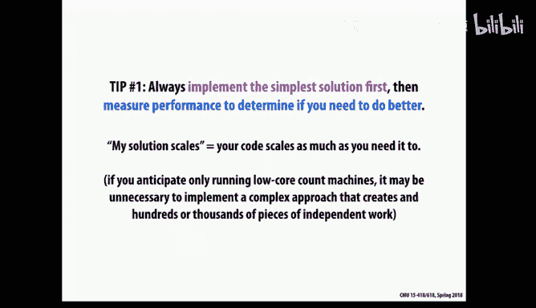

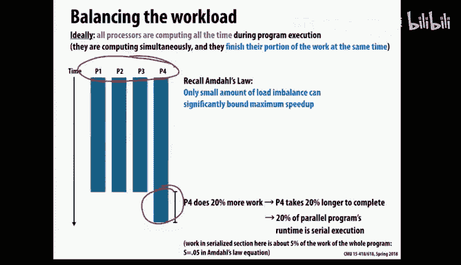

## 概述 📋

并行编程是一个迭代过程，通常需要多次尝试和性能测量才能达到最优。我们的核心目标有三个：
1.  **平衡负载**：确保所有线程的工作量尽可能相等。
2.  **最小化通信**：因为通信开销很大。
3.  **最小化软件开销**：避免因复杂的调度逻辑引入过多额外指令。

首要建议是：**从最简单的可行方案开始实现**。这样能更快获得性能基准，并更容易理解后续的优化方向。


---

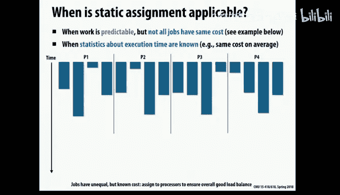


## 负载均衡的重要性 ⚖️

负载不均衡会导致部分处理器空闲，等待其他处理器完成任务，从而严重降低并行效率。即使负载接近平衡（例如，三个处理器工作量相同，第四个仅多20%），这“一点点”的不平衡也会造成性能损失，因为其他处理器在等待时无事可做。

因此，我们的主要议题就是探索不同的工作划分策略，以实现负载均衡。

---

## 静态任务分配 📐


静态分配的核心思想是：**在程序运行前就确定好如何将工作划分给各个处理器**。

### 工作原理
我们之前在网格求解器的例子中见过这种方法，例如使用块划分或交错划分。代码中已经写死了分配逻辑，运行时只需按此逻辑执行。

### 优势与劣势
*   **优势**：运行时开销极低，因为分配决策在运行前已完成。
*   **劣势**：当任务执行时间不可预测或变化很大时，静态分配可能导致严重的负载不均。如果某个分区的任务意外地耗时更长，系统只能忍受这种不平衡。

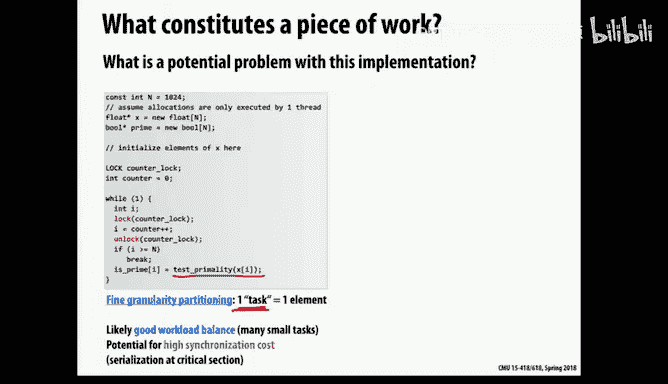


### 适用场景
静态分配适用于任务执行时间**可预测**的情况：
1.  **任务完全相同**：例如网格求解器中每个格点的计算。此时只需给每个处理器分配相同数量的任务即可。
2.  **任务不同但可预测**：如果能通过某个输入参数（如数据规模）快速估算任务耗时，则可以在分配时进行“打包”，使每个处理器上的预计总耗时大致平衡。


虽然可能无法达到完美平衡，但只要因低运行时开销带来的收益大于轻微负载不均的损失，静态分配就是好选择。


---


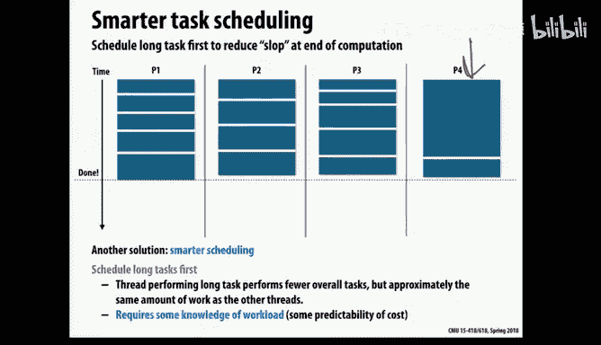


## 半静态调度 🔄

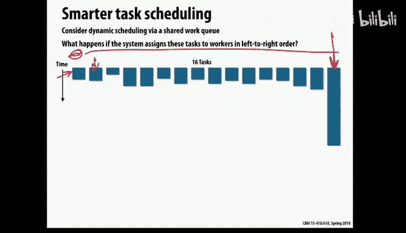


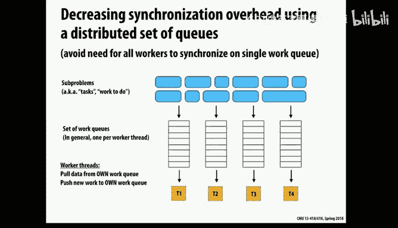

这是一种介于静态和动态之间的实用技巧。

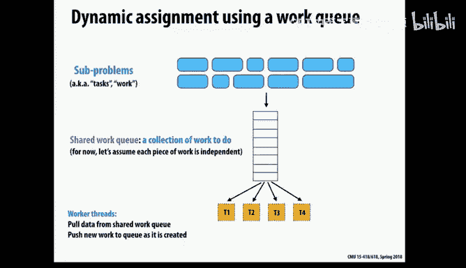

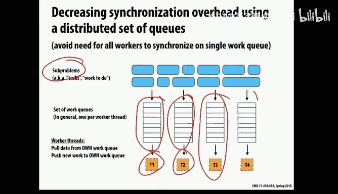

### 工作原理
在许多系统（如随时间步进仿真的物理模拟）中，虽然每个任务的工作量会变化，但变化相对缓慢。半静态调度的做法是：
1.  定期（而非每次）对任务进行性能剖析（Profiling），获取估算其执行时间的参数（例如，需要计算的邻近星体数量）。
2.  根据这次剖析结果，重新划分工作，并在接下来的一段时间内采用静态调度。
3.  经过若干次迭代后，再次进行剖析和重新划分。

### 适用场景
适用于工作量**非均匀但变化缓慢**的场景，例如星系模拟（Barnes-Hut）、风洞中的飞机模型模拟等。

---

## 动态任务分配 🎯


当任务执行时间不可预测且差异很大时，静态分配效果不佳。此时需要动态分配。

### 基本原理
在程序运行时，线程根据需要动态地获取任务。一种简单的实现方式是使用一个共享的循环计数器：
```c
// 简化的动态任务获取示例
lock();
int my_index = counter++;
unlock();
// 执行 tasks[my_index] 对应的任务
```
每个线程原子地获取一个迭代索引。如果某些迭代耗时更长，线程只会在完成当前工作后才去获取新工作，从而在整体上实现负载均衡。


### 任务粒度的重要性
然而，上述简单实现有一个潜在问题：**如果每个任务（循环迭代）非常小，线程会频繁竞争锁以获取新任务，导致巨大的运行时开销**。

解决方案是调整**任务粒度**：每次不是获取一个任务，而是获取一批（例如5个或10个）任务。
*   **增大粒度**：减少获取任务的频率，降低锁竞争开销。
*   **减小粒度**：提高负载均衡的灵活性。

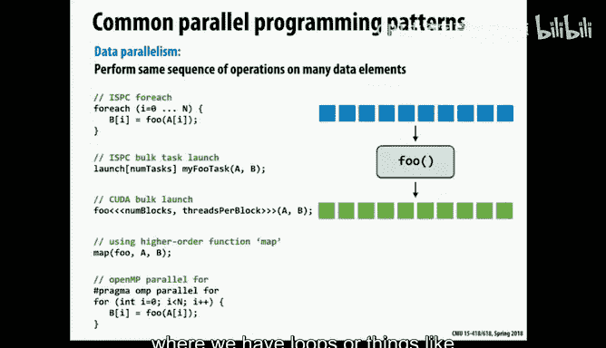

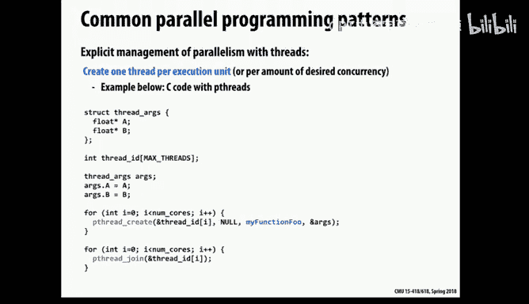

目标是找到**开销与负载均衡之间的最佳平衡点**。通常，任务粒度应设置得足够大以降低开销，但又足够小以避免负载不均。

### 任务排序的智慧
即使采用动态调度，如果任务执行时间差异很大且顺序不合理，仍可能遇到问题。例如，如果将大量小任务先放入队列，最后一个才是大任务，那么当其他线程快速完成小任务后，将不得不等待最后一个线程处理那个大任务。

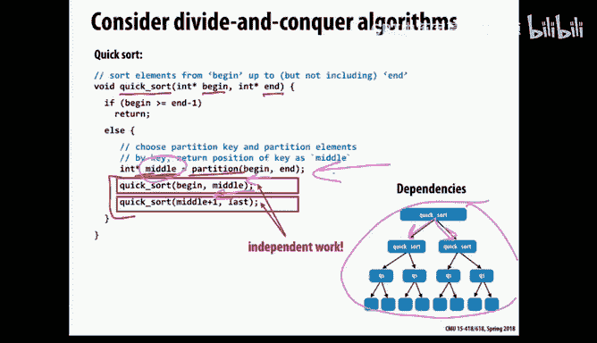

**优化策略**：理想情况下，应先调度大任务，后调度小任务。这类似于先用大石块填充，再用沙粒填补缝隙。实现上可以：
1.  若能预估任务大小，则优先将大任务放入队列。
2.  动态调整任务粒度，开始时用大粒度，接近结束时改用小粒度。

---


## 分布式工作队列 🗂️


使用一个中心化的工作队列，所有线程都从中获取任务，可能造成严重的锁竞争。分布式工作队列是更好的选择。

### 工作原理
1.  每个处理器（或硬件线程）拥有自己的本地工作队列。
2.  初始时，根据某种启发式方法将任务分配到各个队列。
3.  每个线程优先从自己的本地队列获取任务，这提供了良好的局部性，且无竞争。
4.  当某个线程的本地队列为空时，它不会空闲，而是从其他线程的队列中**窃取任务**。

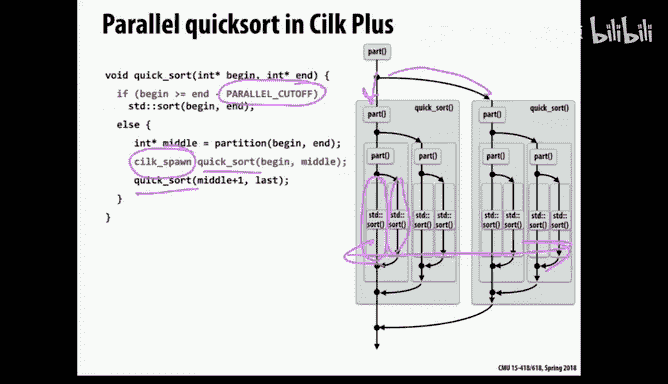

### 工作窃取的细节
*   **窃取来源**：通常随机选择其他队列进行窃取，以避免系统性不平衡。
*   **窃取量**：不会只窃取一个任务（否则很快又需要窃取），也不会窃取全部（导致被窃取线程饥饿）。通常窃取队列中一部分任务（例如一半）。
*   **终止检测**：需要一种机制来判断所有队列是否都已为空，且没有新任务生成，此时程序才能结束。

分布式工作队列结合了动态调度的负载均衡优势和本地访问的局部性优势，是一种非常强大的机制。

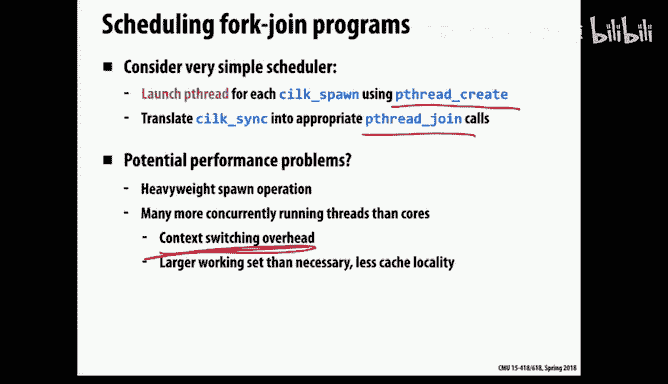


### 处理任务依赖
理想情况下，任务应相互独立。但如果存在依赖关系，可以在任务数据结构中加入依赖信息。线程只会在某个任务的所有前置条件都满足时，才将其从队列中取出执行。这增加了开销，但扩展了动态调度的应用范围。

---


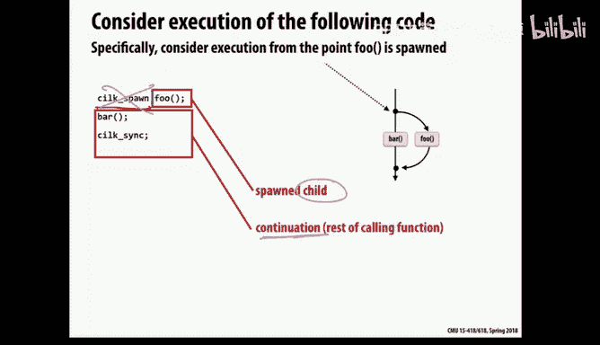

## 分治并行性：以Cilk Plus为例 🌳

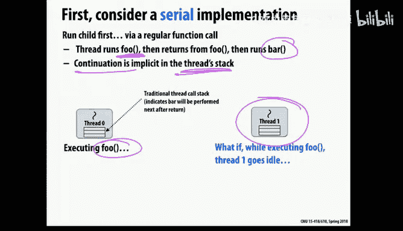

之前讨论主要针对数据并行（如循环）。另一种常见模式是**分治并行性**，通常通过递归实现，例如快速排序。

### Cilk Plus 语言简介
Cilk Plus 是一种用于表达分治并行性的语言扩展，其核心原语是：
*   `cilk_spawn`：表示其后的函数调用可以与当前函数的剩余部分（称为**延续**）并发执行。
*   `cilk_sync`：等待本函数内所有通过 `spawn` 创建的任务完成。每个函数末尾都有一个隐式的 `sync`。

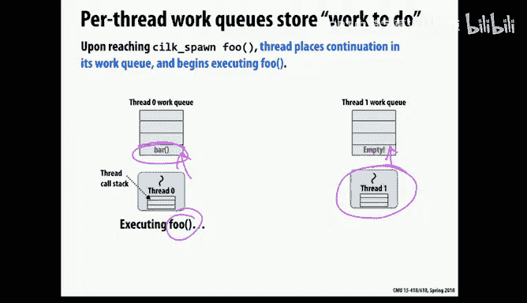

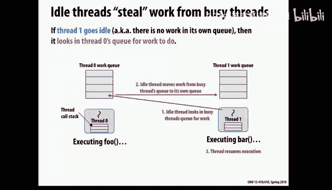

`spawn` 只是提示运行时系统**可能存在**并行机会，并不强制创建新线程。

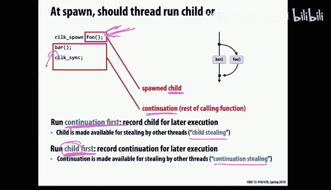

### 运行时系统实现
Cilk Plus 不会为每个 `spawn` 都创建昂贵的操作系统线程。相反：
1.  启动时，为每个硬件线程创建一个工作线程。
2.  工作线程从一个**任务队列**中获取工作，这个队列管理着由 `spawn` 暴露的并行任务。


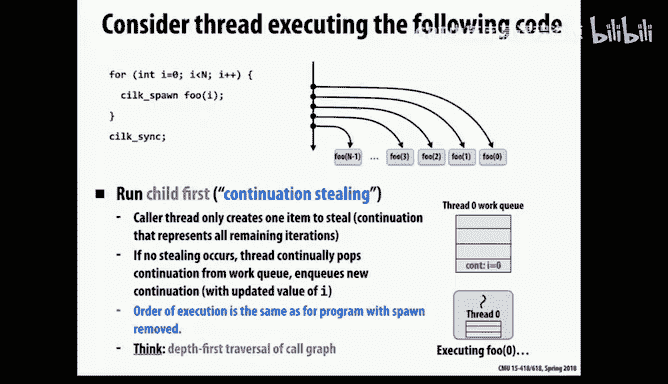

### 延续窃取策略
当线程遇到 `cilk_spawn foo(); bar();` 时，有两个可并行部分：`foo()`（子任务）和 `bar()`（延续）。线程必须立即执行其中一个，并将另一个的描述放入自己的任务队列，供其他线程窃取。这里有两种选择：
1.  **延续优先**：线程执行 `bar()`，将 `foo()` 入队。这类似于广度优先遍历，会快速生成大量任务放入队列。
2.  **子任务优先**：线程执行 `foo()`，将延续（即执行 `bar()` 的上下文）入队。这类似于深度优先遍历，更接近顺序执行顺序，且队列大小有界。

**Cilk Plus 选择了子任务优先策略**，因为它能更好地控制队列大小，并且与分治算法的特性吻合。

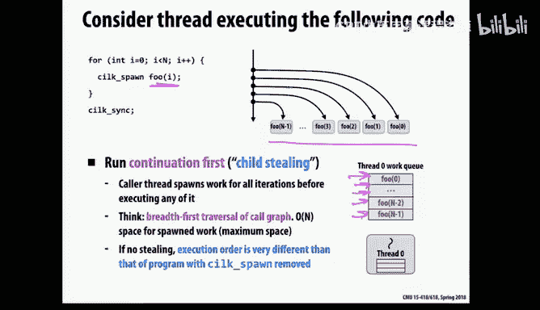

### 工作窃取与队列操作
在分治算法中，先放入队列的任务通常对应更大的工作子集（因为递归早期划分的）。Cilk Plus 的每个本地队列是一个双端队列：
*   **本地线程**：从队列的**底部**推入和弹出任务（后进先出，LIFO）。
*   **窃取线程**：从队列的**顶部**窃取任务（先进先出，FIFO）。


这种策略（窃取最旧的任务）倾向于让窃取者拿到更大的任务块，有利于负载均衡和保持空间局部性。


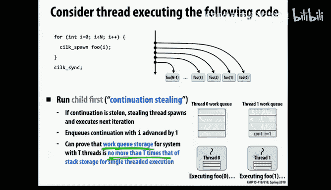

### 同步的实现
在 `sync` 点，需要协调所有并发任务。Cilk Plus 采用**贪婪（greedy）同步策略**：
*   不要求必须由发起 `spawn` 的原始线程来最终完成同步。
*   一个共享数据结构跟踪未完成的任务数。
*   **最后一个完成任务的线程**负责在完成后立即继续执行 `sync` 之后的代码。这避免了原始线程可能空闲等待的情况，减少了同步开销。


---

## 总结 🎓

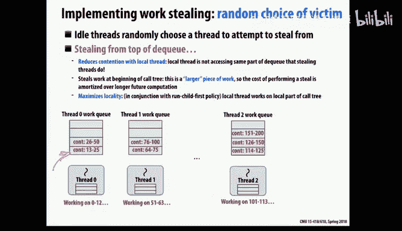

本节课我们一起深入探讨了并行计算中任务调度与负载均衡的核心技术。

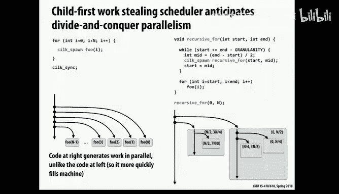

我们首先比较了**静态分配**和**动态分配**。静态分配开销极低，但要求任务执行时间可预测；动态分配能适应不规则负载，但需注意管理其开销。**半静态调度**是两者间实用的折中方案。


在动态调度中，我们认识到**任务粒度**是一个关键可调参数，需要在开销与负载均衡间取得平衡。**分布式工作队列与工作窃取**是实现高效动态调度的有效架构，能同时兼顾局部性和负载均衡。

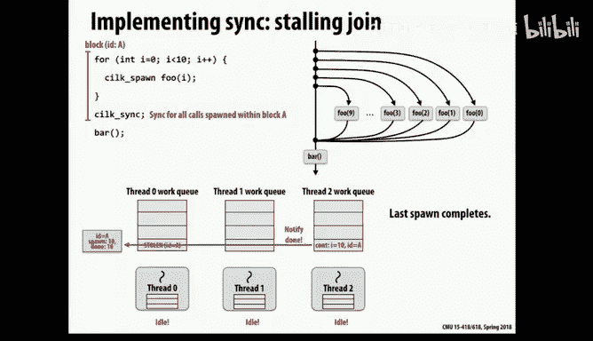

最后，我们以 **Cilk Plus** 为例，研究了**分治并行性**的调度。了解了其“子任务优先”的延续窃取策略、双端队列的窃取方式（从顶部窃取大任务）以及贪婪同步策略，这些设计共同确保了分治算法的高效并行执行。

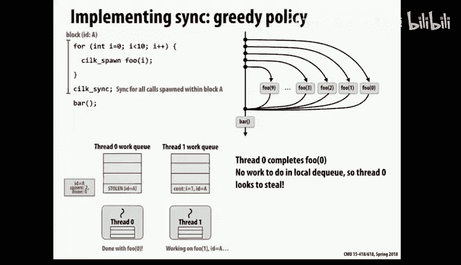

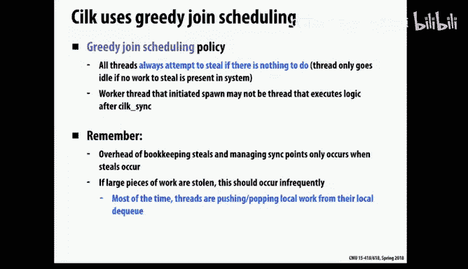


掌握这些任务调度策略，是编写高性能并行程序的基础。在后续的编程实践中，请务必遵循“从简开始，测量优化”的准则，灵活运用这些策略来解决负载均衡的挑战。