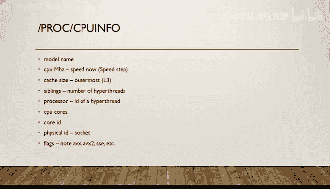
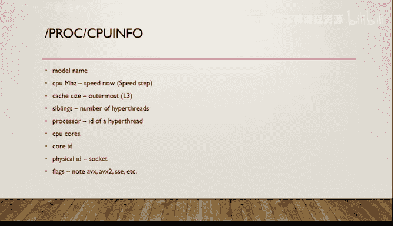

# 6：Lecture 6 - 1-29-18



## 概述
在本节课中，我们将学习如何获取系统硬件信息，并以此为基础，通过一系列代码优化技术来提升程序性能。我们将从了解 `/proc` 虚拟文件系统开始，逐步深入到具体的性能分析和优化策略。

---

## 系统信息获取：`/proc` 文件系统

在现代操作系统中，`/proc` 是一个虚拟文件系统。它并非真实的文件系统，但呈现为文件系统的形式。内核通过 `/proc` 导出大量系统状态信息，这种方式便于我们以文件操作的方式访问数据，避免了每次查询都需进行系统调用的开销。

在 `/proc` 目录下，以数字命名的目录代表正在运行的进程，其数字即为进程ID。进入某个进程目录（例如 `/proc/37684`），可以看到多个文件，这些文件包含了该进程的各种信息，如文件描述符、内存映射等。


通过标准的 Unix 文件权限，系统确保只有进程所有者才能查看该进程的私有信息。系统管理员（root用户）甚至可以修改其中一些可调参数来改变系统行为。

对于性能分析，一个关键文件是 `/proc/cpuinfo`。该文件提供了关于 CPU 的详细信息。其格式易于阅读和解析，每行包含一个标签、一个冒号和对应的信息。



**代码示例：查看CPU信息**
```bash
cat /proc/cpuinfo
```


在 `/proc/cpuinfo` 的输出中，有几个关键字段值得注意：
*   `model name`：处理器型号。
*   `cpu MHz`：处理器当前运行速度。由于现代处理器支持动态频率调整，这个值可能随时变化。
*   `siblings` 与 `cpu cores`：`siblings` 数量大于 `cpu cores` 数量通常意味着启用了超线程技术。操作系统将每个超线程核心视为一个独立的逻辑处理器进行调度。
*   `cache size`：通常显示所有核心共享的最后一级缓存（如L3缓存）的大小。
*   `flags`：列出了处理器支持的功能集，例如我们使用的 `AVX2` 指令集。

了解处理器的具体型号（微架构代号，如 Broadwell）至关重要，因为这样你可以查阅技术文档，获知处理器的功能单元数量、指令延迟和缓存结构等详细信息，从而有针对性地优化代码。

---

## 性能分析与优化基础

上一节我们介绍了如何获取硬件信息，本节中我们来看看如何基于这些信息进行性能分析和优化。优化代码时，我们首先需要找到程序的性能瓶颈。

阿姆达尔定律指出，对程序中某一部分进行优化所能获得的整体性能提升，受限于该部分所占的执行时间比例。因此，我们应该优先优化那些最耗时的部分，通常是程序中最内层的工作循环。

优化的第一步永远是：**先保证正确性，再进行优化**。编写出正确、清晰的代码，然后对其进行基准测试，获取精确的性能数据，以证明你即将优化的部分确实是性能瓶颈。人类的直觉通常是系统性能的糟糕指标，必须进行测量。

**一个反面案例**：曾经有一个项目，开发者花费数月优化计算密集型代码，仅获得2%的性能提升。后来通过系统调用追踪工具 `strace` 发现，问题根源在于代码中一个无意的内存泄漏导致 `malloc` 被调用了上万次。如果事先进行性能剖析，这个问题可能在几分钟内就被发现并修复。

---

## 代码优化实战：循环与计算

现在，让我们将理论应用于实践，分析一段具体的代码并进行优化。我们关注代码中最内层的循环，因为这里是程序花费时间最多的地方。

初始代码包含嵌套循环，内层循环进行了大量的乘法和除法运算，这些是相对昂贵的操作。我们的优化思路是减少这些操作的数量。

以下是初步的优化步骤：
1.  **提取循环不变计算**：将内层循环中不随迭代变化的计算移到外层循环。
2.  **消除除法**：将除法转换为乘法（例如，乘以一个预先计算好的倒数）。

这些简单的重构能带来立竿见影的性能提升，因为它们几乎不需要代价就减少了内层循环的工作量。

为了更深入地优化，我们需要查看编译器生成的汇编代码。通过分析汇编，我们可以了解指令的实际执行顺序和潜在的瓶颈。例如，我们可能发现乘法指令的延迟（完成一次运算所需的时钟周期数）和发射时间（可以连续发射新指令的最小间隔周期数）限制了性能。

---

## 高级优化技术：循环展开

上一节我们通过查看汇编代码识别了瓶颈，本节中我们来看看一种经典的高级优化技术：循环展开。

循环对性能有负面影响：每次迭代都需要进行条件测试，即使这个测试在绝大多数情况下结果都相同；此外，循环中的分支会干扰处理器的流水线和预测机制，减少指令级并行的机会。

循环展开通过手动增加循环体每次迭代的工作量来减少迭代次数。例如，将循环展开4倍，意味着每次迭代处理4个数据元素，循环测试和分支跳转的次数减少为原来的1/4。这能降低分支开销，并为处理器提供更长的、无分支的指令序列，有利于流水线填充和乱序执行。

然而，循环展开也有代价：
*   **代码体积增大**：可能对指令缓存不友好。
*   **寄存器压力**：可能需要更多寄存器来保存临时变量，可能导致寄存器溢出到内存。

因此，需要根据目标平台的特点（如寄存器数量、缓存大小）来选择合适的展开因子。通过实验测量不同展开因子下的性能，可以找到最佳点。

在应用循环展开并结合之前的优化（如利用浮点运算的结合律和分配律进行重构）后，我们获得了显著的性能提升。

---

## 向量化：利用现代指令集

经过一系列传统的“手动”优化，我们获得了可观的加速。现在，让我们尝试一种更现代的优化手段：向量化。

向量化允许单条指令同时处理多个数据元素（例如，使用AVX2指令集一次处理8个单精度浮点数）。我们使用ISPC语言可以相对轻松地实现向量化。

在向量化代码中，我们注意到两个变量被声明为 `uniform`。`uniform` 变量在所有并行执行的程序实例中具有相同的值。这意味着对 `uniform` 变量的计算只需进行一次，然后结果被所有实例共享，而不是在每个实例中重复计算。这进一步减少了冗余工作。

向量化带来了巨大的性能飞跃，其加速比甚至超过了简单的数据并行倍数（如8倍），部分原因就在于 `uniform` 变量优化消除了额外的计算。

让我们来总结一下优化过程：
*   传统的、基于算法和循环的优化（提取不变计算、消除除法、循环展开等）带来了约15倍的加速。
*   向量化优化（利用SIMD指令）在此基础上又带来了约5.4倍的加速。
*   两者结合，总加速比达到了惊人的82倍。

这个案例的启示是：虽然本课程重点讨论并行架构和高级优化技术，但扎实的、来自像15-213这样的基础课程的传统优化技能仍然至关重要，它们往往能带来巨大的收益。在实际开发中，合理的策略是：先进行力所能及的基本优化以保证代码清晰，然后尝试向量化这类“高性价比”的优化，最后根据性能目标决定是否需要投入更多精力进行深度优化。对于软件中非核心的热点代码，可读性和可维护性通常比极致的性能更重要；但对于真正的性能关键内核，优化则是必不可少的。


---

## 总结
本节课我们一起学习了如何通过 `/proc` 文件系统获取详细的硬件信息，并回顾了性能优化的核心原则。通过一个具体的代码优化案例，我们实践了从性能剖析、传统优化（循环展开、计算重构）到现代优化（向量化）的全过程。结果表明，结合扎实的传统优化技巧与现代并行硬件特性，能够释放出巨大的性能潜力。请记住，优化始于测量，并始终在代码清晰度、可维护性与性能需求之间做出权衡。