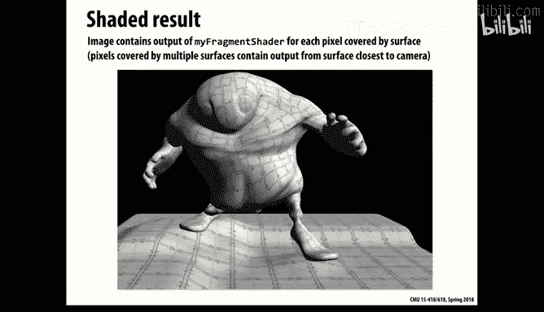
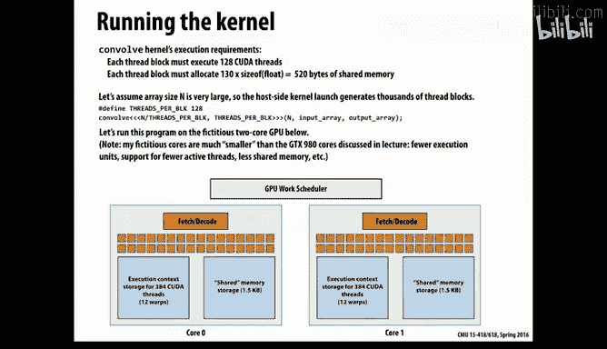

# 7：GPU架构与CUDA编程入门 🚀

在本节课中，我们将要学习图形处理器（GPU）的基本概念、其发展背景，以及如何使用CUDA进行数据并行编程。GPU是现代高性能计算中极为重要的组成部分，它通过大规模并行处理能力，极大地扩展了计算的可能性。我们将从图形渲染的需求出发，理解GPU的计算模型，并学习如何编写高效的CUDA程序。

## GPU的起源与图形渲染需求 🎮

上一节我们介绍了并行计算的基本概念，本节中我们来看看GPU是如何从图形处理领域发展而来的。GPU最初是作为图形处理单元出现的，其设计初衷是为了高效处理计算机图形渲染任务。

现代计算机图形学涉及对大量小型对象（如三角形面片）进行相同或类似的操作。例如，为了渲染一个三维物体，通常会将其表面分解为许多三角形面片，然后对每个面片进行着色、光照计算等操作，最后将其投影到二维屏幕上。这种操作模式天然具有数据并行性，因为每个三角形或像素的处理可以独立进行。

随着对图形真实感要求的不断提高，例如添加复杂的光照效果、反射、折射、纹理映射等，计算需求呈指数级增长。这推动了硬件设计向能够同时处理大量简单计算单元的方向发展。

## GPU硬件架构概览 🏗️


了解了GPU的应用背景后，我们来看看其硬件架构的基本形态。一块现代GPU芯片上集成了大量被称为“流多处理器”（SM，在NVIDIA术语中）的处理单元。


每个SM类似于一个简化的多线程CPU核心，但设计重点在于吞吐量而非单线程性能。一个GPU包含多个这样的SM，它们共享一个高带宽的片上内存（全局内存）。例如，课程中提到的GPU拥有20个SM。其核心思想是：**用大量简单的计算单元替代复杂的控制逻辑**，从而在芯片面积和功耗限制下提供极高的浮点运算能力。

## 图形渲染管线与可编程着色器 ⚙️



GPU的编程模型深深植根于图形渲染管线。渲染管线是一系列将三维物体转换为二维屏幕像素的固定处理阶段。

以下是图形渲染管线的主要阶段：
1.  **顶点处理**：处理三维物体的顶点坐标。
2.  **图元装配**：将顶点连接成三角形等基本图形。
3.  **光栅化**：将三角形转换为屏幕上的像素片段。
4.  **片段处理（着色）**：计算每个像素的最终颜色。
5.  **输出合并**：处理深度测试、混合等，生成最终像素。

关键的发展是“可编程着色器”的引入。着色器是一小段运行在GPU上的程序，用于替代管线中某些固定功能阶段（如顶点着色器、片段着色器）。这使得开发者可以自定义光照、材质等效果。着色器代码看起来类似C语言，在一个数据并行的上下文中执行，即同一段代码被并行应用于无数个顶点或像素。

## CUDA编程模型介绍 💻

当人们意识到GPU的并行能力不仅限于图形后，通用GPU计算（GPGPU）便应运而生。CUDA是NVIDIA推出的并行计算平台和编程模型，它允许开发者使用类似C的语言来利用GPU进行通用计算。

CUDA程序由**主机（Host）**代码和**设备（Device）**代码组成。主机代码运行在CPU上，负责管理设备内存、启动内核等；设备代码（即**内核**）运行在GPU上，执行并行计算任务。

CUDA的核心抽象是**线程层次结构**：
*   **线程（Thread）**：最基本的执行单元，处理一个数据元素。
*   **线程块（Block）**：一组线程的集合，块内的线程可以协作（通过共享内存和同步）。一个块内的线程数量有限制（例如1024）。
*   **网格（Grid）**：所有线程块的集合，用于完成整个计算任务。

内核启动的语法形式如下：
```c
kernelFunction<<<gridDim, blockDim>>>(arguments);
```
其中`gridDim`和`blockDim`定义了网格和线程块的维度。

## CUDA内核与内存模型示例 📝

让我们通过一个具体的例子来理解CUDA编程。假设我们需要将两个矩阵相加：`C = A + B`。

首先，我们编写一个简单的内核函数，每个线程负责计算一个输出元素：
```c
__global__ void matrixAdd(float* A, float* B, float* C, int width, int height) {
    int col = blockIdx.x * blockDim.x + threadIdx.x; // 计算列索引
    int row = blockIdx.y * blockDim.y + threadIdx.y; // 计算行索引
    int idx = row * width + col; // 转换为线性内存索引

    if (row < height && col < width) { // 边界检查
        C[idx] = A[idx] + B[idx];
    }
}
```
在主函数中，我们需要分配设备内存、复制数据、启动内核并取回结果：
```c
// 主机代码示例片段
float *d_A, *d_B, *d_C; // 设备指针
cudaMalloc(&d_A, size); // 在设备上分配内存
cudaMemcpy(d_A, h_A, size, cudaMemcpyHostToDevice); // 复制数据到设备

// 定义执行配置
dim3 blockDim(16, 16); // 每个块有16x16个线程
dim3 gridDim((width + blockDim.x - 1) / blockDim.x,
             (height + blockDim.y - 1) / blockDim.y); // 计算所需的网格大小

matrixAdd<<<gridDim, blockDim>>>(d_A, d_B, d_C, width, height); // 启动内核

cudaMemcpy(h_C, d_C, size, cudaMemcpyDeviceToHost); // 将结果复制回主机
cudaFree(d_A); // 释放设备内存
```
CUDA采用**分离的地址空间模型**。CPU（主机）和GPU（设备）拥有各自独立的内存，必须通过`cudaMemcpy`函数进行显式数据拷贝。

## 性能优化：利用共享内存 🚀

直接访问全局内存速度较慢。为了优化性能，CUDA提供了**共享内存**，这是一种由程序员显式管理的、块内线程共享的高速缓存。

以下是一个使用共享内存优化一维卷积（均值滤波）的示例：
```c
__global__ void convolution1D(float* input, float* output, int n) {
    extern __shared__ float s_data[]; // 动态声明共享内存
    int tid = threadIdx.x;
    int gid = blockIdx.x * blockDim.x + threadIdx.x;

    // 每个线程从全局内存加载一个元素到共享内存
    s_data[tid] = (gid < n) ? input[gid] : 0.0f;

    __syncthreads(); // 确保块内所有线程都已完成数据加载

    // 进行卷积计算（现在从共享内存读取数据，速度更快）
    if (tid > 0 && tid < blockDim.x - 1 && gid < n - 2) {
        output[gid] = (s_data[tid-1] + s_data[tid] + s_data[tid+1]) / 3.0f;
    }
}
```
`__syncthreads()`是一个**屏障同步**原语，确保块内所有线程都执行到此点后，才继续向下执行，这对于共享内存的正确使用至关重要。

## GPU执行模型：从线程到Warp ⚡

CUDA的编程模型如何映射到实际的GPU硬件上呢？关键在于**Warp**的概念。

*   **Warp**：GPU调度和执行的基本单位。通常一个Warp包含32个连续的线程。
*   **SIMD执行**：一个Warp中的32个线程在同一周期内执行**相同的指令**（单指令多数据，SIMD）。如果线程间存在分支（如if-else），会导致Warp**分化**，不同路径的线程会被串行执行，降低效率。
*   **硬件多线程**：每个SM可以同时管理多个活跃的Warp（例如64个）。当一个Warp因等待内存访问而停滞时，硬件调度器会立刻切换到另一个就绪的Warp执行，从而隐藏内存延迟，最大化硬件利用率。

线程块被分配到SM上执行。一个SM可以同时执行多个线程块，具体数量受限于SM的共享内存、寄存器等资源。网格中的线程块可以以任何顺序在任意SM上执行，这由硬件调度器动态管理。

## CUDA同步与原子操作 🔒

在CUDA中，同步有不同的层次：
1.  **块内同步**：使用`__syncthreads()`。
2.  **内核级同步**：内核启动是隐式的同步点。主机在启动下一个内核或拷贝数据前，必须等待当前内核的所有线程块执行完毕。
3.  **全局内存原子操作**：对于跨线程的归约操作或计数器更新，需要使用原子操作（如`atomicAdd`）来保证结果的正确性。原子操作能确保该内存操作不可分割地完成，但性能开销较高。

## 总结 📚

本节课中我们一起学习了GPU并行计算的基础知识。我们从GPU因图形渲染需求而诞生的历史讲起，理解了其数据并行的计算模型。我们深入探讨了CUDA编程模型，包括其主机-设备架构、线程层次结构（线程、块、网格）以及分离的内存空间。



我们通过矩阵加法和卷积优化的例子，学习了如何编写CUDA内核，并了解了使用共享内存和同步进行性能优化的关键技术。最后，我们揭示了CUDA抽象模型之下的硬件执行原理，特别是Warp的SIMD执行和硬件多线程机制，这些是理解GPU高性能的关键。

GPU编程的核心在于将计算任务重构为大量可独立或协作处理的细粒度并行工作项，并通过合理的组织来充分利用其庞大的计算资源和极高的内存带宽。