# 8：CUDA编程入门与矩阵乘法优化 🚀

在本节课中，我们将学习CUDA编程的基础知识，并通过一个矩阵乘法的实例，探讨如何从简单的串行实现逐步优化到高效的GPU并行实现。我们将重点关注CUDA的架构模型、内存层次结构以及性能优化的核心策略。


---

## 概述 📋

上一讲中，Randy介绍了CUDA的基本架构和工作原理。本节我们将进一步深入，回顾CUDA编程的核心概念，并通过一个具体的矩阵乘法案例，演示如何将CPU代码移植到GPU上，并利用CUDA的并行特性进行性能优化。我们将从最基础的实现开始，逐步引入分块、内存访问优化等技术。

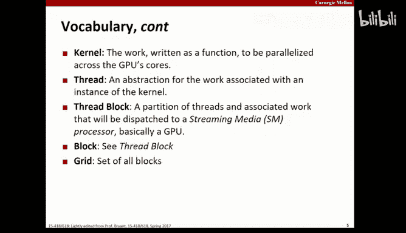

---

## CUDA核心概念回顾 🧠

在深入优化之前，我们先快速回顾一下CUDA编程的几个核心概念。

*   **CPU与GPU**：CPU是传统计算机的“大脑”，而GPU（图形处理单元）最初是显卡的核心，现在也用于通用计算。
*   **主机与设备**：在CUDA编程中，“主机”指计算机本身（CPU和内存），“设备”指GPU板卡。两者拥有独立的内存空间。
*   **CUDA架构**：CUDA是NVIDIA推出的软件框架，用于在GPU上进行通用目的计算。其开源版本称为OpenCL。
*   **全局内存与共享内存**：
    *   `全局内存` 是设备（GPU）上的内存，对所有线程块可见。我们使用 `cudaMalloc`、`cudaFree` 和 `cudaMemcpy` 在主机和设备内存之间传输数据。
    *   `共享内存` 是与单个线程块关联的内存，由该块内的所有线程共享。
*   **内核、线程与线程块**：
    *   `内核` 是我们希望在GPU所有核心上并行执行的代码段。
    *   `线程` 是与内核一个实例相关联的工作的抽象。一个内核会启动海量线程。
    *   `线程块` 是线程的一个分区，这些线程将被调度到一个流式多处理器（SM）上执行。
*   **网格、SM、核心与线程束**：
    *   所有线程块的集合构成 `网格`。
    *   `SM` 是GPU上的处理器，类似于计算机中的CPU，但其内部包含多个核心。
    *   `核心` 是SM内部的单个处理器。
    *   `线程束` 是SM内部对线程块的进一步划分，用于将工作分配给核心。一个线程束包含32个线程，它们以锁步方式执行。
*   **关键限定符与函数**：
    *   `__shared__`：声明位于每个线程块共享内存中的变量。
    *   `__global__`：放在函数前，使其成为可在设备上执行、从主机调用的内核函数。
    *   `cudaMalloc`, `cudaFree`, `cudaMemcpy`：用于管理设备内存。
*   **同步**：`__syncthreads()` 用于同步一个线程块内的所有线程，确保一个工作阶段完成后才进入下一阶段。
*   **内置变量**：
    *   `threadIdx`, `blockIdx`：分别表示线程在线程块内的索引和线程块在网格内的索引。它们是三维的（.x, .y, .z）。
    *   `blockDim`, `gridDim`：分别表示线程块的维度（各维度的线程数）和网格的维度（各维度的块数）。

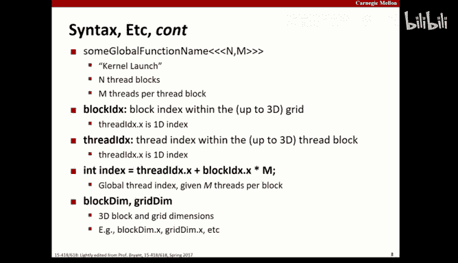

---

## 实用编程技巧与调试建议 🔧

在开始编写CUDA代码前，了解一些最佳实践和调试技巧至关重要。


### 错误检查

在213课程中，我们强调检查所有库函数调用的返回值。在CUDA编程中同样如此。使用 `cudaError_t` 类型和 `cudaGetErrorString` 函数来包装CUDA调用，可以快速定位问题。

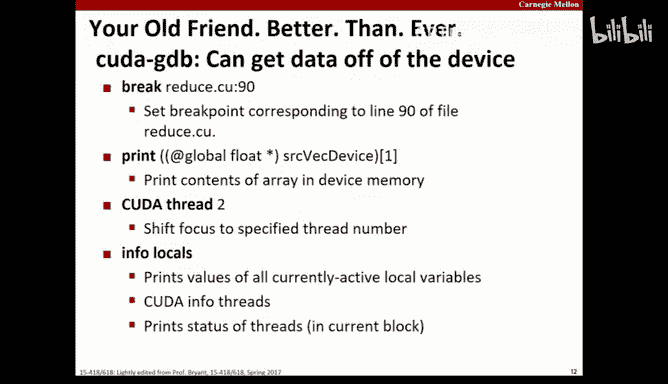

```c
#define gpuErrchk(ans) { gpuAssert((ans), __FILE__, __LINE__); }
inline void gpuAssert(cudaError_t code, const char *file, int line) {
    if (code != cudaSuccess) {
        fprintf(stderr, "GPUassert: %s %s %d\n", cudaGetErrorString(code), file, line);
        exit(code);
    }
}
// 用法
gpuErrchk( cudaMalloc(&d_a, N * sizeof(int)) );
```

对于内核启动，不能直接包装调用，但可以在启动后检查最后一个错误：

```c
myKernel<<<blocks, threads>>>(args);
gpuErrchk( cudaPeekAtLastError() );
gpuErrchk( cudaDeviceSynchronize() ); // 等待内核完成
```

### 使用调试工具

GDB也支持CUDA调试。你可以使用熟悉的GDB命令在不同CUDA线程间切换，`info locals` 可以显示CUDA线程的局部变量信息。

### 避免硬编码常量

不要将硬件相关的数值（如线程块大小）硬编码在代码中。这些“常量”可能会随着硬件升级而改变。尽可能通过计算或查询设备属性来获取这些值。

### 向上取整的通用方法

在划分工作时，经常需要将总任务数向上取整到线程块大小的倍数。不要在每个地方重复编写取整逻辑，应将其封装为一个内联函数或宏。

```c
inline int divUp(int total, int grain) {
    return (total + grain - 1) / grain;
}
// 计算需要的线程块数量
int numBlocks = divUp(N, threadsPerBlock);
```

### 确保正确性优先

在并行化任何代码之前，必须有一个已知正确的串行版本作为基准。并行化是为了获得更快的正确结果，而不是为了获得一个错误的答案。始终用基准答案来验证并行版本的正确性。

### 谨慎使用 `printf`

在CUDA内核中使用 `printf` 需要谨慎。输出存储在固定大小的循环缓冲区中，缓冲区满后会覆盖旧数据。缓冲区会在特定事件时刷新（如内核启动、同步函数调用、上下文销毁时），但**不是在程序退出时**。因此，过度使用 `printf` 可能导致输出丢失或混乱。建议仅在调试时少量使用，并在内核结束后调用 `cudaDeviceSynchronize()` 来确保输出刷新。

### 边界检查

在C语言中，数组越界访问可能导致段错误，这至少能让你知道程序出错了。但在CUDA中，越界访问通常只会导致错误的结果，这更难调试。因此，应在代码中添加大量的边界检查，尤其是在访问数组时。这些检查代码可以包装在宏中，以便在发布版本中轻松关闭。

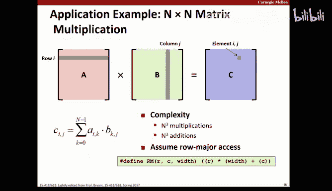

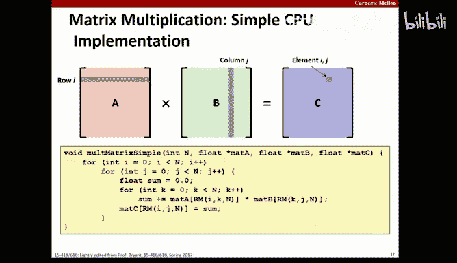

```c
#ifdef DEBUG
#define CHECK_BOUNDS(i, n) if ((i) >= (n)) return;
#else
#define CHECK_BOUNDS(i, n)
#endif


__global__ void myKernel(int *arr, int n) {
    int idx = threadIdx.x + blockIdx.x * blockDim.x;
    CHECK_BOUNDS(idx, n) // 边界检查
    arr[idx] = ...;
}
```

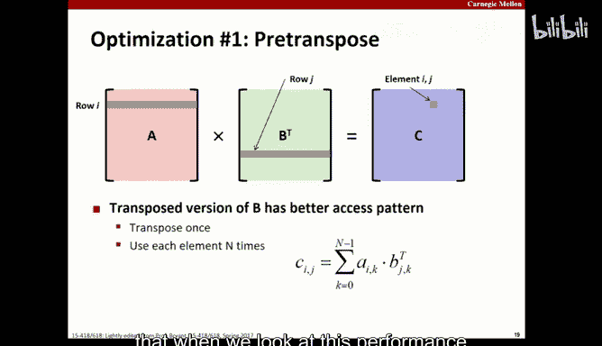

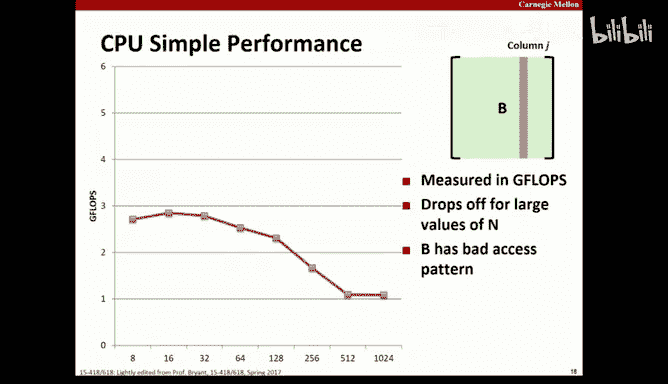

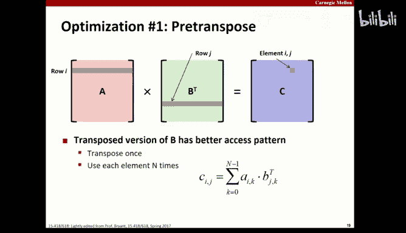

---

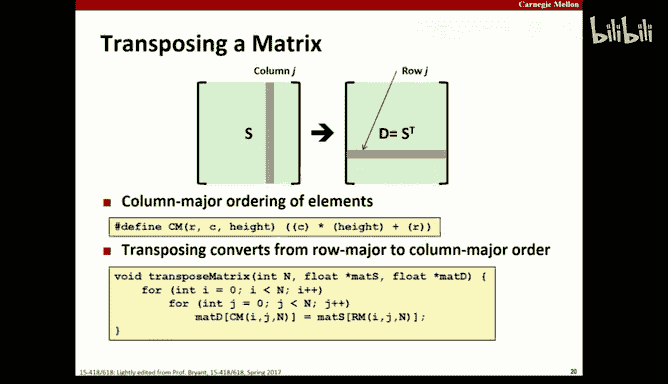


## 案例研究：矩阵乘法的CPU优化 🧮


上一节我们回顾了CUDA基础和编程技巧，本节我们来看看如何将这些知识应用于一个经典问题：矩阵乘法。我们将从CPU优化开始，为后续的GPU移植打下基础。

矩阵乘法 `C = A * B`（其中A是MxK，B是KxN）涉及大量计算，复杂度为 O(M*N*K)。其内存访问模式对性能影响巨大。


### 基础实现及其问题

最基础的实现使用三层嵌套循环。在按行主序存储的系统中，对矩阵A的访问是连续的（行优先），但对矩阵B的访问是跳跃的（列优先）。当矩阵规模增大，无法完全放入CPU缓存时，对B的非连续访问会导致大量的缓存缺失，性能急剧下降。

### 优化策略：预转置

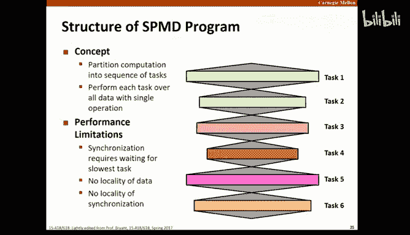

一个简单的优化策略是预先将矩阵B转置。这样，在计算过程中，对转置后的B'的访问也变成了行优先，从而改善了内存访问的局部性。虽然转置本身需要 O(K*N) 的额外操作，但这个成本可以被后续大量计算分摊，总体性能得到显著提升。

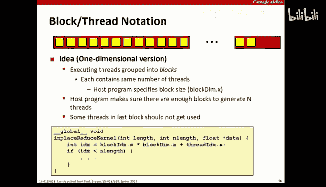

**性能对比**：在图表中，基础实现的性能在矩阵尺寸达到128-512左右时因缓存容量不足而骤降。而使用预转置后，性能曲线变得更加平稳，避免了剧烈的性能下跌。

---

## 将矩阵乘法移植到GPU 🚀


上一节我们在CPU上通过预转置优化了矩阵乘法。现在，我们将其移植到GPU上，利用CUDA进行大规模并行计算。

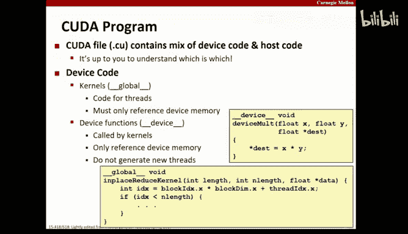

### SPMD模型与CUDA执行流程

CUDA遵循单程序多数据（SPMD）模型。大量线程（内核实例）在GPU的多个处理器上执行相同的代码。它们共享全局内存，并通过屏障（如 `__syncthreads()`）进行同步，而不是传统的互斥锁、信号量等原语。

基本的CUDA程序流程如下：
1.  主机（CPU）设置数据，并将其复制到设备（GPU）的全局内存中。
2.  主机启动内核，设备上的大量线程并行处理数据。
3.  内核执行完毕后，主机通过同步等待所有线程完成。
4.  主机将结果从设备内存复制回主机内存。


性能瓶颈通常在于主机与设备之间的数据传输速度。

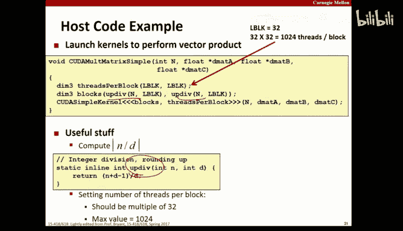

### 基础GPU实现

首先，我们进行一个直接的移植：每个GPU线程负责计算结果矩阵C中的一个元素。线程的索引 `(i, j)` 通过 `blockIdx`、`blockDim` 和 `threadIdx` 计算得出。

```c
__global__ void matrixMulKernel(float* C, float* A, float* B, int N) {
    int i = blockIdx.y * blockDim.y + threadIdx.y; // 行
    int j = blockIdx.x * blockDim.x + threadIdx.x; // 列
    if (i >= N || j >= N) return; // 边界检查

    float sum = 0.0f;
    for (int k = 0; k < N; ++k) {
        sum += A[i * N + k] * B[k * N + j]; // 注意B的访问
    }
    C[i * N + j] = sum;
}
// 主机端启动配置
dim3 threadsPerBlock(16, 16);
dim3 numBlocks(divUp(N, threadsPerBlock.x), divUp(N, threadsPerBlock.y));
matrixMulKernel<<<numBlocks, threadsPerBlock>>>(d_C, d_A, d_B, N);
```

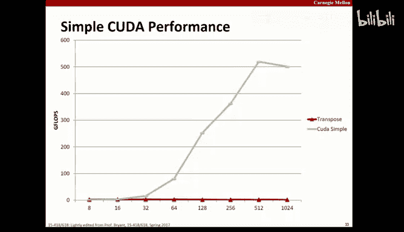

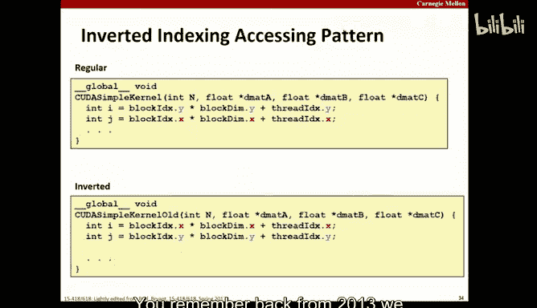

这个简单的移植带来了巨大的性能提升，远超任何CPU优化版本。然而，我们注意到，在内核中访问矩阵B时，`B[k * N + j]` 是列优先的，这可能在GPU上造成问题。

### 内存访问模式的重要性：合并访问

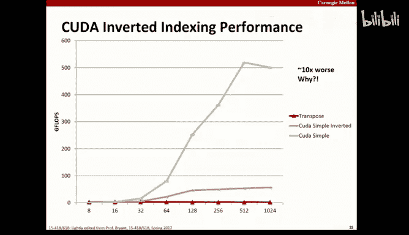

在GPU上，没有传统的多级缓存，但内存访问模式同样关键，原因在于“合并访问”。当一个线程束（32个线程）访问连续的内存地址时，这些访问可以合并为一次或少数几次内存事务，效率极高。如果线程束中的线程访问分散的内存地址，则需要“收集”或“分散”操作，导致多次内存事务，性能下降。

在我们的内核中，如果线程束中的线程具有连续的 `threadIdx.x`（即连续的列索引 `j`），它们对B的访问 `B[k * N + j]` 就是分散的（间隔N），无法合并。这就是为什么简单的GPU实现仍有优化空间。

**性能对比**：图表显示，将内核中循环的 `i` 和 `j` 角色互换（改变内存访问顺序），会导致性能差异，这正是由于合并访问是否有效造成的。

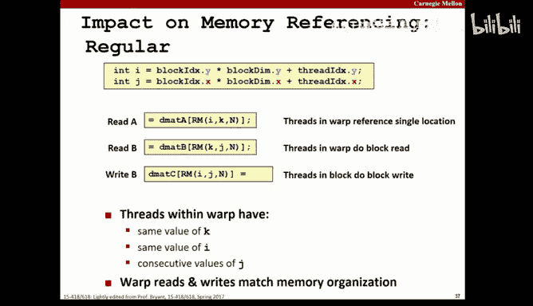

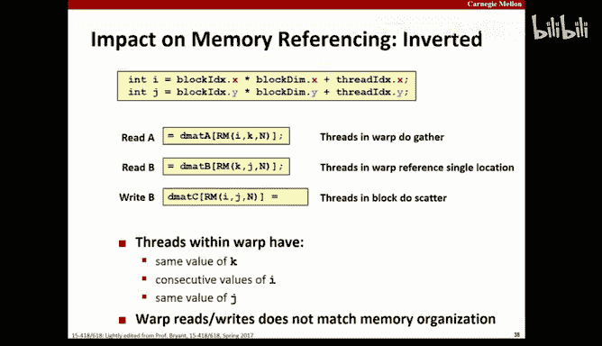

---

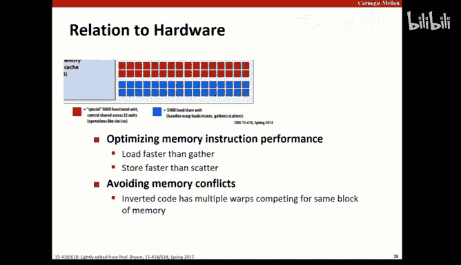

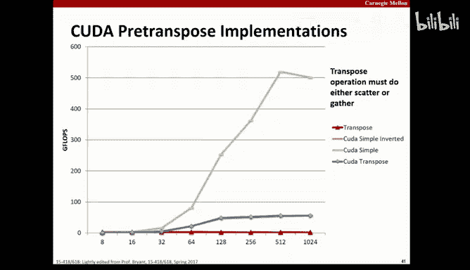

## 高级优化：分块矩阵乘法 🧱


上一节我们看到，即使简单的GPU移植也能带来显著加速，但内存访问模式限制了其最终性能。本节我们将应用在CPU优化中学到的分块技术，进一步提升GPU性能。

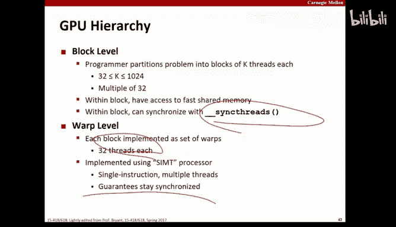

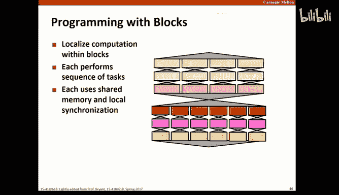

### 分块策略


与CPU缓存优化类似，我们将大矩阵划分为小块（Tile）。每个GPU线程块负责计算结果矩阵C中的一个块。这样，在计算这个块时，线程块只需要重复加载A和B中对应的几个小块到共享内存中，极大地减少了访问全局内存的次数，并促进了线程块内线程对共享内存的高效、合并访问。


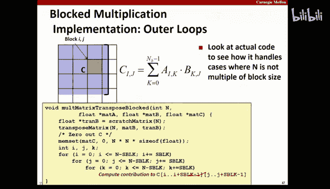

### 分块内核实现

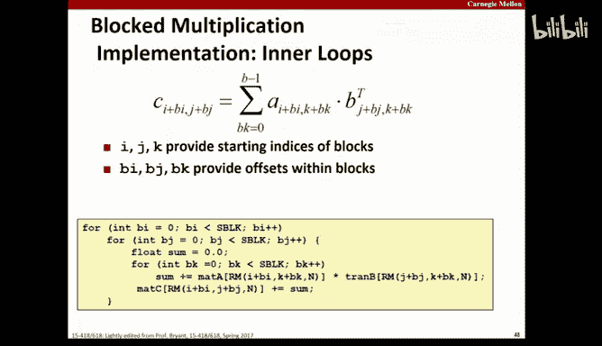

以下是分块矩阵乘法内核的简化框架：

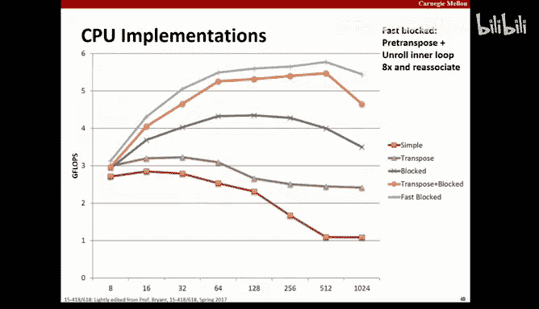

```c
__global__ void matrixMulTiledKernel(float* C, float* A, float* B, int N) {
    // 声明线程块内的共享内存，用于存储A和B的一个块
    __shared__ float sA[TILE_WIDTH][TILE_WIDTH];
    __shared__ float sB[TILE_WIDTH][TILE_WIDTH];

    int bx = blockIdx.x, by = blockIdx.y;
    int tx = threadIdx.x, ty = threadIdx.y;

    // 计算当前线程负责的C中的元素坐标
    int row = by * TILE_WIDTH + ty;
    int col = bx * TILE_WIDTH + tx;

    float sum = 0.0f;
    // 循环遍历所有需要的块
    for (int ph = 0; ph < ceil(N/(float)TILE_WIDTH); ++ph) {
        // 协作地将A和B的当前块加载到共享内存
        if (row < N && (ph*TILE_WIDTH + tx) < N)
            sA[ty][tx] = A[row * N + (ph*TILE_WIDTH + tx)];
        else
            sA[ty][tx] = 0.0f;

        if ((ph*TILE_WIDTH + ty) < N && col < N)
            sB[ty][tx] = B[(ph*TILE_WIDTH + ty) * N + col];
        else
            sB[ty][tx] = 0.0f;

        __syncthreads(); // 等待块内所有线程完成数据加载

        // 使用共享内存中的数据计算部分和
        for (int k = 0; k < TILE_WIDTH; ++k) {
            sum += sA[ty][k] * sB[k][tx];
        }
        __syncthreads(); // 等待所有线程计算完毕，再加载下一个块
    }

    // 将最终结果写回全局内存
    if (row < N && col < N) {
        C[row * N + col] = sum;
    }
}
```

### 性能飞跃与陷阱

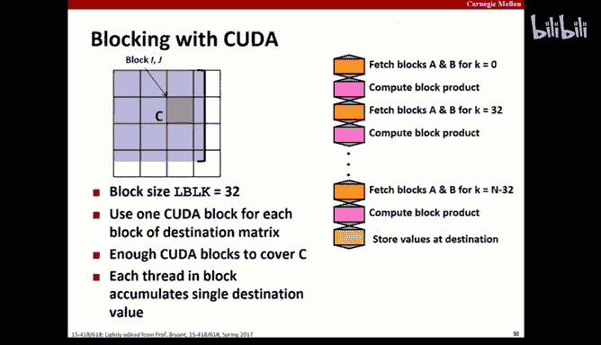

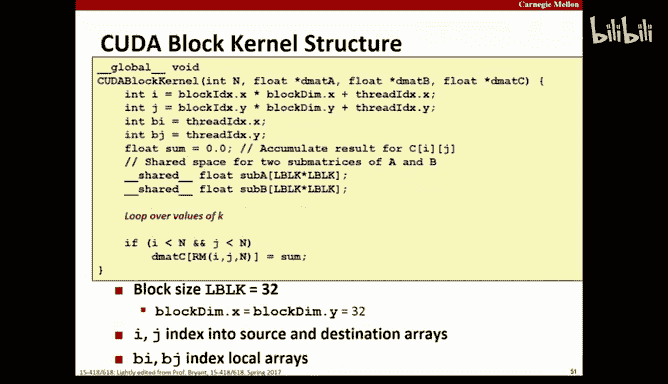

结合了预转置（确保行优先访问）和分块技术后，GPU矩阵乘法的性能实现了又一次巨大飞跃。优化后的性能曲线远高于基础GPU实现。


然而，分块代码需要特别注意**线程同步和边界条件**。例如，在加载数据到共享内存的 `if` 判断中，如果某些线程因边界条件而提前 `return` 或 `continue`，它们可能永远无法到达 `__syncthreads()` 屏障，导致整个线程块死锁。因此，所有线程必须经过相同的同步点。


### 进一步优化：使用向量化加载

更极致的优化包括使用向量化类型（如 `float4`）一次加载4个元素。这能更好地利用内存带宽，因为GPU的内存控制器更擅长处理大块的数据传输。


---

## 总结与核心建议 🎯

本节课我们一起学习了CUDA编程从基础到进阶的完整流程，并通过矩阵乘法案例实践了优化策略。

**核心收获**：
1.  **理解层次结构**：掌握网格、线程块、线程束、SM、核心的层次关系是有效编程的基础。
2.  **利用快速内存**：合理使用共享内存来减少对全局内存的慢速访问。
3.  **优化内存访问**：确保线程束内的内存访问是连续的，以实现合并访问，避免昂贵的收集/分散操作。
4.  **轻量级同步**：使用 `__syncthreads()` 进行块内同步，但要确保所有线程都能到达同步点。


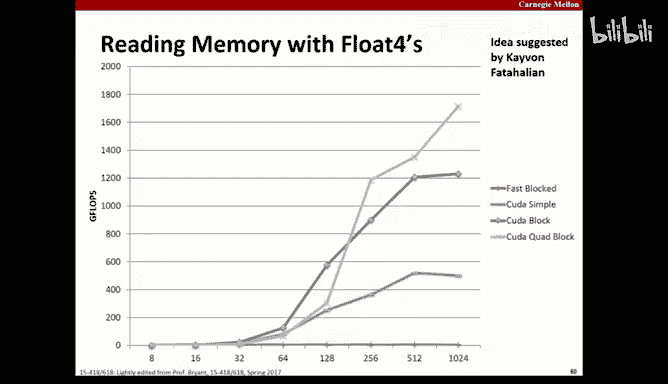

**通用优化流程建议**：
1.  **先求正确**：首先实现一个清晰、易于理解和调试的串行版本作为基准。
2.  **建立基准**：测量串行版本的性能，了解起点。
3.  **逐步并行化与优化**：从简单的GPU移植开始，然后逐步引入分块、共享内存等优化技术。
4.  **持续验证**：每一步优化后，都要与基准结果进行对比，确保正确性。
5.  **关注内存**：在GPU上，内存访问通常是主要瓶颈。计算很快，但低效的内存访问会严重拖累性能。优先优化内存访问模式（合并访问、使用共享内存、减少bank冲突）。
6.  **善用工具**：使用 `cuda-memcheck`、Nsight 等工具进行调试和性能剖析。


通过遵循这些原则，你可以将许多计算密集型任务有效地移植到GPU上，并充分发挥其并行计算能力。