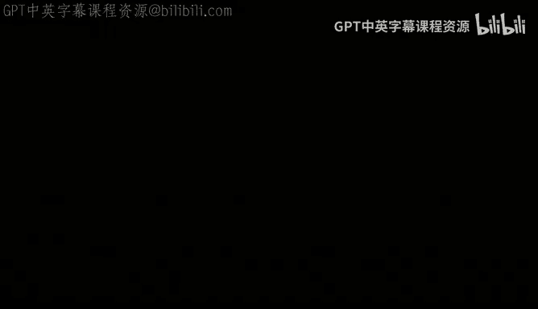

# 9：CUDA编程实践与矩阵乘法优化

## 概述
在本节课中，我们将深入学习CUDA编程的实践技巧，并以矩阵乘法为例，探讨如何将串行算法高效地移植到GPU上，并进行性能优化。我们将从基础概念回顾开始，逐步深入到内存访问模式、线程组织以及具体的优化策略。

---

## CUDA基础概念回顾
上一节我们介绍了CUDA的基本架构。本节中，我们来回顾一些核心概念，以确保后续讨论的连贯性。

*   **主机（Host）与设备（Device）**：主机指CPU及其内存，设备指GPU及其显存。
*   **全局内存（Global Memory）与共享内存（Shared Memory）**：全局内存是设备上所有线程块均可访问的显存。共享内存是线程块内部共享的高速内存。
*   **内核（Kernel）**：在设备上执行的并行函数。使用 `__global__` 限定符声明。
*   **线程（Thread）**：内核的一个并行执行实例。
*   **线程块（Thread Block）**：一组线程的集合，被调度到一个流多处理器（SM）上执行。
*   **网格（Grid）**：所有线程块的集合。
*   **线程束（Warp）**：SM内部调度和执行的基本单位，通常包含32个线程。

内核启动语法示例：
```cpp
kernelFunction<<<numBlocks, threadsPerBlock>>>(arguments);
```
其中，`blockIdx` 和 `threadIdx` 是内置变量，用于标识线程和块的位置。`blockDim` 和 `gridDim` 则描述了块和网格的维度。

---

## CUDA编程实用技巧
在深入具体例子前，掌握一些实用的编程和调试技巧至关重要。

### 错误检查
始终检查CUDA API调用的返回值。这能帮助快速定位问题。

以下是使用宏进行错误检查的示例：
```cpp
#define gpuErrchk(ans) { gpuAssert((ans), __FILE__, __LINE__); }
inline void gpuAssert(cudaError_t code, const char *file, int line) {
   if (code != cudaSuccess) {
      fprintf(stderr, "GPUassert: %s %s %d\n", cudaGetErrorString(code), file, line);
      exit(code);
   }
}
// 使用方式
gpuErrchk( cudaMalloc(&d_a, N*sizeof(int)) );
```
对于内核启动，需使用 `cudaGetLastError()` 来捕获错误。

### 调试工具
GDB可用于调试CUDA程序，支持在主机和设备代码间切换。

### 编码建议
1.  **避免硬编码常量**：设备参数（如块大小）应通过运行时查询或计算获得，以提高代码可移植性。
2.  **封装通用操作**：例如，将计算网格和块大小的向上取整操作封装为函数。
3.  **确保正确性优先**：在并行化前，必须拥有一个经过验证的、正确的串行版本作为基准。优化不应以牺牲正确性为代价。

---

## 内存访问与边界检查
在CUDA中，内存访问错误（如数组越界）通常不会像在CPU上那样导致段错误，而是直接产生错误结果，这使得调试更加困难。

因此，必须在代码中主动、大量地添加边界检查逻辑。虽然这会引入少量开销，但能极大简化调试过程。可以考虑将这些检查封装在宏或内联函数中，以便在发布版本中轻松禁用。

---

## 案例研究：矩阵乘法优化
我们将以矩阵乘法 **C = A * B** 为例，演示从CPU到GPU的移植与优化全过程。

### 第1步：建立基准
首先，我们实现一个简单的CPU串行矩阵乘法。这是我们的正确性基准和性能起点。

性能分析发现，当矩阵规模增大时，由于对矩阵B的列访问不符合行主序的内存布局，导致缓存命中率急剧下降，性能恶化。

### 第2步：CPU优化 - 预转置
一个简单的优化是对矩阵B进行预转置，将列访问转换为行访问。虽然转置本身需要 **O(n²)** 时间，但后续的乘法操作（**O(n³)**）能因此获得更好的缓存局部性，整体性能得到显著提升。

公式表示：计算 **C[i][j]** 时，不再访问 **B[k][j]**，而是访问转置后的 **B_T[j][k]**。

### 第3步：初始GPU移植
我们将优化后的CPU算法直接移植到GPU。每个GPU线程负责计算输出矩阵C中的一个元素。

计算线程全局索引的典型方法：
```cpp
int i = blockIdx.y * blockDim.y + threadIdx.y; // 行索引
int j = blockIdx.x * blockDim.x + threadIdx.x; // 列索引
```
此实现已能利用GPU的大规模并行性，获得远超CPU的性能。

### 第4步：理解GPU内存访问模式
然而，简单的移植并未考虑GPU的内存特性。我们发现，交换循环中的 `i` 和 `j` 索引（即改变线程到矩阵元素的映射关系）会导致性能大幅下降。

原因在于**线程束（Warp）的内存访问模式**：
*   **合并访问（Coalesced Access）**：当一个线程束中的线程访问连续的内存地址时，这些访问可以被合并为一次（或少数几次）内存事务，效率极高。
*   **非合并访问（Uncoalesced Access）**：当线程束中的线程访问分散的内存地址时，需要多次内存事务（聚集`Gather`/散射`Scatter`），效率很低。

在我们的例子中，合理的索引映射确保了同一线程束的线程访问连续内存（行主序），从而实现了合并访问。

### 第5步：GPU优化 - 分块计算
受CPU缓存分块优化的启发，我们在GPU上实施类似策略，但目标是为了更好地利用**共享内存**。

**算法思想**：
1.  将矩阵A和B分成大小相等的子块（Tile）。
2.  每个GPU线程块负责计算输出矩阵C的一个子块。
3.  在计算过程中，线程块先将所需的数据块从全局内存协作加载到速度更快的共享内存中。
4.  线程在共享内存上进行数据计算，减少对全局内存的访问。

这要求线程之间进行同步，以确保数据加载完成后再进行计算。使用 `__syncthreads()` 屏障。

### 第6步：进一步优化
在分块基础上，还可以采用更多优化技术：
*   **循环展开**：手动展开内层循环，减少循环开销并提高指令级并行。
*   **向量化加载**：使用 `float4` 等类型一次加载多个数据，提高内存总线利用率。

这些优化叠加后，性能得到进一步提升。

---

## 性能优化总结与陷阱
本节课我们一起学习了CUDA编程的优化路径。

**核心优化策略总结**：
1.  **从简单正确的实现开始**：首先建立一个清晰、正确的版本。
2.  **分析性能瓶颈**：使用性能分析工具定位热点。
3.  **优化内存访问**：确保线程束内访问连续，充分利用合并访问。善用共享内存减少全局内存访问。
4.  **保持线程束内执行路径一致**：避免线程束分化（Thread Divergence），即同一线程束内的线程执行不同的代码分支。
5.  **注意同步**：正确使用 `__syncthreads()`，确保所有线程都到达屏障后再进行下一步操作。忘记同步或部分线程无法到达屏障是常见错误。

**需要警惕的陷阱**：
*   **线程束分化**：`if-else`、`while`等可能导致同一线程束内线程执行不同路径，严重降低效率。
*   **共享内存库冲突**：当共享内存中多个线程访问同一个内存库（Bank）时会发生冲突，降低访问速度。需要通过内存地址布局来缓解。
*   **隐藏的全局内存访问**：即使是计算密集型内核，低效的全局内存访问也往往是主要瓶颈。





通过结合算法优化（如分块）和硬件特性理解（如内存合并），我们可以充分发挥GPU的并行计算潜力。