# 10：通信成本与优化策略

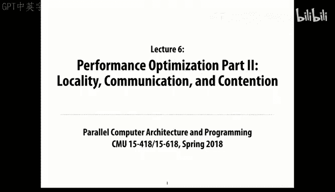

在本节课中，我们将学习并行计算中的通信成本，并探讨如何通过优化数据布局、减少通信开销以及避免资源争用来提升程序性能。我们将从简单的网格计算示例入手，逐步分析延迟、带宽、流水线和算术强度等核心概念。

---


## 通信成本的重要性

上一节我们讨论了如何将计算任务划分为相对独立的块。本节中，我们来看看通信成本如何影响并行程序的整体性能。

通常，即使你有一个绝佳的方法将问题分解成多个部分，但如果数据来回移动的成本过高，这个方法的优势也会被抵消。因此，理解和管理通信成本至关重要。


在共享内存的多核处理器中，线程可以通过共享变量进行通信。而在消息传递的并行系统中（例如通过网络连接的大型集群），处理器之间必须显式地发送和接收消息来交换数据。GPU则兼具这两种特性：在块（block）内部是共享内存，而在块之间则类似于消息传递，需要显式移动数据。

---

## 回顾：任务划分与负载均衡

大约一周前，我们讨论了将计算划分为相对独立的工作块（chunks）的一般思想，并确保这些块在不同的处理器或线程之间实现良好的负载均衡。这是实现并行计算的第一步。

任务划分可以静态或动态进行：
*   **静态划分**：提前确定如何划分，避免了运行时开销。但如果应用程序的执行特征每次运行都不同，静态划分可能导致负载不均衡。
*   **动态划分**：根据系统当时的实时状态动态地分解问题，可以更好地适应变化，但会引入一些运行时开销。

一个重要的建议是：从简单的方案开始，然后根据需要逐步增加复杂性。复杂的方案往往因为开销过大而无法带来实际的性能提升。通过测量来理解性能瓶颈在哪里，并专注于解决这些问题，而不是凭空猜测。

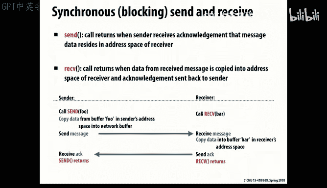

---

## 示例：网格平均计算

为了具体说明通信模式，我们来看一个在科学计算（如有限元分析）中常见的简化示例：网格平均计算。


我们假设将一个物理对象划分为网格，并希望根据每个网格点及其邻居的当前值来计算该点的新值。在这个简单例子中，我们计算每个点与其四个直接邻居（上、下、左、右）的平均值。


我们处理的是一个 `(N+2) x (M+2)` 的网格，其中外围添加了额外的行和列作为边界，以便所有内部点都有完整的邻居，无需特殊条件判断。实际计算在内部的 `N x M` 网格上进行。

### 基础并行化方法

最直接的方法是将网格划分为若干行块，块的数量等于线程或处理器的数量。假设我们将网格划分为 `P` 个行块，每个线程处理一个行块。

在消息传递的世界里，每个块在一个独立的进程上运行，进程之间只能通过网络显式发送消息来交换数据。这通常是一个迭代计算：对整个网格执行平均函数，更新网格状态，然后重复直到收敛。


对于中间的行块（例如线程2），它需要从上方邻居获取其顶部边界行的值，从下方邻居获取其底部边界行的值。同时，它也需要将自己的顶部行发送给上方邻居，底部行发送给下方邻居。顶部和底部的行块则只需要与一个邻居通信。

以下是该算法的伪代码框架，展示了核心的通信和计算模式：


```c
// 伪代码示例：网格平均计算的消息传递模式
// 每个线程分配本地网格空间： (rows_per_thread + 2) x (N+2)
allocate_local_grid(my_id, rows_per_thread, N);

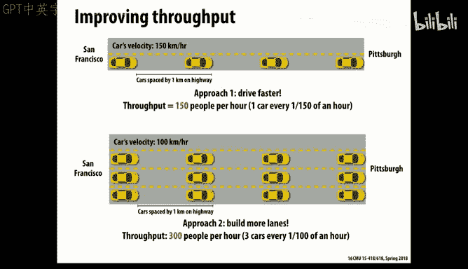

while (!converged) {
    // 阶段1：边界交换
    if (my_id != 0) {
        send(top_row, to: my_id-1);
    }
    if (my_id != P-1) {
        send(bottom_row, to: my_id+1);
    }
    receive(ghost_top_row, from: above_neighbor);
    receive(ghost_bottom_row, from: below_neighbor);

    // 阶段2：本地计算（使用包括ghost行在内的数据）
    for i in local_rows {
        for j in columns {
            new_grid[i][j] = average(old_grid[i-1][j], old_grid[i+1][j],
                                     old_grid[i][j-1], old_grid[i][j+1]);
        }
    }

    // 阶段3：计算局部变化并全局同步以检查收敛性
    local_delta = sum_of_abs_changes(new_grid, old_grid);
    send(local_delta, to: master_thread); // 例如线程0
    // 主线程收集所有local_delta，求和，判断是否收敛
    // 主线程广播收敛状态给所有线程
    receive(converged_status, from: master_thread);
}
```

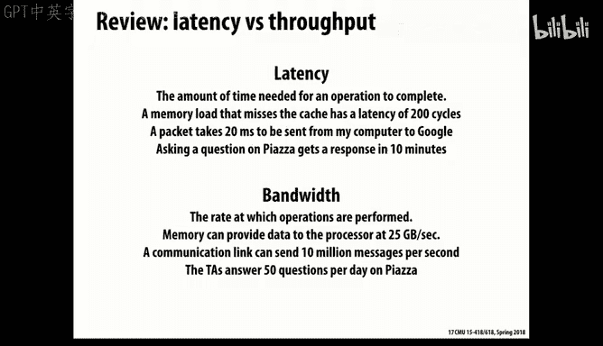

这个程序展示了两种通信模式：
1.  邻居间交换边界数据的局部通信。
2.  所有线程将局部误差发送给主线程（线程0），由主线程聚合并广播全局状态的全局归约（reduce）和广播（broadcast）操作。

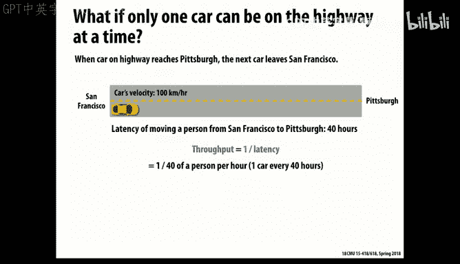

使用MPI等消息传递框架可以相对容易地编写这类程序。


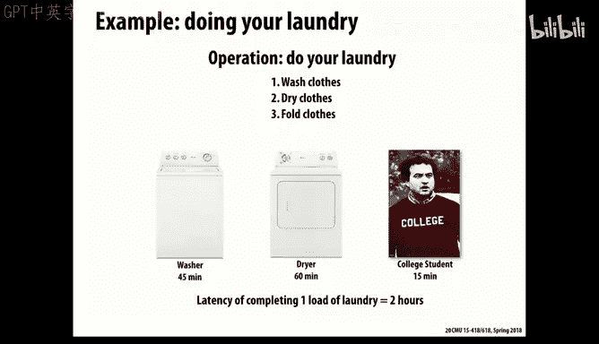

---

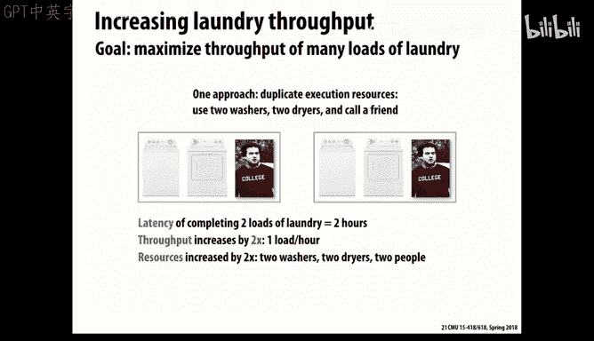

## 发送与接收的语义

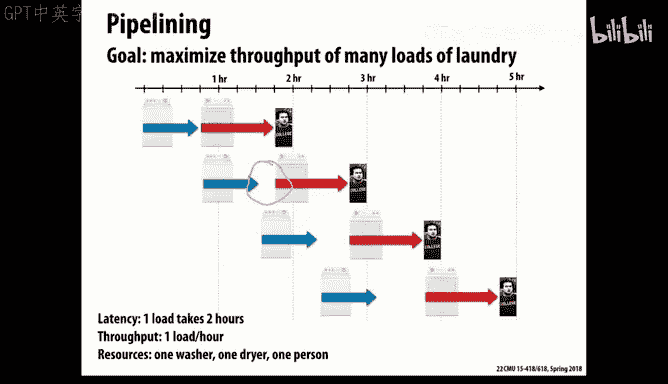

理解了基本模式后，我们需要深入了解通信操作本身的语义，不同的语义会影响程序的正确性和性能。

### 阻塞式发送


从系统实现的角度看，最直接的方式是**阻塞式发送**，有时也称为“ rendezvous”（汇合）。在这种模式下，发送方和接收方必须同步才能完成传输。
*   对于接收方：如果尝试接收时没有消息到达，则会阻塞等待。
*   对于发送方：调用发送函数后，代码会阻塞，直到接收方确认收到消息。这类似于握手协议。


系统实现者喜欢这种方式，因为它所需的缓冲区大小非常明确（最多只需容纳一个消息的数据），避免了缓冲区溢出的风险。然而，阻塞式发送容易导致**死锁**。例如，在上面的伪代码中，如果所有线程同时尝试发送而没有人尝试接收，程序就会卡住。

**解决方法**：使用奇偶排序等技术交错发送和接收的顺序。例如，偶数编号的线程先发送后接收，奇数编号的线程先接收后发送，从而打破循环依赖。

### 非阻塞式发送

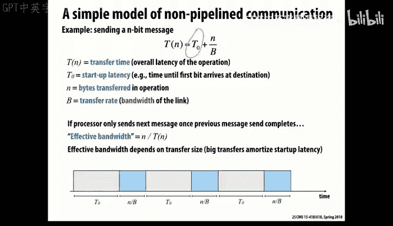

另一种方式是**非阻塞式发送**。调用发送函数后立即返回，不会阻塞发送方线程。发送操作在后台进行。
*   **优势**：发送方可以在等待数据传输完成的同时执行其他计算，提高了资源利用率。
*   **挑战**：如果发送方生产消息的速度快于接收方处理的速度，可能会导致消息在系统中无限堆积，占用大量缓冲区。通常，非阻塞发送会返回一个句柄（handle），发送方可以通过查询该句柄来了解发送是否已完成。

类似地，也可以有**非阻塞式接收**，允许接收方发布接收请求后先去处理其他任务，当数据到达时通过回调（callback）机制通知接收方。

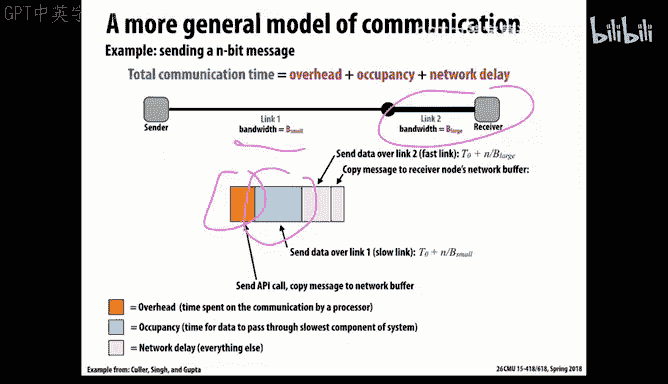


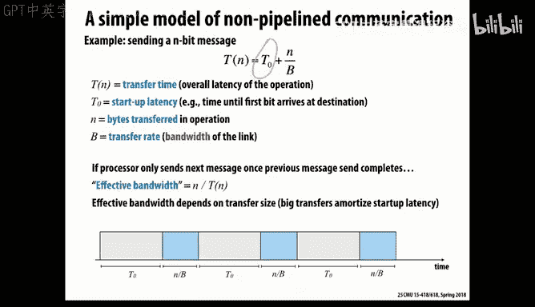

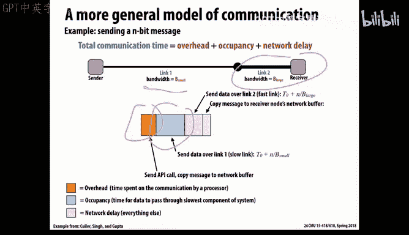

非阻塞通信有助于重叠通信和计算，是提高并行程序性能的重要手段。

---

## 性能参数：延迟与带宽

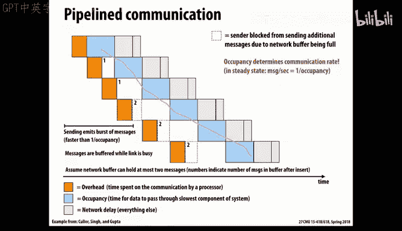

现在，让我们从更宏观的视角分析通信性能的两个关键参数：**延迟**和**带宽**。我们可以通过一个生活中的类比来理解它们。

假设一群人要从旧金山开车到匹兹堡（约4000公里）。
*   **延迟**：一辆车从起点到终点所花费的总时间。如果车速是100公里/小时，那么延迟就是 **40小时**。
*   **带宽/吞吐量**：单位时间内能够完成运输的人数。如果只有一辆车，带宽就是 **每40小时1人**。

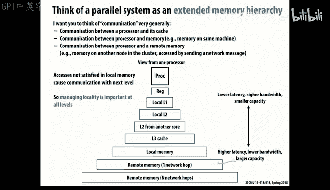

**关键点**：我们可以通过增加车辆数量（即增加“在路上”的并发任务）来提高带宽，而无需改变单辆车的速度（即延迟）。在任何时刻，如果路上有4000辆车（每辆车相隔1公里），那么带宽就变成了 **每小时100人**（100公里/小时 / 1公里/辆 * 1人/辆）。这个例子说明，**提高带宽通常比降低延迟更容易**。


当然，我们也可以通过提高车速（降低延迟）来同时改善延迟和带宽。

在计算机系统中：
*   **延迟**：完成一次操作所需的端到端时间，例如处理一次缓存缺失、从A点发送消息到B点所需的时间。
*   **带宽**：单位时间内可以传输的数据量或完成的操作量，单位通常是字节/秒或操作/秒。

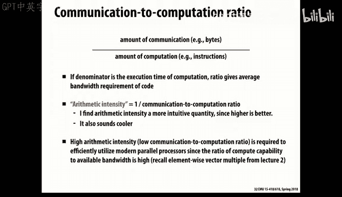

在许多系统中，带宽可以近似表示为 `1 / 延迟`，但通过并发（如多车道）或流水线等技术，可以在不改变延迟的情况下显著提升带宽。

---

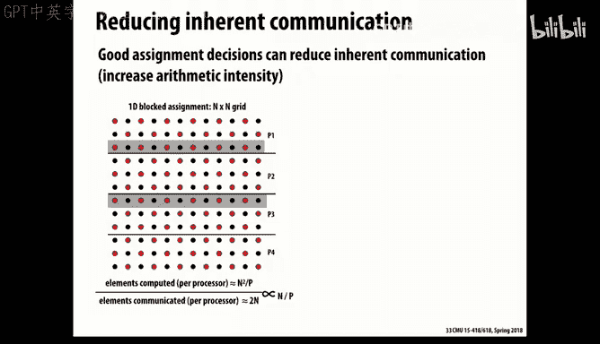

## 流水线提升吞吐量

另一个提升吞吐量的强大技术是**流水线**。我们通过洗衣的例子来说明。

假设洗衣包含三个阶段：
1.  洗涤：45分钟
2.  烘干：60分钟
3.  折叠：15分钟

如果顺序执行，完成一批衣物的总延迟是 **120分钟**。吞吐量是 **每120分钟一批**。


如果采用流水线：当第一批衣物洗涤完成后（45分钟后），立即开始洗涤第二批衣物。虽然烘干阶段是瓶颈（最慢），但我们可以让洗涤和烘干设备持续工作。

在稳定状态下，系统的吞吐量将由最慢阶段（烘干）的延迟决定，即 **每60分钟一批**。这样，**我们无需增加额外的洗衣机或烘干机（资源），仅通过流水线就将吞吐量提高了一倍**。付出的代价是每60分钟需要花15分钟折叠衣服。

在处理器设计中，指令流水线正是利用了这一原理，将指令执行划分为取指、译码、执行、写回等多个阶段，使得处理器能够同时处理多条指令，极大提高了吞吐量。

---


## 通信成本模型


将上述概念应用到通信中，我们可以建立一个简单的模型。传输 `n` 字节数据的总时间 `T(n)` 可以表示为：


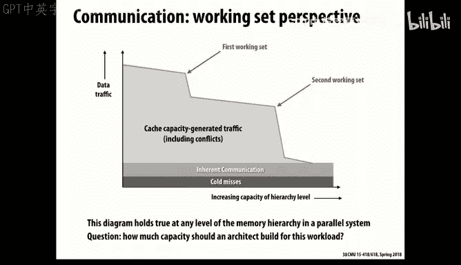

**`T(n) = T0 + n / B`**

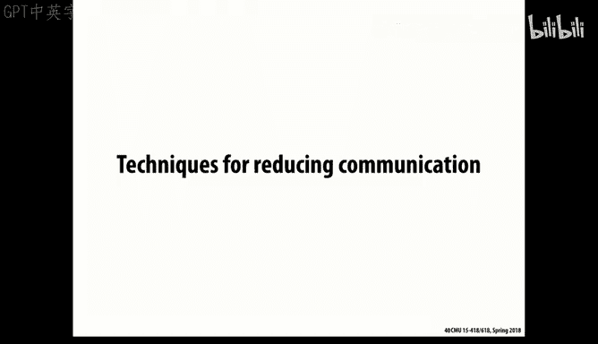

其中：
*   **`T0`**：固定开销。包括建立连接、协议处理等时间，对于长距离通信，还包括光速传播延迟。
*   **`n / B`**：传输时间。`B` 是信道的最大带宽（字节/秒）。


**有效带宽** 则为：**`有效带宽 = n / T(n) = n / (T0 + n/B)`**

从这个公式可以看出：
*   发送更少、更长的消息有助于分摊固定开销 `T0`，从而提高有效带宽。几乎所有通信介质都更擅长传输长消息而非短消息。
*   如果通信路径由多个不同速度的链路组成，那么最慢的链路（瓶颈链路）将决定整体的有效带宽。

通过流水线化的通信协议（例如，在等待前一个消息的确认时就开始发送下一个消息的数据），可以尽可能地让瓶颈链路保持忙碌，从而将有效带宽提升到接近其理论最大值 `B`。

---

## 计算中的通信成本层次结构

在计算系统中，通信成本无处不在，并形成一个层次结构：
1.  **寄存器**：访问速度最快，容量最小。
2.  **缓存**：速度较快，但由多个核心共享，可能引入延迟。它同时也是线程间通信的机制。
3.  **本地内存**：速度较慢，容量更大。
4.  **远程内存/其他处理器内存**：通过消息传递访问，延迟非常高。

**核心原则**：为了获得高性能，应尽可能将计算所需的数据保持在最局部、最快的存储层次中，最大化数据的**局部性**。


---

## 算术强度：计算与通信的比率

一个用于量化上述原则的关键指标是**算术强度**。

*   **固有通信**：由问题本质决定的、无法避免的通信（如网格计算中交换边界值）。
*   **额外通信**：由于硬件设计、软件实现或数据布局不理想而引入的非必要通信（如缓存行失效、虚假共享）。

**算术强度** 定义为：**`算术强度 = 计算操作数 / 通信字节数`**

它衡量了每移动一个字节数据，能完成多少有用的计算。**高算术强度是高性能计算所追求的**。

**示例：SAXPY (Single-precision A·X Plus Y)**
*   计算：每个元素进行1次乘法和1次加法，共 **2次浮点运算**。
*   通信：需要读取两个源向量 (`x`, `y`) 并写入目标向量 (`z`)，假设每个元素4字节，共 **12字节内存访问**。
*   算术强度 ≈ **2次运算 / 12字节 ≈ 0.17 运算/字节**，这是一个非常低的强度，限制了性能发挥。

### 提高算术强度的方法

1.  **优化数据划分**：在网格计算中，与按行划分相比，按**方块**划分能减少通信边界（周长）相对于计算面积的比例，从而提高算术强度。通信量从 `O(n)` 降至 `O(sqrt(n))`。
2.  **循环融合**：将多个独立的、遍历相同数据的循环融合成一个循环。例如，计算 `(A+B)*(C+D)`，与其先算`A+B`和`C+D`再相乘（多次遍历数据），不如在一个循环中一次性完成所有操作，显著减少内存访问次数。
3.  **数据布局优化（分块）**：将数据在内存中按块重新组织（例如，使用四维数组或分块布局），使得每个处理器主要访问本地连续的内存块，提高缓存利用率和局部性。这有助于对抗**虚假共享**——当多个处理器访问同一缓存行中的不同无关数据时，由于缓存一致性协议导致的性能下降。
4.  **软件管理的缓存**：如在CUDA中，主动将数据从全局内存加载到共享内存中，然后进行密集计算，这相当于手动管理的高速缓存，能极大提高算术强度。

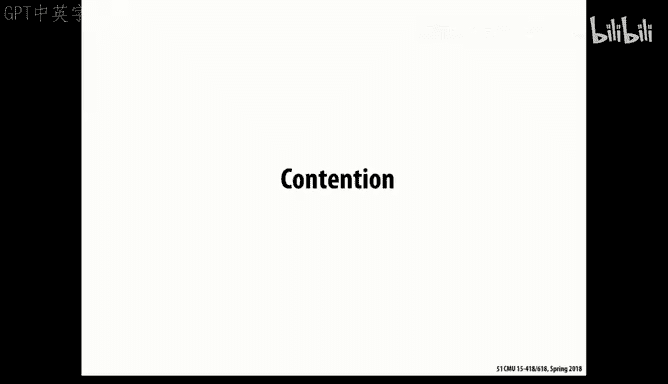

---


## 资源争用与热点

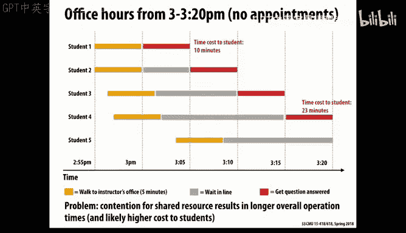

**争用**发生在多个执行单元试图同时访问同一稀缺资源时，它会增加开销并成为性能瓶颈。

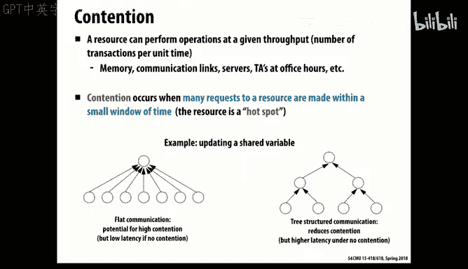

**示例**：假设学生找教授答疑，每人需5分钟。如果学生们同时到达，他们需要排队等待。教授是瓶颈资源，利用率很高，但学生的平均等待时间（延迟）很长。

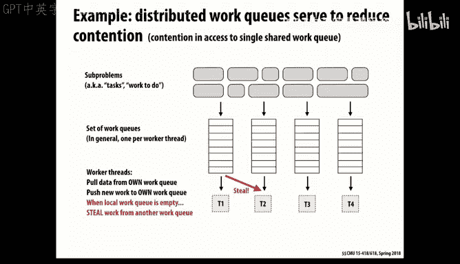

在并行计算中，类似的**热点**会严重限制可扩展性。例如：
*   **全局任务队列**：所有工作线程从一个中心队列获取任务，该队列的锁会成为热点。
*   **原子操作**：多个线程频繁对少数几个计数器进行原子递增（例如，在构建粒子网格的归属列表时），这些计数器会成为热点。


### 避免争用的策略


1.  **分布式数据结构**：使用分布式工作队列，每个线程主要从本地队列获取任务，仅在负载不均时从其他队列窃取任务。
2.  **局部聚合**：避免直接更新全局结构。例如，在构建粒子-网格归属关系时：
    *   **低效方法1**：每个网格单元扫描所有粒子。工作量大且不均衡。
    *   **低效方法2**：每个粒子原子性地将自己插入到对应网格单元的全局列表中。会产生大量原子操作争用。
    *   **高效方法**：
        1.  每个线程处理一部分粒子，为每个网格单元构建一个**局部列表**（无争用）。
        2.  然后，使用高效的**并行排序**（如根据网格单元索引对粒子进行排序）。
        3.  排序后，每个网格单元的粒子在排序数组中连续分布，只需记录起始和结束索引即可“获得”该单元的列表。

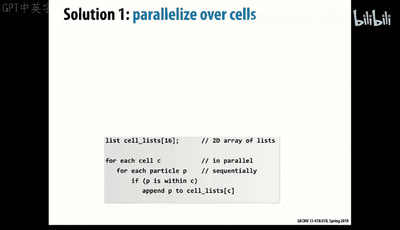


这种方法的核心思想是：**先用无争用的方式完成局部计算，然后通过高效的数据并行原语（如排序、扫描）将局部结果整合为全局结果**。这正是当前课程作业中扫描操作可以发挥作用的地方。

---

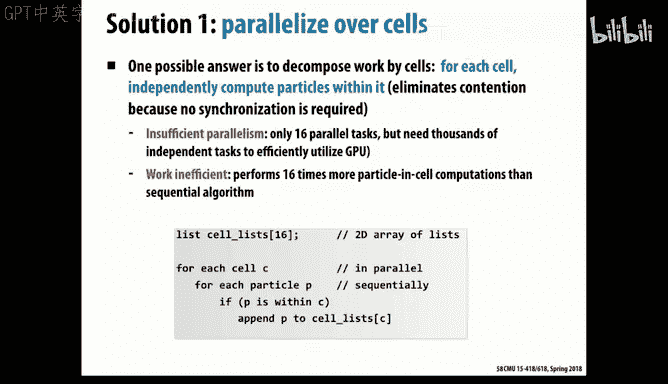

## 总结


本节课中，我们一起深入探讨了并行计算中的通信成本及其优化策略。

我们首先通过网格平均计算的例子，学习了消息传递程序的基本通信模式。然后，分析了阻塞与非阻塞通信的语义及其对程序正确性和性能的影响。

接着，我们引入了**延迟**和**带宽**这两个关键性能指标，并通过类比说明了如何通过并发和**流水线**来提高吞吐量。我们建立了一个简单的通信成本模型 **`T(n) = T0 + n/B`**，并指出发送长消息和流水线化的重要性。

我们探讨了计算系统中的存储层次结构，并强调了数据局部性的核心地位。为此，我们引入了**算术强度**这一关键指标，它衡量了计算与通信的比率。我们学习了通过优化数据划分、循环融合、数据布局和软件缓存等方法来提高算术强度。

最后，我们讨论了**资源争用**和**热点**问题，它们会严重限制并行扩展性。我们学习了通过使用分布式数据结构和局部聚合后全局整合的策略来避免争用，其中高效的数据并行原语（如排序、扫描）扮演了关键角色。

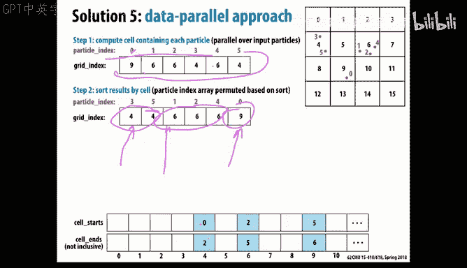

掌握这些关于通信成本、算术强度和避免争用的概念与技巧，对于设计和实现高效的并行程序至关重要。