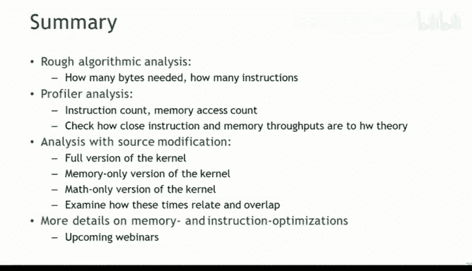
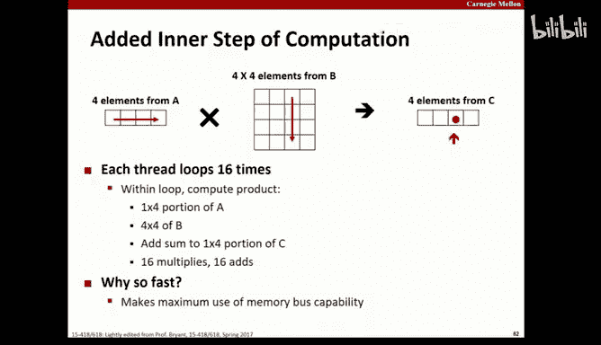

# 12：CUDA性能分析与优化教程

在本节课中，我们将学习如何分析和优化CUDA程序的性能。我们将从理解性能瓶颈的基本概念开始，逐步介绍使用算法分析、性能剖析器和代码修改这三种方法来诊断问题，并深入探讨如何优化内存访问，特别是本地内存的使用。

## 性能优化流程概述

上一节我们介绍了并行计算的基本概念，本节中我们来看看如何系统地分析和优化CUDA内核的性能。性能优化的核心是识别并解决限制程序速度的瓶颈。这些瓶颈通常源于内存带宽、指令吞吐量或延迟。

以下是性能优化的基本步骤：
1.  **建立性能基准**：首先需要明确性能目标，并了解当前内核的性能状况。
2.  **识别性能瓶颈**：分析是内存带宽、指令吞吐量还是其他因素限制了性能。
3.  **理解硬件限制**：查阅硬件规格，了解理论上的内存带宽和指令吞吐量上限。
4.  **制定优化策略**：根据瓶颈类型，采取相应的优化技术。
5.  **验证优化效果**：确保优化确实提升了性能，且没有引入新的问题。

## 识别性能瓶颈的方法

有三种主要方法可以帮助我们理解内核的性能特征。

### 1. 算法分析
算法分析是指通过阅读高级语言（如CUDA C）源代码，估算程序的计算强度和内存访问模式。例如，对于一个向量加法内核，我们可能认为它读取两个`float`（8字节），执行一次加法，然后写入一个`float`（4字节），总计12字节内存操作对应1次计算指令。

然而，这种方法精度较低，因为它忽略了地址计算、循环控制等底层操作。

### 2. 使用性能剖析器
性能剖析器（Profiler）通过在程序执行时收集各种计数器来提供性能数据。NVIDIA提供了命令行（`nvprof`）和图形界面（NVIDIA Visual Profiler）两种工具。**强烈建议使用图形界面版本**，因为它已经将许多底层计数器汇总成更有意义的指标，降低了误解读的风险。

剖析器提供的关键指标包括：
*   **指令发射数**：反映计算吞吐量。
*   **DRAM读写次数**：反映全局内存带宽使用情况。
*   **L2缓存命中/未命中**：反映缓存效率。
*   **IPC**：每时钟周期指令数，衡量计算单元利用率。
*   **全局内存吞吐量**：单位时间内传输的数据量，单位通常是GB/s。

**重要提示**：许多计数器（如每SM的指令数）只针对单个流多处理器（SM）进行采样。在估算整个GPU的性能时，需要乘以SM的总数。而L2和DRAM的计数器通常是全局的。

### 3. 代码修改
代码修改是一种强大但需要技巧的方法。其核心思想是通过修改源代码，分离出计算和内存操作，分别测量它们的时间。
*   **仅内存版本**：移除所有计算逻辑，只保留内存加载/存储操作，用于测量“纯净”的内存访问时间。
*   **仅计算版本**：移除所有内存访问，只保留计算逻辑，用于测量“纯净”的计算时间。

比较原始版本、仅内存版本和仅计算版本的执行时间，可以直观地看出计算与内存访问的重叠（隐藏延迟）程度。
*   如果 `时间(原始) < 时间(仅内存) + 时间(仅计算)`，说明计算和内存访问存在重叠，是理想情况。
*   如果 `时间(原始) ≈ 时间(仅内存) + 时间(仅计算)`，说明几乎没有重叠，存在优化空间。

**挑战**：编译器优化可能会将“无用”的代码（如不参与计算的内存访问或不存储结果的计算）消除。我们需要使用技巧（例如，通过运行时变量控制代码路径）来“欺骗”编译器，保留我们想测量的代码。

## 计算与内存的平衡比

优化的一个关键目标是使程序的计算/内存访问比率与硬件的计算/内存带宽比率相匹配。

1.  **确定硬件比率**：从硬件规格书中查找理论峰值。例如，对于某个GPU，其比率可能是 **3.76 指令 : 1 字节/周期**。
2.  **估算程序比率**：通过算法分析或剖析器数据，估算你的程序每执行一条指令需要访问多少字节内存。
3.  **比较与分析**：
    *   如果**程序比率 < 硬件比率**，意味着程序相对更“渴求”内存，性能受限于**内存带宽**。
    *   如果**程序比率 > 硬件比率**，意味着程序相对更“渴求”计算，性能受限于**指令吞吐量**。

例如，一个向量加法的朴素算法分析得出比率约为 **1 指令 : 12 字节**，远低于硬件的3.76:1，这强烈暗示该内核是**内存带宽瓶颈**。

## 深入内存优化：本地内存

本地内存（Local Memory）是GPU全局内存的一部分，但具有特殊的缓存行为（通常缓存在L1和L2中）。它主要用于两种情况：
1.  寄存器溢出：当线程需要的寄存器数量超过硬件限制时，编译器会将部分变量“溢出”到本地内存。
2.  无法放入寄存器的变量：例如，索引在运行时确定的大型数组。

本地内存访问会影响性能：
*   **增加内存流量**：溢出到本地内存的变量需要通过内存总线加载/存储。
*   **增加指令数**：需要额外的指令来管理这些内存操作。

### 如何分析和优化本地内存
1.  **识别使用情况**：无法从高级代码直接判断。必须在编译时添加特定标志，让编译器报告信息，或通过剖析器查看计数器。
    *   编译标志示例：`-Xptxas -v,-abi=no`
    *   关键剖析计数器：`l1_local_load_hit`, `l1_local_load_miss`, `l1_local_store_hit`, `l1_local_store_miss`。
2.  **评估影响**：计算本地内存访问占总体内存流量的比例。如果比例很小（例如<5%），则优化优先级较低。
3.  **优化策略**：
    *   **增加每线程寄存器数量**：通过编译器选项（如`-maxrregcount=N`）或内核启动配置。但这可能降低活跃线程数（占用率），需要权衡。
    *   **调整L1缓存/共享内存配置**：可以使用`cudaFuncSetCacheConfig`或`cudaDeviceSetCacheConfig`来增加用于L1缓存的内存份额，减少用于共享内存的份额，这有助于提高本地内存（缓存在L1）的命中率。
    *   **使用非缓存加载**：对于其他全局内存访问，使用`__ldg()`指令或`-Xptxas -dlcm=cg`标志进行非缓存加载，避免它们污染本可用于寄存器溢出的L1缓存空间。

**剖析器计数器注意事项**：`l1_local_load_miss`计数器仅在先前对应地址有存储操作时才会递增（否则无法判断是否“未命中”）。因此，在估算由未命中导致的真实内存流量时，通常需要将未命中次数乘以2（一次存储写入+一次加载读取）。

## 总结

本节课中我们一起学习了CUDA性能分析与优化的系统方法。我们首先明确了性能优化的目标是平衡程序需求与硬件资源。接着，我们掌握了三种诊断工具：算法分析（快速估算）、性能剖析器（实际测量）和代码修改（隔离分析）。我们学会了如何计算和解读计算/内存比率，以判断瓶颈类型。最后，我们深入探讨了本地内存这一常见性能“陷阱”的成因、分析方法和优化策略（调整寄存器数量、L1缓存配置）。记住，优化是一个迭代过程：测量、分析、修改、验证，并始终关注最主要的性能瓶颈。