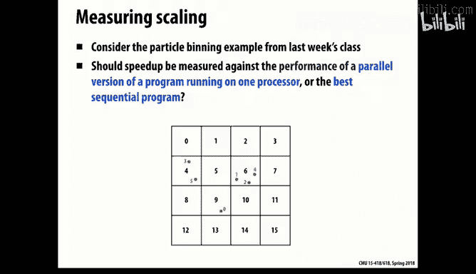
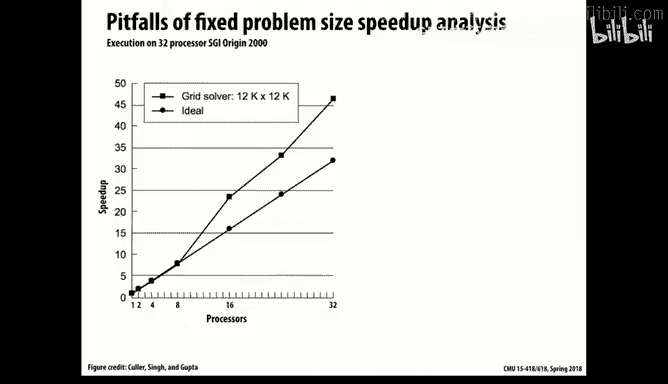
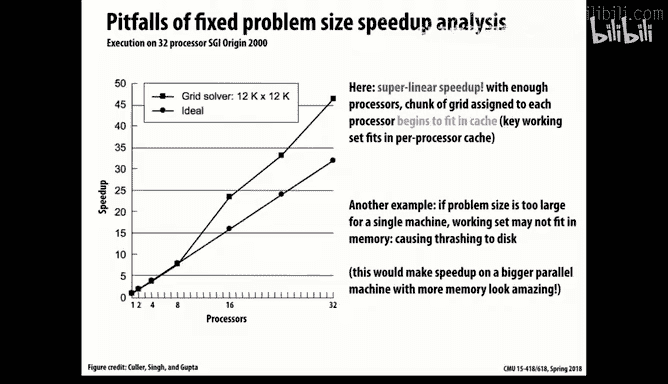
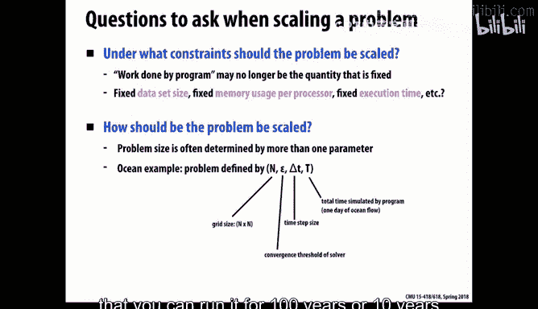
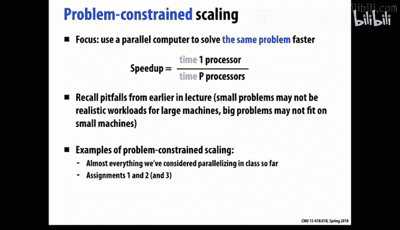
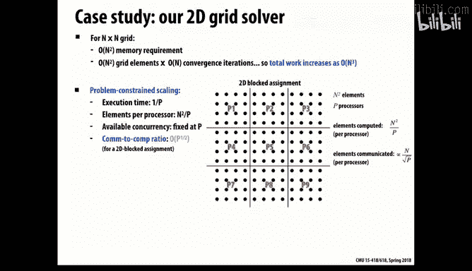
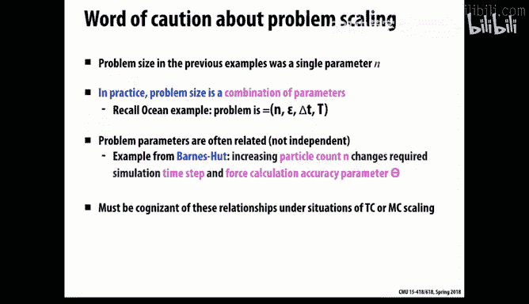
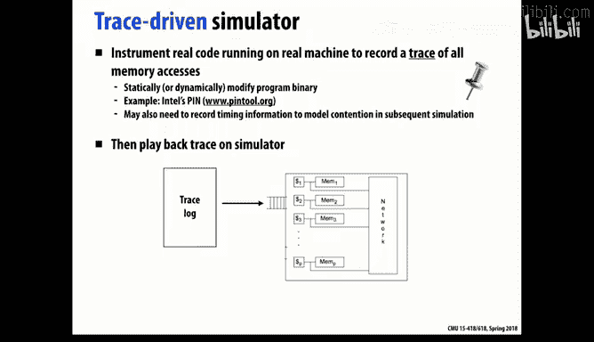
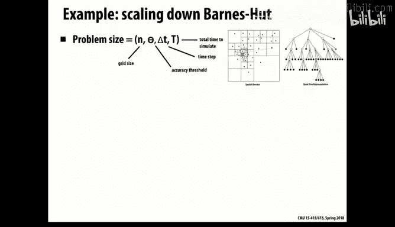
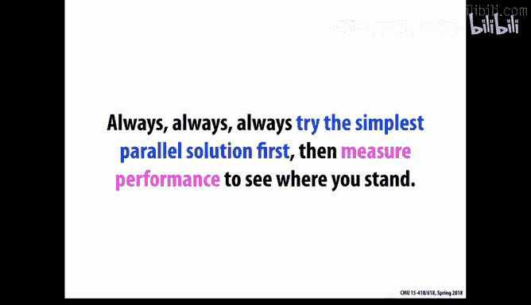

# 13：性能评估与扩展性分析

在本节课中，我们将学习如何评估并行程序的性能，并深入理解“扩展性”这一核心概念。我们将探讨不同的性能度量方法、扩展性类型以及在实际项目中分析和优化性能的策略。

---

## 性能度量的挑战

上一节我们讨论了并行化的基本模式，本节中我们来看看如何衡量并行程序是否成功。一个常见的指标是**加速比**，即程序在单处理器上的运行时间与在P个处理器上运行时间的比值。

然而，直接比较并行代码与单线程版本的性能可能产生误导。例如，一个并行实现可能包含锁操作，即使在单核上运行，这些锁调用也会带来开销。因此，公平的比较应该是：**并行代码的性能 vs. 最优的单线程代码性能**。

另一个挑战是问题规模。如果问题规模太小，增加处理器可能无法带来性能提升，甚至导致性能下降，因为每个处理器的工作量不足以掩盖通信开销。

**公式**： 在网格求解的例子中，每个处理器在每个时间步的计算量约为 `n² / P`，而通信量约为 `n / √P`。通信计算比与 `1 / √P` 成正比。随着P增加，通信开销可能主导总运行时间。

---

## 强扩展与弱扩展

在并行计算领域，通常用两种方式来讨论扩展性：

*   **强扩展**： 固定问题规模，测量使用更多处理器时程序运行速度的提升。这是我们通常所说的“加速比”。
*   **弱扩展**： 随着处理器数量的增加，按比例增大问题规模，目标是保持每个处理器的负载和总运行时间大致不变。这衡量了系统解决更大规模问题的能力。

许多科学计算和工程应用更关注弱扩展，因为它们的目标是利用更多的计算资源来解决以前无法处理的大型问题。

---

## 不同约束下的扩展性分析

根据应用场景的不同，性能目标可能受到不同资源的约束。我们以N×N的网格求解为例，分析三种典型约束下的扩展行为：

以下是三种不同的资源约束场景：

1.  **问题约束**： 固定问题规模（强扩展）。随着P增加，每个处理器的计算量减少，通信开销相对增加，扩展性最终会受到限制。
2.  **时间约束**： 固定总运行时间。目标是利用P个处理器在相同时间内解决一个更大的问题。在这种情况下，可解决的问题规模K大约为 `N × P^(1/3)`。通信计算比随P增长而恶化，但速度比强扩展慢。
3.  **内存约束**： 系统总内存随P线性增长。目标是解决与总内存成比例的最大规模问题。此时，每个处理器的网格尺寸与P成正比，通信计算比可以保持恒定，从而实现良好的扩展性。

**核心结论**： 在三种场景中，内存约束（弱扩展）通常最容易实现良好的扩展性，而问题约束（强扩展）的扩展难度最大。

---

## 性能建模与测量实践

在实际项目中，我们常常需要预测或分析性能。有两种主要的建模方法：

*   **基于踪迹的模拟**： 记录程序在一种配置下的执行踪迹（如内存访问序列），然后在模拟器上回放以评估其他配置。缺点是可能过度拟合特定踪迹，且难以反映问题规模变化后的行为。
*   **执行驱动的模拟**： 模拟器直接执行程序的一个简化或插桩版本，能够动态适应不同的系统状态和问题规模。这种方法更灵活，但构建和运行成本更高。

当面对大量可调参数时，可以使用**帕累托最优曲线**进行分析。这条曲线展示了在给定约束下（如面积、功耗），性能（如速度）的最优边界，帮助设计者在各种权衡中找到最佳设计点。

---

## 性能分析与优化策略

在优化实际代码时，遵循从简单到复杂的策略是有效的。

首先，实现一个简单、正确的并行版本作为基线。然后，通过测量定位性能瓶颈。一个有用的分析模型是**屋顶线模型**。该模型描述了在给定机器上，程序性能如何随其**算术强度**变化。

**公式**： 算术强度 = 总算术操作数 / 总字节通信量。

在屋顶线模型中：
*   当算术强度较低时，性能受限于内存带宽，位于模型的“斜坡”部分。
*   当算术强度足够高时，性能受限于处理器峰值计算能力，位于模型的“屋顶”平坦部分。

你的优化方向应取决于程序在屋顶线模型中所处的位置。

以下是一些诊断瓶颈的实用技巧：

*   **判断计算瓶颈**： 在代码中人工增加冗余算术操作。如果运行时间没有明显增加，说明你可能未充分利用计算单元。
*   **判断内存瓶颈**： 尝试减少内存访问或改变访问模式（如使用更小的数据集）。如果性能显著提升，说明你受内存带宽或延迟限制。
*   **判断同步开销**： 临时移除同步操作（如锁）。虽然结果会错误，但可以暴露出同步机制带来的开销。

此外，充分利用性能分析工具：
*   使用系统监控工具查看CPU利用率。
*   利用硬件性能计数器获取缓存命中率、指令周期等低级信息。
*   在代码关键阶段插入轻量级计时器，了解时间分布。

优化是一个迭代过程。当你对一部分代码进行优化后，瓶颈可能会转移到其他地方，需要重新进行测量和分析。

---

## 总结

本节课中我们一起学习了并行程序性能评估的核心概念。我们明确了公平的性能比较应基于最优串行代码。我们深入探讨了**强扩展**和**弱扩展**的区别，并分析了在**问题约束**、**时间约束**和**内存约束**下并行程序的不同扩展行为。我们还介绍了性能建模的方法（如踪迹模拟）、分析工具（如屋顶线模型）以及一系列定位和诊断性能瓶颈的实用策略。记住，有效的性能优化是一个由测量驱动、从简单开始、并持续迭代的工程过程。