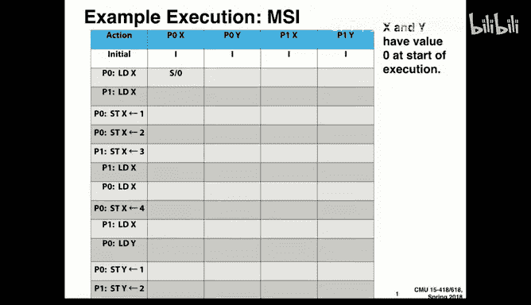
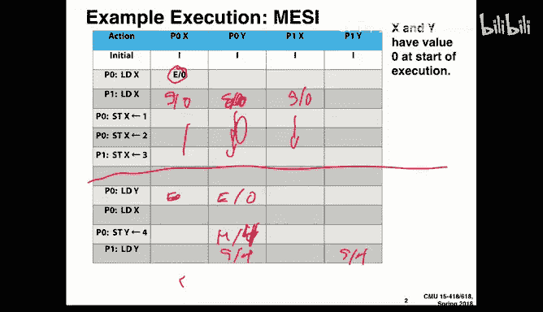

# 14：缓存一致性协议 🧠

在本节课中，我们将学习一个介于计算机体系结构和系统设计之间的新主题：**缓存一致性**。当我们在拥有共享内存但存在多个缓存的大型系统中编写代码时，如何确保所有缓存中的数据保持一致变得至关重要。这对于系统设计和程序性能优化都非常重要。

## 缓存基础回顾

上一节我们介绍了缓存一致性的重要性，本节中我们来看看缓存的基本工作原理。缓存是一个小型、快速的内存，用于临时存放主内存内容的子集。

在C/C++中，如果一个变量被声明为 `volatile`，意味着对该变量的写操作会直接写入内存，而不仅仅是寄存器。

假设我们有一个4字节的内存块存储在地址 `0x12345604`。如果使用典型的64字节缓存行，我们会查看低6位地址来确定该数据在缓存行中的偏移量。在这个例子中，偏移量是4，意味着数据从缓存行的第4个字节开始存放。在**小端序**中，值 `1` 会存储为 `1, 0, 0, 0`。

缓存设计中有不同的策略，主要与写操作有关：

*   **写回**：写操作只更新缓存。只有当该缓存行因容量问题被替换，或进程结束时，才将数据写回主内存。
*   **写直达**：每次写操作都直接穿透缓存，更新主内存。实现更简单，但性能较低，因为大多数数据是读多写少。

另一个策略是**写分配**与**非写分配**：
*   **写分配**：当写入一个不在缓存中的地址时，先将整个缓存行读入缓存，然后修改目标字节。
*   **非写分配**：写入不在缓存中的地址时，直接写入主内存，不将数据读入缓存。

在单处理器系统中，这些策略工作良好。但在共享内存的多处理器系统中，问题就变得复杂了。

## 共享内存与一致性问题

在共享内存系统中，我们希望：如果一个处理器写入了位置X，另一个处理器随后读取X，那么第二个处理器应该能看到第一个处理器的写入结果。否则，内存就不是真正共享的。

缓存，特别是写回缓存，使得这个问题更加复杂。因为处理器可以在其本地缓存中持有比主内存中更新的数据状态。

考虑一个例子：处理器P1和P2都读取了初始值为0的变量X，并存入各自的缓存。如果P1将X写为1（即使使用写直达缓存），P2的缓存中仍然持有旧值0，除非我们采取措施。如果使用写回缓存，情况会更混乱，因为写入可能长时间停留在缓存中，不被其他处理器或主内存感知。

这不仅仅是同步问题（例如使用锁），因为问题在于硬件层面可能持有数据的**陈旧副本**。为了保证性能，这必须在硬件层面解决。

## 缓存一致性的目标与挑战

我们希望达成的目标是：任何时候从位置X读取，都应该得到由任何处理器写入的**最新值**。

挑战在于，缓存创造了“单一共享内存”的假象，但实际上我们拥有一个内存层次结构。作为缓存设计者，我们的工作就是修复这个问题。

在一个典型的多核处理器中，缓存层次结构可能包括：
*   每个核心私有的L1和L2缓存。
*   所有核心共享的L3缓存。
*   主内存。

核心间的交互主要发生在L2和L3缓存之间，一致性硬件通常插入在此处。

即使在单处理器中，由于内存系统流水线、写缓冲区等因素，保持内存一致性也非易事。在多处理器中，问题更加复杂，因为处理器之间并非紧密同步。

因此，我们需要放宽一些要求，在保证**程序顺序**的前提下，创造一个规则被遵守的假象。

## 顺序一致性

一种常被讨论的规则是**顺序一致性**。它包含两层含义：
1.  对于单个处理器，其读写操作必须按照程序中的顺序发生。
2.  所有处理器的所有内存操作，必须存在一个全局的、线性的顺序，使得每个处理器都看到操作按照这个顺序发生。

但这并不是一个易于实现的策略。我们更倾向于用可实现的规则来描述它，这些规则能保证顺序一致性的效果。

以下是三个核心规则：
1.  **处理器顺序**：如果处理器P读取地址X，它应该得到P自己最近写入X的值，除非其间有其他处理器写入了X。
2.  **写传播**：如果处理器P2写入X，那么经过一段时间后（时间可以模糊），如果处理器P1读取X，它应该得到P2写入的值。这保证了写的**最终可见性**。
3.  **写串行化**：对同一地址的多次写入，所有观察到这些写入的处理器必须看到相同的写入顺序。

规则1保证了单处理器的顺序，规则3保证了对同一地址写入的全局顺序，规则2保证了写的最终传播。遵守这三条规则，就能保证顺序一致性。

软件方案（如利用页错误）的粒度太粗（毫秒级），而硬件缓存操作需要在纳秒级完成，因此我们必须寻求硬件解决方案。

## 监听式缓存一致性协议

今天我们将学习最标准、简单的方案：**基于监听的缓存一致性协议**。下一讲会学习更具扩展性的**基于目录的协议**。

监听协议的关键思想是：利用共享的互连总线（或其它互连网络），让所有缓存控制器都能“监听”到总线上的内存事务。每个缓存控制器不仅响应本地处理器的请求，还响应来自互连网络的请求。缓存之间通过消息通信，告知彼此它们关心的缓存行的状态变化。

这会在互连上产生额外流量（缓存到缓存的通信），限制了可扩展性，但方案直接，被当今多数多核处理器采用。

### 简单的写直达协议

首先从一个简单的写直达缓存协议开始。我们暂时忽略缓存行，假设每个地址独立。

以下是协议规则：
*   处理器读未缓存的数据：从内存读取，并将本地副本标记为**有效**。
*   处理器读已缓存的有效数据：直接返回缓存值，无总线流量。
*   处理器写数据：执行**总线写**，更新内存，并通知其他缓存。其他缓存监听到此写操作后，将自己对应的副本标记为**无效**。
*   缓存监听到其他处理器的总线写：将自己对应的副本标记为**无效**。

这个协议利用了写直达的特性，所有写都到内存，只需通过无效化消息防止其他缓存持有旧数据。

协议可以分为两类：
*   **无效化协议**：处理冲突时，使其他副本无效。
*   **更新协议**：处理冲突时，将新数据广播更新给所有持有副本的缓存。

我们主要关注无效化协议。

### MSI 协议（写回缓存）

对于性能更高的写回缓存，我们需要更复杂的协议。**MSI协议**是最基础的写回缓存一致性协议，其名称来源于缓存的三种状态：
*   **修改**：缓存行仅存在于当前缓存中，且已被修改（脏），与主内存不一致。该缓存拥有**独占所有权**。
*   **共享**：缓存行是干净的（与内存一致），可能存在于多个缓存中。
*   **无效**：缓存行不在当前缓存中，或数据已过时。

总线支持三种事务：
*   **总线读**：请求一个共享的、只读的副本。
*   **总线写/读独占**：请求一个独占的、可写的副本（计划写入）。
*   **总线刷新**：将修改的缓存行写回内存。

以下是MSI协议的状态转换规则（以单个缓存控制器对单个缓存行的视角）：
*   **处理器请求导致的转换（实线箭头）**：
    *   读缺失（无效 -> 共享）：发起总线读，从内存或其他缓存获取数据，状态转为共享。
    *   写缺失（无效 -> 修改）：发起总线读独占，获取数据并独占所有权，状态转为修改。
    *   写命中共享（共享 -> 修改）：发起总线读独占，通知其他缓存无效化其副本，状态转为修改。
    *   读命中（共享 -> 共享）：无状态变化，无总线事务。
    *   读/写命中修改（修改 -> 修改）：无状态变化，无总线事务。这是单处理器性能的关键。
*   **总线监听导致的转换（虚线箭头）**：
    *   监听到总线读（共享 -> 共享）：无状态变化。可能需提供数据（如果自己是所有者）。
    *   监听到总线读（修改 -> 共享）：必须**刷新**数据到总线（供请求者读取），状态降为共享。
    *   监听到总线读独占（共享 -> 无效）：必须使自己的副本无效。
    *   监听到总线读独占（修改 -> 无效）：必须刷新数据到总线，然后使自己的副本无效。

**MSI协议的优势**：对于纯粹私有的数据（仅被一个核心访问），其行为类似于单处理器写回缓存，性能良好。
**MSI协议的劣势**：常见的“读-修改-写”操作（如 `i++`）需要两次总线事务：先总线读（获取共享副本），再总线读独占（升级为修改）。即使没有其他缓存持有副本，也需要这样。

### MESI 协议

为了优化“读-修改-写”操作，引入了 **MESI协议**，增加了一个状态：
*   **独占**：缓存行仅存在于当前缓存中，是干净的（与内存一致）。处理器可以不经总线事务直接将其升级为“修改”状态。

状态转换的关键补充：
*   读缺失，且无其他缓存持有该行（由总线监听结果得知）：状态可直接进入**独占**，而非共享。
*   从独占状态写入：无需总线事务，直接转为修改状态。
*   监听到其他处理器的总线读（独占 -> 共享）：状态降为共享，可能需提供数据。
*   监听到其他处理器的总线读独占（独占 -> 无效）：状态转为无效。

MESI协议减少了无竞争写入时的总线流量，是一种常见的优化。

### 其他变种与考量

*   **MOESI 与 MESIF**：为了进一步优化数据提供者，引入了“所有者”状态。
    *   **O**：已修改，但与其他缓存共享（需负责提供数据）。
    *   **F**：类似共享，但被指定为未来读请求的数据提供者。
*   **更新协议**：如 Dragon 协议。当某个缓存写入时，直接广播新数据给所有共享者，而不是使其无效。这可以减少缓存缺失，但可能大幅增加总线流量，且很多更新可能是无用的（其他处理器可能不再访问该数据）。因此，实践中无效化协议更流行。
*   **多级缓存**：在具有L1和L2缓存的系统中，需要维护**包含性**：L1缓存中的任何行也必须在L2缓存中。这样，L2才能代表L1参与一致性协议。这需要额外的设计来保证。
*   **GPU的考量**：许多GPU（如NVIDIA）的缓存不提供硬件一致性。它们将片上内存作为可编程的共享内存或软件管理的缓存。这避免了一致性硬件的开销，但将保持正确的责任交给了程序员，以换取更高的性能和更低的成本。

## 总结

本节课中，我们一起学习了**缓存一致性**的核心概念。我们了解到，在共享内存多处理器系统中，缓存可能导致数据不一致问题。为了解决这个问题，硬件需要实现缓存一致性协议。

我们重点讲解了基于监听的无效化协议，包括：
1.  **MSI协议**：定义了修改、共享、无效三种基本状态，是理解更复杂协议的基础。
2.  **MESI协议**：在MSI基础上增加了独占状态，优化了“读-修改-写”操作的性能。

这些协议通过在缓存控制器之间传递消息，并在共享互连上序列化内存操作，从而保证了**写传播**和**写串行化**，最终实现了顺序一致性的内存视图。理解这些协议的状态转换对于编写高效、正确的并行程序至关重要，因为不同的共享模式会引发不同的一致性通信开销。