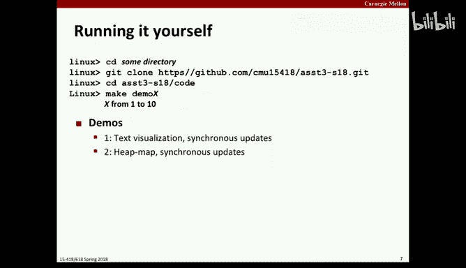
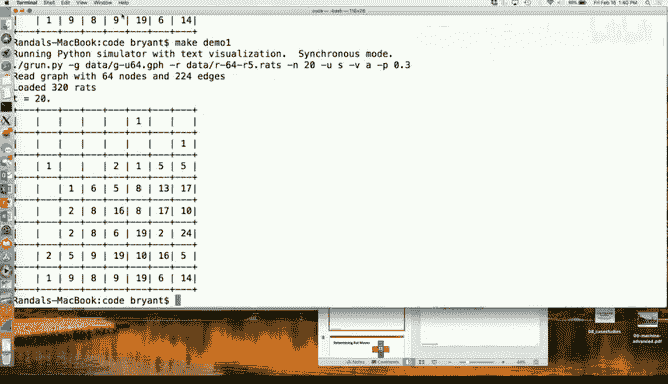
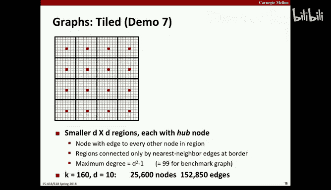
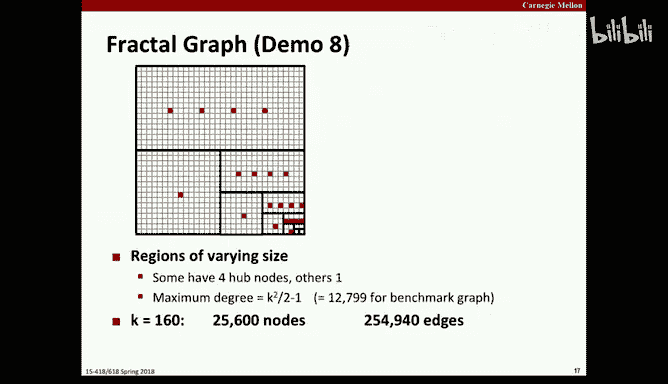
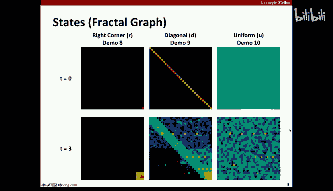
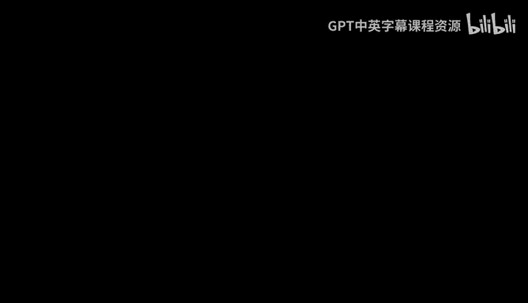
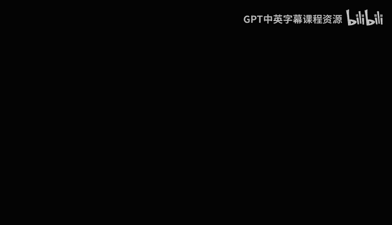
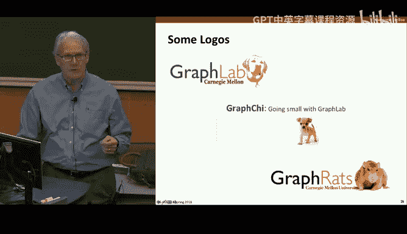

# 15：作业三介绍与稀疏数据结构 🐀

在本节课中，我们将介绍课程作业三。这是一个关于稀疏数据结构和图算法的并行化项目。我们将探讨如何优化一个模拟大量“老鼠”在迷宫中移动的程序，该程序涉及图、稀疏矩阵等概念。虽然问题本身是虚构的，但它能生成有趣的图形，并且其背后的计算类型与处理稀疏、不规则数据结构的许多现实世界问题所面临的并行挑战类似。

## 作业概览与时间安排 📅

作业三的截止日期是3月7日。虽然看起来时间充裕，但请注意中途还有一次考试。因此，部分时间需要用于备考。这意味着你应该尽早开始，而不是拖延到最后。

这个作业旨在探索涉及稀疏数据结构（如图、稀疏矩阵）的算法类型。你需要优化一个功能完整但运行缓慢的代码，既要提升其串行性能，也要提升其并行性能。在现实世界中，优化串行代码和并行化通常是协同进行的，因为某些针对串行优化的设计选择会影响到并行化的效果和可扩展性。

我们将使用多核处理器和OpenMP标准来表达并行计算，这部分内容将在后续的课程中详细讲解。

## 模拟程序：老鼠走迷宫 🧩

让我们来了解一下这个应用程序。想象你有很多老鼠和一个迷宫，迷宫结构用一个图来表示。最简单的图是一个K×K的方形网格，每个节点只与最近的邻居相连。

初始时，所有老鼠都被放置在右下角。然后进行一系列迭代。在每次迭代中，每只老鼠选择下一步的去向：可以留在原地，也可以移动到相邻的位置（由图中的边表示）。

老鼠的选择基于一个奖励函数。这个函数模拟了老鼠的偏好：它们不喜欢过于拥挤，但也不喜欢过于孤单。因此，每只老鼠会根据当前各个位置的老鼠数量（负载因子）计算奖励值，然后根据这些奖励值作为权重，随机选择下一个位置。

### 可视化表示

我们不需要跟踪每只具体的老鼠，因为所有老鼠的偏好是相同的。为了可视化，我们只需要记录每个网格中有多少只老鼠。

最初，我们可以用文本字符来可视化。例如，用不同字符密度表示老鼠数量。运行多个迭代后，老鼠会从角落扩散开来，但由于它们不喜欢过于孤单，扩散速度会受到限制。

为了让可视化更有趣，我们使用热图。热图是一种标准的数据可视化技术，使用从紫色到红色的光谱来表示数值大小。在这里，黑色表示没有老鼠，深紫色表示有少量老鼠，绿色、蓝色表示中等数量，而红色、橙色则表示数量很多。

### 核心计算：奖励函数与随机选择

上一节我们介绍了模拟的基本规则，本节中我们来看看核心的计算过程。假设一只老鼠在网格的某个位置，它有五个潜在目的地：原地不动、向上、向下、向左、向右。

它通过以下**公式**计算每个目的地的奖励值：

`reward = 1.0 / (1.0 + alpha * (log(load_factor / L_star))^2)`

其中：
*   `load_factor` = 该位置老鼠数量 / 全图平均老鼠数量
*   `L_star` 是理想负载因子（例如1.5），表示老鼠喜欢比平均水平稍大的群体。
*   `alpha` 是一个调整参数（例如0.5）。

这个函数的设计使得在理想负载`L_star`时奖励为1，当负载因子为0（空位置）时奖励约为0.5，并且随着负载因子变得非常大，奖励值会缓慢衰减而非骤降，这确保了即使初始时大量老鼠聚集在一点，它们也有非零的概率选择移动。

计算完五个目的地的奖励值后，将它们归一化为权重区间。然后生成一个`[0, total_weight)`之间的均匀随机数，根据该随机数落在哪个权重区间来决定最终去向。

一个重要的特性是：整个程序是**完全确定性的**。所有随机数生成都基于可预测的种子值。因此，每次运行都会产生完全相同的老鼠移动序列和节点计数。这为正确性验证提供了便利。

## 更新模式：同步、顺序与批次 🔄

在上一节我们了解了单只老鼠如何做决策，本节中我们来看看如何组织所有老鼠的更新顺序。这会影响模拟的行为和并行潜力。

主要有三种更新模式：
1.  **同步模式**：计算所有老鼠的下一步移动（基于当前全局状态），然后让所有老鼠同时移动。这会导致“振荡”现象，因为老鼠们会集体从一个拥挤点移动到另一个点，留下一个空点，如此反复，形成棋盘状的不稳定图案。
2.  **老鼠顺序模式**：老鼠0先观察、决策并移动，然后老鼠1基于新的状态（包含了老鼠0的移动结果）进行决策，依此类推。这能产生更平滑、合理的扩散，但**完全没有并行性**，因为每一步都严格依赖前一步。
3.  **批次模式**：这是前两种模式的折衷。将老鼠分成小批次（例如占总数的2%）。在一个批次内，所有老鼠基于同一状态计算并决策，然后同时移动。接着下一个批次再基于更新后的状态进行。批次大小是一个可调参数。同步模式相当于批次大小等于老鼠总数，顺序模式相当于批次大小为1。

对于本作业，你需要优化**同步模式**和**批次模式**的性能。同步模式虽然行为不太“真实”，但更容易优化和并行化。

## 程序实现与数据结构 💻

现在我们已经理解了模拟的逻辑，本节中我们来看看它的代码实现和核心数据结构。

程序有两种实现：Python版本和C语言版本。Python版本功能完整但速度慢，用于验证和可视化。C语言版本是性能优化的对象，其输出可以被Python程序读取并生成热图。

图使用一种称为**压缩稀疏行**的常见数据结构来表示。对于一个有N个节点、M条边的图：
*   `neighbors`: 一个长度为`N + M`的数组，按节点顺序连续存储每个节点的所有邻居边（包括自循环边）。对于每个节点，其邻居列表的第一个元素总是它自己。
*   `neighbor_start`: 一个长度为`N + 1`的数组，记录每个节点的邻居列表在`neighbors`数组中的起始索引。`neighbor_start[N]`指向`neighbors`数组的末尾，这样方便计算任意节点`i`的邻居列表范围：从`neighbor_start[i]`到`neighbor_start[i+1]-1`。

这种表示法节省空间，并且能高效地访问任意节点的所有邻居。

程序的核心状态存储在一个`state_t`结构体中，包含所有老鼠的位置、每个节点的老鼠数量等信息。代码大量使用`static inline`辅助函数，鼓励编译器内联优化，同时保持代码可读性和可调试性。

### 性能瓶颈分析

给定的初始C代码性能很低。让我们分析一下原因。对于一只老鼠在某个节点的“下一步移动”计算：
1.  首先需要遍历该节点的所有D个邻居（包括自身），计算每个邻居的奖励值并求和。这需要D次奖励函数计算。
2.  然后，为了根据随机数做出选择，需要再次遍历邻居列表，累加奖励值直到超过随机数。平均需要遍历D/2次，并且每次都需要**重新计算**奖励函数，因为代码没有缓存第一次计算的结果。

因此，对于一只老鼠，平均需要进行大约 `D + D/2 = 1.5D` 次奖励函数计算。如果有多只老鼠（比如X只）位于同一个节点（例如枢纽节点），它们会**重复进行完全相同的奖励值计算**，因为节点负载在批次内尚未改变。这造成了巨大的计算冗余。

此外，对于像分形图中度数高达12000的枢纽节点，`D/2`可能达到6000，使得线性搜索效率很低。

优化的方向包括：缓存中间计算结果、使用更高效的搜索方法（如二分查找，如果权重可以预处理）、以及利用并行性。

## 图结构：网格、瓦片与分形 🗺️

之前的例子都基于简单的网格图，本节中我们来看看作业中使用的更复杂、更不规则的图结构，它们会带来不同的计算挑战。

1.  **网格图**：规则的四邻接网格。非常规则、稀疏，局部性强。易于分区和并行。
2.  **瓦片图**：在网格图基础上，将图划分为若干区域。每个区域有一个“枢纽节点”，该节点连接到区域内**所有**其他节点。这引入了节点度数的差异：普通节点度数约为5，而枢纽节点度数可能很高（例如，如果区域大小为10×10，则枢纽节点度数为99）。这导致了负载的不均匀，枢纽节点往往会聚集更多老鼠。
3.  **分形图**：结构更复杂，递归地将区域细分。每个子矩形有自己的枢纽节点。这产生了极大的度数差异：一些顶层枢纽节点可能连接到图中超过一半的节点（度数超过12000），而大多数节点度数仍然很小。这种图非常不规则，老鼠可以通过枢纽节点快速进行长距离移动，对数据局部性和负载平衡提出了挑战。

作业的基准测试将使用这些不同的图结构，以及不同的老鼠初始分布（全部在角落、沿对角线均匀分布、在全图均匀分布），以全面评估你的优化效果。

## 性能目标与测量 🎯

我们使用“兆鼠移动每秒”作为性能指标：

`MegaRat Moves/sec = (R * S) / (T * 10^6)`

其中R是老鼠数量，S是模拟步数，T是运行时间（秒）。

你将针对同步模式和批次模式，在多个图结构和初始分布的组合上运行基准测试。最终成绩将基于六个性能数字：同步模式和批次模式各自在三个不同难度基准上的“兆鼠移动每秒”的几何平均值。

给定的初始代码性能很低，尤其是在分形图上。优化目标基于课程讲师所能达到的性能设定。值得注意的是，一些优化在提升串行性能的同时，可能会降低并行加速比，但总体性能（运行时间）仍然是提升的。

## 开发建议与工具 🛠️

以下是一些帮助你高效完成作业的建议：

*   **尽早开始**：先着手优化串行性能，同时思考这些改动对并行化的影响。
*   **性能分析**：使用简单的计时库（如提供的`cycle.h`）在代码中插入计时点，对不同计算阶段（如下一移动计算、老鼠移动更新）进行剖析。这能帮助你准确定位性能瓶颈，无论是串行还是并行部分。
*   **开发环境**：你可以在任何机器（如个人电脑、GHC集群）上进行代码开发和串行优化。但为了获得稳定、可重复的并行性能测量，最终测试将在专用的“Late Day”集群上进行。请使用作业说明中描述的批处理技术在该集群上定期进行基准测试。
*   **正确性验证**：务必使用提供的回归测试工具。它比较你的C代码输出与Python参考实现的输出。虽然它只测试一些小规模用例，但你应该确保程序在所有情况下功能正确。你可以修改测试文件以添加更多测试用例。
*   **优化思路**：
    *   缓存重复计算（如节点的奖励值）。
    *   考虑使用更高效的数据结构或算法来替代线性搜索。
    *   利用OpenMP指令将计算任务分配到多个核心。并行化的机会可能存在于：跨不同老鼠、跨不同图节点、甚至跨节点的不同邻居边。

## 总结 📝

本节课中我们一起学习了作业三的完整内容。我们介绍了一个模拟大量老鼠在图上扩散的应用程序，其核心涉及基于奖励函数的随机决策和稀疏图数据结构。我们探讨了三种更新模式（同步、顺序、批次）及其影响，并分析了程序实现中的性能瓶颈。我们还了解了将使用的不同图结构（网格、瓦片、分形）带来的挑战。最后，我们明确了性能测量方法，并给出了开始优化和并行化的实用建议。记住，关键在于结合串行优化与并行化策略，并始终通过性能剖析和回归测试来指导你的工作。祝你编码愉快！