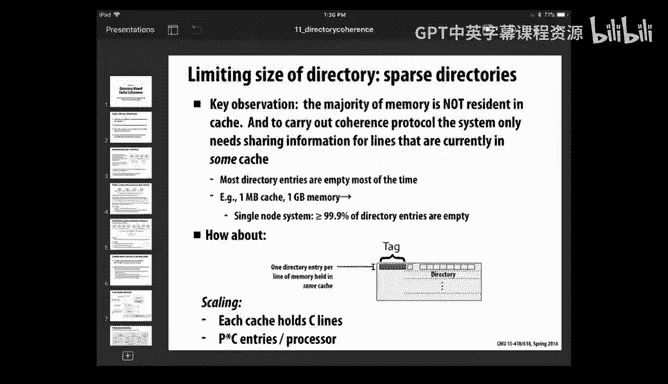

# 16：目录一致性协议 🧠

在本节课中，我们将要学习缓存一致性协议中的另一个重要概念——目录一致性协议。我们将探讨它如何解决监听协议的可扩展性问题，并了解其在真实硬件系统中的实现方式。

## 概述

上一节我们介绍了监听协议及其局限性，特别是总线通信成为系统瓶颈的问题。本节中，我们来看看一种旨在克服这些限制的新方案：目录一致性协议。

## 伪共享问题回顾

在深入新内容之前，我们先回顾一个关键概念。上周三我们讨论了伪共享问题。这是程序员在使用任何共享内存、共享缓存系统时，最需要理解的事情之一。

伪共享发生在以下情况：程序中的数据块恰好位于同一个缓存行内，但它们被不同核心上的不同进程使用。结果是，它们开始互相争夺这些数据。假设数据是可写的，并且它们都在读写独立的计数器。原则上，这些是完全独立的操作，各自的L1缓存可以加载这些值，系统本应高效运行。但由于它们恰好分配在同一个块内，缓存系统认为这就像需要为每个值提供独占访问一样，因此它们会陷入协议争夺。你看到了保持数据可写、无法共享时会有多大的开销。这会导致性能急剧下降，在现实中你会看到这种情况。

以下是一个例子。想象一个Pthreads示例。我们分配一个与线程数相同大小的计数器数组。然后每个线程独立地递增自己的计数器。另一个版本是，我分配一个计数器数组，但我会用一些内存填充每个计数器，使它们落在不同的缓存行中。在第一种情况下，所有计数器都会落入单个缓存行，存在严重的伪共享，它们不得不为这一行互相争夺。在第二种情况下，每个计数器都有自己的独立行，内存系统将它们各自映射到自己的缓存中，它们都能高效运行。在现实中，你可以看到在一个12核机器上，一种情况耗时5秒，另一种情况耗时2秒。这实际上是一个相对温和的版本，情况可能更糟。所以，如果你不理解这一点，缓存行大小这个特性可能会让你措手不及。你可以编写看起来没问题的代码，代码中甚至不需要同步，但问题是你基本上是在与整个缓存内存系统对抗或误用它。

就像图中所示，典型情况是有一个缓存行跨越了分配给两个不同进程的内存。这也是为什么在之前的例子中，我们讨论了那种四维内存布局，以确保每个处理器获得一个连续的地址范围。这样做的好处之一是保证避免伪共享，因为伪共享最多只会出现在这个范围的端点处，与每一行都出现伪共享相比，影响要小得多。因此，在编程时，即使没有涉及同步，你也需要理解这类问题。

以上就是上周三讲座的内容。我只是想确保你们看到了这一点。

## 目录一致性协议简介

现在让我们继续。我们来探讨一种新型的缓存内存系统，它试图克服监听协议的一些限制。

那么限制是什么？问题在于可扩展性。在监听协议中，每次缓存中发生一些关键操作时，它都必须广播给所有其他缓存。只要只有半打左右的缓存在监听，这没问题。但当你试图扩展到更大规模时，就会达到一个点，通信流量变得过大，总线通信成为整个系统的中心瓶颈。

目录一致性的思想是尝试提升一个层次，提供一个更接近点对点的解决方案，其中通信只发生在持有数据的处理器和需要数据的处理器之间。这是理想情况。我们将看几种不同的方案，并详细了解它如何在一些你可能在本课程或其他地方遇到的机器上实际实现。你会发现，就像现实世界中的一切一样，它们从不使用任何方案的简单版本，而是使用层次结构，使得小规模示例可以轻松运行，并在系统规模扩大时采用更复杂的解决方案。

正如我上次所说，总线协议的问题是，这些本地缓存都必须通信流量。如果其中一个想要访问某些数据，它必须在总线上发出请求，说明它想要独占读取或非独占读取。然后，如果其中一个想要将其副本升级为只写，它必须广播出去并使其他副本无效。基本上，问题是这个互连结构承载了非常重的流量。在最简单的版本中，互连实际上只是一条总线。总线在此上下文中意味着一组共享的导线，每个人都可以访问。如果有人将一些数据放在上面，那么所有人都会看到该事务并能够接收它。可以把它看作一个中央通信点，所有发送和接收的消息都在这里。在一些更复杂的情况下，它实际上是一个小型网络，通常是一个环，可以在这些元素之间循环传递消息。这样，消息不一定需要绕一整圈，它可以从源跳到目的地，平均而言，你预计它走大约半圈。总线的优势更多在于吞吐量而非延迟，这意味着可以有多个消息在这些环上传输，只为消息提供更多吞吐量，但你仍然会遇到可能变得非常拥堵的问题。想象一下，互连结构就是所有信息被存放的源头，这会变得非常混乱。

## NUMA架构与层次化设计

在典型系统中，内存不是一个单一的、位于别处的RAM块。它实际上被分区，每个处理器都有一个独立的内存控制器。这样做的部分原因是为了可扩展性，公司希望能够销售可以按块、按块部署的产品。如果你每个块都有一个独立的内存控制器，那么你就可以根据预算订购尽可能多的块，而不必物理上构建一个单独的内存系统。这有时被称为NUMA机器，即非均匀内存访问，因为处理器读取和写入其本地内存比访问远程内存更快。

对于本次介绍，我们将把处理器视为单核。实际上，在现实世界中，每个处理器本身都是一个多核处理器，具有潜在的本地缓存，它们通过某种总线协议（监听协议）相互通信，然后它们通过像这样的互连结构，使用基于目录的协议，与更大的处理器集群进行全局通信。你会看到一些真实的例子。目前，我们将其视为这种非常简单的扁平结构，但在现实世界中，事物往往是层次化的。

这有时被称为缓存一致性NUMA，意味着我们试图为程序员提供单一全局共享内存的假象。缓存的行为就好像这是一个公共内存引用，当一个写入时，另一个可以读取该数据。

## 目录协议的基本思想

这个方案的一个版本是采用互连的思想，使其更像一棵树。其思想是，任何可以本地化到互连顶层（例如处理器）的流量，如果所有者就在那里，那么读取请求可以在本地总线上得到满足。但如果所有者在这里，而读取者在那里，那么它就必须通过全局层次结构、树状层次结构来发出请求。这个相当常见的想法是，你尝试使用树状结构来减少中心部分的拥塞。但在最坏的情况下，如果你的工作负载在内存流量方面没有很好地分区，那么树的根部就会成为瓶颈。你可以想象这在NUMA设置中也能很好地工作，其中内存不是在这里，而是被分割成块，这样就有更多情况可以从这种本地化中受益。

但我们现在要看的是，想象一种情况，你想要一个扁平结构，其中有多个处理器，每个处理器都能访问内存，内存在处理器之间分区，并且我们希望能够进行全局缓存一致性访问，我们将使用目录的思想。

目录是一种信息，用于跟踪哪些处理器拥有给定数据块的副本，以便在需要读取时可以从所有者那里访问，在需要使其无效时，可以只向拥有该副本的处理器发送无效消息，而不必广播。

## 简单目录协议示例

让我们看一个非常简单的版本。想象我有一个处理器，它拥有整个内存空间的一部分。将内存想象成像缓存一样组织成块或行。行是内存中某个块的连续组，比如64字节。逻辑上，你可以将内存地址划分为这些64字节的块，我称之为内存行。我们要做的是为此添加一个目录，对于内存中每一个可能的行（可能有很多），它都有一组位，每个可能的处理器都有一个位，还有一个位表示该行的状态，是脏的还是干净的。这个位向量将说明P个可能的处理器中，哪些在其缓存中拥有这个特定数据行的副本（我们只考虑单级缓存）。然后，你可以想象这样做，整体设计的思路就清晰了。

例如，我们将为每64字节内存定义其主节点，即它存储在P个不同内存中的哪一个。这是内存空间中的最终目的地，可能与数据实际被使用的位置完全无关，但它是整个系统中该部分内存的所在位置。然后，我们将使用术语请求节点，表示想要读取或写入此特定数据块的某个其他处理器。

最简单的情况是读取缺失且该行是干净的。假设这里内存由处理器1拥有，处理器0想要读取它。处理器0会意识到自己没有副本，查看其地址并确定它由处理器1拥有。然后它会发送一条消息，即读取请求：“嘿，我想读取这个数据。”然后处理器1会回应：“好的，这是你的副本。”并会在该特定内存行的位向量的适当位置标记处理器0拥有一个副本。

如果该行是脏的，情况就有点棘手了。想象处理器0发出读取请求，并将其发送给处理器1，因为这是该特定内存位置的主节点。处理器1会说：“哦，有效的副本正由处理器2持有。”现在你可以想象各种场景。但其中一个版本是，处理器1只是回应处理器0说：“哦，抱歉，去问Bob要这个内存。”同时，它会标记……实际上它还没有做。抱歉，这个位是脏位。现在发生的情况是，处理器2……在这个协议版本中（这个想法有各种变体），现在处理器0会说：“嘿，我听说你有这个内存位置。能给我一个副本吗？”处理器2可以直接回应处理器0。在这种情况下，由于我们假设这种属性，即如果存在干净的、可共享的副本，内存将持有该副本。所以会发生的情况是，处理器2……抱歉，是处理器2……也会回应拥有该行的处理器（处理器1）说：“这是副本。我释放它。现在它只是一个共享的可读副本。”因此，我们会将这个位标记为干净，但我们会放入两个共享者，即它由处理器0和2共享。

你可以了解基本思路。让我们再看几个案例。假设处理器3想要写入它，并且它没有副本。假设在这种情况下，它是干净的，但有两个未完成的副本，一个在处理器1，一个在处理器2。同样，你可以想象各种变体。一个版本是，首先处理器0说：“嘿，我想写入这个位置。”并将其发送给拥有该位置的处理器。它会回应一个列表或位向量，说明谁共享这些数据。在这种情况下，由于它是干净的，它也能够回应当前数据是什么。然后在这个版本中，处理器0将负责使其无效，但它可以只向那些拥有此副本的处理器发送无效请求，而不必广播给整个系统。然后它现在拥有……你会看到，它等待直到从这两个处理器收到确认，这样它就不会超前于方案。就像我们之前在写无效协议中看到的那样，你必须确保无效已经发生，这样你就不会让处理器1和2超前访问你想要标记为无效的内存位置。所以，这是一个通用的方案，处理器0会等待直到收到两个确认，然后再继续。现在所有者已将其标记为脏，并由处理器0持有。

## 协议正确性与挑战

一个关键问题是，你必须说服自己这个协议可以工作，你要避免两个处理器都想写入的情况。由于协议中的某种竞争条件，它们都认为自己拥有可写副本，从而把事情搞乱。这就是为什么这些协议的细节变得相当复杂。在这个简单版本中，我们假设处理器0会继续并告知它确实收到了其他处理器放弃其副本的消息。你必须确保在此期间，没有其他进程发送请求、获取信息并认为自己将获得副本。这涉及到在这些地方有适当的队列，以便事情不会超前。处理器1是所有者，但它没有副本。它会先获取它，然后之后使其无效吗？所以你的意思是，如果这些……我想你的意思是？处理器0是所有者，但它没有副本。处理器1是另一个共享者，它持有副本。但这种情况仍然可能发生。是的，那将是……我们没有讨论这种情况，但这是一个很好的例子。基本上，是对脏行的写入缺失，对吗？所以情况是，它被其他地方拥有，因此处理器1无法提供数据。你必须在协议中增加另一个步骤，说：“首先，我发送到这里。然后它会回来，但它会说：‘哦，那实际上在处理器3的缓存里。’”或者两个缓存。它会说它在那里。顺便说一下，如果它是可写的，如果它不能从主节点获得，这意味着它是一个未共享的可写副本。好消息是，现在处理器1可以发出一条消息说：“把它给我。”意思是释放你的副本并把值给我。处理器1可以提供但需要内存来存储……处理器2的缓存可能有这个值。是的，你可以想象，就像我们之前在一些协议中看到的，你可以加速某些情况，即不访问内存，而是从其他地方找到一个可用的副本。在这个版本中，我保持简单，说如果是读取，我们保持缓存一致，保持一个可读副本；只有在有人拥有独占访问权的情况下才让其分离。所以你可以想象这个协议的扩展，说我想玩所有这些技巧，这样我就不必总是写回内存，除非真的需要。所有这些只是让协议更复杂。就像我说的，当涉及到分离事务时，情况也变得复杂，即你开始做某事，然后在得到响应之前，中间可以有其他流量。所以这些协议在现实生活中变得非常、非常复杂。我只是向你展示最基本的版本。但这些都是非常好的问题，你可以想象想要调整它。

## 目录协议的优势与开销

目录协议的好消息是它们减少了总线流量。它们使其更加点对点。例如，如果有256个处理器，但只有一个副本在外面，那么我可以只向那一个处理器发送无效消息。因此，对于共享者数量相当少的情况（这相当常见），你可以大大减少流量。如果有很多共享者，那么与广播协议相比，它不会真正为你节省什么，在广播协议中你只是广播。

这是一些来自伯克利Coor及其同事的教科书的统计数据，他们采用了你之前见过的基准测试，并统计了共享者数量的分布。当然，你会发现，在这些情况下，前两个基准测试中，大约80-90%的情况下只有一个副本在外面。在这个Barnes-Hut基准测试中情况不太好，48%是单个共享者，其他情况是多个共享者。然后你会看到一个分布，至少在这种情况下，它们下降得相当快。LU基准测试甚至更明显。我试图弄清楚“零个副本”是什么意思。共享者数量……在……的时候。所以我相信实际上，抱歉我弄错了，零意味着它是私有副本，一意味着有另一个共享者。所以至少在这种情况下，我认为他们只是对共享全局数据进行基准测试，表明在写入时，有另一个副本在外面需要使其无效，就像一个你不断写入的共享缓冲区。所以那实际上意味着存在共享数据。但这里超过一个共享者的情况下降了很多，除了Barnes-Hut。Barnes-Hut的问题在于，你记得它的四叉树结构意味着你经常需要上下遍历树的顶层，因此这些数据往往被大量共享，不过幸运的是，很多流量是只读流量。所以你可以想象，如果你考虑典型程序，你可以想到一些访问模式，并思考这个方案或任何这些方案对这些模式会如何。我们可以定性地做，也可以尝试进行真实的基准测试来看看会发生什么。

很多情况是你所说的主要是只读数据，意味着数据如果被写入，相对罕见。例如，这个Barnes-Hut有很多共享，但很多时间只是上下遍历这棵树，追踪指针而不实际修改任何数据。因为你记得，数据实际上保存在叶子中，树结构更多是如何获取数据的组织结构。

另一类是迁移数据。这就像一个缓冲区，一个处理器写入它，发送信号说“嘿，有一些数据”，然后另一个处理器会读取它。所以我们称之为迁移数据，即在一个地方有一长串写入，然后是一长串读取。顺便说一下，主要是只读的情况在任何合理的缓存方案中都很容易处理，每个人最终都会将干净的副本加载到他们的L1缓存中，并从整个内存系统中获得最大收益。无论采用哪种方案，所有这些方案都会运行良好。迁移数据，你可以看到，对于……的情况运行良好。你进行一堆写入，所以它基本上会移动到写入者的本地缓存中。然后另一端开始读取它，它只会获取副本并将其带回。所以可能有很多流量来进行实际传输，但相对于其他操作，这是一次性操作。所以这些是简单的情况。更有问题的是那些有很多读写的情况。

一个例子是某些被频繁读写的数据。你会看到的是，它往往会移动。想象不同的处理器都在尝试更新，比如一些数据集合，比如计数器之类的。那么会发生的情况是，它会不断跳来跳去。唯一的好消息是，共享者的数量没有机会积累太多。所以在基于目录的方案中，可能拥有其副本的数量实际上保持相当小，因为它们都在互相争夺它。在……之前，你可以积累很多共享者，它通常已经移动到其他地方，并且所有副本都已被无效。所以与总线协议相比，这对于基于目录的协议来说实际上不是一个糟糕的场景。这意味着无效流量的数量将更成比例……它将涉及大量广播。

低竞争锁也不是真正的问题，因为锁的实现通常是一个变量，一个标志，其他处理器在其上自旋，意味着它们不断读取它并等待。然后一旦它被一个处理器获取，它们会看到那个版本，并尝试用一些其他内置的同步来获取它，以防止在多个地方发生这种情况。那么发生的情况是，如果锁被持有很长时间，标志值将迁移到在其上自旋的各个缓存中，它们只会进行本地读取，这不是问题。然后发生写入时，它会使所有副本无效。第一个能够获取那个……副本的处理器将……所以只要竞争不激烈，这不是什么坏事，缓存系统实际上运行得相当好，你最终会得到很多它的共享副本。所以如果有很多……，目录并没有真正帮助你那么多。但这并不经常发生，所以不是什么大问题。你可以想象，糟糕的情况是高竞争块，你最终有很多处理器在等待。突然它改变了，其中一个获取了它，然后它们都自旋，很多在等待，所以你会得到相当多的流量，因为这种情况经常发生，并且有很多共享者，因为所有等待这个锁的进程都会有自己的副本。所以，那种情况。如果真的有大量共享者，那么目录协议相对于全局广播协议的优势就相当小了。

## 目录存储开销与优化方案

我们目前定义的方案最大的问题是它需要太多内存。因为在我的版本中，我为每64字节内存（无论数字是多少）分配了一个目录条目。不是缓存，而是内存。让我们计算一些数字。假设有2^26个处理器共享它，那么这个位向量有多大？如果我有256位，那是多少字节？有64字节。换句话说，我的位向量占用的字节数和我拥有的数据一样多。我几乎使内存需求翻倍，并且我假设每个内存行都有一个这样的条目，而不是缓存中的每一行。所以无论我的内存是多少，比如32GB内存，我还必须购买32GB内存来存放所有这些目录位。而且我不希望它是慢速的DRAM。这个东西必须相当快，所以显然这不是一个实际可行的好方案。

谁能想到减少内存需求的方法？特别是，如果该行不在任何缓存中，这些向量中的值会是什么？全是零。想想典型系统中的数字，即使是一个大缓存，比如20MB，那已经很大了。而内存可能是32GB，通常在更大规模的系统上甚至更多。所以你拥有的缓存数量实际上远少于内存。想象一下，但如果我们想为整个系统提供足够的目录空间，就内存访问模式而言，最坏情况的分布是什么？是的，正是。你知道，有处理器0的副本，处理器1和处理器2等也有副本，每个处理器有多少？每个处理器都有其整个缓存，其中充满了由该特定进程拥有的地址。但这仍然是数字，是P乘以总数。所以即使我们想象这是20MB，很多，并且我们有1024个处理器，那仍然是……我们回到了我们的问题，我们真的有20GB的共享缓存……所以可能这个数字并没有真正给你带来多大好处，但你可以想象这样的场景，你基本上只有足够的数据在某个缓存中的目录条目。

另一个方案是增加我的……行大小。我们将看到的是增加层次级别，所以即使我有100个处理器，我也不尝试用1000个目录条目来实现，而是使用层次化方案来减少数量，我们将在现实生活中看到这一点。但我们将看另一个方案。实际上，我们只看其中一个。我删除了另一个。所以一个版本是说，看，我的共享者数量实际上相当小。所以我真的不需要分配跟踪可能拥有此副本的每个处理器的最坏情况。我可以减少它，说我将允许最多五个共享副本，并保留一个列表说明这些共享者是谁。但如果超过这个数量，那么我将退回到广播协议。如果你计算数字，五不是一个好数字，对吗？如果我想说五个不同缓存的地址，那需要多少位？在一个1024处理器的系统中，每个是10位，所以5个是50位，这比1024位少得多。这至少是有些希望的，因为正如我们所见，通常你只有非常少的共享副本，或者你可以假设它是无限的，你需要告诉每个人所有事情，你仍然可以想象减少大量的总线流量，如果你只处理这种常见情况并使其回退。所以这是一种有回退的方案，说我总是可以回退到广播。

你可以想象的另一个方案是粗粒度向量，说……你可以想象各种不同的方案，所以你可以说，哦，另一件事是你可以人为地限制某些数据的共享者数量，就像缓存总是说，看，如果缓存中没有空间，我将驱逐某人。所以你可以说，看，我达到了最大共享者数量，其中一个必须离开，你会向最近最少使用的副本发送无效消息。所以你可以想象其他方案，这也适用于我之前描述的那个方案，即你只有足够用于缓存数据的目录条目，你只是限制它，说，嘿，如果来自这个特定内存的数据太多，被分散到各个缓存中，我将限制它，说这就像容量缺失，但不是数据本身的容量，而是你跟踪其方式的能力。

所以在这个领域，你可以想象各种方案来处理至少……通常，在所有系统设计中，特别是在硬件设计中，存在成本效益权衡，你基本上要弄清楚典型工作负载是什么，并确保那些简单且重要的案例得到良好处理，然后你有一些回退机制来处理不太常见的情况，只是让它们以较低效的方式处理。当然，这样做的风险是，一些不知情的程序员可能不知道运行快和运行慢之间的分界线在哪里，通过程序的一些小改动，突然性能变得非常差。这是一个现实生活中的考虑因素，除非你知道这里内部设计发生了什么，否则作为程序员很难真正知道。

## 稀疏目录与消息优化

哦，这实际上已经讲到了我刚刚谈到的，我们称之为稀疏目录。所以一个系统，你只对某些缓存中持有的数据有目录，基本上每个……所以另一种理想的减少是减少在这些协议期间发送的消息数量。因为消息在两个方面是坏的：一是它们的流量，二是如果有一长串消息，往往会增加延迟。

让我们看几个例子，在之前讨论的版本中，你可能能够做到这一点。我们有一个对脏行的读取缺失。你看到发生的情况是处理器1并没有做太多，它只是回应请求者说：“嘿，这是你需要的信息，现在清理这个烂摊子是你的责任了。”但你可以想象一个版本，其中处理器1承担起责任来启动这个过程。所以它会立即向数据所在的处理器2发送消息，说：“嘿，把你的副本给我。”这是读取还是写入？读取。“把你的副本给我，顺便标记你自己的本地副本。”然后它可以回应原始进程，或者在某些场景下，处理器2会回应两个地方。这取决于你的目标是最小化消息数量还是最小化延迟，因为在这个版本中，它仍然需要两跳……之前它总共需要4跳。所以无论如何，你可以想象其他各种方式，其中所有者、请求者和响应者在每个步骤中相互通信，以尝试要么最小化总步骤数、流量，要么最小化其中最长的步骤链，这将决定延迟。

## 真实硬件案例：现代Intel处理器

让我们看一些真实的案例。这基本上就是你在GHC机器或现代Intel处理器中的等待日机器上看到的。正如我们之前所说，这些都具有多级缓存的特性，只有最外层缓存实际上是共享的。正如这些虚线所示，在物理设计方面，内存实际上被分区。内存控制器被分区……抱歉，L3缓存被分区。在核心之间，所以当你访问L3缓存时，它们实际上会通信，这就是我们设计中一直所说的内存，对吧？那是共享部分。L1和L2缓存是我们的私有副本，所以正如我们所见，很多流量可以只停留在这两个缓存中。有趣的是，如果存在一些共享，并且必须出去交叉并返回。所以与之前相比，这已经是某种形式的层次结构，它减少了总流量。当我们讨论跟踪谁负责时，现在协议的实际共享发生在这个级别，在大多数情况下，它是一个简单的环通信和监听协议。但可能发生的情况是，比如等待日机器。我不确定JHC机器。等待日机器是所谓的多插槽机器。这意味着有两个物理芯片，每个都是一个完整的至强处理器，就像我们在这里看到的一样。然后它们被连接在一起，以在它们各自的L3缓存之间提供一致性。所以在每一侧都有一个叫做主代理的东西。你可以把主代理看作是代表所有这些结构行事，并调解所有由于内存访问模式而必须从一侧跨越到另一侧的读写请求，因为地址命中了不同的部分。它们没有……我认为没有太多细节可用，但它可能是一个相当简单的基于目录的协议，因为在某些情况下共享者并不多，你可以最多连接四个或八个这样的插槽。你可以把它们放在一起，但共享者的总数并不巨大。所以之前我们讨论的P是256或1024，逻辑上这里的P更接近2、4或8。所以再次强调，层次结构可以产生很大的不同，但它依赖于我的内存访问模式往往非常本地化，如果有很多全局流量，我仍然可能遇到一些相当糟糕的情况。

我们上次提到，这些缓存的一个属性是所谓的包含属性，意味着任何在L1缓存中的东西也在L2缓存中。好消息是，这意味着L2缓存可以在这些协议中交互，可以确切地知道当某些总线流量在这个互连上经过并说“有人有这个的副本吗”时，它知道。这不是默认行为，如果你不特别维护该属性，你可以很容易地设想L1会获得那些已从L2逐出的只读副本，因此它们必须强制在缓存上施加该属性。不过，我刚刚读到，Intel下一代处理器将不再具有该属性，它将允许这种非包含属性，他们没有提供任何技术描述说明如何实现，但可能必须有更多逻辑来跟踪，以便在这个级别（L2和L3之间的调解，这是第一次共享发生的地方）能够正确工作。所以无论如何，这里的要点是，这些目录方案确实被使用，但它们只用在层次结构的较上层，以减少处理器的总数，从而使这些位向量中所需的位数可以大幅减少，不成问题。然后你还会看到它是一个缓存，它只有足够的目录条目，并不是每个可能的内存行都有一个，它只有……是的，类似地，它只对那些有共享副本、某个缓存中有副本的行保持这些条目处于活动状态。

## 另一种架构：Intel Xeon Phi

还有另一种非常不同的处理器。那实际上是等待日处理器。有14个这样的东西，叫做至强融核，连接到等待日处理器。至强融核是Intel试图与NVIDIA竞争高端计算的产物。其思想是提供一个他们称之为众核系统，意味着在单个芯片上有许多x86核心，并在所有这些核心之间提供缓存一致的内存接口。我们可以访问的版本有点旧，是几年前的，它们有各种代号，我们拥有的机器叫做骑士角落机器。这些实际上类似于……实际上它们就是中国组装成名为天河一号的计算机的那些，多年来它一直是世界上最快计算机，现在它是第二或第三快的超级计算机。我认为它是第二，现在中国有另一个更快的，第三是瑞士实验室的一个，第四是美国的一个。中国在将原始计算能力投入系统方面已经超过了美国。无论如何，这是一个真实的东西，Intel不断完善这个想法，他们计划在美国使用的下一代超级计算机将基于某个版本的至强融核。有一个涉及IBM和NVIDIA的竞争方案。由能源部主导，有两个不同的并行竞争在进行。

那么它的思想是拥有60个左右的核心，全部连接在一起并保持内存一致性，这听起来更像这种可怕的情况，你必须想象……如果你使用基于目录的方案，你必须有一个相当大的目录。这些最初的处理器基于相当旧的设计，可以追溯到10多年前，他们所做的是为它们添加了向量单元。那是下一代，记得我告诉过你有AVX，然后是AVX2，他们没有转向AVX3，而是转向AVX 512。512是向量寄存器中的位数。没人真正关心有多少位，它们是字节，但512更有趣……512位。所以无论如何，它们被设计成每个处理器本身实际上是一个相当差的处理器，只是它有这些可以处理非常大深度的向量单元。

有趣的是，它使用处理器之间的环通信，并以此作为维护缓存一致性的方式。就像我们之前看到的，内存在物理上被分成不同的内存控制器，我认为总共四个或八个。你可以把它们看作是环上的点。这个环只是一个消息可以循环传递的地方，它们可以在缓存控制器或内存控制器之间传递。所以它们做的一件有趣的事情是，它们以此作为内存一致性实现的基础。好消息是，由于它都在一个芯片上，他们可以有一个相当宽的总线，一个64字节的数据总线，不是64位，是64字节。在这个芯片上运行的物理导线，连接它，所以你可以在这个环上获得非常高的带宽和相当低的延迟，因为都是……所以环的好处是，你可以通过发送一条绕整个环运行的消息来有效地进行广播，或者你可以进行更本地化的操作，只走到达目的地所需的距离。这个东西实际上是双向的，所以它可以向任一方向发送消息。

那么发生的情况是，协议看起来更像我们之前看到的全局协议，基于总线的协议，它可以发送形式为“我需要这个的副本”或“你必须使你的副本无效”的消息，这些消息在总线上、在环上发送，如果是无效消息，就绕一整圈；如果只是请求，它可以发出并希望它在附近，然后带着响应返回。所以，它们获得了一种全局行为，但希望某些情况可以更本地化。顺便说一下，这是第一代至强融核。现在你可以想象他们发现，嗯，这并不真的很好，试图让60个左右的核心都在这条总线上发送消息，即使它是一条非常宽的总线，也会产生巨大的流量，这是一个相当严重的瓶颈。我的理解是，他们在设计这个时做得并不出色。所以他们的新一代，叫做骑士登陆，将有一个所谓的网格，你可以通过先朝一个方向走，然后朝另一个方向走，将消息路由到任何两个地方。所以现在没有中央权威，没有简单的方法向每个人发送全局无效消息，因为一切都变成了点对点。这需要一个更复杂的机制，我实际上不知道他们具体如何处理。但可能基于某种类型的目录。所以它是某种基于目录的方案，但没有多少关于如何具体实现的细节可用。所以你看，目录一致性的思想是避免这种中心瓶颈，我称之为基于总线的协议，尽管它通常是某种环，一个中央权威，每个人都必须广播消息。但它带来了成本，实现起来并不容易，协议的复杂性可能相当高，并且你需要存储来跟踪这些的数据量可能相当大，所以正如你在现实生活中看到的，这些往往只在层次结构的较上层实现。

## 总结与课程应用

这将让你现在开始使用……做作业3时有所体会。你基本上会因为数据如此分散和随机，而做很多到处泵送数据的情况。本质上，想象一个完全随机的排列，如果你试图从一堆随机地址复制地址值，这样做将在这里产生巨大的流量。这肯定会限制程序性能，限制实际并行进程的数量。所以上周五我向你展示了我只能在这些程序上获得大约3.5倍的加速，我认为这是因为内存性能方面有太多的复杂性，无法获得更好的行为。所以提出了一个有趣的问题，你可以尝试重新组织事物、安排事物以增加局部性的方法，局部性在这些方面有很大的不同。

好的，这就是我今天要讲的全部内容。问题……争论……甚至没有。是的，你发现的问题，即使在这个方案中，这也是一个非常好的问题。就像我们用OMP或MPI或Pthreads编写程序。如果我们能知道哪个线程将映射到哪个核心，我们也许能够利用这一点，我们可以尝试以某种匹配的方式放置我们的数据。对于Pthreads，据我所知，你完全没有控制权。在OMP中，我认为……两者OMP和……是的，你可以添加一些控制。一般来说，OMP你会发现它倾向于将事物分成块，你可以对布局工作方式有一些控制。访问模式，你可以给出各种提示。这不容易做到，也不完全可靠，所以这些是人们总是想要调整程序时开始使用的技巧。好问题。好的，今天就到这里。

## 总结

本节课中我们一起学习了目录一致性协议，它是为了解决监听协议在可扩展性上的瓶颈而设计的。我们探讨了其基本思想，即通过目录跟踪数据块的共享状态，从而将广播通信转变为点对点通信，减少总线流量。我们分析了简单目录协议的工作流程、面临的挑战（如正确性保证和存储开销），并介绍了优化方案如稀疏目录和层次化设计。最后，我们通过现代Intel处理器和Xeon Phi架构的实例，了解了目录协议在真实硬件中的层次化应用。理解这些概念对于编写高效、可扩展的并行程序至关重要，尤其是在处理共享内存访问模式时。