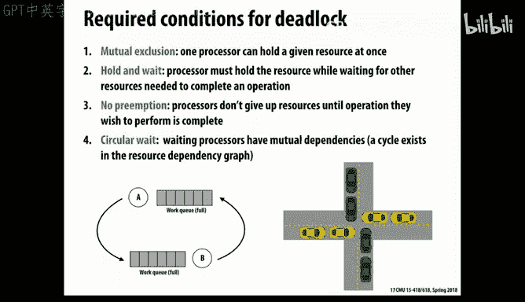

# 17：缓存一致性协议实现细节 🧠

在本节课中，我们将深入探讨总线型缓存一致性协议的具体实现细节。上一节我们介绍了目录型协议，本节中我们来看看总线型协议在实际实现中遇到的复杂问题。我们将了解如何确保协议的正确性，同时避免死锁、活锁和饥饿等问题，并理解现代总线（如拆分事务总线）的工作原理。

## 缓存状态机回顾

首先，让我们回顾一下作为许多实际缓存设计基础的MESI状态图。这个状态机为每个处理器的每个缓存行维护状态。

*   **无效**：缓存不持有该数据的有效副本。
*   **共享**：缓存持有一个干净的、只读的副本，且该数据可被共享。
*   **独占**：缓存持有一个干净的副本，并且知道它是唯一持有此数据的缓存。
*   **修改**：缓存持有一个“脏”副本，已被本地处理器写入，与主内存中的值不同。

状态转换由两种类型的操作触发：
*   **本地处理器请求**（图中黑色箭头）：处理器对该数据进行读写访问。
*   **系统其他部分请求**（图中蓝色箭头）：缓存控制器监听总线上的相干性流量，并据此调整本地状态。

## 多级缓存与包含属性

在实际系统中，我们面对的是多级缓存。相干性流量通常发生在连接核心与共享缓存（如L2）的互连层级。

为了确保L2缓存控制器能够正确监控和响应总线流量，它需要了解其下级L1缓存的内容和状态。这通常通过**包含属性**来实现：L1缓存中的内容是L2缓存内容的一个子集。这样，L2缓存就知道L1中有什么数据，以及这些数据是干净还是脏的。

以下是维护包含属性可能遇到的问题：
*   如果两级缓存都使用标准的LRU替换策略，可能会出现L1中活跃的数据块被L2驱逐的情况，从而破坏包含性。
*   因此，系统需要人为地强制执行包含策略。例如，当L2决定驱逐一个数据块时，它必须同时强制L1也驱逐该数据块。

包含属性也意味着外部总线流量可能需要向上传播到更高级别的缓存。例如，如果一个外部请求要求独占读取某个数据，而该数据在L2中处于共享状态，那么L2不仅需要将自己的副本置为无效，还需要通知L1缓存也将其副本置为无效。

## 并发系统常见问题

在设计此类并发系统时，我们会遇到几个经典问题：

**死锁**
死锁发生在多个代理需要同时持有多个资源，并且形成了一个循环等待的依赖环，导致所有代理都无法前进。避免死锁通常需要破坏其四个必要条件之一：互斥、持有并等待、不可抢占和循环等待。

**活锁**
活锁与死锁不同，系统并非停滞，而是各个代理在不断行动，但这些行动相互抵消，导致整体上没有进展。一个常见的解决方案是引入**指数退避**机制，即让代理在冲突后随机等待一段时间再重试，以打破同步振荡。

**饥饿**
饥饿是指系统整体有进展，但某个特定代理由于优先级不平衡等原因，始终无法获得所需资源而无法前进。解决方案是设计一个公平的调度或仲裁机制，例如使用轮询策略。

## 总线协议基础

为了简化初始讨论，我们假设：
1.  每个处理器一次只能发出一个内存请求，必须完成该事务后才能发出下一个。
2.  使用简单的写回缓存，暂不考虑多级缓存。
3.  缓存可以通知处理器在它处理总线流量时暂停。
4.  总线事务是**原子的**：一旦一个消息出现在总线上，它所需的所有操作都会在没有其他活动干扰的情况下完成。

总线通常是一个共享的物理线路集合，由一个**总线仲裁器**管理。当多个处理器同时请求使用总线时，仲裁器决定哪个处理器获得访问权。

### 监听控制器与标签

缓存控制器包含两部分逻辑：一部分代表处理器执行标准的缓存操作，另一部分是**监听控制器**，负责监控总线上所有流量，查看是否有与本地缓存相关的内存地址。

这两部分逻辑都需要访问缓存的标签和状态信息。为了避免优先级冲突（例如处理器访问与总线监听冲突），一个常见的技巧是**复制标签**，为两边提供独立的副本，当然这些副本必须保持同步。

### 总线投票与“或”逻辑

当某个缓存发出读请求时，系统需要知道：是否有其他缓存持有该数据的脏副本？是否有其他缓存持有该数据的共享副本？这需要通过所有缓存“投票”来决定。

以下是实现这种集体响应的机制：
*   使用**逻辑或**线路。例如，一条“共享”信号线：如果任何缓存持有该数据的副本，它就会拉低这条线。
*   类似地，一条“脏”信号线：如果某个缓存持有脏副本，它会拉低这条线（此时应只有一个缓存响应）。
*   一条“监听挂起”信号线：当缓存需要时间来处理请求时，它会拉高此线，告诉系统等待它完成。

## 写缓冲区与提交点

为了提高性能，系统会使用**写缓冲区**。处理器可以将写操作放入缓冲区，然后继续执行，由缓存控制器在总线空闲时再将数据写回。但监听逻辑必须同时检查缓存内容和写缓冲区，以确保一致性。

一个关键概念是**提交点**。我们需要在复杂的协议中定义一个逻辑时间点，在此之后可以认为一个写操作“已经发生”。对于基于总线的协议，**总线事务本身通常作为全局排序和提交点**。一旦一个事务（如“读独占”请求）出现在总线上并被接受，系统就承诺会完成这个写操作，后续的读操作将看到这个新值。

## 拆分事务总线

现代总线为了提升利用率和性能，通常采用**拆分事务总线**。它将一个完整的事务拆分为独立的请求和响应阶段，从而允许总线在等待一个请求的响应时，处理其他请求。

拆分事务总线带来了新的挑战：
1.  **请求-响应匹配**：系统需要跟踪未完成的请求，以便将返回的响应与正确的请求关联起来。这通常通过为每个未完成请求分配唯一标签来实现。
2.  **动态请求更改**：一个处理器的请求可能因为之前另一个处理器的请求而需要改变（例如，从“升级为独占”变为“无效化本地副本”）。
3.  **流控制**：为了避免缓冲区溢出，引入了**否定应答**机制。接收方可以发送NACK，要求发送方稍后重试。

以下是拆分事务总线处理一个读请求的简化阶段：
1.  **仲裁**：请求方处理器向总线仲裁器请求访问权。
2.  **请求**：获得授权后，将地址和命令（读/写）放到总线上。
3.  **决策**：所有缓存监听请求，检查自身状态。**此阶段可视为提交点**。
4.  **响应仲裁**：持有数据的缓存（或内存）为返回数据而竞争总线。
5.  **数据响应**：赢得仲裁后，将数据和对应的请求标签放回总线，完成传输。

通过拆分事务，请求和响应可以乱序完成，只要它们通过标签正确关联即可，这大大提高了总线利用率。

## 避免死锁的设计

在多级缓存和拆分事务的复杂交互中，容易发生死锁。例如，如果请求和响应共享同一个队列，当队列被请求填满时，响应可能无法入队，导致发送方等待响应，接收方等待队列空间，形成死锁。

一个关键的解决方案是：**为请求和响应使用独立的队列**。这确保了响应流量永远不会被请求流量阻塞。

## 总结

本节课中我们一起学习了总线型缓存一致性协议实现中的核心挑战与解决方案。我们回顾了MESI状态机在多级缓存下的运作，理解了包含属性的重要性。我们探讨了并发系统中固有的死锁、活锁和饥饿问题及其应对策略。我们深入剖析了总线的基本工作原理，包括仲裁、监听和基于“或”逻辑的集体响应机制。我们还介绍了写缓冲区对性能的提升以及它带来的设计考量，并明确了“提交点”的概念。最后，我们探讨了现代拆分事务总线如何通过将请求与响应分离来提高效率，以及如何使用独立队列和NACK机制来解决流控制和死锁问题。实现一个正确、高效且健壮的缓存一致性协议是一项极其复杂的工程任务，需要系统性地处理大量并发交互和边界情况。希望通过本讲，你能对处理器背后为了保障数据一致性所付出的精巧努力有更深的体会。