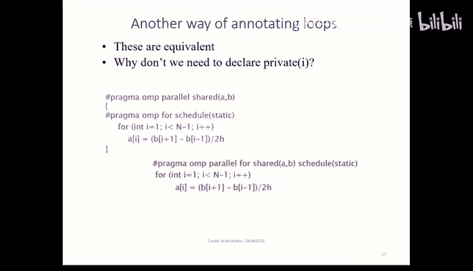
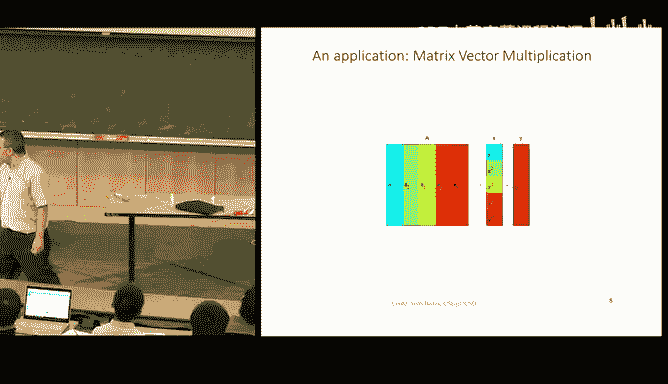
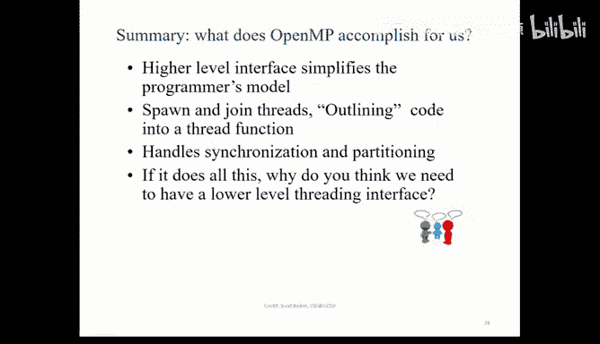

# 18：OpenMP 并行编程基础

在本节课中，我们将要学习 OpenMP 的基本概念和使用方法。OpenMP 是一个用于管理线程和并行性的编程模型，它通过编译指令（pragma）简化了并行程序的编写。

## 概述

OpenMP 是一个基于共享内存的并行编程接口，它通过向编译器添加简单的指令来并行化代码。其核心思想是“分叉-连接”模型，程序在并行区域开始时创建一组工作线程，在区域结束时同步并合并这些线程。

## 并行区域与编译指令

OpenMP 的核心是通过编译指令来标记并行区域。例如，使用 `#pragma omp parallel` 可以创建一个并行代码块。

以下是使用 OpenMP 并行化一个 for 循环的基本方法：

```c
#pragma omp parallel for
for (int i = 0; i < N; i++) {
    // 循环体
}
```

这条指令告诉编译器可以并行执行这个 for 循环。当然，是否应该并行化一个循环取决于循环内部是否存在数据依赖。

## 共享变量与私有变量

在 OpenMP 中，理解变量的共享与私有属性至关重要，这直接影响到程序的正确性。

*   **共享变量**：在并行区域开始前声明的变量，默认被所有线程共享。所有线程读写的是同一块内存地址。
*   **私有变量**：在并行区域内部声明的变量，或者通过指令显式声明为私有的变量。每个线程都拥有该变量的一个独立副本。

虽然编译器有默认规则（外部声明为共享，内部声明为私有），但最佳实践是**始终显式声明**变量的共享属性，以避免因代码维护（如移动变量声明位置）而引入的错误。

我们可以使用以下语法来显式指定：

```c
#pragma omp parallel for shared(a, b) private(i, tmp)
for (int i = 0; i < N; i++) {
    // a, b 是共享变量
    // i, tmp 是每个线程的私有变量
}
```

## 数据依赖与循环并行化

上一节我们介绍了如何声明变量，本节中我们来看看并行化循环时最重要的注意事项：数据依赖。并非所有循环都可以安全地并行化。

考虑以下循环：
```c
for (int i = 1; i < N; i++) {
    A[i] = A[i-1] + B[i];
}
```
这个循环存在“流依赖”，即第 `i` 次迭代的结果依赖于第 `i-1` 次迭代的结果。如果强行并行化，由于线程执行顺序不确定，将得到错误的结果。OpenMP 编译器可能无法检测所有复杂依赖，因此程序员必须对正确性负责。

## 屏障同步与 `nowait` 子句

默认情况下，OpenMP 在并行 for 循环的末尾会设置一个隐式的**屏障**，所有线程必须在此处同步后才能继续执行后续代码。

有时，我们希望线程在完成自己的那部分工作后能立即继续，而不必等待其他线程。这时可以使用 `nowait` 子句来消除隐式屏障。

```c
#pragma omp parallel for nowait
for (int i = 0; i < N; i++) {
    // 工作 A
}
// 线程完成工作A后，无需等待即可立即开始工作B
#pragma omp parallel for
for (int i = 0; i < N; i++) {
    // 工作 B
}
```
使用 `nowait` 时需要格外小心，必须确保消除屏障后程序的逻辑依然正确，通常要求两个循环之间没有数据依赖。

## 归约操作

在并行计算中，经常需要将各个线程计算的结果合并成一个最终值，例如求和、求积、逻辑与等。OpenMP 提供了 `reduction` 子句来简化这一过程。

以下是一个使用归约求和的例子：
```c
int sum = 0;
#pragma omp parallel for reduction(+:sum)
for (int i = 0; i < N; i++) {
    sum += A[i]; // 每个线程计算局部 sum
}
// 循环结束后，所有线程的局部 sum 会自动相加，结果存入全局的 sum 变量
```
归约操作要求运算符满足**结合律**和**交换律**。OpenMP 支持 `+`, `*`, `&`, `|`, `&&`, `||`, `max`, `min` 等运算符。

## 循环调度策略

OpenMP 允许我们指定如何将循环迭代分配给多个线程，这称为调度策略。主要分为静态调度和动态调度。



*   **静态调度**：在循环开始前，迭代块就被预先分配给各个线程。开销小，但若每个迭代的工作量不均，可能导致负载不平衡。
    ```c
    #pragma omp parallel for schedule(static, chunk_size)
    ```
*   **动态调度**：使用一个任务池，线程每完成一个迭代块，就动态地从池中获取下一个块。能更好地平衡负载，但引入了额外的调度开销。
    ```c
    #pragma omp parallel for schedule(dynamic, chunk_size)
    ```



选择策略的依据是循环迭代的计算密度是否均匀。均匀则用静态，不均匀则用动态。

## 内存初始化优化

在非统一内存访问架构上，内存初始化策略会影响性能。一个常见的优化模式是：在并行区域**之外**分配大块内存（单次操作），但在并行区域**之内**由多个线程并行初始化各自“附近”的内存部分。

这样做有两个好处：一是利用并行性加速初始化过程；二是让每个线程初始化离自己 NUMA 节点更近的内存，减少远程访问延迟。
```c
double* large_array = (double*)malloc(N * sizeof(double)); // 串行分配
#pragma omp parallel for
for (int i = 0; i < N; i++) {
    large_array[i] = 0.0; // 并行初始化
}
```

## OpenMP API 函数

除了编译指令，OpenMP 也提供了一套运行时 API 函数。例如，`omp_get_thread_num()` 可以获取当前线程的 ID，`omp_get_num_threads()` 可以获取线程组的总数。这些函数在需要更精细控制时非常有用。
```c
int tid = omp_get_thread_num();
int nthreads = omp_get_num_threads();
```

## 总结



本节课中我们一起学习了 OpenMP 并行编程的基础知识。我们了解到 OpenMP 通过简单的编译指令实现了强大的并行能力，包括管理并行区域、区分共享与私有变量、处理数据依赖、控制同步屏障、执行归约操作以及选择循环调度策略。OpenMP 的“分叉-连接”模型使其非常适合用于并行化规整的循环和代码块，极大地简化了共享内存并行程序的开发。然而，对于更复杂或非结构化的并行模式，我们可能仍需借助更低级的线程库（如 Pthreads）。