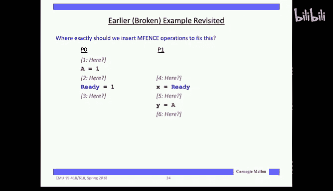
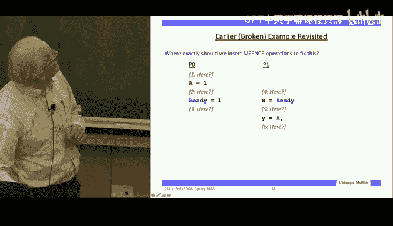
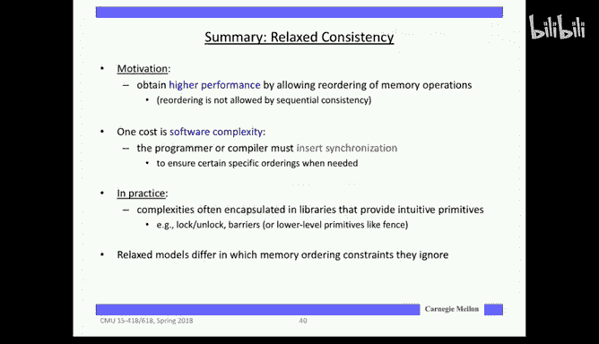

# 19：内存一致性模型 🧠

在本节课中，我们将要学习内存一致性模型。这是一个关于多线程程序如何观察共享内存读写顺序的重要概念。我们将探讨为什么严格的顺序一致性难以实现，以及硬件和软件如何通过更宽松的模型来平衡性能和正确性。

上一节我们介绍了缓存一致性协议，它保证了单个内存位置（缓存行）的读写顺序。本节中我们来看看更宏观的图景——内存一致性模型，它定义了不同内存位置之间操作的全局可见顺序。

## 顺序一致性的直觉与挑战

内存一致性模型的核心问题是：当多个程序读写共享内存时，它们应该观察到怎样的读写顺序？一个直观的想法是，每次读取都应该看到该内存位置最近一次写入的值。但这在实际的大型系统中并不可行，因为不同操作的延迟差异巨大，要求一个写入立即对所有读取可见是不切实际的。

因此，我们需要一个更宽松的模型。完全无序的模型会让软件开发变得极其困难，所以几乎所有系统都提供某种一致性模型，但为了性能，它们通常是经过“放松”的模型。

### 一个示例程序

考虑以下程序：
*   线程0向共享变量 `X` 写入所有偶数值。
*   线程1向共享变量 `X` 写入所有奇数值。
*   线程2反复读取 `X` 的值。

问题是，线程2可能观察到哪些值序列？哪些组合是非法的？

关键在于：对于任何一个给定的线程，外部观察者必须能够按照程序编写的顺序看到它的写入。而跨线程之间，必须存在这些线程顺序的某种有效交错。例如，序列 `[4, 8, 1]` 是合法的，因为偶数和奇数各自保持了顺序。但序列 `[9, 12, 3]` 是非法的，因为奇数 `3` 出现在了奇数 `9` 之后。

这个思想基于一个假设：存在一个全局的、单端口的内存，每一步只能执行一个操作，它会在所有线程的操作中选择一个来执行，从而强制所有线程的操作交错进行，并保持每个线程自身的程序顺序。这被称为**顺序一致性**。

## 硬件现实：程序顺序的违背

然而，现代处理器为了提取指令级并行性，会进行乱序执行，包括内存操作的乱序执行。处理器内部的硬件（如重排序缓冲区）维持了单线程内顺序执行的假象，但这并不跨线程生效。

### 写缓冲区的影响

一个关键硬件优化是**写缓冲区**。当处理器执行存储指令时，它只是将数据放入一个队列（写缓冲区），然后继续执行，由缓存逻辑负责稍后将数据推入内存系统。处理器认为一旦数据进入缓冲区，写操作就“完成”了。

这意味着，一个后续的、对不同地址的读操作，完全可能在之前的写操作对内存系统可见之前就启动并完成。例如：
```c
// 程序顺序
Store A = 5; // 进入写缓冲区
Load B;      // 可能先于 Store A 对系统可见
```
读操作 `B` 会窥探写缓冲区，如果是对同一地址 `A` 的读，它会从缓冲区获取值。但对于不同地址 `B` 的读，它可以直接从缓存读取，而无需等待 `A` 的写入完成。

### 推测执行的影响

分支预测和推测执行也可能导致内存操作不按程序顺序提交。虽然对全局状态（存储）的推测修改会被暂存在写缓冲区中，直到预测被确认，但读操作可以被推测执行，这进一步扰乱了内存操作的全局顺序。

## 宽松一致性模型带来的问题

硬件不保证严格的程序顺序会导致同步问题。考虑一个典型的同步模式：
```c
// 处理器 1
A = 1;          // 更新数据
ready_flag = 1; // 设置同步标志

// 处理器 2
while (ready_flag == 0) {}; // 忙等待标志
read A;                     // 读取数据
```
由于写缓冲区和缓存延迟，可能出现以下情况：
1.  处理器1将 `A=1` 和 `ready_flag=1` 放入写缓冲区。
2.  `ready_flag=1` 的操作更快地传播到了处理器2的缓存。
3.  处理器2看到 `ready_flag==1`，跳出循环。
4.  处理器2读取 `A`，但此时 `A=1` 的更新尚未到达它的缓存，因此读到了旧值 `0`。

这违反了我们的直觉：设置标志意味着数据已就绪。

更复杂的依赖链也可能出现类似问题，表明即使在有缓存一致性协议保证单个地址顺序的情况下，跨不同地址的读写顺序也可能出错。

## 实现顺序一致性的代价

如果我们想在硬件上强制执行经典的顺序一致性，即每个内存操作必须在前一个操作“完成”之后才能开始，那么性能代价会很高。这里的“完成”意味着操作已经深入到内存系统中，足以保证其最终会被执行（例如，已参与缓存一致性协议，开始使其他副本无效）。

这相当于在内存操作的“气球”中，每一个操作之后都打一个结，防止它们上下移动。性能研究表明，这种严格的顺序会导致大量的内存停顿时间，特别是在写操作上。

## 放宽模型：总存储顺序与部分存储顺序

为了性能，硬件设计者提出了更宽松的模型。

*   **总存储顺序**：允许读操作在之前的写操作完成之前就开始（得益于写缓冲区），但写操作之间以及读操作之间仍需保持顺序。这是Intel x86架构采用的模型。
*   **部分存储顺序**：进一步放宽，连写操作之间也不需要保持顺序。

使用总存储顺序可以显著减少因等待写操作完成而导致的停顿时间。

## 弱序与同步操作

从程序员的角度看，我们并不关心所有内存操作的顺序。我们真正关心的是**同步点**之间的顺序。典型的程序模式是：
```
...（私有计算）...
获取锁（同步点）
...（修改共享数据，受锁保护）...
释放锁（同步点）
...（私有计算）...
```
在同步点之间（临界区内），由于数据是私有的或受互斥锁保护，内存操作的顺序无关紧要。关键在于：
1.  在释放锁（或任何向其他线程发出“数据就绪”信号的操作）**之前**，必须保证本线程所有对共享数据的修改都已完成并全局可见。
2.  在获取锁（或任何读取其他线程“数据就绪”信号的操作）**之后**，必须保证能读到最新的共享数据。

因此，只要在同步操作中插入合适的**内存屏障**，就能在支持宽松一致性模型的硬件上，让正确编写的程序表现得像在顺序一致性模型下一样。



## 内存屏障



内存屏障指令（如Intel的`MFENCE`）在程序中设置一个屏障，确保所有在屏障之前的读写操作都“完成”之后，才允许开始屏障之后的读写操作。它并非全局同步，而是处理器本地的约束。

对于之前的同步示例，正确的屏障插入位置是：
```c
// 处理器 1
A = 1;
MFENCE();          // 确保 A=1 在 ready_flag=1 之前全局可见
ready_flag = 1;

// 处理器 2
while (ready_flag == 0) {};
MFENCE();          // 确保读到 ready_flag=1 之后，再读取 A
read A;
```
更精细的屏障（如`LFENCE`仅针对读，`SFENCE`仅针对写）可以用于优化。

## 原子操作与锁的实现

在实际编程中，我们通常使用原子操作库，而不是直接使用内存屏障。例如，Intel的`XCHG`（原子交换）指令不仅原子地交换内存值，其自身就附带了完整的内存屏障效果。

一个简单的自旋锁实现如下：
```c
// 获取锁
while (atomic_exchange(&lock_available, 0) == 0) { // XCHG 隐含 MFENCE
    // 忙等待
}
// 临界区
...
// 释放锁
lock_available = 1; // 普通存储
atomic_exchange(&lock_available, 1); // 使用带屏障的原子操作确保临界区写入在锁释放前可见
```
使用`atomic_exchange`释放锁，能保证临界区内的所有写操作在锁被释放（其他线程可见）之前完成。

复杂的无锁算法（如Peterson算法）在宽松内存模型下需要插入大量屏障，难以正确实现，这凸显了使用成熟同步库的重要性。

## 总结

本节课中我们一起学习了内存一致性模型。我们了解到：
1.  严格的**顺序一致性**模型直观但性能代价高。
2.  现代硬件使用**写缓冲区**和**乱序执行**来提升性能，这导致了内存操作可能不按程序顺序全局可见。
3.  **宽松一致性模型**（如总存储顺序）在硬件层面允许更多重排以提升性能。
4.  对于软件，关键在于正确使用**同步操作**（锁、屏障）。通过在同步点插入**内存屏障**，可以强制关键的内存操作顺序，从而在宽松硬件上构建出顺序一致性的编程模型。
5.  实际编程中应依赖原子操作和线程库，它们封装了正确的屏障语义，避免了直接处理复杂且平台相关的一致性规则。



内存一致性是硬件性能与软件可编程性之间的权衡。不同的处理器架构（x86, ARM）有不同的模型，因此使用标准库进行同步是保证程序可移植性和正确性的最佳实践。