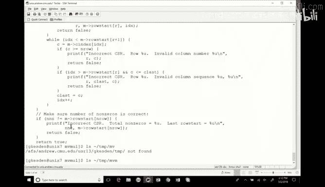
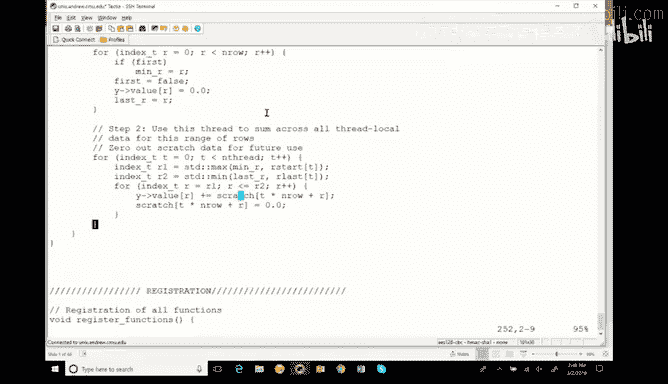

# 20：MPI简介与稀疏矩阵向量乘法优化 🚀

在本节课中，我们将学习两个核心主题：消息传递接口（MPI）的基本概念，以及一个稀疏矩阵向量乘法（SpMV）的代码优化案例。我们将首先快速了解MPI，然后深入分析如何通过并行化、向量化等技术来优化一个经典的计算密集型任务。

---

## MPI简介 📨

上一节我们介绍了共享内存模型，本节中我们来看看另一种并行编程范式：消息传递。MPI（Message Passing Interface）是一个为超级计算机设计的标准接口，用于通过进程间通信来解决问题。它与共享内存模型有根本不同。在共享内存中，处理器通过共享内存进行通信。而在MPI模型中，进程通过显式地发送和接收消息来通信，这尤其适用于分布式内存系统或非均匀内存访问（NUMA）开销很大的情况。

MPI本质上是一个异步通信模型。发送者将消息发送给接收者，接收者将其放入队列。之后有两种处理方式：
*   **选项A（阻塞）**：发送者等待接收者处理完消息并回复。
*   **选项B（非阻塞）**：发送者发送消息后便继续执行其他任务，之后定期检查是否有回复。

MPI支持这两种模式。阻塞式的发送和接收会使调用进程等待操作完成。非阻塞式的操作则允许计算与通信重叠进行，从而提高效率。

MPI是一个接口规范，而非具体的库。它定义了通信的行为，但具体的实现由不同系统上的各种库来完成。MPI常用于C、C++和Fortran语言。

一个最小但无实际用处的MPI程序如下，它仅初始化并最终化MPI环境：
```c
MPI_Init(&argc, &argv);
// ... 程序主体
MPI_Finalize();
```
这个程序不会带来性能提升，但它能确认MPI环境工作正常。

MPI的错误处理遵循所使用语言的惯例：C/Fortran返回错误码，C++可能抛出异常。

运行MPI程序没有标准化的环境命令，但通常推荐使用 `mpiexec` 命令来启动程序，该命令会负责初始化通信和进程管理。

以下是两个非常重要的MPI概念：
*   `MPI_Comm_size`：获取通信器（communicator）中的进程总数。
*   `MPI_Comm_rank`：获取当前进程在通信器中的唯一编号（秩）。

通信器定义了一组可以相互通信的进程。`MPI_COMM_WORLD` 是默认的通信器，包含了所有初始进程。

一个稍好的“Hello World”程序示例如下，它能让每个进程知道自己的秩和总进程数：
```c
int rank, size;
MPI_Comm_rank(MPI_COMM_WORLD, &rank);
MPI_Comm_size(MPI_COMM_WORLD, &size);
printf("Hello from process %d of %d\n", rank, size);
```

---

## MPI通信基础 🔄

上一节我们介绍了MPI的基本概念，本节中我们来看看具体的通信操作及其潜在问题。

发送者和接收者之间经典的同步问题包括：发送者准备发送时接收者未就绪，或接收者等待时发送者尚未发送数据。缓冲（Buffering）机制用于临时存储突发数据，直到接收者准备好处理。

阻塞通信使编程模型变得简单，发送后等待确认，然后继续执行。但其缺点是会序列化本可并行执行的操作，从而限制性能并可能降低并行度。

为了支持异构环境，MPI定义了自己的数据类型（如 `MPI_INT`, `MPI_DOUBLE`）。使用这些类型可以保证数据在不同系统间移植时大小和表示的一致性，也避免了像C语言中 `int` 类型大小不确定的问题。

MPI标签（Tags）曾用于标识消息类型，接收者可根据标签决定如何处理消息。虽然仍可使用，但现在并不特别常用。

基本的阻塞发送操作 `MPI_Send` 参数如下：
```c
MPI_Send(void *buf, int count, MPI_Datatype datatype, int dest, int tag, MPI_Comm comm)
```
参数依次为：缓冲区起始地址、元素数量、数据类型、目标进程秩、消息标签、通信器。



基本的阻塞接收操作 `MPI_Recv` 参数如下：
```c
MPI_Recv(void *buf, int count, MPI_Datatype datatype, int source, int tag, MPI_Comm comm, MPI_Status *status)
```
参数增加了源进程秩和状态指针。接收操作也会阻塞，直到收到匹配的消息。


非阻塞通信（`MPI_Isend`, `MPI_Irecv`）放松了阻塞限制。发起操作后立即返回，允许进程在后台通信进行时执行其他计算。之后可以使用 `MPI_Wait` 来等待操作完成，或使用 `MPI_Test` 来检查操作是否已完成。
```c
MPI_Request request;
MPI_Isend(..., &request); // 非阻塞发送
// ... 执行其他计算
MPI_Wait(&request, MPI_STATUS_IGNORE); // 等待发送完成
```
`MPI_Test` 的返回值遵循C/C++惯例：0表示操作已完成（就绪），非零表示未完成。

`MPI_Status` 对象包含关于操作的额外信息，如消息来源、标签、错误等。`MPI_Probe` 类似于接收操作，但只获取消息状态而不实际接收数据，相当于“窥探”。

MPI的核心函数并不多，大约6个基本函数（如初始化、终化、发送、接收、获取大小和秩）就能覆盖90%的常用场景。加上非阻塞操作和探针，总共可能也就9个函数。使用MPI的真正挑战不在于库函数本身，而在于如何设计基于消息传递的问题解决算法。

消息传递是一种强大的问题解决范式，它允许“软同步”。进程完成一大块工作后，通过发送消息来传递结果，从而实现同步，而不是通过争用共享内存来同步。

除了点对点通信，MPI还支持集体通信操作：
*   `MPI_Bcast`：将消息从根进程广播到通信器中的所有进程。
*   `MPI_Reduce`：将来自所有进程的数据通过一个操作（如求和`MPI_SUM`、求最大值`MPI_MAX`）进行归约，并将结果存储在根进程中。

这些集体操作的性能（如广播如何随进程数扩展）取决于底层的硬件实现（如共享总线、点对点网络），MPI接口本身并不规定实现方式。

---

## 死锁与MPI总结 ⚠️

上一节我们介绍了MPI的通信操作，本节中我们需要注意一个关键问题：死锁。

任何时候使用阻塞通信都需要小心死锁，它们会以意想不到的方式出现。考虑以下代码：
```c
// 进程 0
MPI_Send(buf1, ..., 1, ...);
MPI_Recv(buf2, ..., 1, ...);
// 进程 1
MPI_Send(buf3, ..., 0, ...);
MPI_Recv(buf4, ..., 0, ...);
```
如果两个进程的发送缓冲区都满了，每个进程的 `MPI_Send` 都会阻塞，等待对方进程的 `MPI_Recv` 来清空缓冲区。但对方的 `MPI_Recv` 在 `MPI_Send` 之后，永远无法执行，这就导致了死锁。

解决此类死锁的最佳方案通常是使用非阻塞I/O。如果必须使用阻塞操作，可以通过重新排序发送和接收的顺序来避免，例如让一个进程先发送后接收，另一个进程先接收后发送，确保通信链路不会同时堵塞。

关于MPI的简介就到这里。总的来说，MPI并不复杂可怕，当你需要时，可以快速上手。它的强大之处在于为分布式内存并行计算提供了一个清晰、通用的编程模型。

---

## 稀疏矩阵向量乘法优化案例 🔧

现在，让我们转向一个实际的代码优化案例：稀疏矩阵向量乘法（SpMV）。我们有一个大型的 N×N 稀疏矩阵（即大多数元素为零）和一个向量，需要计算它们的乘积。

由于矩阵是稀疏的，使用稠密表示会浪费大量内存和计算资源。因此，我们采用压缩的稀疏行（CSR）存储格式。以下是该数据结构的关键部分：
```c
typedef struct {
    int nz; // 非零元数量
    int *cols; // 每个非零元所在的列索引
    double *vals; // 非零元的值
    int *row_starts; // 每行非零元在vals中的起始位置
} sparse_matrix_t;
```
这种表示法只存储非零元素及其位置（行、列），大大节省了空间。

我们首先分析一个标准的顺序实现版本。核心计算循环如下：
```c
for (int i = 0; i < num_rows; i++) {
    double sum = 0.0;
    for (int j = row_start[i]; j < row_start[i+1]; j++) {
        sum += vals[j] * x[cols[j]]; // 关键的三行代码
    }
    y[i] = sum;
}
```
让我们聚焦于内层循环的关键三行代码（加载值、加载向量元素、乘加）。我们需要分析其计算强度：每次迭代包含2次浮点操作（一次乘法、一次加法）和3次内存加载（`vals[j]`, `x[cols[j]]`, 以及累积到 `sum` 的读-修改-写，但通常寄存器优化后只算2次关键加载）。

假设在一个3 GHz、具有融合乘加（FMA）单元的处理器上，每个FMA操作延迟为3个周期。那么，每个核心的理论峰值浮点性能约为：3 GHz / 3 cycles/op * 2 FMA单元 = 2 GFlops（每秒20亿次浮点操作）。内存带宽能否跟上？这取决于每次迭代需要加载的数据量和内存系统的吞吐量。在这个例子中，我们可能受限于内存带宽。

接下来，我们尝试使用OpenMP进行并行化。只需添加一行编译制导语句：
```c
#pragma omp parallel for
for (int i = 0; i < num_rows; i++) {
    // ... 循环体
}
```
OpenMP会自动将循环迭代分割成块，分配给多个线程执行。在一个8核系统上，我们期望最多8倍的加速，但实际可能只获得5.5倍，这是由于并行开销、负载不平衡或内存带宽限制造成的。

OpenMP还支持动态调度（`schedule(dynamic)`），它将循环迭代分成更小的块，并在运行时动态分配给空闲线程。这对于工作负载不均匀的情况很有用。但如果工作负载均匀，动态调度会增加额外的运行时开销，可能反而降低性能。在我们的SpMV例子中，由于采用了稠密表示的非零元，工作负载大致均匀，因此动态调度可能不会带来显著收益。

OpenMP也支持归约操作。我们可以使用以下指令让每个线程计算局部和，然后自动合并：
```c
#pragma omp parallel for reduction(+:sum)
for (int i = 0; i < num_rows; i++) {
    // ... sum += ...
}
```
这简化了编程，但归约操作本身也有同步开销。



我们还尝试了使用GCC向量扩展进行手动向量化。代码如下：
```c
typedef double v4df __attribute__((vector_size(32))); // 定义4个double的向量类型
v4df *v_vals = (v4df *)vals; // 假设数据已对齐
v4df *v_x = (v4df *)x;
v4df v_sum = {0};
for (...) {
    v_sum += v_vals[j] * v_x[col_index];
}
```
我们期望向量化能大幅提升性能，因为它一次处理多个数据。然而实际性能提升并不明显。原因很可能仍然是**内存带宽限制**。当计算单元因向量化而变得非常高效时，对内存系统的数据供给需求急剧增加，内存带宽成为了瓶颈。此外，还可能存在缓存行对齐、访问模式（间接访问 `x[cols[j]]`）等问题，影响了内存吞吐效率。

最后，我们看一个更高级的双阶段优化策略。该策略将计算分为两个阶段：
1.  **阶段1（并行计算阶段）**：每个线程独立计算分配给自己的那部分行，将结果累加在线程私有的局部数组中。此阶段无同步开销。
    ```c
    #pragma omp parallel
    {
        double *local_y = malloc(...); // 线程私有累加器
        // 每个线程计算自己的分区
        for (i = my_start; i < my_end; i++) {
            local_y[i] = ...; // 计算部分和
        }
    #pragma omp barrier // 阶段1结束，同步
    ```
2.  **阶段2（并行归约阶段）**：所有线程同步后，它们“调转方向”，每个线程负责将**所有线程**的局部结果中属于某个子范围的部分求和到一起。
    ```c
        // 阶段2：垂直归约
        #pragma omp for schedule(static)
        for (i = 0; i < num_rows; i++) {
            for (int t = 0; t < num_threads; t++) {
                y[i] += local_y_from_thread[t][i]; // 概念性代码
            }
        }
    }
    ```
这种方法避免了在计算阶段进行昂贵的全局归约同步，而是将归约工作也并行化了。这是一个非常优雅的模式。然而，在实践中，即使采用了这种巧妙的模式，性能提升可能仍然受限于终极瓶颈——**内存带宽**。当所有核心都全力工作时，它们对内存系统的总需求可能超过了系统所能提供的带宽。

---

## 总结 📝

本节课中我们一起学习了两个主要内容。

首先，我们快速了解了**MPI（消息传递接口）**。我们明白了它是一种基于消息通信的并行编程模型，适用于分布式内存系统。我们学习了其核心概念：通信器、进程秩、阻塞与非阻塞通信、以及集体操作如广播和归约。同时，我们也注意到了使用阻塞通信时可能出现的死锁问题。

其次，我们深入分析了一个**稀疏矩阵向量乘法（SpMV）的优化案例**。我们从简单的顺序实现开始，逐步尝试了OpenMP并行化、动态调度、归约以及手动向量化。通过这个案例，我们观察到一个关键现象：在许多计算密集型任务中，当成功地将计算并行化和向量化后，**内存带宽往往成为最终的性能瓶颈**。我们还学习了一种双阶段并行归约的优化模式，它虽然优雅，但同样可能受限于内存系统。

这个案例深刻地提醒我们，在追求极致计算性能时，必须密切关注内存访问模式、带宽限制以及数据局部性。优化是一个多层次、需要综合考虑计算和内存特性的过程。