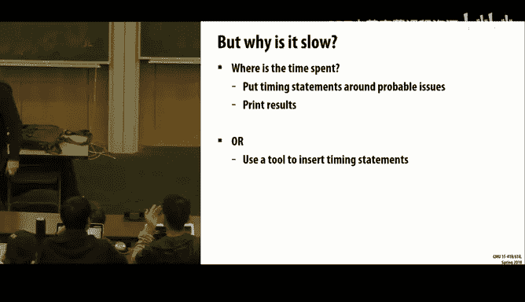
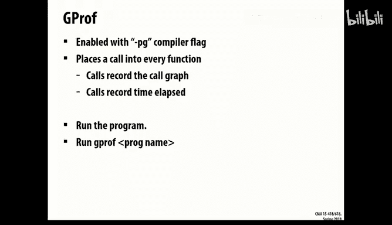
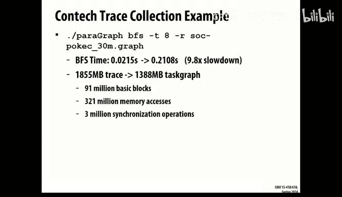

# 21：性能监控工具 🛠️

在本节课中，我们将学习如何分析和优化程序性能。当你的代码运行缓慢时，仅仅猜测问题所在是不够的。你需要通过测量来获得洞察力，从而理解代码的实际行为。我们将介绍一系列工具，帮助你定位性能瓶颈，从系统级监控到细粒度的指令级分析。

## 概述 📋

性能分析的第一步是确认问题。你的程序真的慢吗？还是系统负载过高？使用像 `top` 这样的工具可以快速查看整个系统的状态，包括CPU使用率、内存占用以及当前运行的其他进程。

---


## 系统级监控：`top` 与 `time` 📊


上一节我们提到了确认问题的重要性，本节中我们来看看两个基础的系统监控工具。

`top` 命令提供了一个动态的、实时的系统进程视图。它可以告诉你：
*   有多少用户登录到机器上。
*   CPU的总体使用率。
*   每个进程的CPU和内存使用情况。
*   系统的空闲内存量。




例如，如果你的程序显示使用了 `796%` 的CPU，这通常意味着它几乎完全占用了8个硬件线程（因为 `796% ≈ 8 * 100%`）。理解这些百分比的计算方式对于诊断CPU密集型问题至关重要。

`time` 命令（特别是 `/usr/bin/time`）则在程序运行结束后提供聚合统计数据。它可以告诉你：
*   程序运行的总挂钟时间。
*   程序消耗的总CPU时间（用户态+内核态）。
*   程序使用的最大内存（常驻集大小）。



以下是一个 `time` 命令输出的示例：
```
600% CPU, 33 seconds total time, 6 seconds user time.
```
这表明一个并行程序使用了相当于6个CPU核心满载的总计算时间，但实际的挂钟时间只有33秒，体现了并行带来的加速。


然而，这些工具只提供了宏观的、聚合的数据。要深入理解“为什么慢”，我们需要进入程序内部。

---

## 程序性能分析工具 🔍

上一节我们通过系统工具了解了程序的整体资源消耗，本节中我们来看看专门用于分析程序内部行为的工具。这些工具的核心思想是**程序插桩**——在代码中插入额外的指令来收集运行时数据。插桩主要有两种方式：编译时插桩和运行时插桩。

### 阿姆达尔定律与热点分析 ⚡

在深入工具之前，我们必须重温**阿姆达尔定律**。它告诉我们，对程序任何部分进行加速，其整体收益受限于该部分所占的执行时间比例。

**公式**：`整体加速比 = 1 / ((1 - P) + P/S)`，其中 `P` 是可优化部分的比例，`S` 是该部分的加速比。

因此，性能优化的首要任务是找到程序的“热点”——那些消耗了大部分执行时间的代码区域。将优化精力集中在热点上才能获得最大回报。

### GProf：函数级分析器 📝

GProf 是一个经典的编译时插桩分析工具。通过在编译时添加 `-pg` 标志，编译器会在每个函数入口和出口插入计时代码。

程序运行后，会生成一个 `gmon.out` 文件。使用 `gprof` 命令分析该文件，你会得到一份报告，其中包含：
*   每个函数消耗的总时间及其占总时间的百分比。
*   函数的调用关系图（call graph）。
*   每个函数被调用的次数。

以下是分析报告可能包含的内容：
```
% time    cumulative seconds   self seconds   calls   name
70.0      2.10                 2.10           1       build_incoming_edges
30.0      2.70                 0.60           18      page_rank
```
这份报告清晰地指出，`build_incoming_edges` 函数占了70%的时间，而核心算法 `page_rank` 占了30%。这帮助你决定优化重点应该放在哪里。

GProf 的优点是易于使用，但它的粒度较粗（函数级），并且插桩会带来一定的运行时开销。

### Perf：基于硬件计数器的分析器 🖥️

现代处理器内部都有一组**性能监控计数器**，可以统计诸如缓存命中/失效、分支预测错误、执行周期数等底层事件。Perf 是一个强大的命令行工具，可以访问这些计数器。

Perf 的使用主要分为两种模式：
1.  **`perf stat`**：收集程序运行期间的聚合计数器值。这是一个很好的起点，用于了解程序的整体行为特征。
    ```
    $ perf stat ./my_program
    ```
    输出可能包括：
    ```
    5,000,000,000 cycles                    # 总周期数
    2,000,000,000 instructions              # 总指令数
        0.40  insn per cycle              # 每周期指令数(IPC)，较低
        50,000,000 cache-misses           # 缓存失效次数
        24.5% of all cache refs          # 缓存失效率
    ```
    低IPC和高缓存失效率暗示了可能的性能瓶颈。

2.  **`perf record` 与 `perf report`**：进行基于事件的采样分析。你可以指定一个事件（如 `cache-misses` 或默认的 `cycles`），当该事件的计数器溢出时，Perf 会记录当时的程序计数器（PC）位置。
    ```
    $ perf record -e cache-misses ./my_program
    $ perf report
    ```
    `perf report` 会启动一个交互式界面，展示哪些函数甚至哪些指令地址最常触发该事件。这能将性能问题精准定位到代码行。

**重要提示**：由于微架构的延迟，采样点可能稍微偏离实际触发事件的指令，通常在一两条指令之内。分析时需要结合代码上下文进行判断。

通过 Perf，我们可能发现，例如，47%的缓存失效发生在一个名为 `edge_map` 的自定义函数中，从而明确优化目标。

### 高级工具：Pin 与 ConTech 🔬

对于更深入或定制化的分析，例如需要完整的内存访问踪迹或并发事件记录，可以使用更高级的动态二进制插桩工具。




*   **Pin**：由英特尔开发的一个动态二进制插桩框架。它可以在程序运行时，将用户编写的“Pin工具”注入到进程中，从而分析指令混合、生成内存地址踪迹、模拟缓存等。Pin 功能强大但开销较高（可能带来10倍或更多的 slowdown）。
*   **ConTech**：一个研究型工具（由本讲教授开发），旨在高效记录程序执行的控制流、内存访问和并发事件，生成一个“任务图”，可用于数据竞争检测、一致性协议模拟等高级分析。

这些工具通常用于研究项目或对性能有极端要求的深度优化，因为它们会产生巨大的日志文件和分析开销。

---

## 内存与调试工具 🐛

性能问题有时与内存错误（如内存泄漏、越界访问）交织在一起。这些问题会拖慢程序甚至导致崩溃。因此，在追求极致性能前，确保代码正确性是关键。

*   **Valgrind (Memcheck)**：一个重量级的内存调试工具。它通过模拟CPU运行你的程序，可以检测内存泄漏、非法内存访问、使用未初始化值等问题。缺点是速度很慢（10-20倍 slowdown）且会使线程序列化。
*   **AddressSanitizer (ASan)**：一个编译时插桩工具。在编译时添加 `-fsanitize=address` 标志，编译器会插入检查代码。运行时，它能以比 Valgrind 小得多的开销（约2倍）检测类似的内存错误，并且支持多线程程序。

在优化前，先用这些工具扫清内存错误，可以避免许多难以调试的“灵异”性能问题。

---

## 性能分析流程总结 🗺️

本节课中我们一起学习了从发现问题到定位瓶颈的完整工具链。现在，让我们总结一个系统化的性能分析流程：

1.  **确认问题**：问题是否可稳定复现？在一个空闲的机器上运行。
2.  **宏观检查**：使用 `top` 查看系统负载，使用 `time` 获取程序整体资源消耗。确认程序是否真的在全力使用CPU。
3.  **定位热点**：
    *   如果代码结构清晰（函数分明），使用 **GProf** 找到消耗时间最多的函数。
    *   使用 **Perf stat** 了解程序的整体微观特征（IPC、缓存失效率等）。
4.  **深入分析**：使用 **Perf record/report** 对热点函数进行采样分析，精确找到消耗周期或触发缓存失效的指令行。
5.  **结合理论与洞察**：根据工具提供的数据（如“大量时间花在原子操作上”或“访问通过双重指针间接进行”），运用你的算法和数据结构知识来设计优化方案（如减少争用、改变数据布局）。
6.  **确保正确性**：在优化过程中，使用 **Valgrind** 或 **AddressSanitizer** 确保你的修改没有引入内存错误。
7.  **迭代**：优化后，重复测量，验证性能是否提升，并寻找下一个热点。


记住，**测量优于猜测**。工具提供的数据是你进行高效优化的最可靠指南。不要花费20小时去优化一个只占1%时间的I/O例程，而应利用这些工具找到真正拖慢程序的“罪魁祸首”。