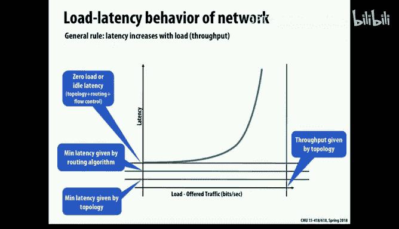
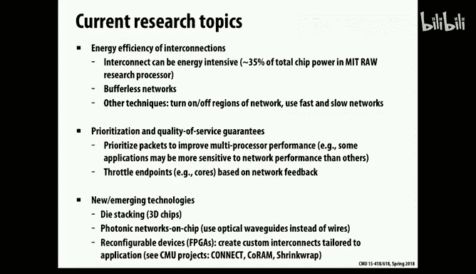

# 22：高性能计算互连网络

在本节课中，我们将要学习大规模并行计算机系统中的关键组成部分——互连网络。我们将探讨不同的网络拓扑结构、路由算法以及数据在网络中传输的基本方式，了解它们如何影响系统的性能、可扩展性和成本。

上一节我们介绍了缓存一致性协议，其中假设处理器和缓存之间通过某种方式通信。本节中我们来看看当系统规模扩大时，这种通信方式如何从简单的总线演变为复杂的网络。

---

## 网络基础概念与挑战

当观察大规模计算机系统时，互连网络成为一个重要的研究课题，这在较小规模的系统中通常不会被过多考虑。我们讨论的网络是指将高性能计算系统的计算节点连接起来的网络。这与互联网中常见的网络（如TCP/IP）非常不同，因为这些网络旨在实现**紧密的本地化**和**极高的性能**。另一方面，它们不像互联网那样需要过多担心故障或连接中断。

在讨论网络时，根据上下文，其含义可能大不相同。之前我们描述缓存协议时，只是假设缓存之间存在某种通信方式，通常简化为总线。但需要记住的是，这些连接点（我们称之为**节点**）通常是缓存控制器、内存控制器或其他作为处理器代理的系统部件。为了简化，我们今天统称它们为节点。

正如上一讲提到的，最简单的形式是**总线**。它实际上是一组不同的电线：一组用于发出请求（放置地址），另一组用于返回数据的响应。对于读操作，通常使用物理上独立的总线，以避免死锁的可能性，即大量请求阻塞了潜在的响应，导致系统死锁。

今天，我们将超越简单的总线，探讨如果我们使用真正的网络会是什么样子，这些网络可能有哪些形态，以及我们如何获得更具可扩展性的大型系统网络。如今，这不仅适用于谷歌、Facebook或亚马逊等数据中心或超级计算中心，也适用于单个芯片。对于高性能处理器，芯片内部也需要某种网络来连接所有不同的节点。

网络中的节点可能是处理器、内存控制器、I/O控制器或其他核心。我们不过多关心具体连接什么，而是关心如何连接它们。

设计网络涉及许多问题，选择何种网络取决于具体环境，部分取决于预算，也取决于我们谈论的规模：是连接多核芯片中的四到八个节点，还是连接超级计算机中的一万个节点？因此，针对不同部分，设计选择会非常不同。此外，物理上，在单个芯片上可以负担更多、更“粗”的连接，而在芯片之间则不行，因此随着系统设计层级的提升，设计会变得非常不同。

许多问题使得网络设计成为一个难题：
1.  **性能**：包括延迟和带宽。
2.  **能耗**：特别是对于片上网络，能耗是一个主要问题。
3.  **可扩展性**：公司通常不只生产一种系统。他们希望销售256、512、1024个处理器的系统，并且希望网络设计是可扩展的，无需为每个规模定制特殊的网络。

正如前面提到的，即使在单个芯片上，这个问题也日益突出。例如，GHC机器和Latedays机器中的典型节点都是多核芯片（通常是六核或八核），规模较小，通常使用简单的**环网**。我们拥有的旧款至强融核（Xeon Phi）是61核机器，更新一代是72核，它们内部也有网络连接，并且两代之间有所不同。

甚至有公司设计出非常简单的核心，以便在单个芯片上放置64个核心，形成一个核心数众多但连接带宽较低的廉价系统。即使是右侧展示的Tegra芯片，也是GPU和ARM处理器的组合，集成了多个ARM处理器，常用于汽车应用等单芯片解决方案。几乎所有现代系统都是多核的，区别只是在于核心数量是2个、4个，还是1000个、10000个。

---

## 网络拓扑结构

让我们看看互连网络的不同可能性。首先明确一些术语：
*   **节点**：网络的端点，可以是缓存控制器、处理器、内存控制器或I/O设备。
*   **链路**：网络中的点对点连接，物理上通常是一束电线以及两端的电子设备，用于来回发送消息。
*   **交换机**：一个小型模块，可以根据消息的目的地或其他因素，通过不同的**路由**连接和转发消息。交换机背后的逻辑定义了路由元素。

以下是设计网络时需要考虑的一些问题：

1.  **拓扑结构**：网络的整体图结构是什么？交换机和链路如何连接，以及如何连接到节点？
2.  **路由**：如果我想将消息从点A发送到点B，我应该选择哪条路径？选择路径的算法是什么？
3.  **缓冲**：实际发送消息意味着什么？一个极端是必须通过网络预留整个路径，一次移动整个消息或部分消息。
4.  **流控制**：如何管理拥塞？如何处理在给定时间内试图通过网络推送大量消息的事实？

在讨论网络时，有两种不同的通用实现风格：
*   **直接网络**：交换机和节点是同一实体，交换逻辑内置于节点本身。
*   **间接网络**：存在一系列完全独立于节点的交换机，形成从一个端点到另一个端点的链路。

一个有用的衡量指标是**二分带宽**。这意味着如果将网络切成两半，计算有多少连接被切断，这个数量就是二分带宽。例如，对于一个N×N的网络（有N²个节点），如果将其切成两半，大约会切断N条线，因此二分带宽是N，即节点数的平方根。这不错，但并非极好。相比之下，一个简单的环或线性链的二分带宽是1，任何一条线被切断都会断开网络，因此二分带宽非常低。对于像你现在正在处理的、几乎没有局部性的应用程序，试图通过系统传输大量流量时，低二分带宽将成为流量的瓶颈。

另一个问题是路由。有些网络被称为**阻塞网络**，意味着一条消息可能会阻塞另一条消息的进展。另一类称为**非阻塞网络**，创建起来要困难得多，它保证任何消息都不会受到其他消息的影响。

对于网络性能，通常关注**延迟**（消息从点A到点B的时间）与**负载**（系统中的流量）的函数关系。一般形状是一条曲线：当系统中没有其他消息时，消息会毫无干扰地快速通过。随着消息增多，性能会缓慢下降，并在某个点达到饱和，此时由于拥塞和流量过大，延迟会急剧增加。

---

### 常见网络拓扑示例

以下是可能考虑的一些拓扑结构：

**总线**
物理上我们画一条线，但从图论角度看，它实际上只是一个单一的节点（一个交换机）。总线是一种一次只能处理一个连接的交换机（如果我们将其视为点对点连接，则一次只能有一个发送者和一个接收者）。其优点是广播非常廉价。
*   **优点**：易于构建，可以相当容易地向总线添加多个节点（在一定限制内），并具有在缓存协议中非常有用的广播能力。
*   **缺点**：可扩展性问题，随着连接增多，带宽将严重受限。在芯片上物理驱动总线也相当昂贵（功耗高）。

**交叉开关**
这是另一个极端。每个节点都通过直接连接与其他每个节点相连，因此这里有N²个交换机。它允许任何节点通过一跳直接与任何其他节点通信。
*   **优点**：这是最佳可能，是一个**非阻塞网络**。任何连接请求，只需使用交叉开关中特定的交换机即可保证工作。
*   **缺点**：明显的可扩展性问题，拥有N²个交换机连接N个节点非常昂贵。但实际上，这种设计仍有使用，例如Oracle（收购自Sun Microsystems）的某些处理器芯片中就集成了交叉开关，它占据了与一个核心相当的面积。

**环网**
允许消息环绕。其优点是易于扩展（只需将环的大小加倍），并且实际上用于连接Intel处理器中的缓存控制器。直到最近的Skylake处理器之前，都使用环网；Skylake使用了网状网络。我们Waitdays集群中的至强融核（Xeon Phi）也是环网连接，这也是其性能不佳的部分原因。环网设计非常简单，通常用于连接4个或8个元素。

**网格**
网格对于芯片上的布局很有吸引力，因为它可以自然地布置在二维表面上。路由相当简单（类似于在曼哈顿街区导航）。好消息是它易于扩展到不同尺寸。但网格的一个问题是边缘与中间不同，对于某些类型的问题映射来说可能很尴尬。通常采用的路由算法是先在X维度移动，然后在Y维度移动（或反之），以避免死锁。Intel的Skylake处理器和新的至强融核（Xeon Phi）都使用网格网络。

**环面**
环面是网格的一种变体，其边缘是连接的（形成一个环），从而提供更均匀的连接性。逻辑上，它是一个环面（甜甜圈形状）。环面的一个巧妙变体是**折叠环面**，它通过将每个链路的长度拉伸两倍，使得没有特别长的链路，从而在二维表面上实现更均匀的布局，同时保持完全相同的逻辑拓扑。

**树**
树是一种非常有用的网络。左侧所示的有时被称为**H树**，因为其形状像字母H。树可以递归设计，嵌入到平面表面，这对于芯片等场景很友好。但经典树的一个问题是二分带宽非常差（在根部切割只切断一条线，二分带宽为1）。为了解决这个问题，Charles Leiserson（CMU博士）提出了**胖树**的概念。其思想是在树的较高层级增加更多（更“粗”）的链路，从而提供更多连接性，使得二分带宽可以随系统节点数扩展。胖树的路由算法与普通树基本相同（向上走直到找到共同祖先，然后向下走），只是在有多个选择时可以随机选择。胖树路由并不比树路由困难，因此相当有吸引力。

胖树的一个实际问题是，经典版本需要在网络的不同层级构建不同度数的交换机，这对于可扩展的实用设计来说并不理想。但令人惊讶的是，我们可以重新设计它，使其仅使用固定度数的交换机。这可以通过将多个树合并在一起来实现，例如使用四个树在顶部合并。这种设计在商业世界中非常流行，例如**InfiniBand**网络。物理上，这些交换机与以太网交换机类似，只是通过重新配置路由软件来实现随机选择和定向路由。

**超立方体**
超立方体是将网格思想推广到多维。一个d维超立方体可以通过连接两个(d-1)维超立方体的对应节点来构建。其优点是具有非常简单的路由算法：节点地址的每一位代表超立方体中的一个维度，两个节点之间有连接当且仅当它们的地址仅相差一位。路由算法就是一次改变一位地址（从高位到低位或随机顺序），直到到达目的地。超立方体具有良好的二分带宽（随节点数扩展），但物理上无法在三维空间中嵌入超过三维的结构，因此当规模增大时，布线会变得非常密集和复杂。一些超级计算机使用四维超立方体，但每个节点具有更高的度数（非二进制）。

**Omega网络**
这是一种经典的间接网络设计。逻辑上它看起来像一系列交叉连接的阶段。其结构支持一种路由方案：从最高有效位到最低有效位，遵循“1表示向下，0表示向上”的规则。拓扑上，它与胖树有相似之处。这种思想有许多变体，但在实践中是否被广泛使用尚不确定。

---

## 数据交换方式

到目前为止，我们看了网络拓扑的高层视图。现在让我们深入了解如何实际实现消息在这些网络中的移动。

一个有趣的问题是：通过网络移动消息意味着什么？在电话系统中，传统方式是**电路交换**。在通话期间，会在两个呼叫之间建立一系列专用的电线。即使进行长途或国际通话，也是通过电路交换完成的。如今，在计算机科学中很难找到仍然使用电路交换的例子。

**分组交换**（互联网的基础）的思想是将消息分解成**分组**块。从网络的角度来看，一个分组就是一个完整的消息，它本身包含目的地信息、可能的源信息以及数据块。典型的互联网分组大小是1500字节。对于这些类型的网络，我们可能希望看到比消息更低的层级。完整的消息是客户端所考虑的，但这些通常被分解成更小的分组（例如几十字节）。在更低的层级，我们甚至可能将其分解成更小的单元（称为**微片**或**流控制数字**）进行传播。

一个分组通常包含：
*   **头部**：描述目的地、长度、源等信息。
*   **有效载荷**：数据。
*   **尾部**：可能包含表示消息结束的特殊代码，或包含**校验和**（奇偶校验信息）以检查传输过程中是否损坏。

我们必须考虑试图通过一个一次只能处理一个分组的交换机发送两个分组的情况。基本选项是：
1.  **缓冲**其中一个，让第二个通过。
2.  **丢弃**它（在互联网拥塞时可能发生）。
3.  寻找**替代路由**。

我们主要考虑缓冲，假设必须存储一个分组的信息，直到信道可用。

**电路交换**基本上必须预留沿途所有链路，然后一旦预留成功就可以快速发送分组。问题是建立连接需要大量时间，并且它严重限制了可以维持的连接数量，因此这是一种非常重量级的方法，现在可能已不再使用。

更传统的方式（例如在互联网中）是**存储转发**。其思想是每个交换机需要有足够的缓冲来容纳几个分组（可能一个或两个）。存储转发意味着存储一个分组，然后将整个分组发送到下一个交换机，因此每个分组在每一跳都是完整的传输。互联网就是一个存储转发网络。但问题是，每一跳都增加了通过链路发送整个分组的完整成本，因此延迟与跳数成正比，并且需要足够的缓冲来实现。

另一种在这些低级网络中使用的思想是**直通路由**。其思想是基本上使用流水线：当分组移动时，不是在一个交换机中累积整个分组再发送到下一个，而是立即开始发送。因此，你得到了这种流水线效应。所以，从A到B发送消息的时间与**消息长度加上跳数**成正比，而不是消息长度乘以跳数。你支付第一跳的成本，但一旦开始，就会持续移动直到整个消息通过。在这方面，它的性能要好得多。

然而，直通路由的问题是它可能会阻塞。如果头部被阻塞，即使可以继续移动分组，使其在网络的不同点慢慢累积，但在任何给定时间都可能占用大量链路。

还有一种思想称为**虫孔路由**。它将分组分解成比分组本身更小的单元——**微片**。一个分组会有一个微片作为头部，一系列微片作为有效载荷，一个微片作为尾部。有效载荷中没有路由信息，需要做的是在移动这些微片时跟踪正在使用的连接，直到看到带有特殊标志的尾部，然后可以释放它。这几乎像电路交换，分配一个逻辑信道（通过网络的一条路径），并在此消息活动期间使用它。这实际上用于一些真实的网络设计中。

然而，你可能会遇到阻塞，并且如果考虑不周，可能会在系统中产生死锁：可能有两个或一系列消息在缓冲区上形成循环依赖，导致都无法通过。解决方法是**虚拟通道**，将信道分成多个虚拟通道，为每个提供足够的缓冲，并具备临时解决争用的能力。通过正确的路由规则（例如，先X后Y），可以为水平流量和垂直流量分配不同的虚拟通道，从而避免死锁。这个想法类似于总线中请求总线和响应总线分离以避免死锁的技巧。它使得构建非常快速和简单的网络成为可能（交换机所需的硬件非常少，缓冲和逻辑都不多）。

---

## 总结与趋势

本节课中，我们一起学习了高性能计算互连网络的核心知识。

我们首先定义了网络的基本概念（节点、链路、交换机）和设计挑战（性能、能耗、可扩展性）。接着，我们深入探讨了多种网络**拓扑结构**，包括简单的**总线**、全连接的**交叉开关**、易于扩展的**环网**和**网格**、更均匀的**环面**、结构化的**树**与**胖树**、高维的**超立方体**以及间接的**Omega网络**，并分析了它们各自的优缺点和适用场景。

然后，我们了解了数据在网络中移动的几种方式：传统的**电路交换**、互联网基础的**存储转发**、降低延迟的**直通路由**以及进一步分解数据的**虫孔路由**，并提到了使用**虚拟通道**来避免死锁的策略。

总体趋势是，系统从简单的总线开始，发展到环网，现在正转向网格。但随着系统规模的扩大（无论是片上多核、多芯片封装，还是数据中心级别），这些互连网络的思想正在被重新审视和评估。在网络中实现更高的性能和可扩展性，正成为从芯片设计到大型数据中心构建的关键问题。