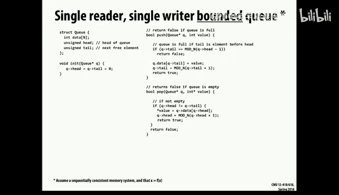
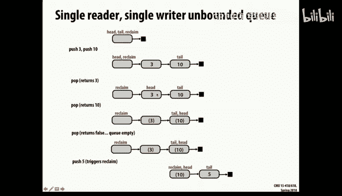
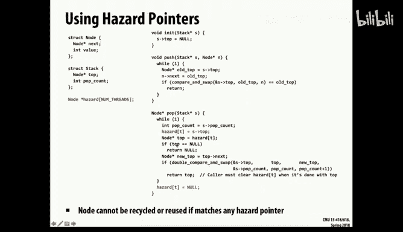
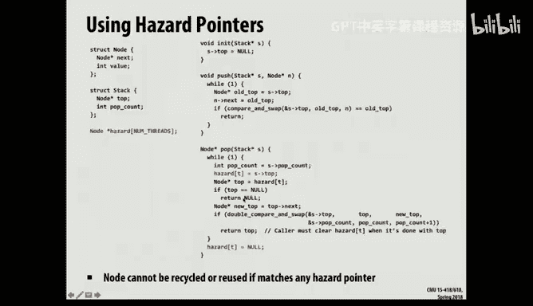

# 24：无锁编程与并发数据结构

在本节课中，我们将要学习如何在不使用传统“大锁”的情况下实现共享数据结构。我们将探讨细粒度锁、原子操作以及无锁编程的核心概念，这些技术对于构建高性能的并行程序至关重要。

## 细粒度锁与原子操作

上一节我们介绍了传统锁的局限性。本节中我们来看看如何通过更精细的控制来提升并发性能。

一种改进方法是使用细粒度锁，即为数据结构的各个部分（而非整个结构）分别加锁。另一种更极端的思路是彻底摒弃锁，使用其他机制来确保共享数据结构的正确更新，这就是无锁编程。

无锁编程是一个重要的研究领域，也是本课程项目的一个有趣方向。例如，仔细实现和评估各种并发数据结构就很有价值。

### 原子操作：硬件基础

像Pthread互斥锁这样的传统锁是重量级的，涉及操作系统交互，可能导致线程挂起和唤醒，耗费数万个时钟周期。对于只需短暂更新以防止冲突的并发程序，自旋锁通常是更合适的选择。

然而，即使使用自旋锁，如果锁住整个数据结构（如哈希表），也会序列化所有访问，使其不适合并行编程。

因此，许多更精细的方法利用了原子操作。以下是CUDA（以及GCC）中可用的一些原子操作示例：
*   **原子加法/递增**：以原子方式执行简单的算术运算。
*   **比较并交换**：这是硬件实现的核心基础操作。

让我们重点看看**比较并交换**操作。

`compare_and_swap(addr, expected, new_val)` 是一个三参数操作：
1.  `addr`：目标内存地址。
2.  `expected`：预期该地址当前存储的值。
3.  `new_val`：希望存入该地址的新值。

该操作原子性地执行以下步骤：
1.  读取地址 `addr` 的当前值，记为 `old`。
2.  如果 `old` 等于 `expected`，则将 `new_val` 写入 `addr`。
3.  返回 `old` 值。

假设我们通过设计确保 `new_val` 与 `expected` 不同（否则操作无意义）。如果返回的 `old` 值与传入的 `expected` 不匹配，则说明操作失败，未能成功将 `new_val` 存入目标地址。

### 使用比较并交换的示例

以下是使用比较并交换实现原子最小值操作的**示例模式**（注意，此代码存在潜在无限循环问题，仅用于展示模式）：

```c
// 警告：此代码在X不小于当前最小值时会无限循环，仅作模式演示。
void atomic_min(int* addr, int x) {
    while (1) {
        int old = *addr; // 非原子读取，仅用于演示逻辑
        int new_val = (x < old) ? x : old;
        // 假设 compare_and_swap 返回旧值
        if (compare_and_swap(addr, old, new_val) == old) {
            break; // 成功更新
        }
        // 否则重试
    }
}
```

更合理的例子是实现**原子递增**或一个简单的**自旋锁**。例如，实现一个锁：假设锁变量为1表示可用，0表示被占用。获取锁的线程会反复尝试用0与锁变量进行“比较并交换”（预期值为1），直到成功为止。

在C++11及更高版本中，`std::atomic` 模板类型可以将任何类型变为原子类型。对于基本数据类型（如 `int`），编译器会使用底层的原子指令（如fetch-and-add）来实现。这是一个相对于C语言编程的巨大优势。

## 原子操作的硬件实现

像比较并交换这样的底层原子操作是如何实现的呢？在x86架构中，可以在某些指令前添加一个前缀字节（`LOCK`），指示该指令必须以原子方式执行。硬件通过缓存协议技巧来保证这一点。

在基于总线的缓存系统中，它可以保证在执行原子指令期间，相应的缓存行不会被驱逐，从而防止了“读后无效”的竞态条件。在基于目录的缓存系统中，实现更为复杂，通常需要通过目录来保持对该内存位置的锁定，直到执行处理器释放它。

任何能锁定总线的操作都可能引发棘手的错误。历史上，x86就曾存在一个与 `LOCK` 前缀相关的漏洞，恶意代码可利用它导致系统挂起。这提醒我们，处理并发问题时，不仅要考虑正常行为，还要考虑攻击者可能选择的病态行为。

## 并发链表与细粒度锁

比较并交换通常适用于对单个字（word）进行原子操作。但在实际中，我们常需要操作更大的数据结构。例如，在15-418课程作业（代理缓存）中，最简单的实现是为整个缓存加一把大锁（互斥锁或读写锁）。更高级的做法是对缓存中的条目（如页面或链表节点）进行单独加锁，这就是细粒度实现。

让我们以一个标准有序链表的插入和删除操作为例。在并发环境下，多个线程同时插入或删除可能导致竞态条件，例如两个线程同时尝试更新同一个前驱节点的 `next` 指针，导致一个插入丢失。




最简单的解决方案是为整个链表加一把大锁，但这会使其完全串行化，丧失并发性。

### 手递手锁

以下是改进方法之一：**手递手锁**。

其核心思想是，线程在遍历链表时，总是持有至少一个锁。它会在获取下一个节点的锁之后，才释放当前节点的锁。这类似于爬绳时“手递手”前进，保证始终至少有一只手抓住绳子。

这种方法保证了操作的某种序列化：所有操作都必须从链表头开始，按相同顺序向下进行，防止了线程“超车”造成的混乱。同时，它确保在修改某个节点时，不仅会阻塞后续操作，也会等待前面的操作完成，从而安全地进行删除或插入。

以下是手递手锁的**示例代码框架**（注意，此代码可能未处理向空链表插入等边界情况）：

```c
typedef struct node_t {
    int key;
    struct node_t *next;
    pthread_mutex_t lock; // 每个节点都有自己的锁
} node_t;




typedef struct list_t {
    node_t *head;
    pthread_mutex_t lock; // 链表本身的锁，用于控制初始入口
} list_t;

void list_insert(list_t *L, int key) {
    node_t *new_node = malloc(sizeof(node_t));
    new_node->key = key;
    pthread_mutex_init(&new_node->lock, NULL);

    pthread_mutex_lock(&L->lock); // 获取链表锁
    node_t *prev = NULL;
    node_t *curr = L->head;

    if (curr) pthread_mutex_lock(&curr->lock); // 获取第一个节点锁
    pthread_mutex_unlock(&L->lock); // 释放链表锁，允许其他线程进入

    // 遍历查找插入位置，保持“手递手”
    while (curr && curr->key < key) {
        if (prev) pthread_mutex_unlock(&prev->lock);
        prev = curr;
        curr = curr->next;
        if (curr) pthread_mutex_lock(&curr->lock);
    }

    // 执行插入
    new_node->next = curr;
    if (prev) prev->next = new_node;
    else L->head = new_node;

    // 释放锁
    if (prev) pthread_mutex_unlock(&prev->lock);
    if (curr) pthread_mutex_unlock(&curr->lock);
}
```

手递手锁是一种有趣的策略，但它通常只适用于有唯一起点、能产生序列化效果的数据结构（如链表、二叉树）。使用像Pthread互斥锁这样的重量级锁来实现手递手锁效率很低，因为锁操作开销太大。如果所有线程都活跃工作，使用自旋锁是更可行的方案。

细粒度锁（包括手递手锁）的主要问题是代码复杂，容易引入难以察觉的bug，并且如果使用传统锁，开销可能仍然很高。

## 无锁编程

那么，能否完全摒弃锁呢？无锁算法保证至少有一个线程总能取得进展，不会因为某个线程被操作系统换出或崩溃而导致整个系统停滞。虽然在高竞争下，线程可能在循环中不断重试，但概率上它比锁更不易受系统调度影响。

### 单生产者单消费者队列

一个简单的无锁例子是**单生产者单消费者环形缓冲区队列**。只要内存读写是原子的（即不会读到半更新的字），并且只有单个线程写队尾指针、单个线程写队头指针，那么此队列无需任何同步原语即可工作。这是因为不存在“写-写”或“读-写”冲突到同一变量。

### 无锁链表：ABA问题

对于多线程环境，我们可以尝试用“比较并交换”循环来实现无锁栈（链表）。基本思路是：推送时，读取当前栈顶，设置新节点的 `next` 指针指向它，然后尝试用“比较并交换”将栈顶指针更新为新节点。弹出时类似。

然而，这里存在一个经典问题：**ABA问题**。

假设线程0准备弹出节点A，它读取到栈顶为A，并计算出新的栈顶应为 `A->next`（即B）。但在执行“比较并交换”之前，线程1完成了以下操作：
1.  成功弹出A。
2.  弹出B。
3.  又将节点A（可能是内存回收后重用的）推入栈顶。

此时，线程0执行“比较并交换”：它发现栈顶仍然是A（尽管是重用的），于是操作“成功”，将栈顶设置为B。这导致B之后的所有节点丢失，且重用的A节点可能包含不一致的数据。

### 解决ABA问题



解决ABA问题主要有两种思路：



1.  **使用双字比较并交换**：将栈顶指针与一个全局的“修改计数器”绑定在一起，作为一个双字（例如，在64位机器上使用128位操作）进行原子交换。这样，即使地址相同，计数器值也不同，从而检测到中间状态的变化。x86架构支持16字节的 `CMPXCHG16B` 指令来实现此功能。
2.  **危险指针**：每个线程拥有一个“危险指针”寄存器。当线程要访问一个节点时，先将该节点的地址存入其危险指针。任何线程在释放（free）一个节点前，必须检查所有线程的危险指针，如果该节点被任何危险指针引用，则不能立即释放，必须推迟。这保证了正在被引用的节点不会被回收和重用。

无锁编程的代码非常精妙且容易出错，但它能在高并发、低竞争的场景下提供优异的性能，并且避免了线程阻塞/唤醒的开销和死锁风险。

## 性能考量与总结

本节课中我们一起学习了实现并发数据结构的多种技术。

实验结果表明，不同技术在不同场景下表现各异：
*   **低竞争**：细粒度锁（尤其是使用重量级锁时）的开销可能比一把大锁还高。
*   **高竞争**：细粒度锁由于减少了串行化，性能可能优于大锁。
*   **无锁数据结构**：在低到中度竞争下通常表现良好，并且随着线程数增加，其可扩展性往往更好。

在选择技术时，需要考虑应用场景：
*   如果线程数不超过核心数，且所有线程都保持活跃，那么基于自旋锁的细粒度锁可能是好选择。
*   对于像Web服务器这样可能拥有大量线程（远超核心数）的应用，线程可能被换出，此时无锁数据结构更具优势，因为它们不依赖于线程的持续执行。

无锁编程是一个深入且有趣的领域，涉及精巧的算法和对硬件内存模型的深刻理解。它不仅是学术研究的热点，也是构建高性能并发系统的重要工具。


---
**总结**：本节课我们探讨了超越粗粒度锁的并发数据结构实现。我们从原子操作（如比较并交换）出发，介绍了细粒度锁（如手递手锁）的概念与实现。接着，我们深入研究了无锁编程，分析了其动机、简单案例（单生产者单消费者队列），以及核心挑战ABA问题及其解决方案（双字CAS、危险指针）。最后，我们对比了不同技术的性能特点，并指出其适用场景。掌握这些知识对于编写高效、健壮的并行程序至关重要。