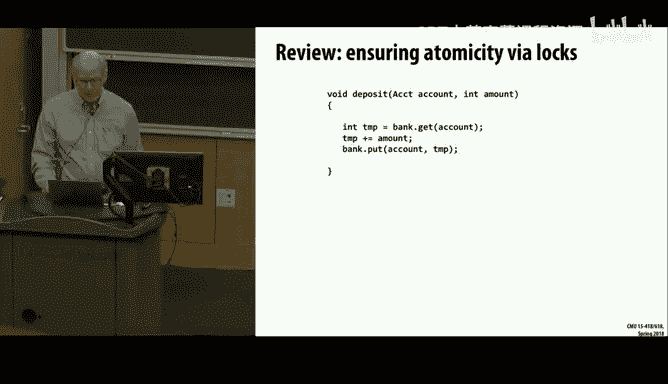
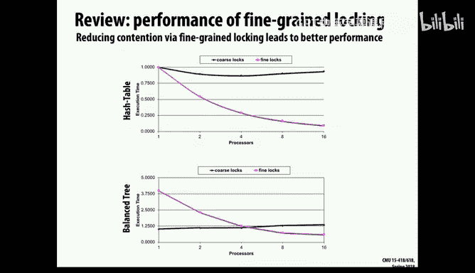
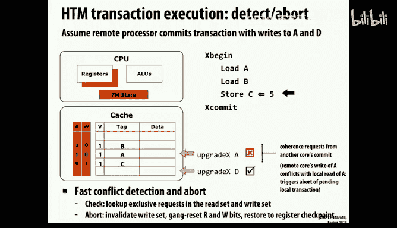

# 25：事务内存

在本节课中，我们将学习一种更高级的同步抽象概念——事务内存。我们将探讨其核心思想、优势、实现方法，并与之前学习的低级同步原语进行对比。

上一节我们介绍了无锁队列的实现以及ABA问题的解决方案。本节中，我们来看看一种旨在简化并发编程的更高层次抽象。

## 事务内存的动机

传统的基于锁的同步方法存在诸多挑战：
*   **编程复杂且易错**：使用`compare-and-swap`等低级原语构建无锁数据结构非常繁琐且风险高，在不同硬件平台上可能出现意外行为。
*   **可组合性差**：当操作涉及多个锁时，容易引发死锁，程序员必须精心设计锁的获取顺序。
*   **缺乏原子性与隔离性**：简单的锁无法保证复杂操作的“全有或全无”（原子性），也无法保证外部观察者看不到操作的中间状态（隔离性）。

事务内存（Transactional Memory）的理念借鉴自数据库领域，旨在让程序员以声明式的方式指定代码块应原子执行，而由系统（编译器、运行时、硬件）负责处理底层的同步细节。

事务内存期望提供以下ACID特性（源自数据库）：
*   **原子性（Atomicity）**：事务中的所有操作要么全部完成，要么全部不发生。
*   **一致性（Consistency）**：事务执行前后，系统都处于一致状态。
*   **隔离性（Isolation）**：并发执行的事务彼此隔离，一个事务的中间状态对其他事务不可见。
*   **持久性（Durability）**：已提交的事务结果是永久性的（在内存系统中通常隐含此特性）。

## 事务内存的优势示例

考虑一个哈希表与平衡二叉树的并发操作性能对比研究：
*   **粗粒度锁**：锁住整个数据结构，严重限制了并发性。
*   **细粒度锁**（如为每个链表节点或树节点加锁）：提升了并发性，但在树结构中，访问不同分支的线程仍可能在根节点附近发生串行化。

事务内存方案允许线程乐观地执行操作，仅在提交时检测冲突。对于二叉树，即使多个线程访问不同叶子节点，只要它们的读写集不冲突，就可以并发提交，从而避免了根节点的瓶颈。

## 实现事务内存的关键机制

实现事务内存主要需要解决两个问题：**数据版本管理**和**冲突检测**。

### 数据版本管理

数据版本管理决定了如何暂存事务中的写操作，以便在需要中止时能够回滚。主要有两种策略：

以下是两种主要的数据版本管理策略：

1.  **积极更新（Eager / Undo-Logging）**
    *   **做法**：立即将新值写入内存，同时将旧值记录在**撤销日志**中。
    *   **提交**：成功则丢弃日志。
    *   **中止**：遍历撤销日志，将内存值恢复为旧值。
    *   **挑战**：需要额外机制保证隔离性，因为新值在提交前就已可见。

2.  **延迟更新（Lazy / Deferred-Update）**
    *   **做法**：将写操作缓存在一个**写缓冲区**中，不立即修改实际内存。
    *   **提交**：将缓冲区中的所有更新一次性应用到内存。
    *   **中止**：直接丢弃写缓冲区。
    *   **优势**：天然提供了隔离性，因为实际内存直到提交前都未改变。
    *   **挑战**：提交过程需要原子性地完成所有更新，可能更复杂。

### 冲突检测

冲突检测决定何时允许事务提交或必须中止。也有两种主要哲学：

以下是两种冲突检测策略：

1.  **悲观检测**
    *   **理念**：假定冲突很可能发生，在事务执行过程中持续监控读写集。
    *   **做法**：一旦检测到潜在冲突（如其他事务写入了本事务读过的数据），立即采取行动（如中止或暂停当前事务）。
    *   **优势**：可以更早地中止注定失败的事务，避免无用功；有时可通过暂停而非中止来解决冲突。
    *   **劣势**：实现逻辑复杂，可能引入活锁（两个事务相互导致对方重启）。

2.  **乐观检测**
    *   **理念**：假定冲突很少发生，允许事务不受干扰地执行完毕。
    *   **做法**：在提交时刻，检查事务的读写集是否与在此期间提交的其他事务的写集冲突。
    *   **优势**：实现相对简单，尤其在硬件中易于实现。
    *   **劣势**：可能做了很多工作后才发现冲突并中止，造成浪费；策略相对保守。

## 硬件事务内存（HTM）实践

现代处理器（如某些Intel CPU）提供了硬件事务内存支持。它通常利用现有的缓存一致性协议来跟踪读写集（以缓存行为粒度）。

**基本工作流程**：
1.  事务开始时，处理器记录寄存器状态，并开始监控特定缓存行的访问。
2.  执行期间，加载操作会标记缓存行为“已读”，存储操作会标记缓存行为“已写”（值可能暂存在本地缓存，未全局可见）。
3.  如果监控的缓存行被其他核心无效化（表明被修改），则检测到冲突，当前事务中止。
4.  提交时，尝试将本地缓存的写操作原子性地变为全局可见。如果成功，则事务提交；如果失败（如由于冲突），则事务中止。

**Intel TSX 实现示例**：
Intel 提供了类似 `XBEGIN`、`XEND`、`XABORT` 的指令来支持HTM。程序员需要提供事务代码段和一个回退代码路径（通常是用传统锁实现的相同逻辑），以备事务多次失败后使用。

**硬件事务内存的局限性**：
*   **容量有限**：受限于CPU缓存的结构和大小，能够跟踪的读写集大小是有限的。
*   **指令限制**：某些指令（如I/O操作）不能在事务内执行。
*   **始终需要回退路径**：由于可能因各种原因（冲突、容量溢出、不支持指令）导致事务中止，程序员必须编写备用的同步方案。

## 软件事务内存（STM）

软件事务内存完全在软件层（库或运行时系统）实现事务语义。它更灵活，不受硬件限制，但开销通常比HTM高。STM可以实现更复杂的冲突检测和版本管理策略，并且通常以对象为粒度进行管理。

本节课中我们一起学习了事务内存的概念，它是一种旨在简化并发编程的高级同步抽象。我们了解了其相对于传统锁的优势（如原子性、隔离性、避免死锁），并探讨了实现事务内存的核心机制：数据版本管理（积极vs延迟更新）和冲突检测（悲观vs乐观）。最后，我们简要介绍了硬件事务内存（HTM）的基本原理和实践中的局限性。事务内存虽然尚未成为主流编程模型，但它为解决并发编程的复杂性提供了一个有前景的方向。