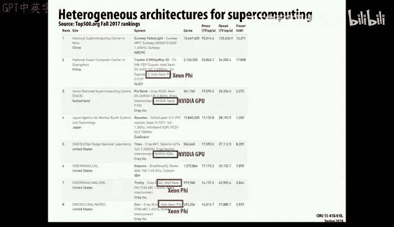

# 26：异构计算与硬件加速

在本节课中，我们将探讨异构计算环境带来的优势，以及从纯软件映射到更接近硬件的设计所带来的好处。我们将看到，从手机到超级计算机，都混合使用了不同类型的计算引擎，而功耗已成为当今计算机设计中的核心制约因素。

上一节我们讨论了并行计算的基本模型，本节中我们来看看当计算资源固定时，如何在“少量强大核心”与“大量简单核心”之间做出权衡。

## 核心数量与性能的权衡

假设我们拥有固定的芯片面积。我们的选择是：制造少量性能强大的“胖核心”，还是大量性能较弱的“瘦核心”。这并非简单的等量交换，因为根据阿姆达尔定律，并行加速受限于程序中无法并行化的串行部分。

阿姆达尔定律的公式可以描述为：

**Speedup = 1 / [(1 - F) + (F / N)]**

其中：
*   **F** 是程序中可被并行化的部分比例。
*   **N** 是并行处理器的数量。

这个公式表明，即使并行部分（F）很大，但只要存在一小部分串行代码（1-F），它就会成为整体性能提升的瓶颈。

为了更具体地分析，我们引入一个资源模型。假设芯片总资源为 **N**（以基础小核心为单位），每个核心分配的资源为 **R**，则核心数量为 **N / R**。单个核心的性能是其资源 **R** 的函数，我们假设为 **perf(R)**，例如 **perf(R) = sqrt(R)**，表示随着资源增加，性能提升存在边际递减效应。

以下是不同并行化程度（F值）下，整体性能随核心资源配置（R值）变化的分析：

*   **高并行度（如 F=0.9999）**：最佳策略是使用大量小核心（R值小），以获得接近线性的性能提升。
*   **中等并行度（如 F=0.9）**：存在一个最优的 R 值，使得整体性能最佳，这可能意味着核心规模需要比基础核心更大一些。
*   **低并行度（如 F=0.5）**：性能提升有限，即使增加核心数量或增大单个核心，收益也不明显。

这些曲线最终都收敛于一个点：即整个芯片只做一个超大核心（R = N）时的性能。这个模型表明，如果应用程序的并行化程度不高，无论是使用少量大核心还是大量小核心，都难以获得理想的性能提升。

## 异构核心架构的优势

上述分析引出一个问题：我们是否可以做得更好？与其使用同构的核心，不如采用异构设计：即一个强大的“胖核心”配合许多简单的“瘦核心”。

在这种架构下，我们可以尝试将程序的**串行部分**映射到胖核心上执行，而将**并行部分**分发到大量瘦核心上执行。数学模型显示，这种架构在面对不完美的并行化（即存在串行部分）时，性能下降曲线更为平缓。

例如，对于99%并行化的程序，异构架构能在很宽的资源配置范围内保持接近理想的性能。即使对于存在少量（如2.5%）串行代码的程序，性能也能维持在一个较高的水平。这表明，将一部分芯片面积专用于串行处理，同时用大量小核心处理并行任务，是一个有效的设计思路。

当然，这个模型基于一个乐观的假设：我们能完美地将串行计算映射到胖核心上。在实际工程中，这极具挑战性，因为工作负载特征复杂且多变。

## 现实世界中的异构计算

异构计算的思想已在当前各类计算设备中广泛应用。

**个人计算机与服务器**：现代处理器（如Intel Skylake）在同一芯片上集成了通用CPU核心、GPU图形处理单元以及媒体处理引擎。集成GPU可以共享最后一级缓存，实现与内存系统的高性能紧密耦合，避免了独立显卡需要通过总线拷贝数据带来的性能损失。

**移动设备**：手机和处理器（如Apple A系列、NVIDIA Tegra）是“片上系统”（SoC）的典型代表。它们集成了多核CPU、GPU以及众多专用硬件加速器（如视频编解码器、图像信号处理器、数字信号处理器）。苹果等公司通过自研芯片，可以协同设计硬件与手机功能，实现能效和性能的优化。

**超级计算机**：世界顶尖的超算系统普遍采用CPU+加速器的异构模式。例如，美国的“泰坦”超级计算机在原有CPU集群中加入了NVIDIA GPU，获得了10倍的性能提升。中国的“神威·太湖之光”则使用了自主研发的众核处理器。功耗是制约超算规模的关键因素，而加速器通常能提供更高的每瓦特性能。

## 硬件加速与能效

推动异构计算和硬件加速的一个根本动力是**功耗**。无论是在需要限制电费和数据中心散热的大型超算，还是在追求续航和手持温度的移动设备中，功耗都是核心约束。

对典型程序运行的功耗分析显示：
*   约25%的功耗用于时钟和电路基础开销。
*   约28%的功耗用于在处理器、缓存和内存之间移动数据。
*   约42%的功耗用于指令获取、解码、分支预测等控制逻辑。
*   只有相对较小的一部分功耗真正用于执行应用程序的“有用工作”。

因此，如果能减少控制逻辑和数据移动的开销，让硬件更专注于计算本身，就能显著提升能效。

以下是不同硬件平台执行FFT计算的能效对比：
*   **专用集成电路（ASIC）**：性能和能效最佳，但完全不可编程，设计成本高昂。
*   **现场可编程门阵列（FPGA）**：性能和能效介于ASIC和GPU之间，具有一定可编程性，但编程难度高。
*   **图形处理器（GPU）**：相比CPU有显著提升，尤其适合并行计算任务。
*   **通用处理器（CPU）**：灵活性强，但能效最低。

硬件加速在移动设备上效果显著。例如，手机视频播放续航长，是因为采用了专用的H.264硬件解码器，其功耗远低于软件解码。数码相机能快速进行JPEG压缩，也是依靠专用硬件。手机中的图像处理功能（如全景拼接、防抖、人像模式）也越来越依赖专用的图像信号处理器（ISP）或AI加速单元。

极端案例如D. E. Shaw Research设计的“Anton”超级计算机，它完全专用于分子动力学模拟，在特定领域比通用超算快数千倍，是专用硬件能力的极致体现。

## 挑战与未来方向

尽管异构计算优势明显，但也带来巨大挑战：

1.  **编程复杂性**：为CPU、GPU、DSP、FPGA等不同架构编写和优化程序是截然不同的体验。将应用迁移到不同硬件平台需要大量工作。
2.  **软件维护**：为多种硬件目标维护同一软件功能，增加了开发、测试和调试的复杂性。
3.  **负载均衡与资源匹配**：如果某个专用单元（如纹理单元）成为瓶颈，其他强大的计算单元（如SIMD单元）就会闲置，造成资源浪费。

此外，数据移动的能耗已成为关键问题。研究表明，从DRAM中读取数据的能耗，比执行一次浮点运算高出数个数量级。因此，未来的优化方向包括：
*   通过算法设计减少数据移动，使计算更贴近数据。
*   利用数据压缩技术，用计算开销换取通信开销的降低。
*   随着某些计算模式（如加密）的标准化，将其以专用指令或硬件单元的形式集成到通用处理器中。

本节课中我们一起学习了异构计算的基本理念、其在从手机到超算等各种设备中的应用，以及硬件加速带来的显著能效提升。我们也探讨了由此带来的编程和系统设计挑战。在功耗成为核心制约因素的今天，如何智能地混合使用不同类型的计算单元，并高效地将计算任务映射到它们之上，是计算机系统架构中一个非常活跃且至关重要的领域。