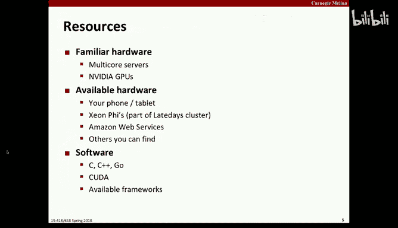
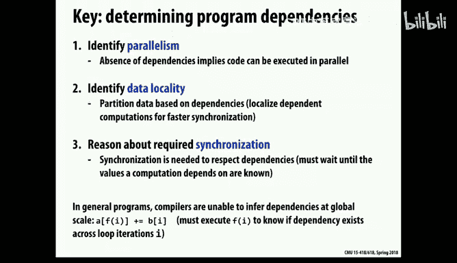
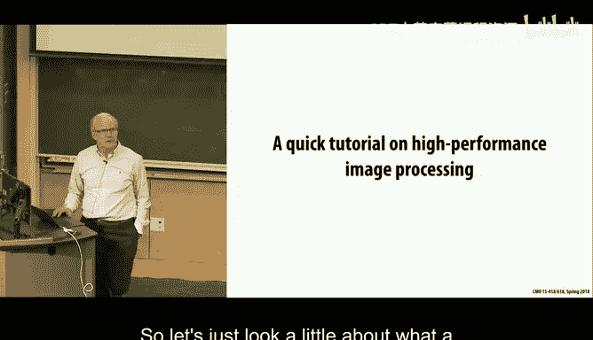
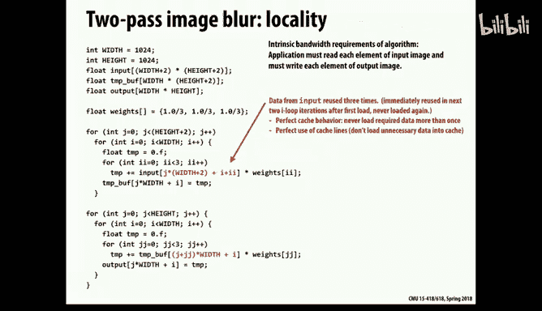

# 27：领域特定编程系统 🚀


在本节课中，我们将探讨如何通过领域特定编程语言（DSL）来应对并行编程的复杂性，实现高生产力和高性能。我们将重点介绍两个案例：用于科学计算的Liszt和用于图像处理的Halide。

## 项目概述与时间安排 📅

本节课开始时，我们首先讨论了课程项目。项目占总成绩的25%，相当于两个重要作业的工作量。项目主题非常开放，旨在激发你的兴趣，让你在时间限制内尽可能深入地探索。

项目截止日期安排紧凑，旨在确保持续进展。关键节点包括提案检查点、详细提案、进展报告、最终书面报告以及海报展示会。所有截止日期都是严格的，没有宽限日。

## 项目主题选择 💡



以下是项目主题通常可以归类的几个方向：

*   **应用导向型**：选择一个你个人或专业上感兴趣的计算密集型应用（如计算机视觉、计算摄影），并探索如何使其在并行机器上高效运行。需要注意的是，重点应放在并行计算部分，而非应用本身的实现细节。
*   **系统研究型**：专注于并行系统的某个方面，例如比较不同的同步原语（如事务内存）、研究Intel的硬件支持，或者为高级语言（如Java、Python）开发并行计算扩展。
*   **平台评估型**：评估特定应用在不同平台（如GPU vs CPU）上的性能，或者研究使用Go等高级语言进行并行编程能达到的性能极限。

你可以从零开始编写代码，也可以基于现有专家编写的软件包进行深入研究。如果使用现有代码，我们期望你能进行更深入的测量、实验、调优和优化，探索不同实现之间的权衡。

## 可用资源与注意事项 ⚙️

在硬件方面，你可以使用课程提供的GPU、GHC集群、Zion高性能节点，甚至可以探索手机、平板（如ARM GPU）或树莓派上的并行计算。如果需要，我们也可以提供Amazon Web Services的预算支持。软件方面没有特定限制，你可以选择任何编程语言和可用软件包。

需要谨慎考虑的项目方向包括FPGA编程，除非你已有丰富经验，否则在有限时间内完成一个有意义的项目可能非常困难。

## 并行编程的挑战与机遇 🔄

上一节我们介绍了项目相关事项，本节中我们来看看当前并行编程领域面临的挑战。为了获得最佳性能，程序员通常需要在多个层次进行优化：从利用CPU的向量指令（SIMD）和多线程，到协调多核及多服务器间的任务。此外，异构系统（如CPU+GPU）的出现使得软件迁移和优化变得更加复杂。

不同的编程模型（如SIMD、OpenMP、MPI）对应不同的机器抽象，它们之间通常不兼容，迁移程序可能意味着重大重写。这导致了软件开发和维护的巨大负担。

## 领域特定语言的愿景 🎯

那么，我们能否做得更好？能否找到一种方法，使编写的代码不仅能高效运行在今天，也能适应明天的机器，而无需进行彻底的堆栈重写？

这引出了我们对软件的三点期望：**通用性**（能编写各种程序）、**高性能**和**高开发效率**。然而，通常很难同时满足这三点。例如，C/C++通用且性能高，但开发效率较低；Python等解释型语言通用且开发效率高，但性能损失巨大。

领域特定语言（DSL）的策略是：**牺牲部分通用性，专注于特定应用领域，以同时获得高开发效率和高性能**。SQL数据库查询语言就是一个成功的DSL例子。用户编写高级查询，查询优化器则负责将其高效地映射到具体硬件上执行。

## 案例一：用于科学计算的Liszt 🔬

现在，让我们深入第一个案例：**Liszt**。这是一种专为求解偏微分方程（PDE）等网格类问题设计的语言。这类问题通常涉及空间和时间的连续域，需要通过离散化（将空间划分为网格，时间划分为步长）来求解。

Liszt的核心抽象是**图**（或网格）。它允许你定义图结构（顶点和边），并在其上定义场量（如温度、热通量）。然后，你可以编写类似以下的代码来描述计算：


```lisp
// 示例：基于温度差计算热通量（概念性代码）
for each edge e in mesh:
    v1 = head(e)
    v2 = tail(e)
    dist = distance(position(v1), position(v2))
    temp_diff = temperature(v1) - temperature(v2)
    flux(v1) += temp_diff / dist
    flux(v2) -= temp_diff / dist
```

这段代码遍历所有边，根据相连顶点的温度差和距离更新顶点的热通量。Liszt采用**单次赋值**和已知的归约操作，使得编译器能够进行依赖分析，理解数据读写模式。

### 从同一描述生成不同并行代码 🛠️

Liszt的强大之处在于，它能从同一高级描述自动生成针对不同并行架构的优化代码。

**1. 面向分布式集群（MPI风格）的映射：**
编译器会分析网格和数据依赖，自动进行**空间分区**，将网格划分为子区域分配给不同处理器。它会计算所需的**幽灵单元**（边界副本），并自动生成处理器间交换这些边界数据的通信代码。即使对于不规则网格，这个过程也能自动化完成。

**2. 面向GPU的映射：**
在GPU上，我们可能为每条边分配一个线程来计算通量更新。但多个边可能写入同一个顶点，造成写冲突。Liszt编译器会构建一个**冲突图**，并通过**图着色算法**进行调度。相同颜色的边（不冲突）可以并行执行，不同颜色的边顺序执行。这样就将潜在的原子操作冲突转化为有序的高效执行。



## 案例二：用于图像处理的Halide 📸

接下来，我们看看第二个案例：**Halide**。这是一个专门为图像处理设计的领域特定语言，已被Google等公司用于生产环境。

图像处理中常见的一种操作是**卷积**（或滤波），例如对每个像素及其邻域进行加权平均以实现模糊效果。一个简单的3x3平均模糊的串行C代码可能如下：


```c
for (int y = 1; y < height-1; y++) {
    for (int x = 1; x < width-1; x++) {
        output[y][x] = (input[y-1][x-1] + input[y-1][x] + ... + input[y+1][x+1]) / 9;
    }
}
```

直接计算需要每个像素进行9次乘加操作（对于n x n核是n²次）。一个优化技巧是**分离卷积**：先进行水平方向的1D平均，再进行垂直方向的1D平均。这能将计算量从n²降至2n，但需要引入一个与图像等大的中间缓冲区，可能影响缓存效率。

### Halide的高层抽象与调度分离 ✨


Halide的关键创新在于将**算法描述**（要计算什么）和**调度策略**（如何计算，包括并行、分块、向量化）清晰地分离开。



在Halide中，上述模糊操作可以非常简洁地描述：

```python
# 算法描述：要计算什么
blur_x = Halide.Func()
blur_y = Halide.Func()
x, y = Halide.Var(), Halide.Var()
blur_x[x, y] = (input[x-1, y] + input[x, y] + input[x+1, y]) / 3  # 水平模糊
blur_y[x, y] = (blur_x[x, y-1] + blur_x[x, y] + blur_x[x, y+1]) / 3 # 垂直模糊
```

然后，你可以独立地指定调度策略来优化性能：



```python
# 调度策略：如何计算以优化性能
blur_y.split(y, yo, yi, 32).parallel(yo).vectorize(x, 8)
blur_x.compute_at(blur_y, yi).store_root().vectorize(x, 8)
```

这段调度代码指示编译器：在y维度上分块（块大小32）并进行并行化；在x维度上进行向量化（8宽）；并指定中间结果`blur_x`在计算`blur_y`的每个内循环块时局部计算和存储，以提升缓存局部性。

### 自动调度与性能 🏆

更令人兴奋的是，基于Halide框架的研究（如CMU与Google的合作）已经能够开发**自动调度器**。给定算法描述后，自动调度器可以搜索巨大的调度策略空间，找到接近甚至超越人类专家手工调优性能的方案。实验表明，自动调度器在多数情况下能击败花费数小时进行手动调优的Halide专家。

## 总结 📝

本节课中我们一起学习了领域特定编程系统如何应对现代并行计算的挑战。

*   我们首先了解了课程项目的开放性、主题选择方向以及严格的时间安排。
*   接着，我们探讨了当前并行编程在多层次优化和异构系统下面临的复杂性，以及在不同编程模型间迁移软件的困难。
*   我们引入了**领域特定语言**的概念，其核心思想是通过**牺牲通用性**，在特定应用领域内同时追求**高开发效率**和**高性能**。
*   我们深入研究了两个典型案例：
    *   **Liszt**：用于科学计算网格问题。它提供基于图的高层抽象，允许编译器自动进行依赖分析，并从同一描述生成面向分布式内存集群（使用分区和幽灵单元）或GPU（使用图着色解决写冲突）的高效并行代码。
    *   **Halide**：用于图像处理。其关键优势在于**算法与调度分离**。用户用高级语言描述计算内容，然后可以独立指定或由自动调度器优化计算策略（如并行、分块、向量化），从而在复杂硬件上实现极致性能。

这些例子展示了通过提升抽象层次、赋予编译器更多领域知识，可以显著简化并行编程，并自动生成适应不同架构的高性能代码，代表了并行编程未来发展的重要方向之一。