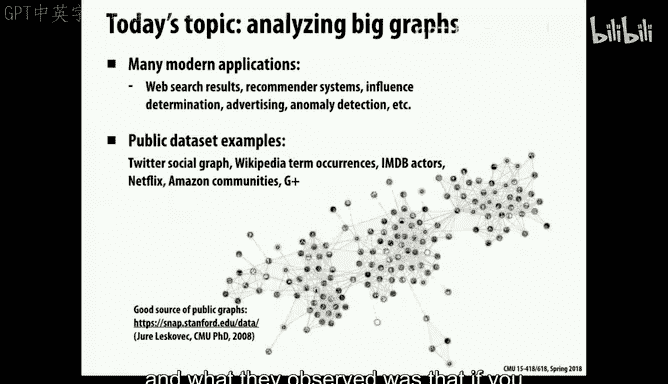
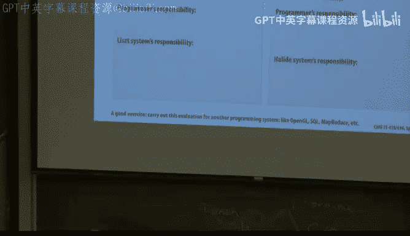
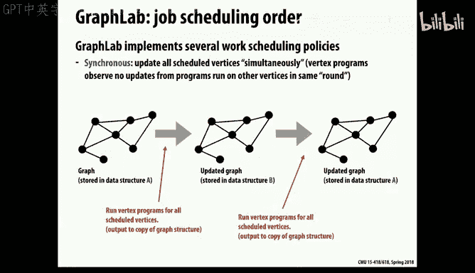

# 28：图分析系统 🚀

在本节课中，我们将继续探讨领域特定系统，但重点转向一类更常见的实现形式：领域特定编程系统或软件包。这些系统不发明全新的语言，而是通过库、运行时系统和编译器支持，在现有语言（如C++）中提供特定领域的强大抽象和优化能力。我们将以图分析为例，深入探讨这类系统的设计理念、实现机制以及如何通过数据压缩和存储优化来提升性能。



上一节我们讨论了领域特定语言（DSL），它们为特定任务类别设计了全新的编程语言。本节中，我们来看看另一类更广泛存在的解决方案：领域特定编程系统。

## 图分析的重要性与应用 📈

图分析在21世纪初开始兴起，其核心在于认识到许多复杂关系可以抽象为图结构，分析这些图的结构本身就能带来巨大价值。



*   **网页排名**：谷歌的创始人发现，通过分析网页（节点）和超链接（边）构成的图，可以推断出哪些页面内容最具权威性，从而诞生了PageRank算法。
*   **社交网络分析**：在Facebook的好友关系或Twitter的关注者网络中，分析整体结构可以洞察行为模式、社区发现等。
*   **广泛的应用**：许多公司基于图分析构建了核心业务，这不仅是计算机科学的热点，也催生了社会科学研究的新方法。

面临的挑战在于，这些图可能极其庞大，包含数百万甚至数十亿的节点和边，将其映射到标准处理器上非常困难。此外，我们也不希望为每种算法都从头实现底层逻辑。因此，图分析是构建领域特定系统的绝佳领域。

## 领域特定系统的目标 ⚖️

我们再次回顾性能、完备性和生产力这三个维度。像C/C++这样的通用语言完备性高，通过努力也能获得高性能，但生产力较低。领域特定系统的目标是在这个三角形中找到一个更优的平衡点，即**在特定领域内，通过提供高级抽象来兼顾生产力和性能**。

关键在于，系统需要能够融入该领域专家已知的性能优化技巧。这可以通过两种方式实现：
1.  系统自身极其智能，能自动完成优化。
2.  系统为用户提供足够的“钩子”或控制杆，让开发者能够进行调优，而无需重写底层代码。

我们之前在讨论Halide图像处理库时已经见过类似思路：它提供了一个独立的语言来描述如何将图像处理流水线分解、分块以及映射到向量单元上，让程序员能以高级指令的方式完成底层优化。

## PageRank算法示例 🔍

PageRank是图分析中的一个经典算法，其核心思想是：一个网页的重要性由其入链（指向它的链接）的质量决定。这类似于“名人效应”——一个人因为认识其他名人而变得出名。

算法公式化表示如下：
```
PR(p) = (1 - α) / N + α * Σ_{q∈In(p)} (PR(q) / OutDeg(q))
```
其中：
*   `PR(p)` 是页面p的PageRank值。
*   `α` 是阻尼因子（通常为0.85），确保算法稳定收敛。
*   `N` 是图中总节点数。
*   `In(p)` 是指向页面p的页面集合。
*   `OutDeg(q)` 是页面q的出链数量。

该算法是一个迭代过程，每个节点的值基于其邻居节点的值进行更新，直到所有值收敛。一个重要的特性是，在温和的假设下，无论更新顺序如何，它都会收敛到唯一值，这为实现提供了灵活性。

## GraphLab：一个图分析编程系统 🛠️

GraphLab是一个源自CMU的项目，它提供了一个在C++中嵌入的框架，用于描述PageRank这类图算法。其设计初衷是为了将大规模图计算映射到由数百或数千台机器组成的集群上。

以下是GraphLab的核心抽象和工作原理：



### 计算抽象
系统将图视为包含状态（节点和边上的数据）的全局对象。计算由顶点程序定义，每个顶点程序只能访问其“作用域”内的信息，即该顶点、其边及其邻居的数据。

### 编程模型
用户编写C++函数来描述在每个顶点上执行的单步计算。例如，PageRank的顶点更新函数可以简洁地写成：
```cpp
void pagerankUpdate(Vertex& vertex) {
    double sum = 0;
    for (Edge& edge : vertex.inEdges()) {
        sum += edge.source().rank / edge.source().outDegree();
    }
    vertex.rank = (1 - ALPHA) / totalVertices + ALPHA * sum;
}
```
系统提供了遍历邻居、获取度数等原语。


### 执行引擎
系统根据用户编写的顶点程序，自动生成用于 Gather（从边和邻居收集信息）、Apply（应用更新）和 Scatter（将信息散射到邻边）的代码。一个调度器负责管理顶点操作的执行顺序。

顶点程序可以通过`signal`函数通知调度器，当前顶点或邻居顶点需要被重新调度（例如，当其值变化超过阈值时）。这实现了基于变化的异步更新传播，直到整个图收敛。

### 可配置的策略
GraphLab提供了多种执行策略供用户选择，以适应不同算法的需求：
*   **一致性模型**：例如，是否允许同时对同一顶点进行读写。
*   **调度策略**：
    *   **同步**：像BSP模型，所有顶点基于上一轮状态并行更新，然后同步。实现简单，但收敛可能较慢。
    *   **图着色**：保证相邻顶点不同时更新，避免冲突。
    *   **动态异步**：由`signal`驱动，只更新发生变化的顶点及其受影响邻居，通常收敛更快。

这种将调度、一致性等关注点分离并作为可配置选项的设计，使得系统在保持核心抽象简单的同时，又能提供足够的灵活性和性能优化空间。

## 性能挑战与优化策略 ⚡

图算法通常对硬件不友好：计算密度低（算术强度低），数据访问模式不规则，内存带宽常常成为瓶颈。针对这些挑战，出现了以下优化思路：

### 单机与集群的权衡
早期认为处理十亿级边的大图必须使用大型集群（如Hadoop）。但GraphChi项目提出了相反思路：通过巧妙的磁盘存储和访问调度，在单台机器（甚至是一台Mac mini）上处理大规模图。

### 流式处理与分片（Sharding）
对于无法完全装入内存的图，可以采用流式处理模型。GraphChi的核心思想是将图**分片**：
1.  将节点划分为多个区间（分片）。
2.  每个分片存储属于该区间节点的**所有入边**，并按源节点排序。
3.  处理时，依次将每个分片（及其关联的边数据）作为“滑动窗口”载入内存。
4.  由于边已排序，从其他分片读取所需数据时也是连续的，从而最大化I/O效率。

这种方法能以有限的内存，通过多次顺序磁盘访问来处理远超内存容量的大图。


### 数据压缩
由于图算法常受内存带宽限制，且计算资源相对空闲，可以考虑使用轻量级数据压缩来减少数据体积，即使需要额外的解压缩计算也是划算的。

Ligra系统采用了一种基于**差分编码**和**游程编码**的压缩方法：
1.  **排序与差分**：首先将每个顶点的邻居列表排序，然后不存储邻居ID的绝对值，而是存储相邻ID之间的差值。对于许多现实世界的图（如社交网络、网页链接），这些差值通常很小。
2.  **字节压缩**：识别出差值可以用1字节、2字节或4字节表示的连续区间，并用标记位指示区间长度和编码方式。这样，一个长的邻居列表就被压缩成一系列带标记的字节块。

例如，对于顶点ID 32，其排序后的邻居列表为 `[5, 6, 10, 15, 100]`。存储时先存第一个邻居的相对偏移 `5-32 = -27`，然后存后续差值 `[1, 4, 5, 85]`。系统会尝试用最少的字节来编码这些数字。

这种压缩在数据加载时进行轻量解码，显著减少了存储占用和I/O流量，尤其适用于图结构相对静态、可以预处理的场景。

## 总结 📝

本节课中我们一起学习了领域特定编程系统在图分析领域的应用。我们了解到：

1.  **图分析**是一个重要且广泛的应用领域，其核心是对关系进行抽象和迭代计算。
2.  **GraphLab** 等系统通过提供以顶点为中心的高级编程抽象，将程序员从复杂的并行调度和一致性管理中解放出来，提升了开发生产力。
3.  实现高性能的关键在于**提供可配置的优化策略**（如调度和一致性模型），让领域专家能够引导系统获得接近手写优化代码的性能。
4.  针对图计算固有的性能挑战（不规则访问、低算术强度），可以通过**创新的存储布局**（如GraphChi的分片流式处理）和**轻量级数据压缩**（如Ligra的差分游程编码）来显著提升单机或集群的处理能力。

这些案例表明，成功的领域特定系统不仅在于发明一个优雅的抽象，更在于让该抽象能够高效地映射到底层硬件，并通过灵活的设计容纳各种性能优化技巧。