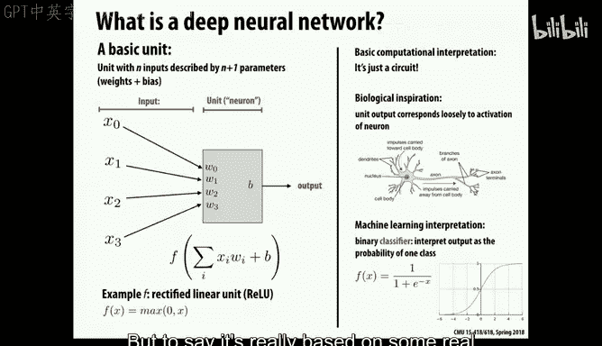
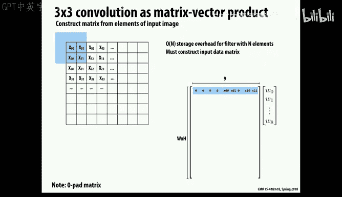
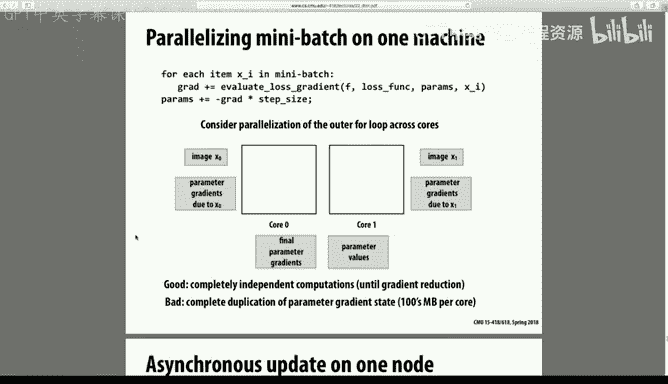
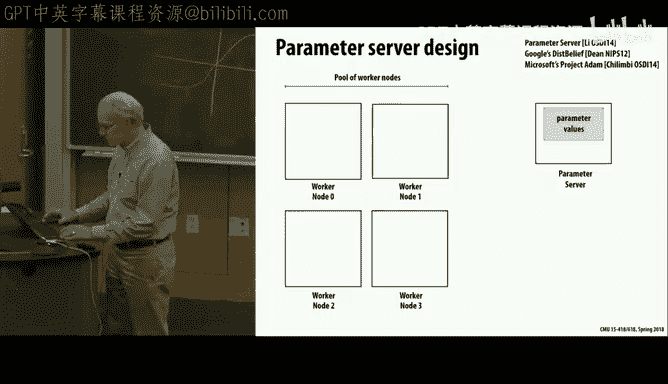

# 29：深度神经网络与并行计算 🧠


在本节课中，我们将探讨并行计算与深度神经网络之间的关系。深度神经网络已经彻底改变了人工智能和机器学习领域，其影响范围广泛，从图像识别到语音处理和语言翻译。我们将首先了解神经网络的基础知识，然后分别讨论其评估（推理）和训练过程，并分析其中涉及的并行计算挑战与优化策略。




## 神经网络基础 🧱

上一节我们概述了课程主题，本节中我们来看看神经网络的基本计算单元。神经网络的基本思想源于对计算网络的思考，其核心计算单元执行加权求和运算。

一个基本单元接收一些实数值输入和对应的实数值权重，计算加权和并加上一个偏置项，然后对其应用一个非线性函数。过去人们设计了各种复杂的非线性函数，但近年来，一个极其简单的函数变得非常有效，即 **ReLU（Rectified Linear Unit）** 函数，其公式为：

`output = max(0, input)`

这个函数是分段线性的：如果输入值为正，则输出等于输入值；如果输入值为负，则输出为零。它受到生物神经元工作方式的启发，但并非精确模拟。

## 神经网络的两种模式：评估与训练 ⚙️


神经网络的应用主要分为两种模式。

**评估模式**：在网络训练完成后，我们反复使用它进行预测或分类。例如，将训练好的翻译模型用于实时翻译。这个过程计算量相对较小，但可能需要在手机等资源受限的设备上高效运行。

**训练模式**：这是确定网络所有权重值的过程。它需要海量的计算资源和数据，可能在数据中心耗费数天甚至数周的时间。训练过程远比评估过程计算密集。

接下来，我们将首先聚焦于评估过程，然后再讨论训练。

## 网络结构与卷积层 🕸️

神经网络由这些计算单元（神经元）按一定结构连接而成。输入（如图像）经过网络处理，最终输出分类结果。输入和输出之间的神经元称为“隐藏层”。



网络的结构设计目前仍包含一定的经验成分。一种常见的连接方式是**全连接层**，即某一层的所有神经元都与下一层的所有神经元相连。但这会带来巨大的计算和存储开销。

另一种更高效的结构是**卷积层**，它大量应用于图像处理。卷积操作类似于我们之前学过的图像滤波，但权重可以是任意值，而非均匀权重。关键特性是，**相同的权重集合（卷积核）会应用于输入数据（如图像）的每一个位置**。

卷积神经网络因其权重共享的特性，所需的参数量更少，从而更易于训练、存储和评估。有时，我们还会通过**池化**操作（如最大池化）来降低数据维度，仅保留最重要的特征信息。

以下是卷积层计算的一个简化代码表示，展示了其嵌套循环结构：

```cpp
for (int image = 0; image < batch_size; ++image) {
  for (int out_channel = 0; out_channel < num_filters; ++out_channel) {
    for (int in_channel = 0; in_channel < input_depth; ++in_channel) {
      for (int y = 0; y < output_height; ++y) {
        for (int x = 0; x < output_width; ++x) {
          for (int fy = 0; fy < filter_height; ++fy) {
            for (int fx = 0; fx < filter_width; ++fx) {
              // 计算加权和
              output[image][out_channel][y][x] +=
                weights[out_channel][in_channel][fy][fx] *
                input[image][in_channel][y+fy][x+fx];
            }
          }
        }
      }
    }
  }
}
```

循环的嵌套顺序会影响数据的局部性和缓存性能，因此优化循环结构至关重要。

## 评估阶段的优化策略 🚀

在资源受限的环境（如手机）中进行神经网络评估时，我们需要优化其性能和能效。一个主要挑战是权重数据的存储和访问开销巨大。

为了解决这个问题，可以采用以下几种数据压缩和优化策略：


*   **剪枝**：将绝对值足够小的权重直接设置为零，从而减少计算和存储。
*   **量化**：将权重值聚类到少数几个离散值上。例如，将所有接近2的权重设为2，接近-1的权重设为-1。然后只需存储权重索引和一个小的码表。
*   **编码**：进一步使用霍夫曼编码等无损压缩技术，减少存储每个权重所需的平均比特数。

通过结合这些技术，可以在几乎不影响模型精度的情况下，将模型大小压缩数十倍，从而显著降低存储访问能耗。


## 训练过程与梯度下降 📉

现在，让我们转向计算量更大的训练过程。训练的目标是找到一组权重，使得网络在整个训练集上的预测损失最小化。这是一个涉及数百万甚至数十亿参数的复杂非线性优化问题。

解决此问题的标准方法是**随机梯度下降**。其核心思想是：
1.  计算当前权重下，单个训练样本（或一小批样本）的损失函数相对于每个权重的梯度。
2.  沿着梯度方向，以一个小步长更新所有权重。
3.  重复此过程，直至损失收敛。


梯度通过**反向传播**算法计算。它利用链式法则，从输出层开始，逐层向后计算损失对每一层权重的偏导数。需要注意的是，为了进行反向传播，在前向传播过程中产生的所有中间结果都需要被保存下来。

## 训练阶段的并行化策略 🤖



训练过程在计算和数据量上都极为庞大。我们可以利用以下并行性：

*   **数据并行**：这是最主流的方
法。将训练数据划分到多个处理器（或机器）上。每个处理器用完整的模型权重处理自己的一份数据，独立计算梯度，然后将所有梯度汇总并更新全局权重。这类似于之前作业中的批处理。
*   **模型并行**：将模型本身（不同的层或同一层内的不同部分）划分到多个处理器上。这种方法通信开销较大，实现更复杂，通常用于模型过大无法放入单个设备内存的情况。

在实际的大规模分布式训练中（如谷歌的数据中心），常采用**异步并行**策略。各个计算节点从中央的**参数服务器**获取当前权重，计算梯度后异步地推送回更新。参数服务器负责整合这些更新。这种方法放松了对同步的要求，容忍节点间的延迟和少量不一致，从而提高了整体吞吐量和系统容错性。



## 总结与展望 🔮

本节课我们一起学习了深度神经网络与并行计算的紧密联系。

我们首先介绍了神经网络的基本计算单元和结构，重点讲解了高效的卷积层。然后，我们分别探讨了神经网络在**评估（推理）**和**训练**阶段的挑战。

在评估阶段，我们讨论了通过**循环优化、权重剪枝、量化和编码**等技术来减少计算量和存储访问，以适应边缘设备。

在训练阶段，我们深入分析了**随机梯度下降**和**反向传播**的原理。并详细阐述了如何通过**数据并行**和**异步参数服务器**等策略，在分布式集群上实现大规模并行训练，以处理海量数据和复杂模型。

当前，深度神经网络领域仍在快速发展。硬件方面，出现了专用于矩阵运算的TPU、支持低精度计算的GPU等；软件方面，涌现了TensorFlow、PyTorch、Caffe等高级框架来简化开发。未来，更高效的网络结构、更低的数值精度要求以及新的硬件加速方案将继续推动该领域进步。

---
**版权说明**：
*   本教程内容翻译整理自 CMU 15-418/618 课程讲座《Lecture 29: Parallel Computing and Deep Neural Networks》。
*   原课程版权归卡内基梅隆大学及讲师所有。
*   字幕来源：GPT中英字幕课程资源 - BV18b421J7cA。
*   本教程仅为知识分享与学习用途。