# 30：消息传递与并行运行时实现

在本节课中，我们将学习消息传递（如MPI）和共享内存并行运行时（如OpenMP和Cilk）的内部实现细节。我们将探讨数据如何在处理器间移动、不同的缓冲策略、以及编译器如何将高级并行指令转换为底层的线程操作。

---

## 消息传递的实现细节

上一节我们回顾了并行编程的基本模型。本节中，我们来看看消息传递模型在实际系统中是如何实现的，特别是数据移动和缓冲的关键问题。


消息传递的基本通信操作是发送（send）和接收（receive）。发送方执行发送操作，接收方执行接收操作，这有效地将数据从发送方的私有地址空间复制到接收方的私有地址空间。

消息传递系统之所以流行，一个简单原因是它易于构建大规模并行计算机。与共享地址空间不同，它不需要缓存一致性或内存系统的特殊硬件支持。理论上，任何设备（如手机或物联网设备）都可以通过网络互相发送消息，组成一个大型并行计算机。

在并行计算的整个历史中，这都是一种相当流行的构建大型机器的方式。如今在云计算中，云中的许多服务器也以这种方式运行。当你有独立的刀片服务器或节点时，它们之间不一定有缓存一致性，因此使用消息传递是让软件工作的最简单方法。

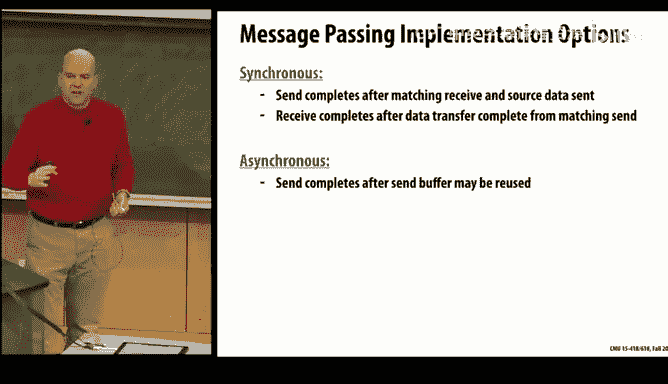

### 与共享地址空间的对比


在讨论消息传递之前，我们先简要对比共享地址空间下的数据通信。

在共享地址空间中，数据通信主要通过缓存进行。当读取一个共享地址时，数据会被拉取到处理器的缓存中。因此，数据的传输主要由读取操作触发。

读取操作涉及将虚拟地址转换为物理地址，然后内存系统硬件根据物理地址查找数据。这可能涉及通过互连网络发送请求到主存节点或其他处理器的缓存（脏副本），然后数据返回。这本质上是一个**请求-响应**协议。

关键点在于：
*   传输中使用的地址是**物理地址**，整个内存系统都理解物理地址的含义。
*   数据到达时，接收方（缓存）已经为其预留了位置。
*   这个过程不需要在地址空间之外进行额外的缓冲。


相比之下，在消息传递中，存在**源地址**和**目标地址**两个不同的地址。发送方在发送时并不知道目标地址，甚至接收方在执行接收操作之前也不知道数据应该放在哪里。

### 同步与异步消息传递

你可能还记得，在消息传递的网格求解器代码示例中，有同步和异步两种版本。
*   **同步消息传递**：发送方会一直阻塞，直到接收方完成接收。
*   **异步消息传递**：发送方将消息缓冲后立即继续执行，接收方稍后再接收。

从高层次看，异步方式听起来更好，因为它不会阻塞发送方。然而，实现细节带来了挑战。

### 同步消息传递的实现

以下是实现同步消息传递数据转移的典型方式：

1.  发送方执行发送操作，但**不立即发送实际数据**。它先发送一个短消息（通知），告知接收方“我有一个消息要发送给你”，其中包含标签等参数。
2.  假设接收方已经执行了匹配的接收操作，并准备接收。接收方收到通知后，会回复一个确认消息，其中包含**目标地址**（数据应存放的位置）。
3.  发送方收到确认后，知道了目标地址，便可以执行**直接内存访问（DMA）** 传输，将数据从发送方地址空间的已知位置复制到接收方地址空间的已知位置。

这种方法的优点是，一旦发送方知道目标地址，数据可以直接复制到正确位置，无需在地址空间之外进行额外缓冲。主要缺点是性能：发送方必须阻塞等待，直到接收方准备好。如果接收方尚未执行接收操作，发送方可能被阻塞任意长的时间。

### 异步消息传递的实现

在异步消息传递中，发送方执行发送后，传输在后台进行，发送方继续执行。

**乐观异步方法**：
发送方**立即开始发送实际数据**。数据到达接收方时，接收方可能尚未执行接收操作，因此不知道数据应存放在何处。此时，数据必须被放入一个**缓冲区**。消息传递层必须在系统级别分配缓冲区空间来保存这些消息。当接收方最终执行匹配的接收操作时，它从缓冲区中查找并复制数据到本地地址空间。

这种方法性能上具有吸引力，因为发送方不会被阻塞，并能尽快移动数据。但存在严重问题：消息可能很大，且任意数量的处理器都可能向一个处理器发送大量消息。随着处理器数量增加，缓冲区空间可能无限增长，甚至耗尽内存。

**保守异步方法**：
这种方法结合了同步和异步的特点。发送方执行发送后，**立即发送一个短通知消息**（而非实际数据），然后继续执行。接收方在准备好接收（即执行了匹配的接收操作）后，发送一个确认消息回发送方，其中包含目标地址。发送方在后台（例如通过事件处理程序）收到此确认后，再进行DMA传输。

这种方法将缓冲问题从接收方转移到了发送方。如果发送方发送了大量消息，而接收方尚未接收，发送方的缓冲可能增长。然而，这通常比接收方缓冲溢出更容易处理，因为发送方本地可以感知缓冲耗尽，并自然地通过阻塞发送方来进行流量控制（流控），这比要求远方的发送方停止发送更简单。

### 混合方案：基于信用的方法

为了结合乐观方法的速度和保守方法的安全性，可以采用一种**基于信用（Credit-Based）** 的混合方案。

其思想是：
1.  接收方为每个发送方**预分配**一定量的缓冲区空间（例如 4KB）。
2.  消息传递层会向发送方通告其可用的信用额度（即剩余缓冲区大小）。
3.  发送方在发送消息时，会检查消息大小是否小于其当前信用额度。
    *   如果**是**，它可以**乐观地**立即发送数据，因为它知道接收方有空间存放。
    *   如果**否**（信用不足），则必须采用**保守的**握手方式。
4.  当接收方消费（处理）消息后，会在反向通信（如发送消息给原发送方时）中“捎带”更新对方的信用额度。

这种方法对程序员是透明的，由消息传递层内部管理。

### 消息传递实现中的关键问题

实现消息传递层时，有两个根本问题需要关注：

1.  **输入缓冲区溢出**：我们已讨论了基于信用的方案。其他不可取的方法包括直接拒绝消息或丢弃数据包，因为这些方法通常无法根本解决问题，并可能导致性能下降或死锁。


2.  **死锁**：一个典型场景是两个处理器互相发送大量消息，然后才执行接收操作。它们可能用发送的消息填满彼此的缓冲区，导致双方都无法向前执行到接收操作来清空缓冲区，从而形成死锁。


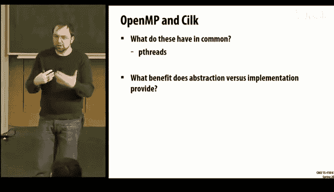

最流行的解决方案是使用**独立的请求和响应网络**（通常是逻辑上分离）。例如，将互连带宽的一部分保留给请求，另一部分保留给响应。这样，即使请求因缓冲区满而阻塞，响应仍然可以继续传递，打破死锁循环。


### 消息传递总结

从程序员接口看，消息传递是数据的**单向传输**。但这种单向性在确定数据存放位置和避免缓冲区溢出方面带来了问题。

设计实现时需要：
*   避免需要全局知识的方案，以保证可扩展性。
*   支持大量并发消息，以实现高性能。
*   处理输入缓冲问题（如采用信用机制）。
*   由于消息传递延迟显著，系统喜欢采用推测和其他技巧来与其他操作重叠执行。

---

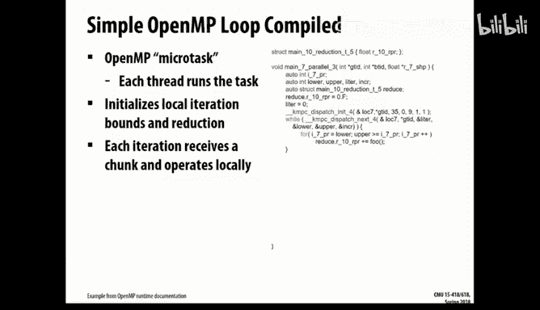

## 共享内存并行运行时：OpenMP与Cilk

上一节我们深入探讨了消息传递的内部机制。本节中，我们将视角转向共享内存并行运行时，特别是OpenMP和Cilk，看看它们如何在底层实现其高级并行抽象。

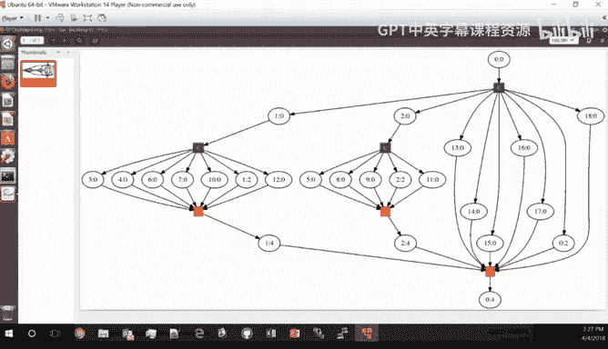

OpenMP和Cilk都是共享内存编程模型，都采用**fork-join**模式，并且底层都使用**Pthreads**来实现并发。它们提供了比直接使用Pthreads更高级、更便捷的并行描述方式，但有时也会带来额外的开销，并且可能无法暴露程序员所知的某些优化信息。

### OpenMP的实现

以下是一个简单的OpenMP并行循环代码示例：
```c
#pragma omp parallel for reduction(+:r)
for (i=0; i<10; i++) {
    r = r + a[i];
}
```
编译器（如LLVM）在遇到`-fopenmp`标志时，会识别这些编译制导语句并进行代码转换。它并非直接输出上述代码，而是插入额外的变量和函数调用。

转换后的逻辑大致如下：
1.  **并行区域开始**：主线程遇到`parallel for`时，会调用一个`__kmpc_fork_call`函数，指明一个函数（如`main._omp_fn.0`）将被并行执行。
2.  **工作函数**：原始的for循环体被包装进这个工作函数中。函数内部会处理迭代空间的划分。
3.  **动态调度**：如果指定了`dynamic`调度，运行时库会管理一个任务队列。每个工作线程在执行完一个任务块（chunk）后，会请求下一个任务块。
4.  **归约操作**：每个线程拥有本地归约变量副本。循环结束后，这些本地副本的值需要通过原子操作或其他方式合并到全局变量`r`中。
5.  **隐式屏障**：并行区域结束时，所有线程会同步在一个屏障（barrier）上。屏障的实现可能有多种（如线性屏障、树形屏障），由运行时根据系统情况选择。

通过工具可以观测到，默认情况下，运行时创建了与硬件线程数相等的线程（例如8个），但实际执行循环迭代的线程可能只有部分，并且工作负载可能不平衡。

**OpenMP其他特性**：
*   **`atomic`**：编译器会根据架构和数据类型，将原子操作转换为相应的硬件指令（如x86的`lock add`用于整型），或使用更复杂的指令序列（如`compare-and-swap`循环用于浮点数）。
*   **`task`**：任务依赖会创建微任务（microtask），运行时通过跟踪变量的地址和长度来管理依赖关系图，并在前置任务完成后调度后续任务。

### Cilk的实现

Cilk采用一种不同的并行范式，基于“spawn”（生成）和“sync”（同步）来创建并行任务。以下是一个经典的Cilk Fibonacci示例：
```c
int fib(int n) {
    if (n < 2) return n;
    int x = cilk_spawn fib(n-1);
    int y = fib(n-2);
    cilk_sync;
    return x + y;
}
```
Cilk的语义规定：遇到`cilk_spawn`时，**父线程（调用者）继续执行spawn出的子任务（`fib(n-1)`）**，而**被spawn的延续部分（`fib(n-2)`及其后的代码）** 可能被其他工作线程窃取（work-stealing）以并行执行。

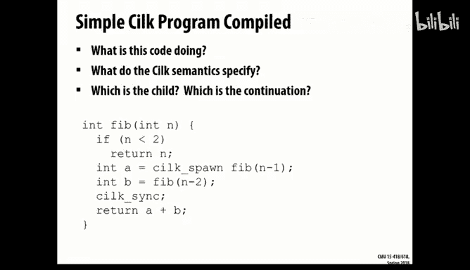

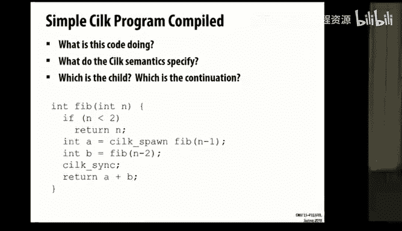

Cilk运行时的核心是**工作窃取调度器**。其实现的一个关键机制是使用C语言的**`setjmp`和`longjmp`** 来保存和恢复“延续”（continuation）的上下文（包括栈和寄存器状态）。

编译器会将简单的Cilk代码转换为包含许多基本块（basic block）的复杂控制流图，以处理并行执行、窃取和同步的所有可能路径。例如，一个简单的`fib`函数可能被转换成数十个基本块，用于管理`setjmp`/`longjmp`、标志位检查以及不同执行路径的清理工作。

工作线程（即Pthreads）从一个公共队列中窃取任务。当窃取到一个延续时，它使用`longjmp`跳转到该延续的上下文中执行。如果无任务可窃取，线程可能在一个信号量上等待。

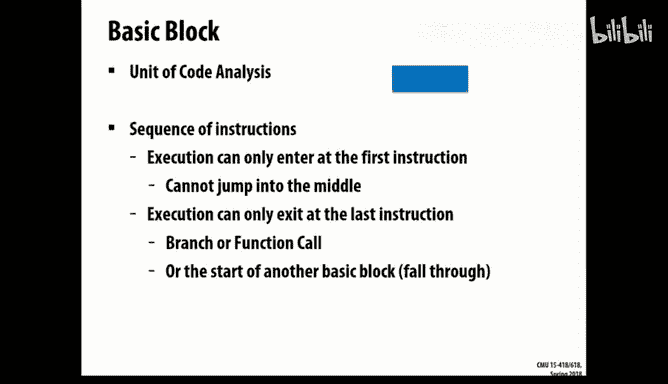


通过工具同样可以观测Cilk程序的执行，查看线程何时窃取工作、何时同步。对于非常小的计算（如`fib(6)`），可能因为计算太快而没有发生窃取，程序以串行方式运行。对于更大的计算，则可以观察到线程间的负载均衡和窃取行为。


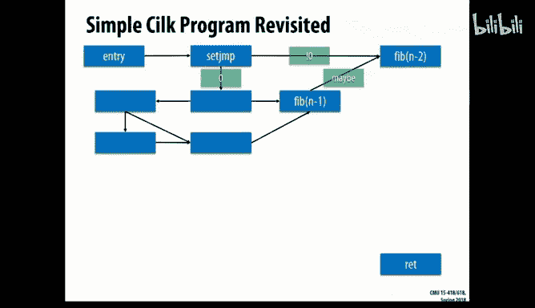

---

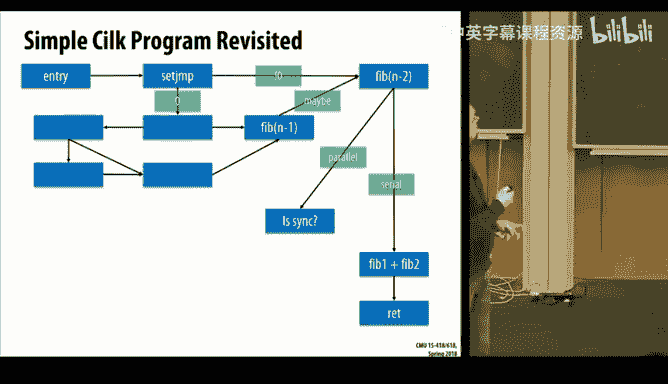

## 总结


本节课中，我们一起深入探讨了并行编程中两种核心范式的底层实现。

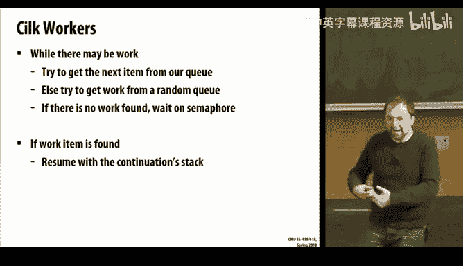

在**消息传递**部分，我们分析了同步、异步以及混合信用机制的数据传输方式，理解了缓冲管理和死锁避免的挑战。这解释了为何MPI编程中需要注意消息大小和通信模式。


在**共享内存并行运行时**部分，我们剖析了OpenMP和Cilk如何将高级并行指令编译和转换为底层的Pthreads操作和复杂控制流。我们看到了OpenMP如何管理并行循环、任务和原子操作，以及Cilk如何利用工作窃取和上下文切换来实现高效的递归并行。

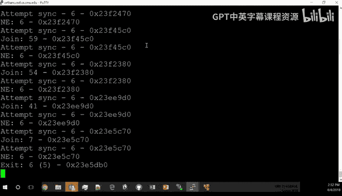

理解这些底层机制，不仅能帮助你编写更高效、更可靠的并行代码，也为将来进行并行系统研究、优化甚至自己实现运行时库奠定了基础。