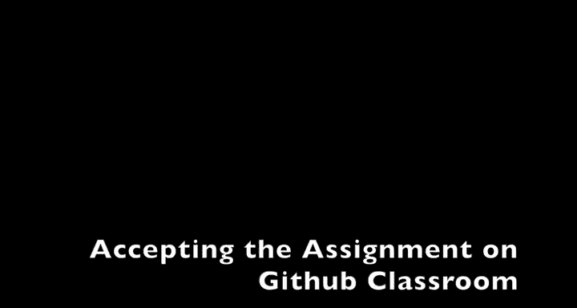
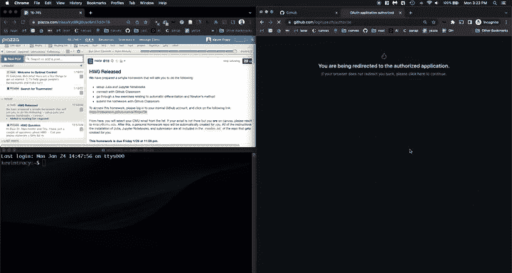
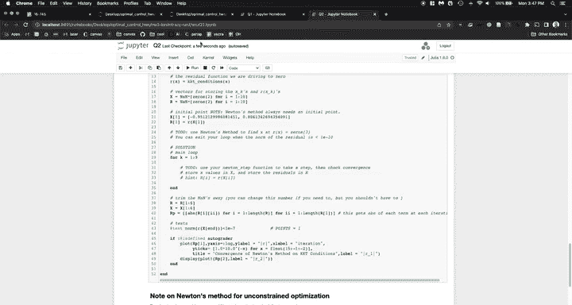
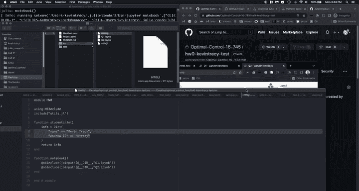
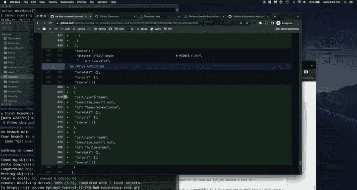
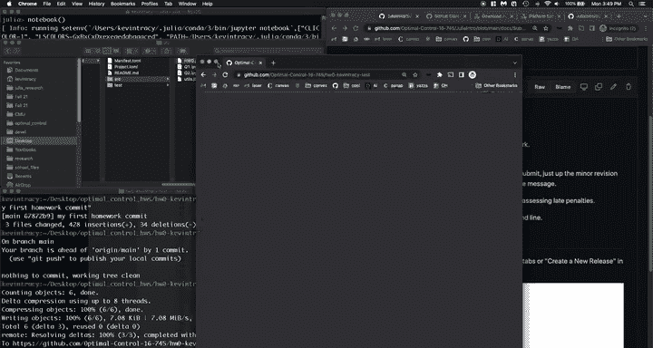

# 1：HW0 环境配置与提交指南 🚀



在本节课中，我们将学习如何为《最优控制和强化学习》课程完成第零次作业（HW0）的环境配置与提交。我们将从接受GitHub Classroom作业开始，逐步完成Julia环境安装、代码仓库克隆、作业内容填写，直至最终提交作业。

---



## 概述

我们将按照以下步骤完成HW0：
1.  通过GitHub Classroom链接接受作业。
2.  安装指定版本的Julia编程语言。
3.  将个人作业仓库克隆到本地计算机。
4.  配置Jupyter Notebook环境并完成作业题目。
5.  将完成的作业提交回GitHub并创建发布版本。

---

## 1. 接受GitHub Classroom作业

首先，我们需要通过课程提供的链接接受作业。此步骤将在GitHub上为你创建一个私有的作业代码仓库。


以下是具体操作步骤：
1.  在Piazza或课程页面找到HW0发布的帖子，其中包含GitHub Classroom链接。
2.  点击链接，确保你的浏览器已登录到你想关联的GitHub账户。
3.  系统会请求权限，点击“同意”。
4.  在导入的课程名单中找到你的名字（或测试账户的名字）。
5.  确认所选标识符（通常是你的学校邮箱）无误。
6.  点击“接受此作业”。系统将创建一个以作业名称和你GitHub用户名命名的私有仓库。

> 注意：仓库创建可能需要几分钟时间。完成后，你可以通过提供的链接访问你的私有仓库。

---

## 2. 安装Julia 1.6.5

作业要求使用Julia语言的长期支持版本1.6.5，而非最新版本。请严格按照以下步骤安装。

以下是安装Julia 1.6.5的步骤：
1.  访问Julia官方网站，下载Julia 1.6.5版本。
2.  根据你的操作系统（Windows、macOS或Linux）选择对应的安装包。
3.  **对于macOS用户**：下载`.dmg`文件，像安装其他应用程序一样将其拖入“应用程序”文件夹。
4.  为了在终端中方便地调用Julia，可以创建一个符号链接。在终端中执行以下命令：
    ```bash
    ln -s /Applications/Julia-1.6.app/Contents/Resources/julia/bin/julia /usr/local/bin/julia
    ```
5.  打开终端，输入`julia`命令，如果成功启动REPL（交互式环境），则说明安装成功。

> 提示：如果遇到问题，首先检查你是否安装的是1.6.5版本。

---

## 3. 克隆作业仓库到本地

现在，我们将线上GitHub仓库克隆到本地计算机，以便进行编辑和测试。

操作步骤如下：
1.  在本地创建一个文件夹，用于存放本课程的所有作业，例如`optimal_control_homeworks`。
2.  打开终端，使用`cd`命令进入该文件夹。
3.  回到你的GitHub作业仓库页面，点击绿色的“Code”按钮，复制仓库的HTTPS或SSH链接。
4.  在终端中，使用`git clone <你复制的链接>`命令克隆仓库。这会将仓库的所有内容下载到你当前所在的文件夹中。

---

## 4. 配置环境并完成作业

上一节我们完成了代码的本地克隆，本节中我们来看看如何配置Jupyter Notebook环境并完成作业内容。

### 4.1 安装IJulia包

IJulia包是Julia与Jupyter Notebook交互的桥梁。我们需要在Julia环境中安装它。

1.  在终端中启动Julia REPL（输入`julia`）。
2.  在Julia的`julia>`提示符后，输入以下命令进入包管理模式：
    ```julia
    ]
    ```
3.  在`pkg>`提示符后，输入以下命令添加IJulia包：
    ```julia
    add IJulia
    ```
4.  安装完成后，按退格键（Backspace）退出包管理模式，回到`julia>`提示符。
5.  输入以下命令启动Jupyter Notebook：
    ```julia
    using IJulia
    notebook()
    ```
    这将在你的默认浏览器中打开Jupyter Notebook界面。

### 4.2 完成作业文件

在Jupyter Notebook界面中，导航到你克隆的作业文件夹。你需要完成以下三个文件：

以下是需要完成的文件列表：
*   `src/homework0.jl`：用文本编辑器（如VS Code、Sublime Text）打开此文件，填写你的学生信息（姓名、学号等）。
*   `Q1.ipynb`：第一个问题的Jupyter Notebook。打开后，按照单元格内的说明逐步完成计算和编码任务。**确保运行每一个单元格**，直到所有测试（test cells）都通过。
*   `Q2.ipynb`：第二个问题的Jupyter Notebook。操作方式同Q1，仔细阅读说明，完成代码，运行所有单元格并通过测试。

> 核心操作：在Notebook中，使用 **`Shift + Enter`** 运行当前单元格并跳转到下一个。

---

## 5. 提交作业



完成所有题目并通过测试后，我们需要将修改推送（Push）到GitHub，并创建一个发布（Release）作为最终提交。

### 5.1 推送更改到GitHub



首先，我们将本地修改同步到远程仓库。

1.  在终端中，进入你的作业仓库目录。
2.  使用`git status`命令查看有哪些文件被修改。你应该能看到`homework0.jl`、`Q1.ipynb`和`Q2.ipynb`的状态是“modified”。
3.  使用`git add .`命令暂存所有更改。
4.  使用`git commit -m “提交信息”`命令提交更改，例如`git commit -m “完成HW0所有题目”`。
5.  使用`git push`命令将本地提交推送到GitHub远程仓库。
6.  回到你的GitHub仓库页面刷新，确认更改已成功上传。

### 5.2 创建发布版本



最后一步是创建一个标签化的发布（Release），这将被视为你的最终作业提交。

请严格按照以下步骤操作：
1.  在你的GitHub仓库页面上，点击“Releases”标签。
2.  点击“Create a new release”。
3.  在“Choose a tag”输入框中，输入 `v1.0`，然后点击“Create new tag”。
4.  在“Release title”输入框中，输入 `Final Submission`。
5.  点击“Publish release”按钮。

完成后，你的仓库“Releases”部分会显示一个名为“Final Submission (v1.0)”的发布，这标志着你的HW0已成功提交。



---

## 总结

本节课中我们一起学习了完成CMU《最优控制和强化学习》课程HW0的完整流程。我们掌握了如何通过GitHub Classroom接受作业、安装特定版本的Julia、克隆仓库、配置Jupyter环境、完成并测试作业代码，以及最终通过Git提交和创建发布版本。这套流程是后续所有作业的基础，请务必熟悉。