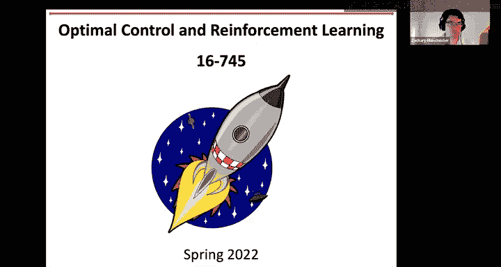
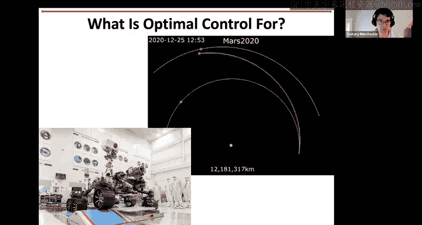
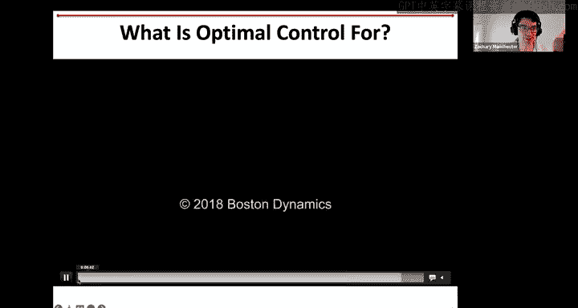
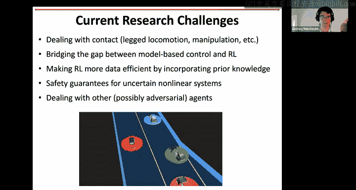
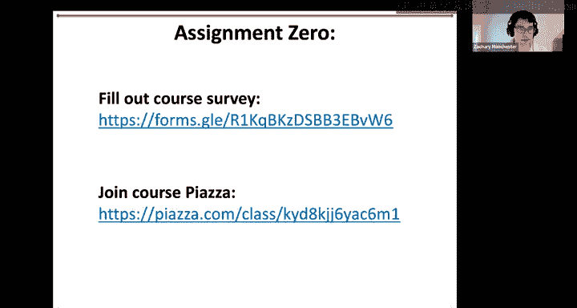
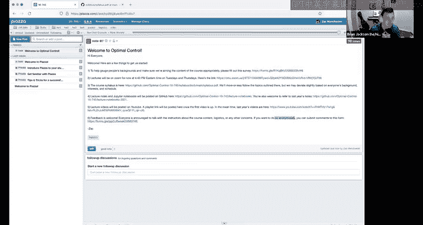
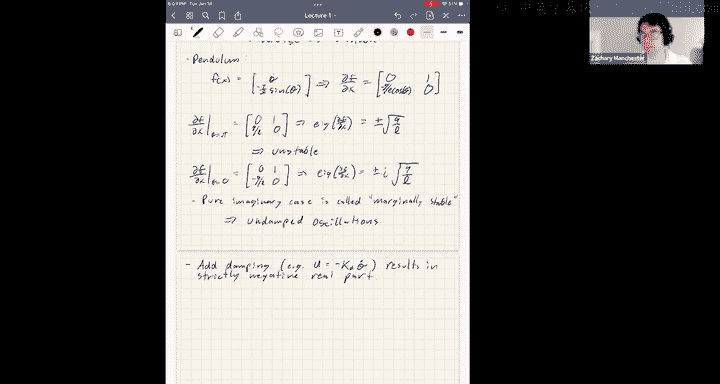

# 2：动力学回顾 🚀

在本节课中，我们将学习动力学系统的基本概念，这是进行最优控制和强化学习的基础。我们将从最一般的动力学形式开始，逐步深入到更具体的系统类型，如仿射控制系统、机械臂动力学和线性系统。我们还将探讨平衡点及其稳定性分析。

---

## 1. 动力学系统的一般形式

一个光滑动力学系统最通用的形式是一个一阶向量微分方程：

\[
\dot{x} = f(x, u)
\]

其中：
*   \( x \in \mathbb{R}^n \) 称为**状态**，通常包含位置和速度等信息。
*   \( u \in \mathbb{R}^m \) 称为**输入**或控制量，例如关节扭矩或推力。
*   \( f \) 称为**动力学**函数。

对于大多数机械系统，状态向量 \( x \) 可以分解为**构型** \( q \)（如位置或关节角）和**速度** \( v \)：

\[
x = \begin{bmatrix} q \\ v \end{bmatrix}
\]

需要注意的是，构型 \( q \) 并不总是一个向量（例如，单摆的构型空间是一个圆 \( S^1 \)），但速度 \( v \) 总是一个向量。

---

## 2. 仿射控制系统

许多系统，特别是机械系统，可以写成一种更具结构性的形式，称为**仿射控制系统**：

\[
\dot{x} = f_0(x) + B(x) u
\]

其中：
*   \( f_0(x) \) 称为**漂移项**，仅依赖于状态。
*   \( B(x) \) 称为**输入雅可比矩阵**。

这种形式之所以称为“仿射”，是因为在控制输入 \( u \) 上是线性的（尽管在状态 \( x \) 上可以是非线性的）。几乎所有光滑系统都可以通过数学技巧（如引入新状态）改写为此形式。

**示例：单摆动力学**
单摆的动力学方程为 \( mL^2 \ddot{\theta} + mgL \sin\theta = \tau \)。将其写成仿射形式：
*   状态： \( x = [\theta, \dot{\theta}]^T \)
*   动力学： \( \dot{x} = \begin{bmatrix} \dot{\theta} \\ -\frac{g}{L}\sin\theta \end{bmatrix} + \begin{bmatrix} 0 \\ \frac{1}{mL^2} \end{bmatrix} \tau \)
这里， \( f_0(x) = [\dot{\theta}, -\frac{g}{L}\sin\theta]^T \)， \( B(x) = [0, \frac{1}{mL^2}]^T \)。

---

## 3. 机械臂动力学（拉格朗日形式）

机械系统通常采用以下形式的动力学方程，这源于拉格朗日力学：

\[
M(q) \dot{v} + C(q, v) = B(q) u
\]

其中：
*   \( M(q) \) 是**质量矩阵**（正定）。
*   \( C(q, v) \) 包含科里奥利力、离心力和重力等项。
*   \( B(q) \) 是**输入雅可比矩阵**。
*   \( v \) 是速度，通常通过运动学关系 \( \dot{q} = G(q) v \) 与构型导数关联。在许多简单情况下， \( G(q) \) 是单位矩阵，即 \( v = \dot{q} \)。

为了将其放入通用形式 \( \dot{x} = f(x, u) \)，我们可以解出 \( \dot{v} \)：

\[
\dot{v} = M(q)^{-1} [B(q) u - C(q, v)]
\]
\[
\dot{q} = G(q) v
\]

然后组合状态 \( x = [q; v] \)。

---

## 4. 线性系统

线性系统是最经典且研究最透彻的控制系统模型，形式如下：

\[
\dot{x} = A(t) x + B(t) u
\]

如果 \( A \) 和 \( B \) 是常数矩阵，则系统是**时不变**的；否则是**时变**的。线性系统理论非常完善，因此我们经常将非线性系统在其平衡点附近**线性化**，以利用线性系统的工具进行分析和设计。

线性化方法为：
\[
A = \frac{\partial f}{\partial x} \bigg|_{(x^*, u^*)}, \quad B = \frac{\partial f}{\partial u} \bigg|_{(x^*, u^*)}
\]
其中 \( (x^*, u^*) \) 是线性化点（通常是平衡点）。

---

## 5. 平衡点

平衡点是系统可以保持静止的状态点，即满足：

\[
f(x, u) = 0
\]

**示例：单摆的平衡点**
对于无输入的单摆动力学 \( \dot{x} = [\dot{\theta}, -\frac{g}{L}\sin\theta]^T \)，令其为零：
*   \( \dot{\theta} = 0 \)
*   \( -\frac{g}{L}\sin\theta = 0 \Rightarrow \theta = 0 \text{ 或 } \pi \)
因此，存在两个平衡点：最低点 \( \theta=0 \) 和最高点 \( \theta=\pi \)。

**通过控制移动平衡点**
如果我们希望单摆停留在 \( \theta = \pi/2 \)（水平位置），则需要求解：
\[
f(x, u) = \begin{bmatrix} \dot{\theta} \\ -\frac{g}{L}\sin(\pi/2) + \frac{1}{mL^2}u \end{bmatrix} = \begin{bmatrix} 0 \\ 0 \end{bmatrix}
\]
解得所需扭矩为 \( u = mgL \)。这表明可以通过施加控制输入来创造新的平衡点。

---

## 6. 平衡点的稳定性

稳定性分析关心的是：如果系统从平衡点附近开始，是否会保持在附近？我们首先通过一维非线性系统来建立直观理解。

**一维系统直观分析**
绘制 \( \dot{x} = f(x) \) 的曲线。平衡点是曲线与x轴的交点（\( f(x)=0 \)）。
*   如果在平衡点处，当 \( x \) 略微增加时 \( f(x) < 0 \)（导数负），系统会往回走，则该平衡点是**稳定的**。
*   反之，如果略微增加时 \( f(x) > 0 \)（导数正），系统会远离，则该平衡点是**不稳定的**。

**高维系统与线性化稳定性定理**
对于高维系统 \( \dot{x} = f(x) \)，我们在平衡点 \( x^* \) 处线性化，得到雅可比矩阵 \( J = \frac{\partial f}{\partial x} \big|_{x^*} \)。
*   计算 \( J \) 的特征值。
*   如果**所有特征值的实部都小于零**，则平衡点是**渐近稳定的**。
*   如果**存在实部大于零的特征值**，则平衡点是**不稳定的**。
*   如果**所有特征值实部小于等于零，且存在实部为零的特征值**，则线性化方法无法判定，需要进一步分析（称为**临界情况**）。

**示例：单摆稳定性分析**
单摆动力学的雅可比矩阵为：
\[
J = \frac{\partial f}{\partial x} = \begin{bmatrix} 0 & 1 \\ -\frac{g}{L}\cos\theta & 0 \end{bmatrix}
\]
*   在最低点 \( \theta=0 \)： \( J = \begin{bmatrix} 0 & 1 \\ -\frac{g}{L} & 0 \end{bmatrix} \)，特征值为 \( \lambda = \pm j\sqrt{g/L} \)（纯虚数）。这对应于无阻尼振荡，属于临界情况。
*   在最高点 \( \theta=\pi \)： \( J = \begin{bmatrix} 0 & 1 \\ \frac{g}{L} & 0 \end{bmatrix} \)，特征值为 \( \lambda = \pm \sqrt{g/L} \)（一正一负）。因此该平衡点是不稳定的。

通过添加阻尼控制（如 \( u = -K_d \dot{\theta} \)）可以使最低点变得稳定。

---

## 总结

本节课我们一起回顾了动力学系统的基础知识。我们学习了：
1.  动力学系统的一般微分方程形式 \( \dot{x} = f(x, u) \)。
2.  具有重要结构的仿射控制系统 \( \dot{x} = f_0(x) + B(x)u \)。
3.  机械臂中常见的拉格朗日动力学形式。
4.  线性系统及其作为非线性系统近似工具的重要性。
5.  如何定义和求解系统的平衡点。
6.  如何通过线性化和分析雅可比矩阵特征值来判断平衡点的稳定性。

这些概念是后续学习最优控制与强化学习算法的基石。在下节课中，我们将探讨离散时间动力学以及数值积分方法，这是将连续时间模型转化为计算机可处理形式的关键步骤。