#  3：动力学离散化与稳定性 🎯


## 概述
在本节课中，我们将学习如何将连续时间的动力学系统（常微分方程）转换为离散时间模型，以便在计算机中进行仿真和算法实现。我们还将探讨离散化对系统稳定性的影响，并介绍几种常见的数值积分方法。

---

## 回顾：连续时间动力学与稳定性

上一节我们介绍了连续时间动力学系统、平衡点以及稳定性概念。特别是，我们讨论了局部稳定性，它要求系统雅可比矩阵特征值的实部严格为负。

**公式**：对于连续时间系统 `dx/dt = f(x)`，在平衡点 `x*` 处线性化得到 `dx/dt ≈ A * (x - x*)`。若 `A` 的所有特征值实部 `Re(λ) < 0`，则系统局部稳定。

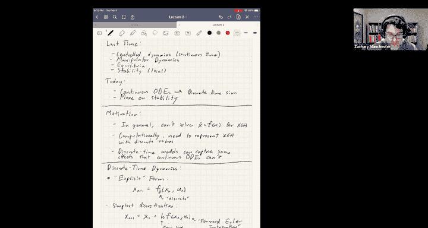

本节中，我们将重点转向离散时间领域，看看当我们将这些连续方程转化为计算机可以处理的离散步骤时，会发生什么。


---

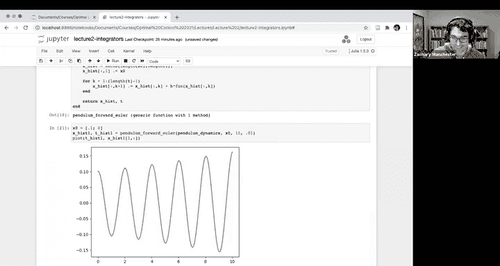

## 为什么需要离散化？

在工程实践中，我们通常无法解析地求解这些非线性微分方程。因此，我们需要通过数值模拟来预测系统行为。此外，计算机本质上是离散的，我们需要用有限维的离散点序列来表示连续的状态轨迹 `x(t)`。

离散时间模型在某些方面甚至比连续时间ODE更通用。例如，碰撞、摩擦等非光滑动力学效应无法用光滑的ODE描述，但可以用离散时间映射来刻画。

---


## 显式离散时间动力学系统

首先，我们讨论显式形式的离散时间系统。其一般形式为：

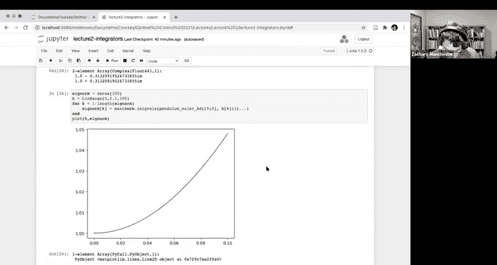

**公式**：`x_{k+1} = f_d(x_k, u_k)`

其中，`k` 是离散时间步索引，`f_d` 是离散动力学函数。

### 前向欧拉积分法
以下是实现离散化最简单（但通常效果不佳）的方法：

**公式**：`x_{k+1} = x_k + h * f(x_k, u_k)`

这里，`h` 是时间步长。这个公式直观地使用当前状态的导数来估计下一个状态。

为了演示，我们将其应用于一个简单的无阻尼摆系统（质量 `m=1`，长度 `L=1`）。从接近下平衡点（角度 `0.1` 弧度，速度 `0`）的初始条件开始，使用 `h=0.1` 秒进行仿真。

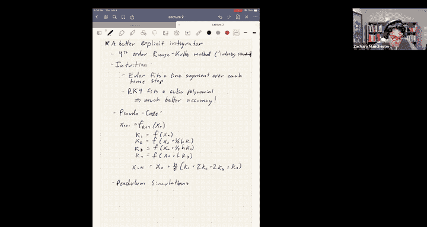


**代码示例（概念）**：
```python
def forward_euler_step(xk, h, dynamics_func):
    return xk + h * dynamics_func(xk)
```

仿真结果显示，摆的振荡幅度不断增长，最终“爆炸”——这与物理事实（应保持恒定振幅振荡）相悖。即使将步长减小到 `h=0.01`，这种不稳定的增长依然会发生，只是时间被推迟了。

---

## 离散时间系统的稳定性分析 🧐

上一节我们介绍了连续时间系统的稳定性条件。本节中我们来看看离散时间系统有何不同。

在离散时间中，我们可以将动力学视为一个迭代映射。为了分析线性化系统在平衡点（假设为原点）附近的稳定性，我们考察其雅可比矩阵 `A_d`。

经过 `n` 步迭代后，状态变化与 `A_d^n` 相关。稳定性要求对于所有初始状态 `x_0`，当 `k → ∞` 时，`A_d^k * x_0 → 0`。这意味着矩阵 `A_d^k` 必须趋于零。

这引出了离散时间稳定性的关键条件：

**核心结论**：离散时间系统局部稳定的充要条件是，其雅可比矩阵 `A_d` 的所有特征值的**模长（绝对值）必须小于1**。在复平面上，这意味着所有特征值都必须位于**单位圆内**。

### 应用于前向欧拉法
对于前向欧拉法，离散雅可比矩阵为：
**公式**：`A_d = I + h * A`
其中 `A` 是连续时间系统在平衡点的雅可比矩阵。

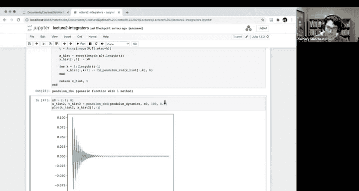

对于我们的无阻尼摆，在平衡点处计算 `A_d` 的特征值。当 `h=0.1` 时，特征值模长大于1，这从理论上解释了仿真中观察到的发散行为。**对于无阻尼系统，前向欧拉法使用任何有限步长都会导致数值不稳定**。

这种不稳定性是积分器人为引入的，并非物理系统的真实属性。积分器使用的分段线性近似持续高估了变化率，导致能量不断被添加到系统中。

**重要启示**：
1.  离散化过程可能**定性改变**动力学的行为。
2.  必须始终**谨慎检查**仿真结果。
3.  检查能量行为是一个很好的方法：对于保守系统，总能量应守恒；对于耗散系统，能量应衰减。

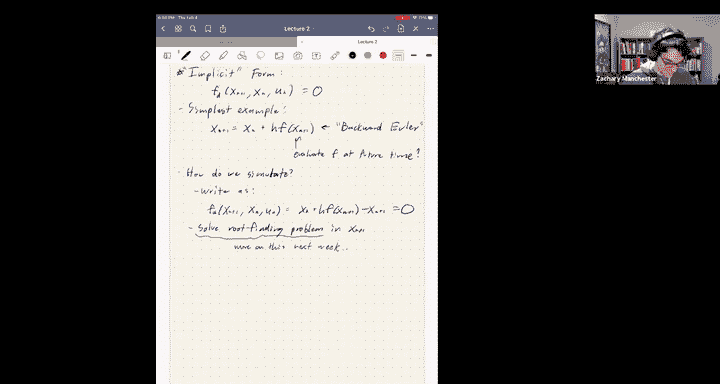

---

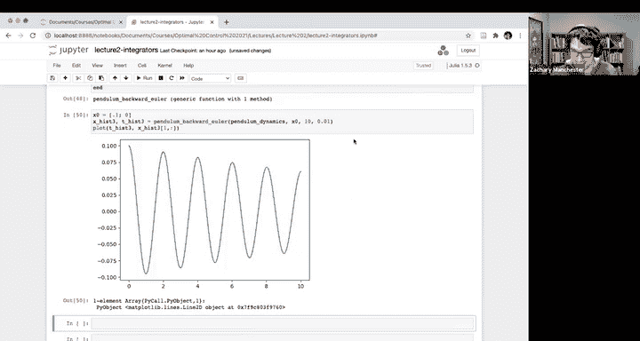

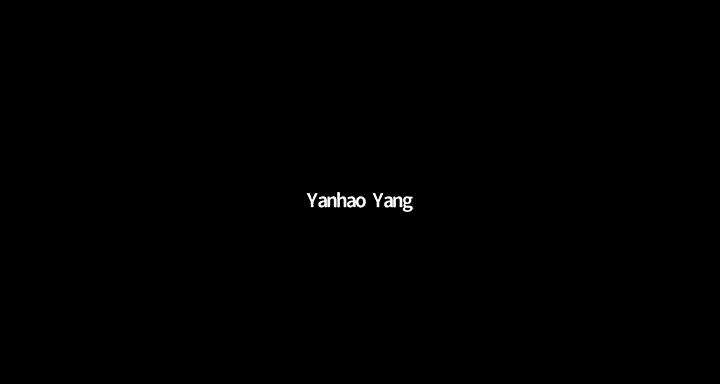

## 更好的数值积分方法

鉴于前向欧拉法的问题，我们显然需要更好的方法。

### 四阶龙格-库塔法（RK4）🏃‍♂️
这是工程和科学计算中的标准方法。其思想是在每个时间步内对动力学进行四次评估，从而拟合一个三次多项式，而非线性段。

**公式**：
```
k1 = h * f(x_k, u_k)
k2 = h * f(x_k + k1/2, u_{mid})
k3 = h * f(x_k + k2/2, u_{mid})
k4 = h * f(x_k + k3, u_{k+1})
x_{k+1} = x_k + (k1 + 2*k2 + 2*k3 + k4) / 6
```

对同一个摆系统使用RK4（`h=0.1`）进行仿真，结果表现出完美的等幅振荡，与物理预期一致。计算其离散雅可比矩阵的特征值，发现模长非常接近1（例如 `0.999999...`），这表明RK4在保持系统稳定性方面非常出色。

然而，RK4也并非完美。如果我们绘制特征值模长随步长 `h` 变化的曲线，会发现：对于小步长，它几乎精确为1；但随着步长增大，特征值模长会先小于1（导致**人为阻尼**），超过某个阈值后则大于1（导致**人为能量增长**）。

**结论**：即使像RK4这样高级的积分器，也存在潜在的“陷阱”。必须根据具体问题谨慎选择步长，并始终进行合理性检查。

---

## 隐式积分方法

接下来，我们简要介绍隐式方法。其一般形式为：

**公式**：`x_{k+1} = f_d(x_{k+1}, x_k, u_k, u_{k+1})`
状态 `x_{k+1}` 隐含在方程两侧，通常需要求解非线性方程（如使用牛顿法）才能得到。

### 后向欧拉法
最简单的隐式方法是后向欧拉法：

**公式**：`x_{k+1} = x_k + h * f(x_{k+1}, u_{k+1})`

对摆系统应用后向欧拉法（`h=0.1`），仿真显示振荡幅度不断衰减。这与前向欧拉法正好相反：后向欧拉法引入了**人为阻尼**。

虽然这不物理，但这种数值阻尼特性使得隐式方法在需要大时间步长或仿真“刚性”系统时非常有用，因为它能防止仿真爆炸。因此，隐式方法常用于计算机图形学、游戏引擎和一些机器人仿真器中。

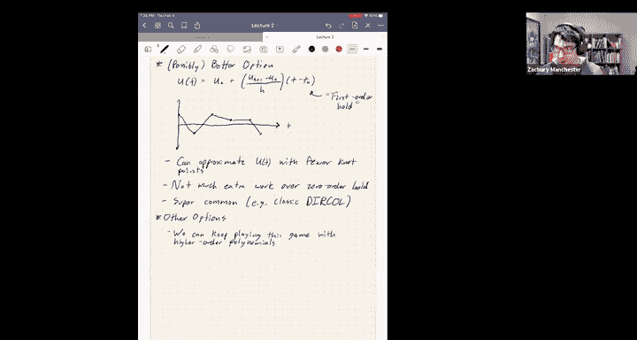

在轨迹优化中，由于所有时间步的状态和输入是同时求解的，解隐式方程并不构成额外负担，因此隐式方法也被广泛使用。


---

## 控制输入的离散化

到目前为止，我们主要讨论了状态 `x(t)` 的离散化。控制输入 `u(t)` 的离散化同样重要，但通常更简单，因为我们可以主动选择其表示形式。

### 零阶保持
这是最简单的方法：在整个时间步内保持控制输入为常数。

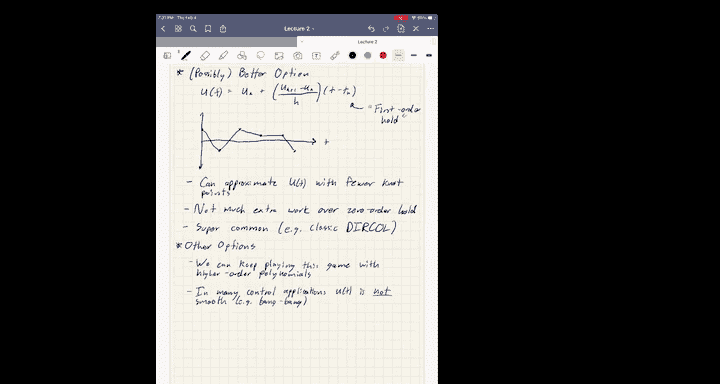

**公式**：`u(t) = u_k`，对于 `t ∈ [t_k, t_{k+1})`

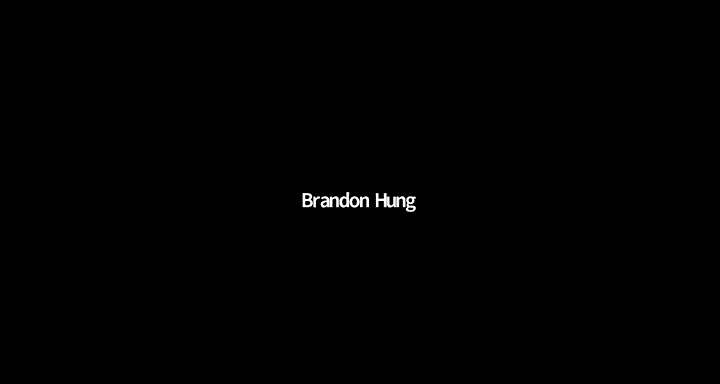


实现简单，但如果真实的控制信号是光滑的，则需要很多采样点才能准确近似。

### 一阶保持（分段线性插值）
在相邻采样点之间进行线性插值。

**公式**：`u(t) = u_k + ( (u_{k+1} - u_k) / h ) * (t - t_k)`，对于 `t ∈ [t_k, t_{k+1})`

如果控制信号本身是连续或光滑的，这种方法可以用更少的节点（采样点）获得更好的近似，从而减小优化问题规模，加快求解速度。它在许多标准的直接配点法中是默认选择。

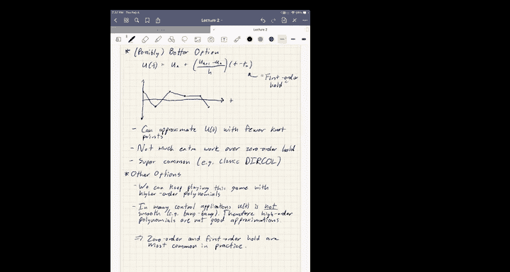

### 高阶插值
可以使用更高阶的多项式（如样条）进行插值。这对于轨迹非常光滑的问题（如航天器轨道）是有利的。然而，在机器人控制中，由于执行器饱和限制，控制信号常常是“砰砰”型的非光滑信号，高阶多项式近似效果不佳，甚至可能因龙格现象而产生振荡。

**核心要点**：选择控制参数化方式时，需权衡近似精度、问题复杂度和实际控制信号的特性。

---

## 总结

本节课我们一起学习了以下核心内容：

1.  **离散化的必要性**：为了在计算机中仿真和求解连续动力学系统。
2.  **离散时间稳定性**：系统稳定的条件是雅可比矩阵特征值位于复平面的**单位圆内**（模长<1）。
3.  **数值积分器的影响**：
    *   **前向欧拉法**：简单但不稳定，会人为增加系统能量，应避免使用。
    *   **龙格-库塔法（RK4）**：精度和计算成本的良好折衷，是标准选择，但仍需注意步长选择。
    *   **隐式方法（如后向欧拉）**：更稳定，能处理刚性系统，但计算成本更高；在轨迹优化中很有用。
4.  **控制输入离散化**：介绍了**零阶保持**和**一阶保持**方法，选择取决于控制信号的光滑性和问题需求。
5.  **核心教训**：离散化总会引入误差，可能改变系统行为（如稳定性、能量特性）。必须对仿真结果进行**合理性检查**，例如验证能量是否按物理规律守恒或耗散。

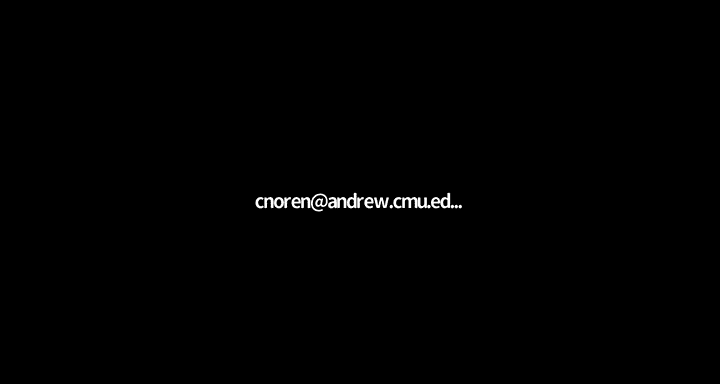

通过理解这些离散化工具及其特性，我们为后续学习基于这些离散模型的优化和控制算法打下了坚实基础。