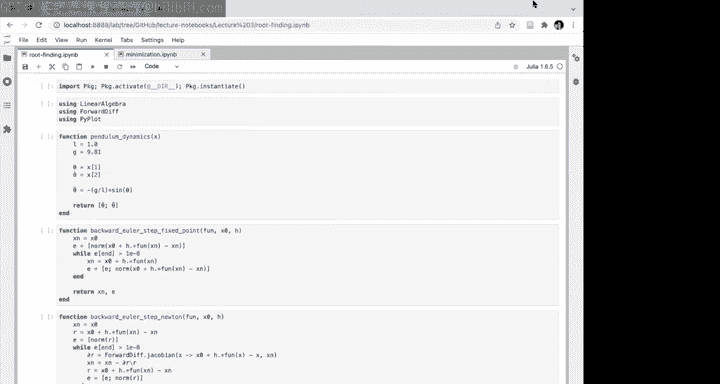
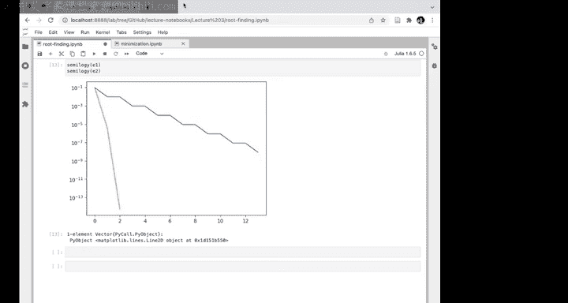
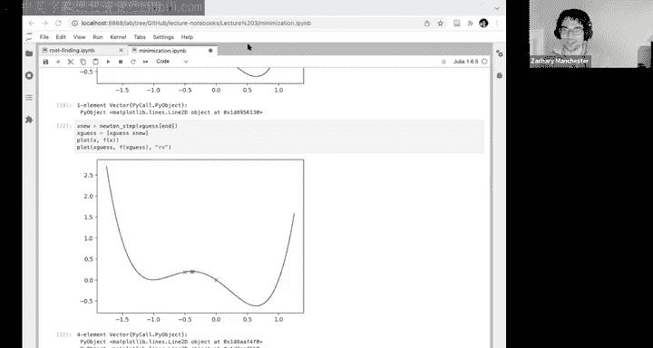
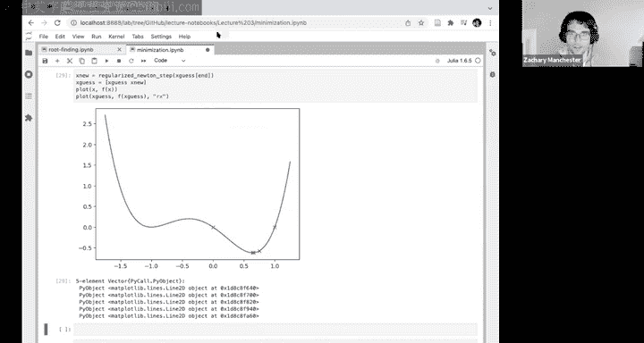
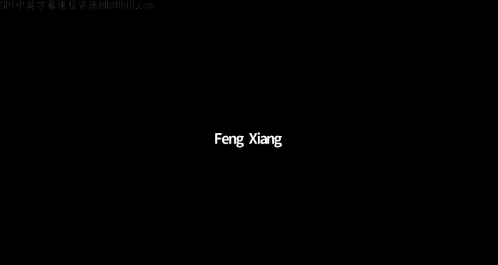
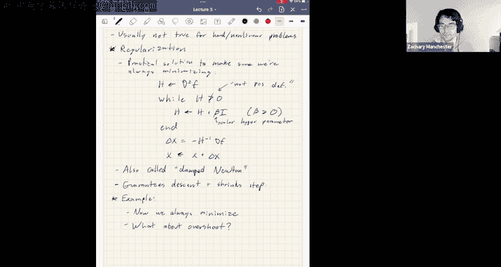

# 4：数值优化的基础知识

## 概述 📚

在本节课中，我们将学习数值优化的基础知识，这是后续最优控制和强化学习内容的重要铺垫。我们将从导数符号约定开始，然后深入探讨两种核心的数值算法：求根算法和无约束最小化算法。

## 符号约定 📝

上一节我们介绍了课程概述，本节中我们来看看数值优化中一个基础但至关重要的部分：符号约定。我们将统一导数、雅可比矩阵、梯度和海森矩阵的表示方法，以确保后续公式推导和代码实现的清晰与正确。

首先，我们定义函数 **F(x)**，它是一个**标量值函数**，输入是 **R^n** 维向量，输出是一个标量。这类函数通常是我们希望优化的目标，例如损失函数或成本函数。

对于此类函数，其梯度（或称一阶导数）我们记为 **∂F/∂x**。在本课程中，**梯度始终是一个行向量（1×n）**。许多教材将其写作列向量，但采用行向量有两大优势：
1.  **维度一致性**：在一阶泰勒展开 **F(x + Δx) ≈ F(x) + (∂F/∂x) Δx** 中，**Δx** 是 n×1 的列向量。为了使结果 **F(x + Δx)** 为标量，**∂F/∂x** 必须为 1×n 的行向量，矩阵乘法才能成立。
2.  **链式法则**：保持此约定能确保链式法则在矩阵乘法中自然成立，无需额外转置，从而避免代码实现中的常见错误。

类似地，对于一个向量值函数 **G(y)**（输入 **R^m**，输出 **R^m**），其雅可比矩阵 **∂G/∂y** 的维度是 **m×m**。这同样由其一阶泰勒展开的维度匹配所决定。

为了兼顾其他惯例的便利性，我们也定义以下符号：
*   **∇F(x)**：表示梯度 **∂F/∂x** 的转置，即列向量形式。
*   **∇²F(x)**：表示海森矩阵（Hessian），即梯度的导数，**∂/∂x (∇F(x))**。这是一个 **n×n** 的对称矩阵。

## 求根算法 🔍

在明确了符号约定后，我们进入第一个核心算法主题：求根。求根问题在动力学系统分析中非常常见。

求根问题的形式是：给定函数 **F(x)**，寻找 **x*** 使得 **F(x*) = 0**。例如，在连续时间动力学系统中，寻找平衡点（**ẋ = F(x) = 0**）就是一个求根问题。

一个紧密相关的概念是**不动点**问题：寻找 **x*** 使得 **F(x*) = x***。这对应于离散时间动力学系统（**x_{k+1} = F(x_k)**）的平衡点。两者可以轻松转换（例如，将不动点问题改写为 **F(x) - x = 0**）。

以下是两种求解方法：

### 不动点迭代法

这是一种简单直接的方法，适用于寻找稳定不动点。

**算法描述**：从初始猜测开始，反复将当前值代入函数，即迭代计算 **x ← F(x)**，直到 **x** 的变化可忽略不计。其原理是，如果不动点是稳定的，系统动力学本身就会将状态吸引至该点。

**特点**：
*   仅对稳定不动点有效。
*   收敛速度可能很慢。

### 牛顿法

牛顿法是求根问题的标准方法，具有极快的收敛速度。其核心思想是利用当前点的一阶泰勒展开来逼近函数，并求解该线性近似方程的根。

给定当前点 **x**，函数的一阶泰勒展开为：
**F(x + Δx) ≈ F(x) + (∂F/∂x) Δx**

我们希望找到 **Δx** 使得 **F(x + Δx) = 0**。令近似式为零：
**F(x) + (∂F/∂x) Δx = 0**

求解 **Δx**：
**Δx = - (∂F/∂x)^{-1} F(x)**

然后更新当前点：
**x ← x + Δx**

重复此过程直至收敛。

**牛顿法的特点**：
*   **二次收敛**：在解附近，每次迭代有效数字的位数大约翻倍，能快速达到机器精度。
*   **需要导数**：需要计算函数值 **F(x)** 及其雅可比矩阵 **∂F/∂x**。
*   **可能失败**：需要初始猜测靠近真解；雅可比矩阵需可逆；函数需要足够光滑（至少一阶导数连续）。

**代码示例（应用于隐式积分）**：
在课程演示中，我们使用牛顿法求解后向欧拉法（一种隐式积分方法）中的非线性方程。我们将离散动力学方程 **x_{k+1} = x_k + h F(x_{k+1})** 转化为求根问题 **R(x_{k+1}) = x_k + h F(x_{k+1}) - x_{k+1} = 0**，并对残差函数 **R** 应用牛顿法。与不动点迭代法相比，牛顿法仅需3次迭代即可达到高精度，而后者需要14次，展示了牛顿法收敛速度的优势。

## 无约束最小化 📉

在掌握了求根算法后，我们转向优化领域的核心：无约束最小化问题。本节将学习如何将最小化问题转化为求根问题，并应用牛顿法求解。

我们考虑最小化一个标量值函数 **F(x)**：
**min_x F(x)**

假设 **F(x)** 是光滑的（具有连续的一阶和二阶导数）。根据微积分，局部最小点的一阶必要条件是梯度为零：
**∇F(x*) = 0**

因此，我们可以将最小化问题转化为对梯度函数 **∇F(x)** 的求根问题。这正是牛顿法可以处理的类型。

对梯度函数 **∇F(x)** 应用牛顿法：
1.  在当前点 **x** 对梯度进行一阶泰勒展开：
    **∇F(x + Δx) ≈ ∇F(x) + ∇²F(x) Δx**
    其中 **∇²F(x)** 是海森矩阵。
2.  希望找到 **Δx** 使得 **∇F(x + Δx) = 0**，故令近似式为零：
    **∇F(x) + ∇²F(x) Δx = 0**
3.  求解 **Δx**：
    **Δx = - [∇²F(x)]^{-1} ∇F(x)**
4.  更新当前点：
    **x ← x + Δx**

**直观理解**：该步骤等价于用二阶泰勒展开局部逼近 **F(x)**，然后精确地最小化这个二次近似函数。

**示例与问题**：
通过一个多项式函数的例子，我们发现朴素的牛顿法（直接应用于梯度）会收敛到最近的驻点，可能是极小值、极大值或鞍点。这不符合我们“最小化”的初衷。

**确保下降方向**：
观察牛顿步 **Δx = - H^{-1} g**（其中 **H = ∇²F**, **g = ∇F**）。在标量情况下，**-g** 指向下降方向，乘以 **H^{-1}** 可视为步长。要保证下降，需要 **H^{-1} > 0**，即 **H > 0**（海森矩阵正定）。
在向量情况下，这一条件推广为：**海森矩阵 H 必须正定**，才能保证 **Δx** 是下降方向。如果函数的海森矩阵处处正定，则该函数是**强凸函数**，牛顿法总能找到全局最小值。但对于机器人等非线性系统，问题通常是非凸的，海森矩阵可能不定。

**正则化（海森矩阵修正）**：
为了解决海森矩阵非正定导致的上升问题，我们引入正则化技巧。核心思想是修正海森矩阵，使其变得正定。

**算法步骤**：
1.  计算当前点的海森矩阵 **H** 和梯度 **g**。
2.  检查 **H** 是否正定。如果不是，则循环执行：
    **H ← H + β I**
    其中 **β > 0** 是一个标量参数，**I** 是单位矩阵。
3.  当 **H** 正定后，计算牛顿步：
    **Δx = - H^{-1} g**
4.  更新：
    **x ← x + Δx**

**正则化的作用**：
1.  **保证下降方向**：通过使 **H** 正定，确保步进方向是下降方向。
2.  **调整步长**：添加 **βI** 会使 **H** 变大，从而使其逆 **H^{-1}** 变小，相当于收缩了步长。当远离最优解、泰勒近似不准确时，采取更保守的小步长是合理的。
3.  **计算高效**：通过尝试Cholesky分解等方法来检查正定性，比计算完整的特征值分解要高效得多，这对于大规模问题至关重要。

在示例中，对初始点应用正则化后的牛顿法，成功找到了局部极小值，而非之前的局部极大值。

**遗留问题**：
正则化解决了上升问题，但牛顿法仍可能因步长过大而“超调”，越过最小值。我们将在下节课介绍**线搜索**方法来控制步长，确保每次迭代都使函数值充分下降。

## 总结 🎯

本节课我们一起学习了数值优化的基础。
*   我们首先建立了梯度、雅可比矩阵和海森矩阵的符号约定，强调梯度作为行向量的重要性以保证链式法则和代码简洁性。
*   接着，我们探讨了**求根算法**，重点介绍了具有二次收敛速度的**牛顿法**，并将其应用于隐式积分求解。
*   然后，我们将最小化问题转化为梯度求根问题，引入了用于无约束最小化的**牛顿法**。我们发现了朴素牛顿法可能收敛到非极小值点的问题。
*   为了解决该问题，我们引入了**海森矩阵正则化**技巧，通过添加 **βI** 迫使海森矩阵正定，从而保证迭代方向是下降方向，并自动调整步长。

这些内容为我们后续学习最优控制中更复杂的数值优化问题奠定了坚实的基础。在下节课中，我们将介绍线搜索方法，以完善牛顿法，解决步长控制问题。