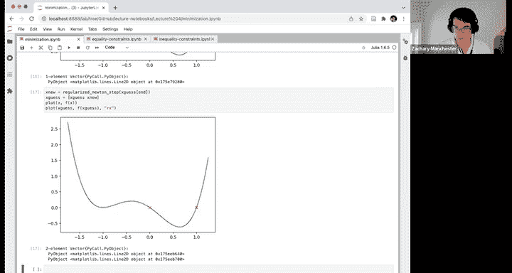
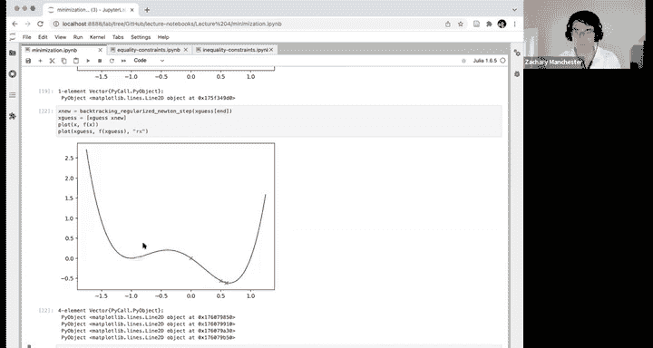
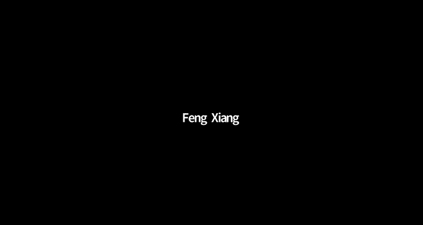
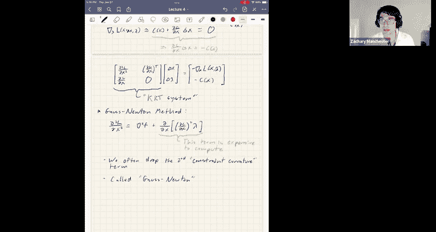
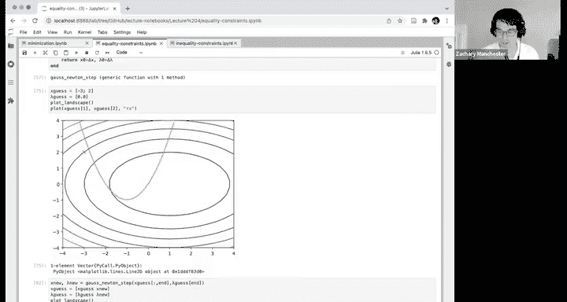
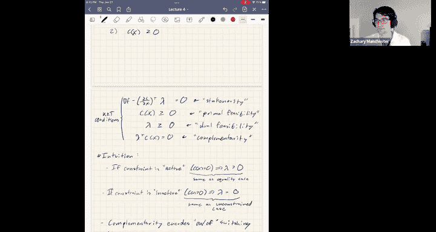

# 5：优化（第二部分）🚀





## 概述
在本节课中，我们将继续学习数值优化方法。我们将首先完成关于线搜索的讨论，然后深入探讨带约束的优化问题，特别是等式约束和不等式约束的处理方法。

---

## 回顾与过渡：从无约束优化到线搜索


上一节我们介绍了牛顿法及其在求解无约束优化问题中的应用。我们讨论了如何通过正则化来确保算法在远离解时也能朝正确的方向前进。然而，即使方向正确，步长也可能过大，导致“超调”现象。本节中，我们将介绍一种称为“线搜索”的技术来解决这个问题。

### 回溯线搜索

线搜索的核心思想是：在计算出牛顿步长 `Δx` 后，不直接采用全步长，而是通过一个缩放因子 `α` 来调整步长，确保目标函数值有足够的下降。





以下是实现回溯线搜索（Armijo规则）的步骤：

1.  初始化步长 `α = 1`（即全牛顿步）。
2.  检查以下条件是否成立：
    `f(x + αΔx) ≤ f(x) + β * α * ∇f(x)^T Δx`
    其中，`β` 是一个很小的正数（如 `1e-4` 到 `0.1`），`∇f(x)^T Δx` 是基于一阶泰勒展开的预期下降量。
3.  如果条件不成立，则将步长 `α` 乘以一个收缩因子 `c`（通常为 `0.5`），即 `α = c * α`，然后重复步骤2。
4.  一旦条件满足，则更新 `x = x + αΔx`。

**代码示例（概念）**：
```python
alpha = 1.0
beta = 0.1
c = 0.5
while f(x + alpha * delta_x) > f(x) + beta * alpha * grad_f(x).dot(delta_x):
    alpha = c * alpha
x = x + alpha * delta_x
```

**直觉**：这个条件确保实际函数值的下降与基于当前梯度信息预测的下降基本一致。如果差异过大，说明在当前点的一阶近似不准确，因此需要缩短步长。

**注意**：在每个牛顿迭代的外层循环中，`α` 都会重置为1。我们只进行必要的回溯，以找到满足条件的足够大的步长。

**总结**：结合正则化（保证下降方向）和回溯线搜索（保证合适的步长），牛顿法可以变得非常鲁棒和高效。对于足够光滑的函数，可以证明从任意初始点出发，该方法都能保证找到一个局部极小值。

---

## 过渡：从无约束问题到等式约束优化

掌握了处理无约束问题的方法后，我们现在将问题复杂化，引入约束条件。首先，我们来看等式约束优化问题。

### 等式约束优化问题

问题形式为：
```
minimize f(x)
subject to c(x) = 0
```
其中，`f(x): R^n → R` 是目标函数，`c(x): R^n → R^m` 是约束函数（包含 `m` 个等式约束）。

#### 一阶必要条件（KKT条件）



对于等式约束问题，最优解必须满足所谓的KKT条件（Karush-Kuhn-Tucker条件）。其几何直觉是：在解处，目标函数的梯度 `∇f` 必须与约束函数的梯度 `∇c` 平行。

**数学表述**：
存在一个拉格朗日乘子向量 `λ ∈ R^m`，使得：
1.  **平稳性**：`∇f(x) + ∂c/∂x^T λ = 0`
    （即 `∇f(x)` 与 `∇c(x)` 的列张成的空间平行）
2.  **原始可行性**：`c(x) = 0`

我们定义 **拉格朗日函数** `L(x, λ) = f(x) + λ^T c(x)`。上述KKT条件恰好等价于拉格朗日函数对所有变量（`x` 和 `λ`）的梯度为零：
- `∇_x L(x, λ) = ∇f(x) + ∂c/∂x^T λ = 0`
- `∇_λ L(x, λ) = c(x) = 0`

#### 用牛顿法求解KKT系统

现在，我们需要求解一个由 `x` 和 `λ` 组成的非线性方程组 `∇L(x, λ) = 0`。我们可以直接对其应用牛顿法。

对 `∇L(x, λ) = 0` 进行一阶泰勒展开，我们得到以下线性系统（称为 **KKT系统**）：

```
[ H(x, λ)   J(x)^T ] [ Δx   ] = - [ ∇_x L(x, λ) ]
[ J(x)       0     ] [ Δλ   ]     [ c(x)        ]
```
其中：
- `H(x, λ) = ∇²_xx L(x, λ)` 是拉格朗日函数关于 `x` 的Hessian矩阵。
- `J(x) = ∂c/∂x` 是约束的雅可比矩阵。

求解这个线性系统得到步长 `(Δx, Δλ)`，然后更新 `x = x + Δx`, `λ = λ + Δλ`。



#### 高斯-牛顿近似


计算完整的Hessian矩阵 `H(x, λ)` 可能很昂贵，因为它包含目标函数的Hessian和约束的二阶导数项（可能涉及三阶张量）。一个常见的简化是**高斯-牛顿法**，它忽略约束的二阶导数项，仅使用目标函数的Hessian来近似 `H(x, λ)`。

**优缺点**：
- **优点**：计算量显著降低，迭代更快。
- **缺点**：收敛速度可能略慢于完整的牛顿法（超线性收敛 vs 二次收敛）。
- **实践**：在最优控制等领域，由于动力学约束通常很复杂，计算其二阶导数非常昂贵，因此高斯-牛顿法非常常用，且通常在实践中表现鲁棒。

**总结**：对于等式约束优化，我们可以通过构造拉格朗日函数并将其梯度设为零，将其转化为一个非线性方程组，然后用牛顿法求解。高斯-牛顿近似是一种常用且高效的计算简化。

---

## 过渡：从等式约束到不等式约束优化

处理了等式约束后，我们面临更普遍的**不等式约束**优化问题。这类问题在机器人学中非常常见，例如执行器的力矩限制、避障等安全约束。

### 不等式约束优化问题

问题形式为：
```
minimize f(x)
subject to c(x) ≥ 0
```
这里 `c(x) ≥ 0` 表示向量的每个分量都大于等于零。

#### 一阶必要条件（KKT条件）

不等式约束的KKT条件比等式约束更复杂，它包含了一个“开关”行为：约束可能是“活跃的”（紧贴边界，`c_i(x)=0`）或“非活跃的”（`c_i(x)>0`）。

**完整的KKT条件**：
存在拉格朗日乘子 `λ ∈ R^m`，使得：
1.  **平稳性**：`∇f(x) - ∂c/∂x^T λ = 0` （注意符号约定，这里使用 `-` 使得 `λ ≥ 0`）
2.  **原始可行性**：`c(x) ≥ 0`
3.  **对偶可行性**：`λ ≥ 0`
4.  **互补松弛性**：`λ_i * c_i(x) = 0`，对于所有 `i=1,...,m`

**直觉解释**（以物体落在冰面上为例）：
- `c(x) ≥ 0`：物体不能穿透冰面（位置必须 ≥ 0）。
- `λ ≥ 0`：冰面只能给物体向上的支持力（法向力 ≥ 0），不能向下拉。
- `λ_i * c_i(x) = 0`：只有当物体接触冰面时（`c_i(x)=0`），支持力才存在（`λ_i > 0`）；如果物体在空中（`c_i(x)>0`），则支持力为零（`λ_i=0`）。

#### 求解不等式约束问题的方法

由于互补松弛条件引入了不可微性，直接对KKT条件应用牛顿法变得困难。以下是几种主流方法：

以下是几种处理不等式约束的数值优化方法简介：

1.  **有效集法**
    *   **思想**：猜测哪些约束是活跃的（`c_i(x)=0`），将其视为等式约束；哪些是非活跃的（`c_i(x)>0`），将其忽略。然后求解一个等式约束子问题。如果猜错了，根据最优性条件调整猜测，重复过程。
    *   **优点**：如果有效集猜测准确，速度极快。
    *   **缺点**：需要良好的启发式规则来猜测有效集。

2.  **内点法（障碍函数法）**
    *   **思想**：将不等式约束 `c(x) ≥ 0` 用“障碍函数”替换并加入目标函数。例如，使用对数障碍函数：`min f(x) - μ * Σ log(c_i(x))`。当 `c_i(x)` 接近0时，`-log(c_i(x))` 趋于无穷大，从而阻止迭代点违反约束。参数 `μ` 逐渐减小以逼近边界。
    *   **优点**：理论性质好，是凸优化问题的黄金标准。
    *   **缺点**：对于非凸问题，需要很多技巧来稳定；每次迭代需要求解一个可能病态的系统。

3.  **惩罚函数法**
    *   **思想**：将约束违反量作为惩罚项加入目标函数。例如，使用二次惩罚：`min f(x) + ρ * Σ ( min(0, c_i(x)) )^2`。当约束满足时，惩罚项为0；违反时，产生二次惩罚。参数 `ρ` 逐渐增大以迫使约束满足。
    *   **优点**：实现简单。
    *   **缺点**：数值病态问题严重，难以获得高精度的约束满足，通常需要非常大的 `ρ`。

**实践中的混合策略**：通常，可以先用内点法或惩罚函数法让解接近最优区域，此时能较准确地判断有效集，再切换成快速的有效集法进行“抛光”。许多工业级求解器（如OSQP）都采用此类策略。

---

## 总结

本节课中我们一起学习了：
1.  **回溯线搜索**：通过动态调整步长，防止牛顿法超调，提高收敛鲁棒性。
2.  **等式约束优化**：引入拉格朗日乘子和拉格朗日函数，将问题转化为求解KKT系统，并可用牛顿法或高斯-牛顿法求解。
3.  **不等式约束优化**：介绍了更复杂的KKT条件（包含平稳性、原始/对偶可行性和互补松弛性），并概述了有效集法、内点法和惩罚函数法等主要求解思路。



这些内容是构建最优控制与强化学习算法的基础数值工具。在接下来的课程中，我们将把这些优化方法应用到具体的动力学系统控制问题中。