# 6：优化算法（第三部分）与二次规划 🚀

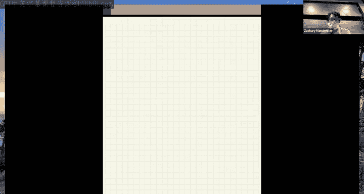

在本节课中，我们将继续探讨约束优化问题。我们将首先学习一种处理不等式约束的强大算法——增广拉格朗日法，它能有效解决传统惩罚法中的病态问题。接着，我们将深入研究二次规划，这是一种在现代模型预测控制中至关重要的凸优化问题。最后，我们会讨论在约束优化背景下，正则化和线搜索等数值技巧的具体应用。

---

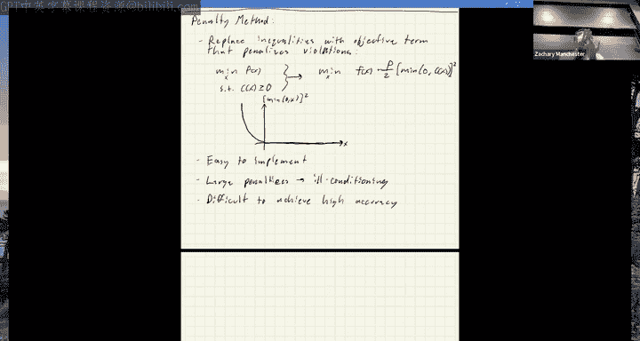

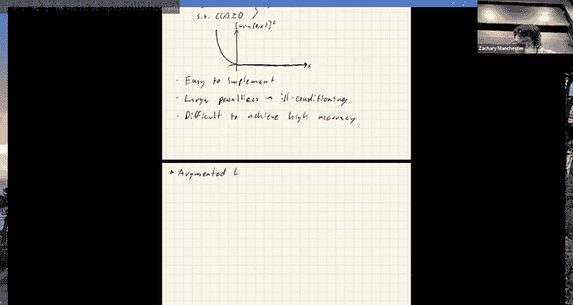

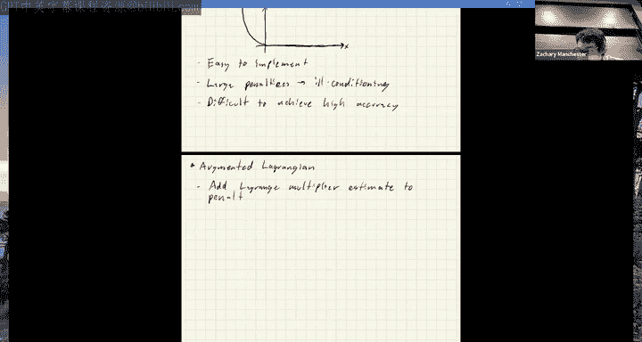

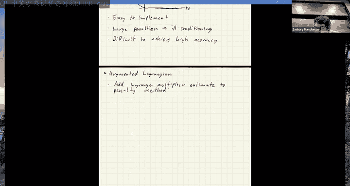

## 1. 回顾：惩罚法与KKT条件

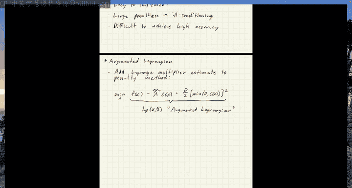


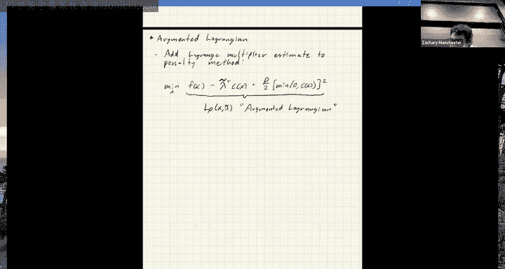

上一节我们介绍了约束优化，特别是KKT条件和处理不等式约束的惩罚法。

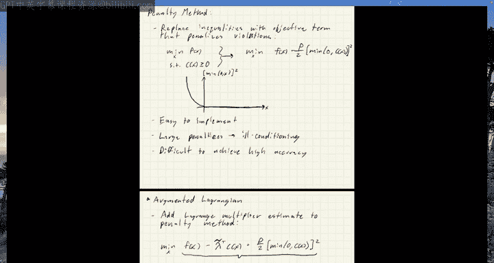

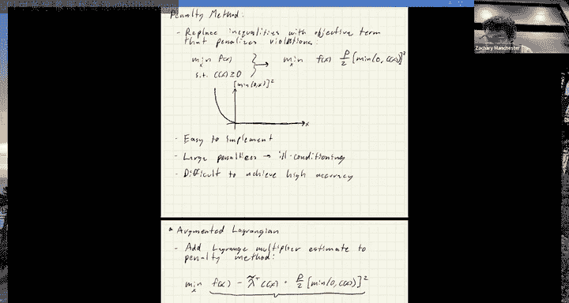

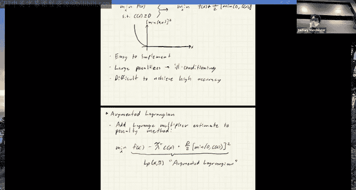

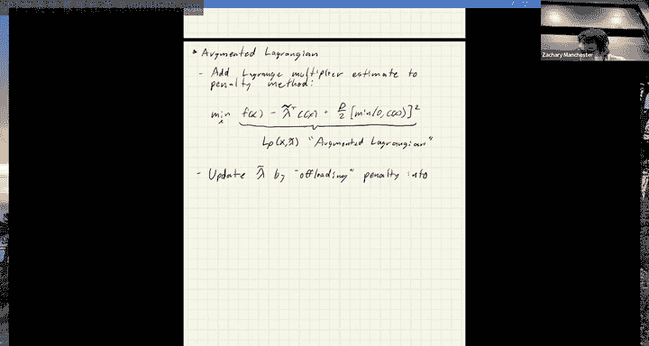

惩罚法的基本思想是将约束违反转化为目标函数的惩罚项。对于一个最小化问题：
```
min f(x)
s.t. c(x) >= 0
```
我们将其转化为无约束问题：
```
min f(x) + (ρ/2) * [min(0, c(x))]^2
```
其中 `ρ` 是惩罚权重。

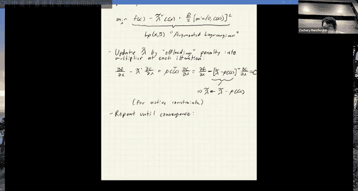

然而，惩罚法存在一个根本问题：为了获得精确的约束满足（即 `c(x) = 0`），理论上需要将惩罚权重 `ρ` 增加到无穷大。但在实际计算中，过大的 `ρ` 会导致海森矩阵病态，使得牛顿法中的线性系统难以求解，从而无法达到高精度的约束满足。

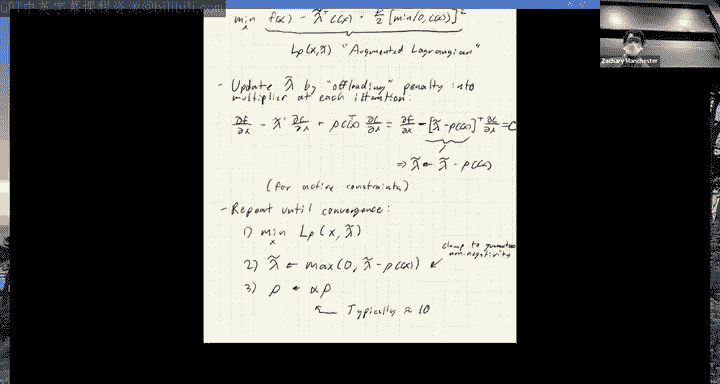


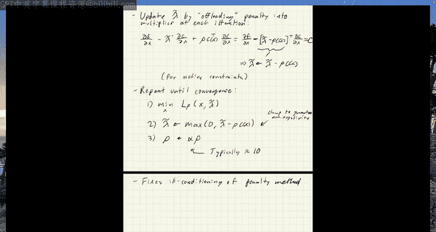

---

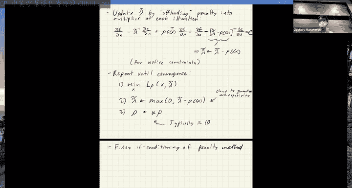

## 2. 增广拉格朗日法 🛠️


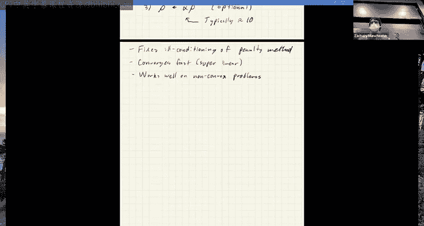

为了克服惩罚法的缺陷，我们引入增广拉格朗日法。它结合了拉格朗日乘子法和惩罚法的优点。

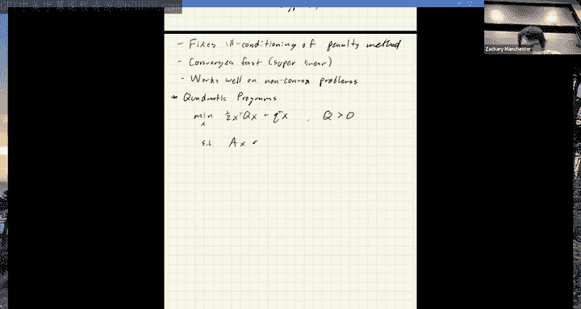

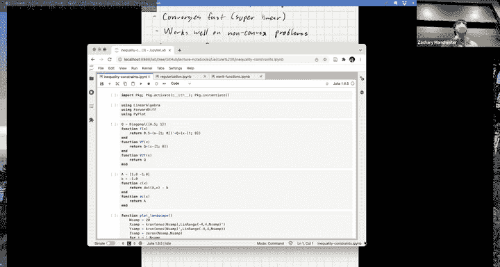

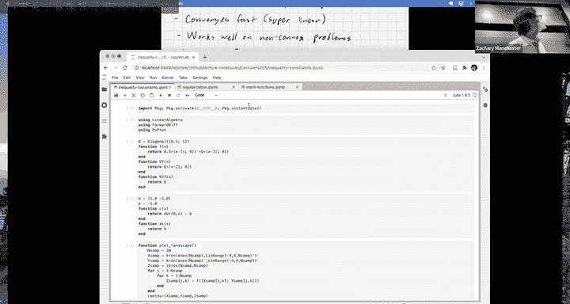

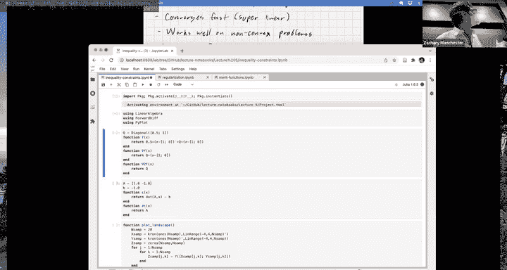

### 2.1 基本思想
我们定义增广拉格朗日函数 `L_ρ`：
```
L_ρ(x, λ̃) = f(x) - λ̃ᵀ c(x) + (ρ/2) * [min(0, c(x))]^2
```
注意，这里的 `λ̃` 是拉格朗日乘子的一个估计值，而不是原始问题中的精确乘子。

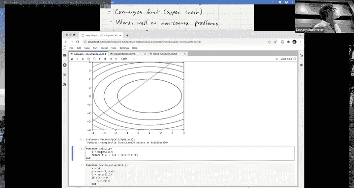

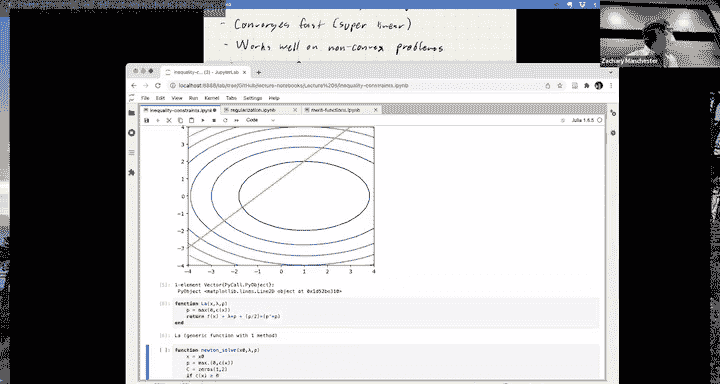

### 2.2 算法步骤
增广拉格朗日法是一个双层循环算法：

1.  **内层循环（固定乘子，优化变量）**：
    固定当前的乘子估计 `λ̃` 和惩罚权重 `ρ`，求解关于 `x` 的无约束最小化问题：
    ```
    x* = argmin_x L_ρ(x, λ̃)
    ```

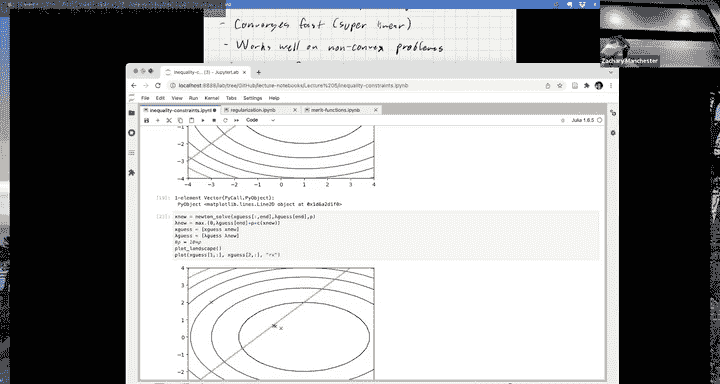

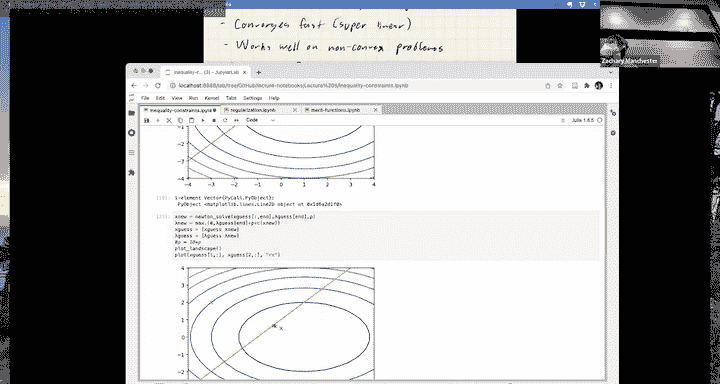


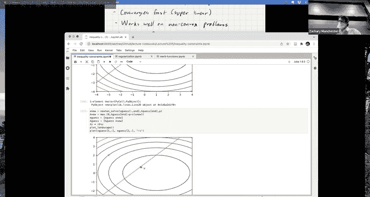

2.  **外层循环（更新乘子和惩罚权重）**：
    *   **更新乘子**：根据当前解 `x*` 的约束违反程度更新拉格朗日乘子估计。对于活跃约束（`c(x) < 0`），更新规则近似为：
        ```
        λ̃_new = max(0, λ̃_old - ρ * c(x*))
        ```
        这个更新使得乘子估计逐渐逼近真实的最优拉格朗日乘子。
    *   **（可选）增大惩罚权重**：为了加速收敛，可以按一个因子（例如10）增大 `ρ`：
        ```
        ρ_new = α * ρ_old,  (α > 1)
        ```
        但即使不增大 `ρ`，仅通过乘子更新，算法也能收敛到正确解。

### 2.3 优势
*   **解决病态问题**：不需要将 `ρ` 增加到无穷大，通过乘子更新即可获得精确解，避免了海森矩阵的病态。
*   **对非凸问题鲁棒**：相比原始-对偶内点法，增广拉格朗日法对非凸问题和不可行初始猜测的容忍度更高，非常稳健。
*   **收敛速度快**：虽然达不到原始-对偶方法的超线性收敛速率，但仍能实现快速的超线性收敛。


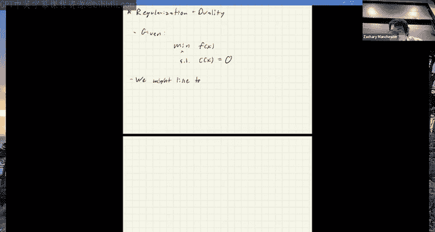

---

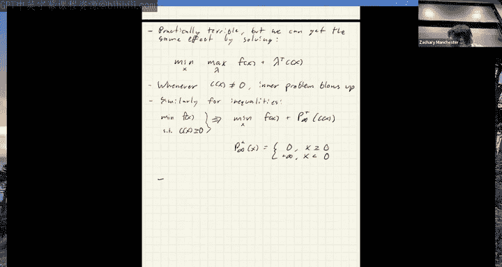

## 3. 二次规划：模型预测控制的基石 📐

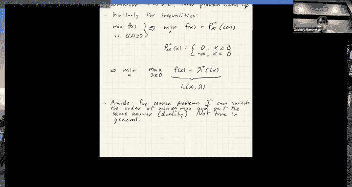

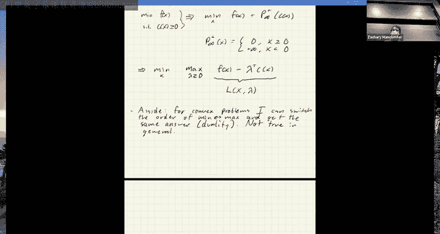

二次规划是一类特殊的凸优化问题，其目标函数是凸二次函数，约束为线性（等式或不等式）。它在机器人、航空航天等领域的实时模型预测控制中应用广泛。

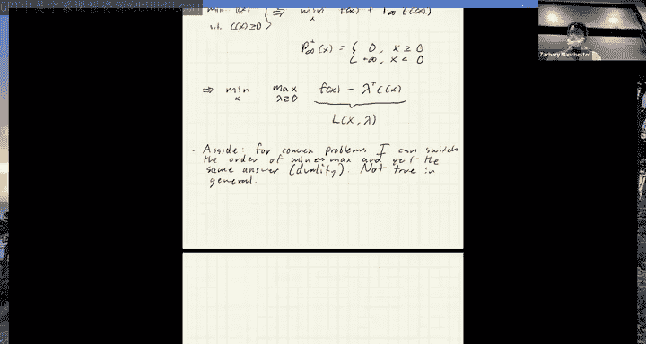

### 3.1 标准形式
一个二次规划问题可以写为：
```
min (1/2) xᵀ Q x + qᵀ x
s.t. A x <= b
     C x = d
```
其中，矩阵 `Q` 是严格正定的，这保证了目标函数是凸的，且问题有唯一解。

### 3.2 求解与应用
由于其结构的特殊性（凸且约束线性），存在非常高效的专用求解器，可以达到千赫兹甚至更快的求解速度，非常适合在线实时控制。

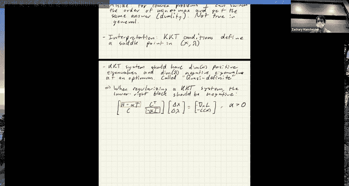

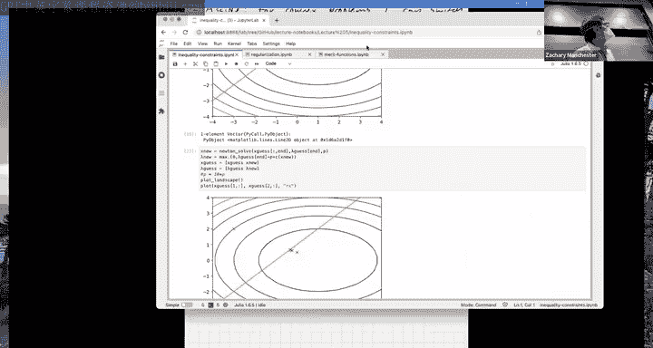

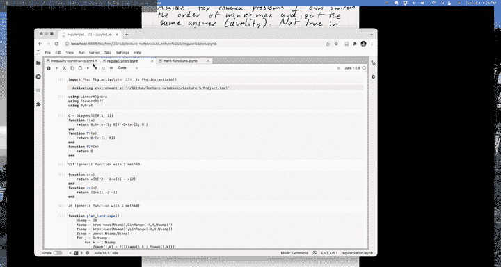

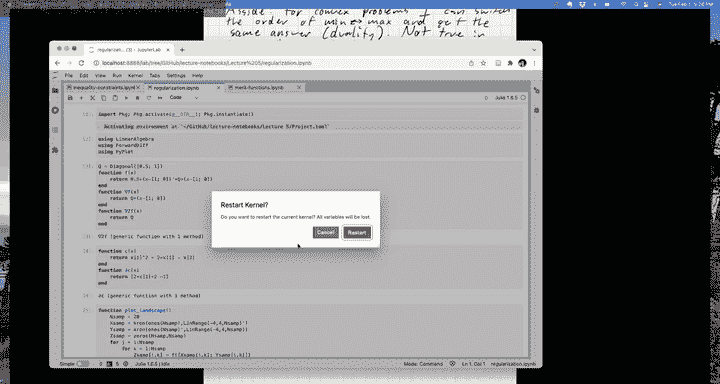

在本次课程的代码演示中，我们使用增广拉格朗日法求解了一个简单的二维二次规划问题。结果表明，即使不更新惩罚权重 `ρ`，仅通过外层循环的乘子更新，算法也能快速收敛到精确解。

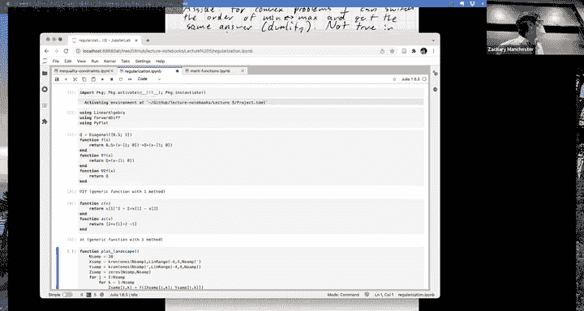

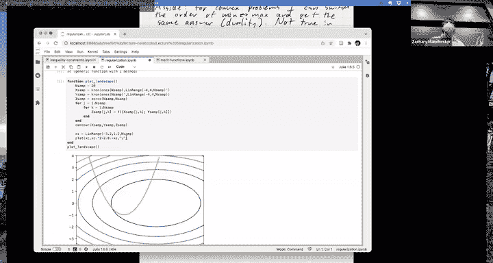

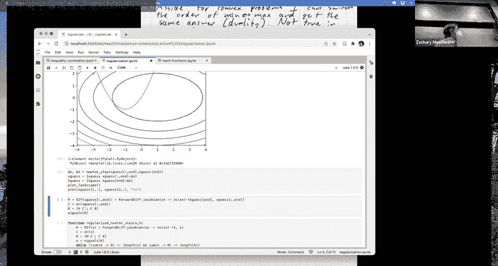

---

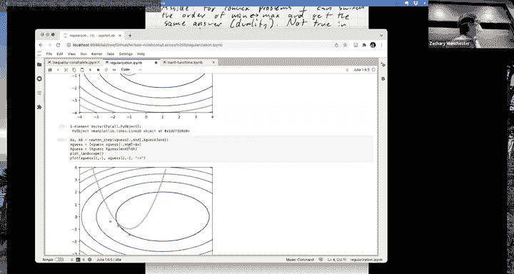


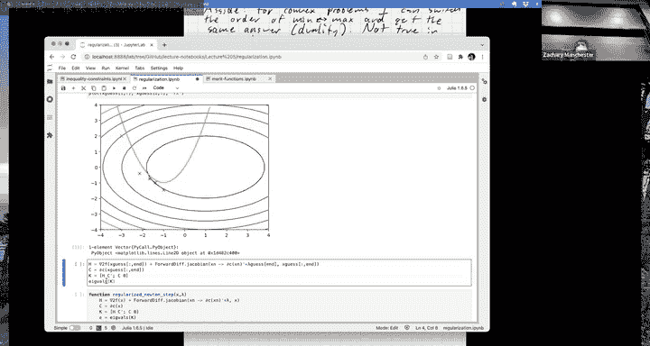


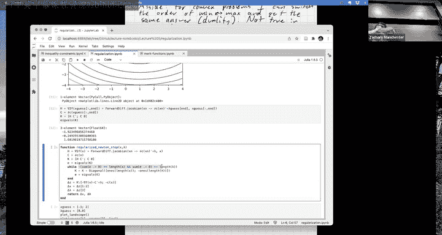

## 4. 约束优化中的正则化与线搜索 ⚙️

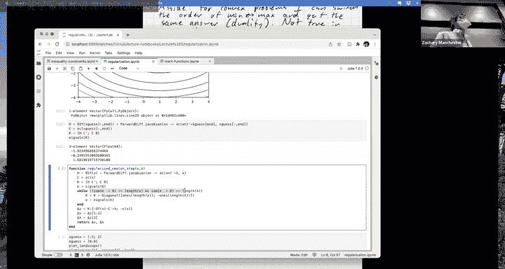


本节我们将讨论在一般非线性约束优化中，如何应用正则化和线搜索技巧。


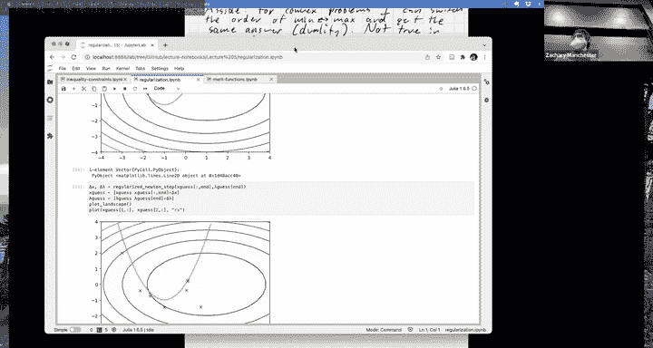


### 4.1 KKT系统的正则化
回顾一下，对于包含等式约束的问题，其KKT条件导出的牛顿步线性系统为：
```
[ ∇²L  ∇cᵀ ] [ Δx ] = - [ ∇f - λ∇c ]
[ ∇c    0  ] [ Δλ ]     [   -c     ]
```
这个系统需要具有特定的特征值结构：在解处，与变量 `x` 相关的部分应有正特征值（对应极小值），与乘子 `λ` 相关的部分应有负特征值（对应极大值）。这种系统被称为**拟定系统**。

当牛顿迭代远离解时，这个特征值结构可能被破坏。此时，我们需要对KKT矩阵进行正则化：
*   在左上角的 `∇²L` 块添加正正则项 `(+αI)`，使其更“正定”。
*   在右下角的零块添加**负**正则项 `(-αI)`，使其更“负定”。
正则化后的系统变为：
```
[ ∇²L + αI    ∇cᵀ    ] [ Δx ] = - [ ∇f - λ∇c ]
[   ∇c       -αI     ] [ Δλ ]     [   -c     ]
```
这能确保牛顿步指向正确的鞍点方向（在 `x` 上下降，在 `λ` 上上升）。

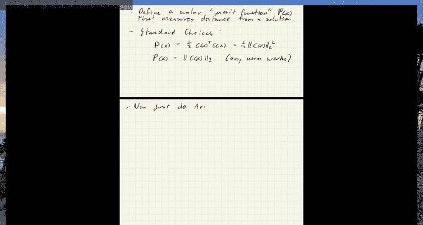

### 4.2 约束优化中的线搜索
在无约束优化中，我们通过检查目标函数值是否充分下降来进行线搜索（Armijo规则）。在约束优化中，我们没有单一的目标函数来度量进展。因此，我们需要定义一个**价值函数**来衡量当前点离解的“距离”。

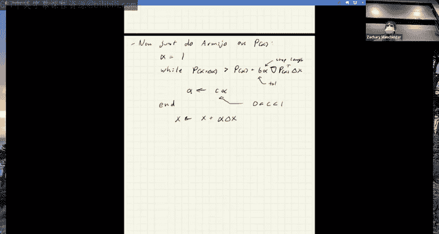

以下是几种常见的价值函数选择：

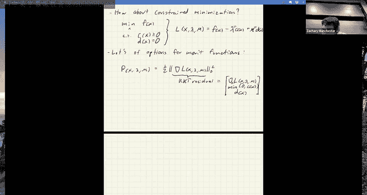

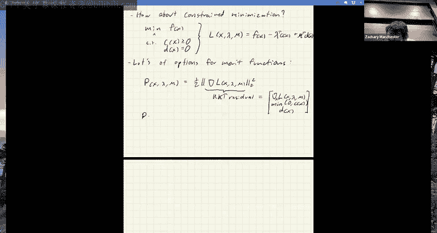

1.  **KKT残差范数**：`P(x, λ) = ||∇L, c||`。其梯度计算成本高昂，实践中不常用。
2.  **目标函数加约束违反惩罚**：`P(x) = f(x) + ρ * ||min(0, c(x))||₁`。这是最常用的方法之一，其梯度计算简单（涉及符号函数），且 `ρ` 可以调节对目标下降和约束满足的权衡。但 `ρ` 过大可能导致“Maratos效应”，即由于约束曲率，线搜索回溯过多，收敛极慢。
3.  **增广拉格朗日函数本身**：`P(x) = L_ρ(x, λ̃)`。对于使用增广拉格朗日法的求解器，这提供了一个天然的价值函数，计算也相对方便。

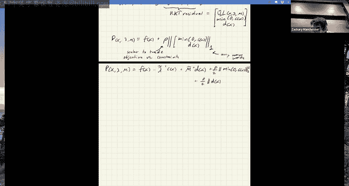

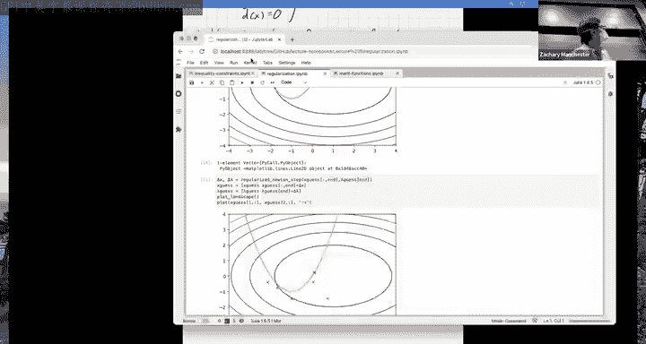

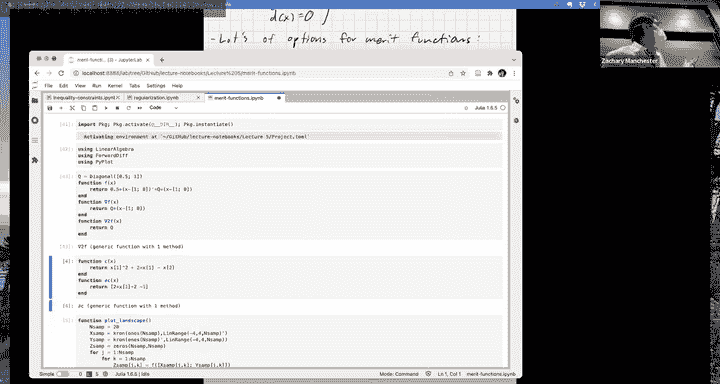

在代码演示中，我们比较了使用KKT残差和“目标+1范数惩罚”作为价值函数的效果。后者通过调整惩罚权重 `ρ`，可以在跟踪约束和快速收敛之间取得平衡。


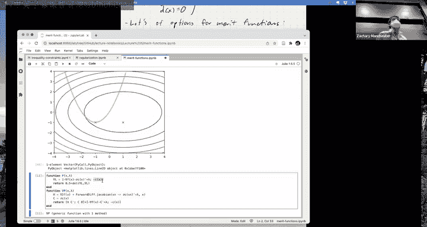


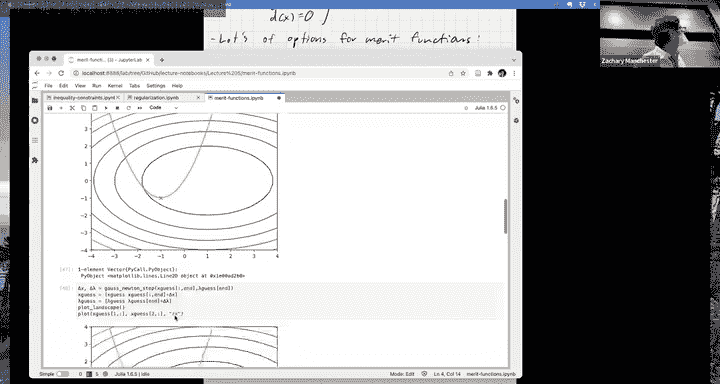

---

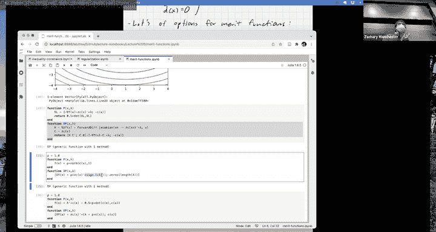

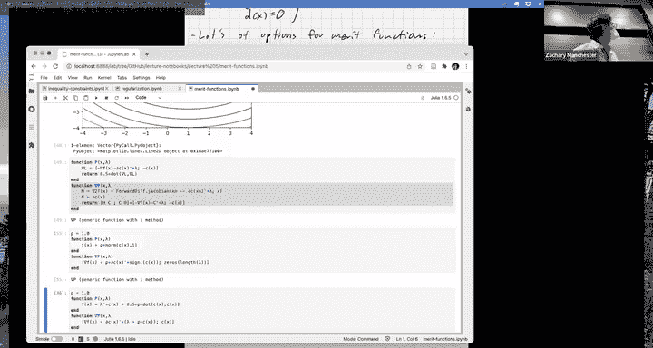

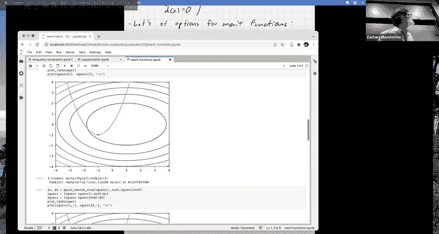

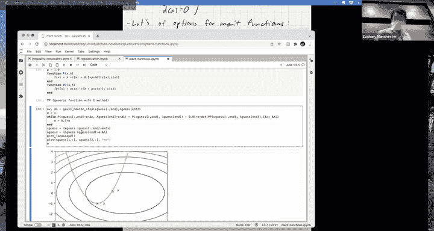

## 总结 🎯

本节课我们一起学习了处理约束优化问题的几个核心工具：

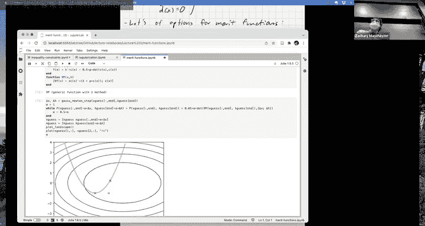

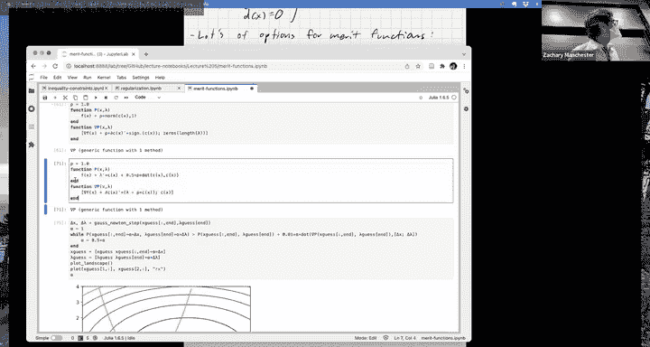

1.  **增广拉格朗日法**：通过结合惩罚项和拉格朗日乘子更新，有效解决了纯惩罚法的病态问题，对非凸问题和不可行初值鲁棒性强，是实践中非常受欢迎的算法。
2.  **二次规划**：我们了解了这种凸优化问题的标准形式及其在实时控制中的重要性，并看到了用增广拉格朗日法求解QP的实例。
3.  **高级数值技巧**：
    *   **正则化**：在求解KKT系统时，通过对角块添加正/负正则项，可以保证牛顿步方向的正确性，特别是在问题非凸或远离解时。
    *   **线搜索**：在约束优化中，需要构造标量价值函数（如目标加约束惩罚范数）来引导步长选择，并需注意调节惩罚权重以避免“Maratos效应”。

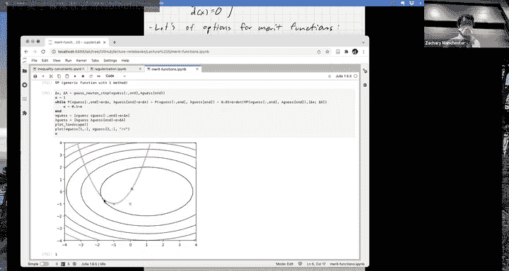

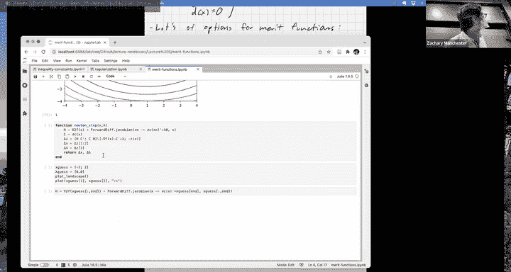

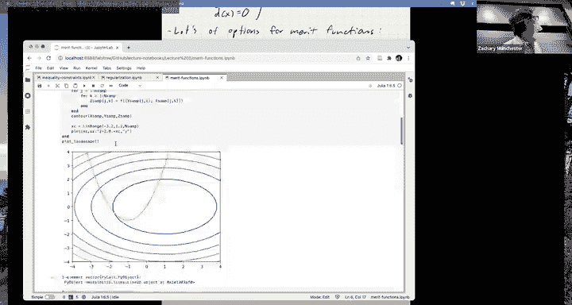

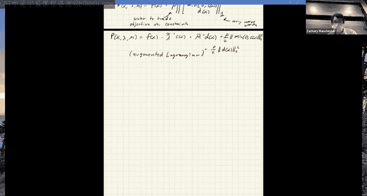

这些内容构成了解决非线性约束优化问题的实用工具箱，也是我们后续学习最优控制算法的重要基础。下一节课，我们将正式进入轨迹优化和确定性最优控制的主题。