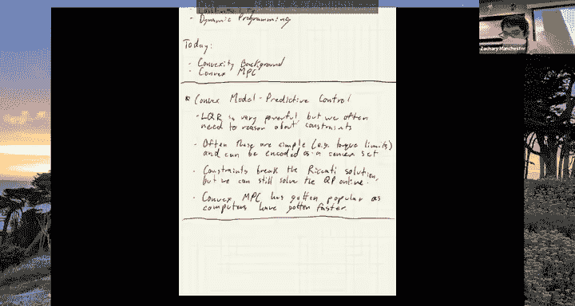
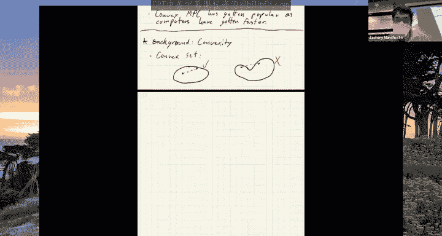
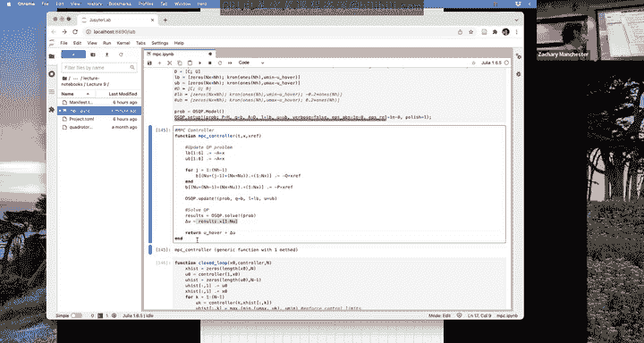
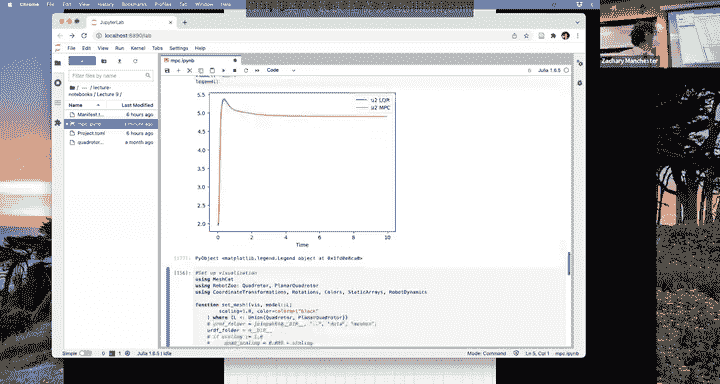
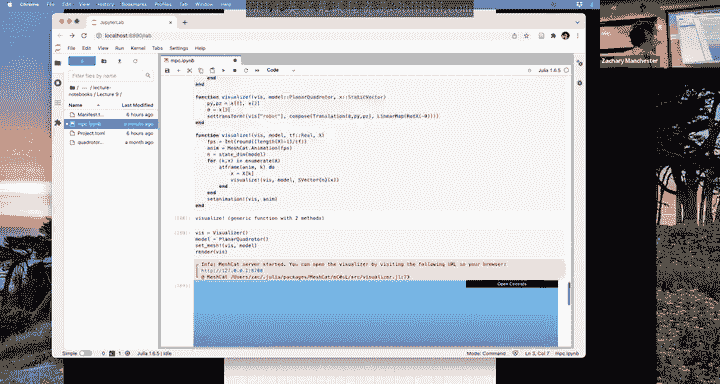
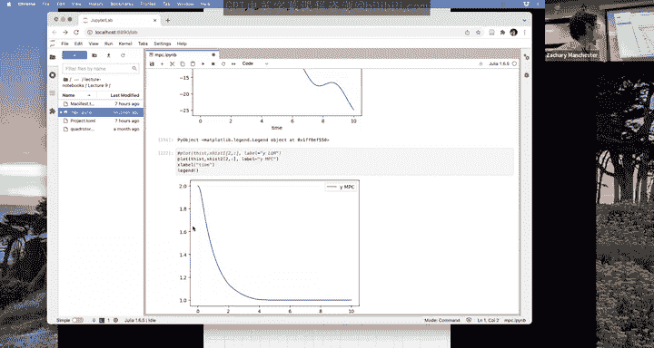

# 10：凸模型预测控制 🎯

在本节课中，我们将学习凸模型预测控制（MPC）。我们将从LQR（线性二次调节器）过渡到处理带约束的控制问题。首先，我们会介绍凸优化的基本概念，然后深入探讨凸MPC的原理、动机和实际应用。

---

## 从LQR到带约束的问题

上一节我们介绍了LQR和动态规划。本节中，我们来看看如何将LQR扩展到能处理实际系统中常见的约束，例如执行器的力矩或推力限制。

LQR功能强大，能很好地应用于高度非线性系统。但它假设系统没有任何约束。在实践中，最常见的约束是执行器限制（如力矩或推力限制）。当控制器达到这些限制时，LQR无法对其进行规划，可能导致控制器失效。

这些约束通常很简单，几乎总是可以表述为凸约束或凸集。例如，执行器限制通常是简单的边界约束，推力限制可以表述为锥约束。

约束破坏了之前讨论的Riccati方程等优美的LQR求解方法。但是，如果我们回顾之前讨论的LQR的二次规划（QP）形式，QP可以包含线性不等式约束。因此，虽然无法使用Riccati解和反馈增益矩阵K，但我们仍然可以直接求解QP。只要我们能足够快地求解这个QP，它就是完全可行的，并且可以在线运行。在现代计算能力的支持下，我们通常可以在千赫兹速率下求解这些QP，从而在机器人上实时运行。

凸MPC已经变得非常流行。过去几十年，MPC的应用领域随着计算机速度的提升而不断扩大。最初它用于化工过程控制（更新速率可能每分钟一两次），现在则能用于四足机器人或火箭等高速系统。

---

## 凸优化基础

在深入MPC之前，我们需要理解一些凸优化的核心概念。凸优化之所以重要，是因为对于凸问题，任何局部最优解都是全局最优解，并且牛顿法等求解器可以快速、可靠地收敛。

### 凸集

凸集的定义是：集合中任意两点之间的连线上的所有点也都包含在该集合内。

以下是优化和控制中常用的一些标准凸集示例：

*   **线性子空间**： 表示为 **Ax = b**。我们的线性动力学方程就是这种形式。
*   **半空间/盒子/多面体**： 表示为 **Ax ≤ b**。多面体是多维空间中的“多边形”。
*   **椭球**： 表示为二次不等式，如 **xᵀPx ≤ 1**，其中 **P** 是正定矩阵。
*   **二阶锥**： 也称为洛伦兹锥或“冰淇淋”锥。定义为 **||x₂:ₙ||₂ ≤ x₁**，其中 **x₁** 是向量的第一个元素，**x₂:ₙ** 是其余部分。

### 凸函数

凸函数的定义是：其图上方的区域（即上图）构成一个凸集。等价地，连接函数图上任意两点的线段位于函数图像的上方。

凸函数是从 **Rⁿ** 映射到 **R** 的函数，通常作为我们要最小化的目标函数或成本函数。

以下是一些常见的凸函数示例：

*   **线性函数**： **f(x) = cᵀx**
*   **二次函数**： **f(x) = ½ xᵀQx + cᵀx**，其中 **Q** 是半正定矩阵。这在最优控制中是最常用的成本函数。
*   **范数**： **f(x) = ||x||**，任何范数都是凸的。

### 凸优化问题

凸优化问题是：在凸约束集上最小化一个凸函数。

以下是一些标准的凸优化问题类型，它们都有高效的求解器：

*   **线性规划**： 线性目标函数，线性约束。
*   **二次规划**： 二次目标函数，线性约束。这正是LQR的QP形式。
*   **二次约束二次规划**： 二次目标函数，二次约束（凸的，例如椭球）。
*   **二阶锥规划**： 目标函数通常是线性的（但可以转化为二次型），约束包含二阶锥约束。

这些问题的层次结构是：LP是QP的特例，QP是QCQP的特例，QCQP可以转化为SOCP。

为什么凸性如此重要？对于凸函数，任何局部最优解都是全局最优解。这意味着不存在虚假的局部最优点。从控制工程的角度来看，牛顿法在这类问题上效果极佳，收敛速度非常快（通常只需5-10次迭代），并且可靠。因此，我们可以为在线求解时间提供可证明的保证，这对于实时控制至关重要。

在实践中，我们通常可以选择凸的成本函数（如二次型）。挑战在于动力学方程通常是非线性的，约束也可能非凸。我们需要通过线性化动力学等技巧来近似处理，以将问题转化为凸形式。

---

## 凸模型预测控制

现在，我们正式介绍凸模型预测控制。可以将其视为带约束的LQR。我们通常只能处理线性动力学（因为等式约束必须是线性的），但可以对状态和控制输入施加各种凸约束。

### 从动态规划到MPC

回顾上一节的动态规划讨论，如果我们知道了“成本-to-go”函数，那么要得到反馈策略，只需要求解一个单步优化问题：

**uₖ = argminᵤ [ 单步成本 + 成本-to-go(下一状态) ]**

其中包含动力学约束。这正是LQR的推导方式。

对于LQR，如果我们只关心输入约束（如力矩限制），一个直观的想法是直接在这个单步最小化问题中加入对 **u** 的约束。但这样做效果通常很差，甚至可能导致系统不稳定。原因是，这里使用的“成本-to-go”函数是在**无约束**情况下计算出来的，它完全忽略了未来的约束，因此对于长期行为是一个很差的近似。

然而，如果系统是稳定的，并且我们的控制策略能将其驱向原点（或参考轨迹），那么在足够远的未来，控制输入应该会脱离约束边界，趋于零。此时，无约束的LQR“成本-to-go”函数就是一个良好的近似。

基于这个直觉，MPC的核心思想是：将动态规划中的单步前瞻扩展为多步前瞻。我们在一个有限时域 **H** 内进行显式的约束优化，然后在时域末端用一个近似的“成本-to-go”函数来代表更远的未来。这个近似的“成本-to-go”通常就取自无约束LQR的解。

### MPC问题表述

标准的凸MPC问题表述如下：

最小化：
**∑ₖ₌₁ᴴ⁻¹ [ ½ (xₖ - x_ref)ᵀQ(xₖ - x_ref) + ½ (uₖ - u_ref)ᵀR(uₖ - u_ref) ] + ½ (x_H - x_ref)ᵀP(x_H - x_ref)**

满足：
*   **xₖ₊₁ = A xₖ + B uₖ** （线性动力学约束）
*   **xₖ ∈ X** （凸的状态约束集）
*   **uₖ ∈ U** （凸的输入约束集）

其中：
*   **H** 是预测时域。
*   **Q** 和 **R** 是状态和控制成本的权重矩阵。
*   **P** 是终端成本矩阵，取自无约束无限时域LQR的Riccati解，即“成本-to-go”的近似。
*   **x_ref** 和 **u_ref** 是参考状态和输入（例如悬停状态）。

如果没有任何额外的状态和输入约束，这个MPC问题就完全退化为LQR问题。当系统未激活约束时，MPC与LQR的行为是一致的。

MPC也被称为“滚动时域控制”。在每一个时间步，它都基于当前状态求解一个有限时域的最优控制问题，但只实施第一个控制输入，然后在下一个时间步重复这个过程。

### 时域与终端成本的重要性

终端成本 **V(x) = ½ (x - x_ref)ᵀP(x - x_ref)** 作为“成本-to-go”的近似，其质量对MPC性能至关重要。
*   如果 **V(x)** 是对真实“成本-to-go”的完美近似，那么只需要 **H=1** 的时域就足够了。
*   时域 **H** 越长，MPC的性能通常越好，并且对终端成本近似的质量依赖越小。
*   反之，终端成本近似得越好，所需的时域 **H** 就可以越短。

在实践中，我们需要在性能（更长的 **H**）和计算负担（更短的 **H**）之间进行权衡。

---

## 实例：平面四旋翼控制

为了具体说明，我们考虑一个平面四旋翼（二维）模型。它有三个状态：**x**（水平位置）、**y**（垂直高度）、**θ**（俯仰角），以及两个控制输入：**u₁** 和 **u₂**（两个螺旋桨的推力）。

其非线性动力学方程为：
*   **mẍ = (u₁ + u₂) sinθ**
*   **mÿ = (u₁ + u₂) cosθ - mg**
*   **Jθ̈ = (L/2)(u₂ - u₁)**

在悬停条件（**θ=0**, **u₁=u₂=mg/2**）附近进行线性化，得到线性模型：
*   **Δẍ ≈ -g Δθ**
*   **Δÿ ≈ (1/m)(Δu₁ + Δu₂)**
*   **Δθ̈ ≈ (L/(2J))(Δu₂ - Δu₁)**

我们可以将其写成标准状态空间形式 **ẋ = A x + B u**。

### 仿真对比：LQR vs. MPC

我们设置一个场景：让四旋翼从初始位置（水平偏移1米，高度偏移1米）飞往目标位置（高度1米，其他为零）。在没有约束的情况下，LQR和MPC（时域 **H=1**）的表现几乎完全相同。

然而，当我们将初始水平偏移增加到5米时，情况发生了变化：
*   **LQR** 会计算出很大的控制指令，但实际执行器存在上限（例如最大推力为1.2倍悬停推力）。由于LQR无法“感知”这个限制，它仍然命令执行器输出超出能力的推力，导致系统实际响应与预期严重不符，最终可能失控坠毁。
*   **MPC** 在优化问题中明确包含了 **u_min ≤ u ≤ u_max** 的约束。因此，它能“规划”出在推力限制内可行的轨迹，虽然响应可能变慢，但能稳定地到达目标。

### 利用状态约束保证线性化有效性

在线性化中，我们使用了小角度近似（**sinθ ≈ θ**, **cosθ ≈ 1**）。当俯仰角 **θ** 很大时，这个近似不再成立，基于线性模型的MPC预测会变得不准确。

一个巧妙的技巧是，我们可以为MPC问题增加一个状态约束：**|θ| ≤ θ_max**，其中 **θ_max** 是一个保证小角度近似合理的小值（例如0.2弧度）。这样，MPC控制器在规划时就会自动将姿态限制在线性模型有效的范围内，从而获得更可靠、更平滑的控制性能。

---

## 总结

本节课中，我们一起学习了凸模型预测控制。

1.  **动机**： 实际机器人系统存在执行器限制等约束，而无约束的LQR无法处理这些约束，可能导致性能下降甚至失败。
2.  **凸优化基础**： 我们回顾了凸集、凸函数和凸优化问题的定义。凸问题的优点是局部最优即全局最优，且可用牛顿法等快速可靠地求解。
3.  **MPC原理**： MPC通过求解一个有限时域内的带约束优化问题来生成控制指令。它在时域末端使用一个近似的“成本-to-go”函数（通常来自无约束LQR）来代表更远的未来。在每个时间步，只实施优化解的第一个控制输入，然后重新求解。
4.  **关键要素**： 预测时域 **H** 和终端成本函数 **V(x)** 是影响MPC性能与计算复杂度的关键设计参数。
5.  **实例与应用**： 通过平面四旋翼的仿真，我们直观展示了MPC在处理执行器约束方面的优势，并介绍了如何利用状态约束来保证模型线性近似的有效性。

凸MPC因其能够显式、最优地处理各种约束，已成为现代机器人学中首选的先进控制方法。