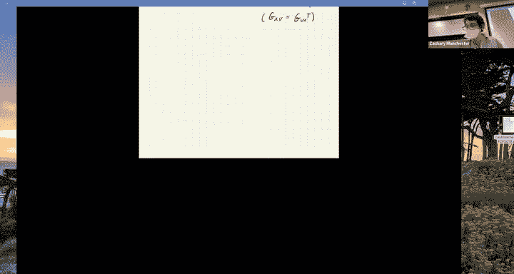
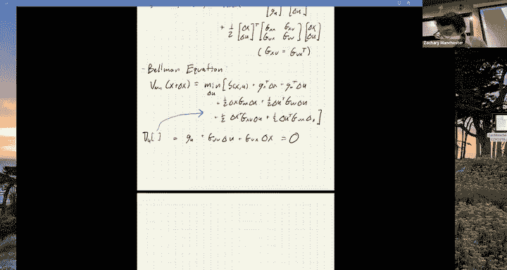
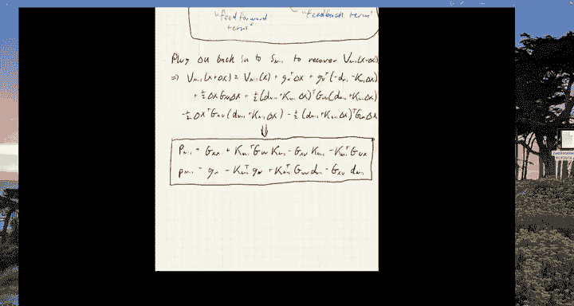
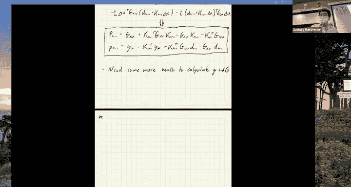
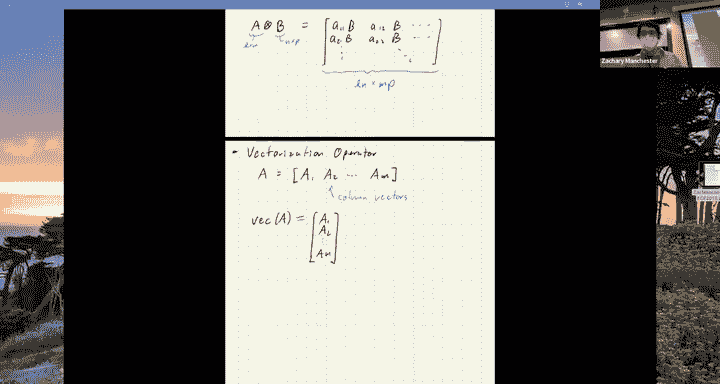
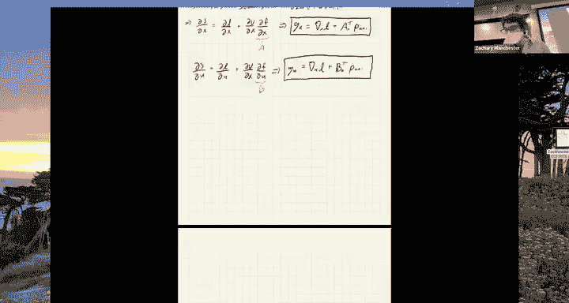
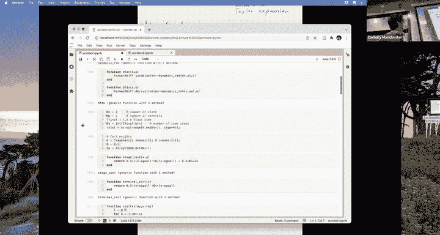

# 11：非线性轨迹优化 🚀

在本节课中，我们将学习非线性轨迹优化的基本概念和一种在机器人学中广泛使用的核心算法——差分动态规划，也称为迭代LQR。我们将从回顾凸优化开始，逐步过渡到非线性问题的挑战，并详细讲解如何利用动态规划和牛顿法的思想来解决这些问题。

---

## 回顾与过渡：从凸优化到非线性问题

上一节我们快速回顾了凸优化和凸模型预测控制的基础。本节中，我们来看看当系统动力学变为非线性时，优化问题会变得多么复杂和有趣。

### 凸优化的威力与局限

线性化动力学模型在许多情况下效果极佳。如果可行，这通常是首选方案。例如，火箭着陆和足式机器人的标准控制器都大量使用了线性化模型和凸优化（如二阶锥规划）。

*   **火箭软着陆**：通过将推力矢量约束（推力大小和万向节角度限制）建模为**二阶锥约束**，可以将问题转化为凸优化问题。
    *   **推力约束公式**：`||[f_x, f_y]||_2 ≤ μ * f_z`，其中 `f_z` 是法向推力，`μ` 与万向节角度限制相关。
*   **足式机器人接触力**：脚与地面间的摩擦力约束同样可以建模为**摩擦锥**，这也是一个二阶锥约束。
    *   **摩擦锥公式**：`||[f_x, f_y]||_2 ≤ μ * f_z`，其中 `μ` 是摩擦系数。

在实践中，为了利用更成熟、更快速的QP求解器，常将圆锥约束线性化为多面体锥进行内近似。

### 引入非线性动力学的挑战

然而，当我们必须在优化问题中引入非线性动力学时，情况就变得复杂了。问题立即变为**非凸**，我们无法保证求解器总能收敛，也无法界定收敛所需的迭代次数。这使得在线应用变得有风险，需要进行大量的测试和蒙特卡洛仿真。

尽管如此，非线性MPC在实践中仍有应用，例如在自动驾驶中。成功的关键技巧包括：
1.  **热启动**：利用上一个时间步的MPC解作为当前优化的初始猜测，通常能快速收敛。
2.  **正则化**：保证算法能收敛到局部最优解。

但本质上，我们只能获取局部梯度信息，然后“顺坡而下”，无法知晓全局最优解的情况。因此，**如果线性方法足够好，就应该使用它**。

---

## 非线性轨迹优化问题定义

现在，让我们回到确定性最优控制的通用框架，正式定义非线性轨迹优化问题。

在离散时间下，问题形式如下：

**目标**：最小化总成本
`J = ∑_{k=0}^{N-1} l_k(x_k, u_k) + l_N(x_N)`

**约束**：
1.  **动力学约束**：`x_{k+1} = f_k(x_k, u_k)` （非线性）
2.  **状态与输入约束**：`x_k ∈ X_k`, `u_k ∈ U_k` （可能非凸）

**问题特点**：
*   **非凸成本函数**：通常仍选择易于处理的二次型。
*   **非线性动力学**：`f_k` 是非线性函数。
*   **非凸约束**：集合 `X_k` 和 `U_k` 可能非凸。
*   **光滑性假设**：通常假设成本和动力学至少是二阶连续可微的，以便计算梯度和海森矩阵，从而应用牛顿法。

---

## 差分动态规划与迭代LQR 🧮

DDP/iLQR 是一种结合了动态规划和牛顿法的强大算法。其核心思想是：在动态规划的后向递归中，对“成本至Go”函数进行二阶泰勒展开，并在此基础上计算牛顿更新步长。

### 算法核心：二阶近似与后向递归

我们首先定义价值函数 `V_k(x)` 和动作价值函数 `Q_k(x, u)` 的二阶泰勒展开。

*   **价值函数展开**：
    `V_k(x+δx) ≈ V_k(x) + p_k^T δx + 1/2 δx^T P_k δx`
    其中 `p_k` 是梯度，`P_k` 是海森矩阵。终端条件 `p_N` 和 `P_N` 来自终端成本 `l_N(x_N)`。

*   **动作价值函数展开**：
    `Q_k(x+δx, u+δu) ≈ Q_k(x, u) + [g_x^T, g_u^T] [δx; δu] + 1/2 [δx; δu]^T [G_{xx}, G_{xu}; G_{ux}, G_{uu}] [δx; δu]`
    其中 `g_x`, `g_u` 是梯度块，`G_{xx}`, `G_{xu}`, `G_{ux}`, `G_{uu}` 是海森矩阵块，且 `G_{xu} = G_{ux}^T`。

### 后向递归步骤

从已知的终端成本 `V_N` 开始，向后递归计算 `k = N-1, ..., 0`。

1.  **最小化动作价值函数**：对 `Q_k` 的近似式关于 `δu` 求导并令其为零。
    `∂Q_k/∂(δu) = g_u + G_{uu} δu + G_{ux} δx = 0`

2.  **求解最优控制增量**：
    `δu_k^* = -G_{uu}^{-1} g_u - G_{uu}^{-1} G_{ux} δx`
    我们将其定义为：
    `δu_k^* = d_k + K_k δx`
    其中：
    *   **前馈项** `d_k = -G_{uu}^{-1} g_u`：由梯度项驱动，将系统拉向期望状态。
    *   **反馈项** `K_k = -G_{uu}^{-1} G_{ux}`：由海森矩阵项决定，与LQR中的增益类似，用于稳定系统。

3.  **更新价值函数**：将最优的 `δu_k^*` 代回 `Q_k` 的展开式，合并关于 `δx` 的项，即可得到前一时刻价值函数的参数 `p_{k-1}` 和 `P_{k-1}`。
    `P_{k-1} = G_{xx} + G_{xu} K_k + K_k^T G_{ux} + K_k^T G_{uu} K_k`
    `p_{k-1} = g_x + G_{xu} d_k + K_k^T g_u + K_k^T G_{uu} d_k`

这个递归过程与LQR的Riccati方程递归非常相似，只是多了前馈项 `d_k`。

### 计算梯度与海森矩阵：向量化技巧

上述递归依赖于计算 `g_x`, `g_u`, `G_{xx}`, `G_{xu}`, `G_{uu}`。这些项涉及对动力学模型 `f_k(x,u)` 的导数。计算 `G_{xx}` 等项时需要动力学雅可比矩阵 `A = ∂f/∂x` 和 `B = ∂f/∂u` 的导数，这会产生三阶张量，计算较为复杂。

为了在标准矩阵库中清晰处理这些运算，我们引入两个工具：
1.  **克罗内克积**：将矩阵维度“放大”。
2.  **向量化算子**：将矩阵按列堆叠成一个长向量。

利用 **“Vec技巧”**，可以将矩阵连乘的导数转化为涉及克罗内克积的向量化运算，从而避免直接处理三阶张量。例如，对于 `ABC`，有：
`vec(ABC) = (C^T ⊗ A) vec(B)`

通过这种方法，我们可以系统地计算出所有需要的梯度 `g` 和海森矩阵块 `G`。其中，包含三阶张量（即 `∂A/∂x`, `∂B/∂x` 等）的项最为复杂。

### DDP 与 iLQR 的区别

一个关键的实践细节是：
*   **差分动态规划**：保留所有项，包括那些由三阶张量贡献的项。这相当于**完整的牛顿法**。
*   **迭代LQR**：忽略上述复杂的三阶张量项。这相当于**高斯-牛顿法**。

在机器人领域，**几乎所有人都使用iLQR**。原因在于：
1.  **计算简便**：忽略张量项大大简化了实现。
2.  **数值稳定性**：高斯-牛顿近似能保证海森矩阵 `P_k` 保持半正定，而完整的牛顿法可能产生不定矩阵，需要额外的正则化。
3.  **性能相近**：对于许多问题，忽略这些高阶项对收敛速度的影响不大。

因此，iLQR 是实践中更受欢迎的选择。

---

## 完整算法流程：前向滚动与线搜索

DDP/iLQR 算法是一个迭代过程，每次迭代包含一个后向传递和一个前向传递。

以下是算法的伪代码概述：

**初始化**：给定初始状态 `x_0` 和控制序列 `{u_k}` 的初始猜测。

**循环直到收敛**：
1.  **前向滚动**：使用当前控制序列 `{u_k}`，通过动力学方程 `x_{k+1} = f(x_k, u_k)` 模拟出状态轨迹 `{x_k}`，并计算总成本 `J`。
2.  **后向传递**：从 `k = N` 到 `1`，利用上述递归公式计算反馈增益 `{K_k}` 和前馈项 `{d_k}`，同时计算期望成本下降量 `ΔJ`。
3.  **前向传递与线搜索**：
    *   设置线搜索参数 `α = 1`。
    *   进行新的前向滚动，但使用更新后的控制律：`u_k^{new} = u_k^{old} + α d_k + K_k (x_k^{new} - x_k^{old})`。
    *   使用Armijo条件检查新轨迹的成本 `J_{new}`：如果 `J_{new} > J_{old} + c * α * ΔJ`（`c` 是一个小常数，如 `1e-2`），则减小 `α`（例如 `α = 0.5α`）并重试。
    *   接受使成本下降的 `α` 和对应的新轨迹。
4.  **更新**：将新得到的控制序列和状态轨迹作为下一次迭代的初始猜测。

**算法核心**：通过迭代地线性化动力学、求解近似LQR问题、并沿下降方向进行线搜索，最终收敛到原非线性问题的一个局部最优解。

---

## 实例演示：Acrobot摆起控制 🤖

为了直观展示iLQR的效果，我们将其应用于一个经典控制问题：Acrobot（双连杆欠驱动摆）的摆起控制。

*   **系统**：双连杆，仅在肘部关节有电机驱动，肩部关节被动。
*   **目标**：从自然下垂的静止状态，摆动到倒立平衡位置。
*   **方法**：使用iLQR算法，成本函数为跟踪倒立状态的二次型，初始控制猜测为加入噪声的零扭矩。

运行算法后，我们可以看到Acrobot成功地从一个随机的初始控制序列开始，通过数次迭代优化，最终学习到能将系统摆起到目标位置的优美轨迹。这生动地展示了iLQR处理非线性、欠驱动系统轨迹优化问题的强大能力。

---

## 总结

本节课中我们一起学习了非线性轨迹优化的核心内容：

1.  **问题定义**：明确了带有非线性动力学和非凸约束的轨迹优化问题形式。
2.  **算法核心**：深入讲解了**差分动态规划**及其变体**迭代LQR**的原理。该算法本质上是动态规划与牛顿法的结合，通过在后向递归中对价值函数进行二阶泰勒展开，并求解一系列近似LQR问题来更新策略。
3.  **关键步骤**：理解了算法中的**后向递归**（计算反馈和前馈增益）、**前向滚动**以及**线搜索**的重要性。
4.  **实践区别**：了解了DDP（完整牛顿法）与iLQR（高斯-牛顿法）的主要区别，以及为何iLQR在机器人领域更受青睐。
5.  **应用实例**：通过Acrobot摆起控制的演示，直观看到了iLQR算法的有效性。

非线性轨迹优化为处理复杂机器人系统提供了强大的工具，尽管其理论保证不如凸优化完善，但在精心实现和大量测试下，已成为许多先进机器人系统的核心技术。