# 13：处理三维旋转 🚀


在本节课中，我们将回顾之前讨论过的确定性最优控制算法，并开始探讨一个在机器人学中非常实际且重要的话题：三维旋转。我们将学习如何用旋转矩阵和四元数表示姿态，以及相关的运动学。


---

## 📊 算法回顾：确定性最优控制

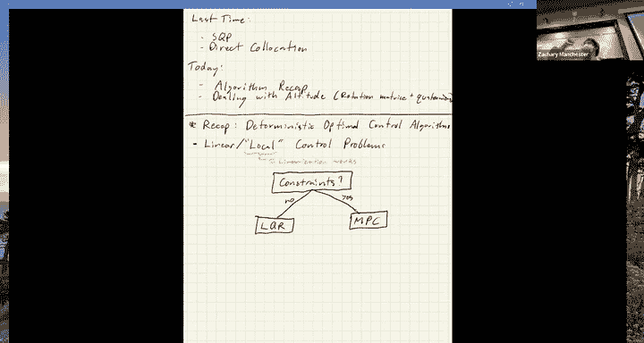

上一节我们介绍了序列二次规划和直接配点法等非线性轨迹优化技术。本节中，我们将对目前讨论过的所有算法进行一个总结，并分析它们的优缺点。

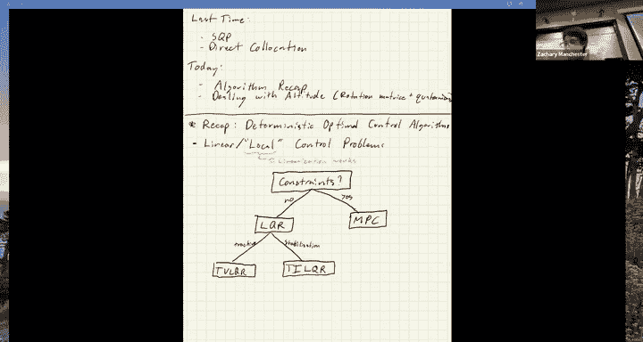

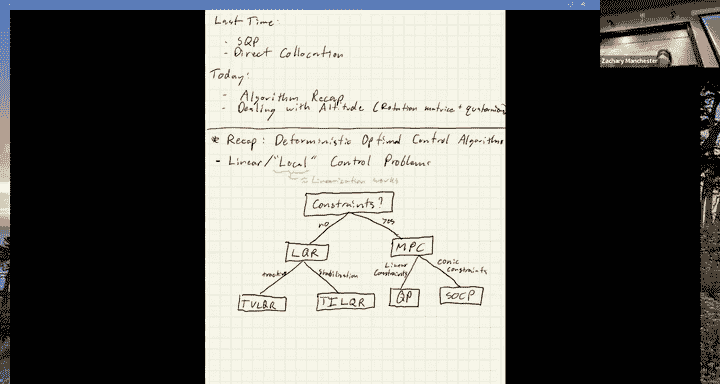

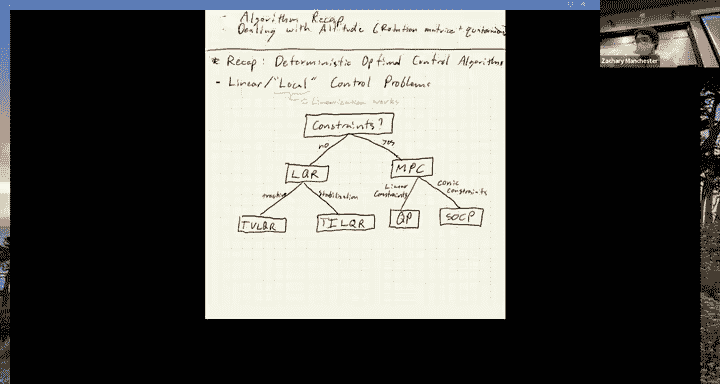


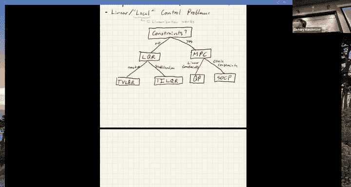

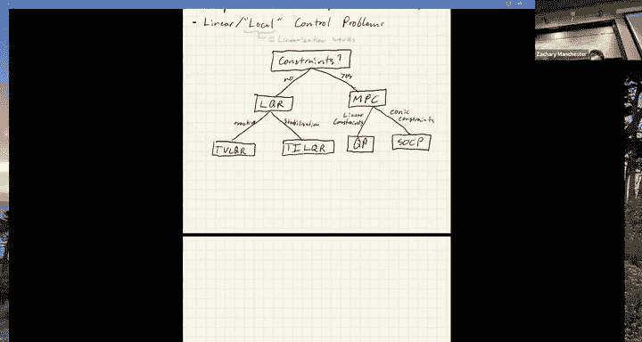

我们讨论过的算法主要分为两大类：适用于线性或局部线性化问题的算法，以及用于非线性轨迹优化的算法。

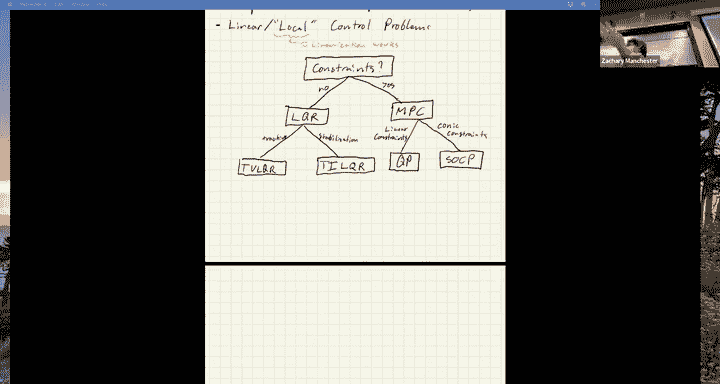

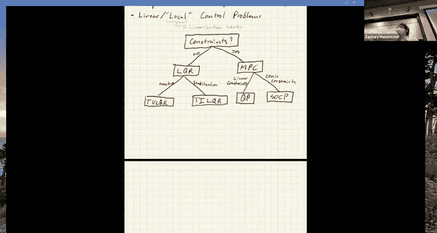

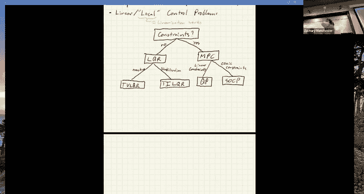


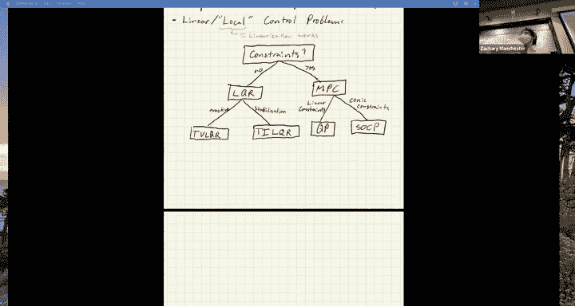

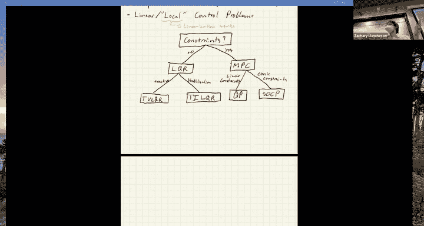


### 线性或局部控制问题

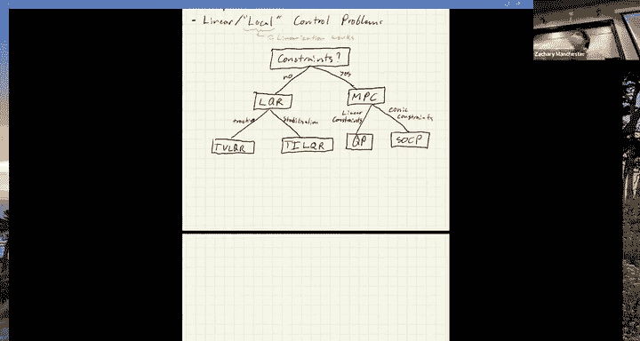

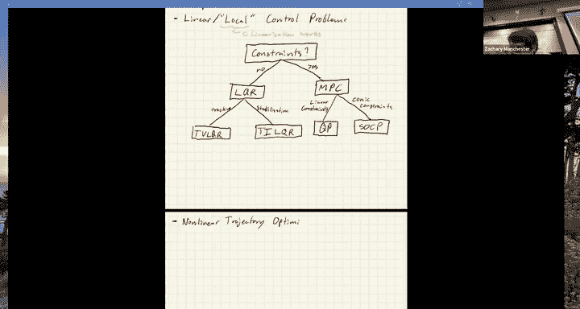

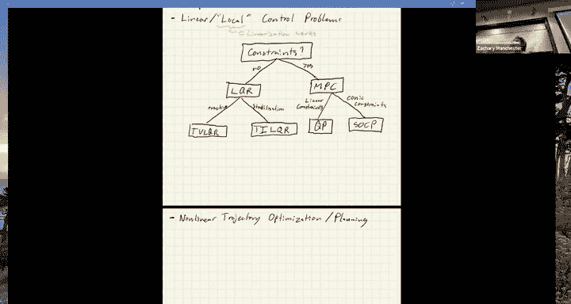

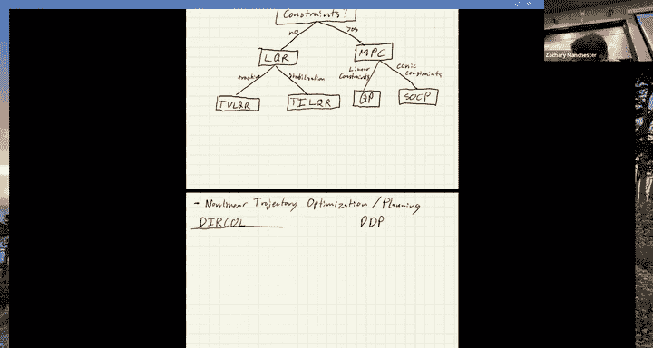

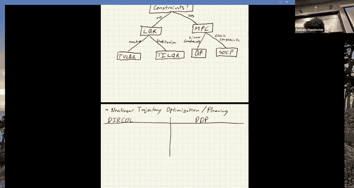


这类问题适用于动态系统本身是线性的，或者可以通过线性化（例如在参考轨迹或平衡点附近）进行局部控制的情况。以下是决策流程：


首先，判断问题是否有约束（指除动力学方程外的约束，如控制限幅、障碍物等）。


*   **如果没有约束**，可以使用 **LQR**。这是一个闭式解。
    *   如果是跟踪问题（跟随一条时变轨迹），则使用时变LQR。
    *   如果是镇定问题（稳定在一个固定点），则使用经典的时不变LQR（常值增益矩阵K）。
*   **如果有约束**，则需要使用 **模型预测控制**。
    *   如果约束是**线性不等式**，则问题是一个**二次规划**。这是目前机器人控制中非常成熟和快速的方法。
    *   如果约束是**锥形约束**（如摩擦锥、火箭软着陆约束），则问题是一个**二阶锥规划**。这仍处于研究前沿，但也是可行的。


### 非线性轨迹优化/规划

这类问题用于离线的轨迹设计或规划，特别是当动态高度非线性或存在复杂约束时。我们主要讨论了两种算法：**微分动态规划** 和 **直接配点法**。

以下是它们的优缺点比较：

*   **动态可行性**：
    *   **直接配点法**：将动力学作为优化问题中的等式约束。只有在求解器收敛到KKT条件的解时，才严格满足动力学。
    *   **DDP**：通过前向积分（rollout）始终保证动力学可行性。
*   **初始猜测**：
    *   **直接配点法**：可以提供一个不满足动力学的“卡通”轨迹作为初始猜测，可能有助于更快收敛。
    *   **DDP**：只能提供控制量的初始猜测，然后通过动力学积分得到状态轨迹。对于高度非线性系统，这可能难以提供一个好的起点。
*   **约束处理**：
    *   **直接配点法**：可以相对容易地处理任意形式的约束。
    *   **DDP**：处理约束需要额外技巧，如使用压缩函数处理控制约束，或使用惩罚函数/增广拉格朗日法处理状态约束。
*   **额外输出**：
    *   **DDP**：在反向传播过程中会计算出反馈增益矩阵 `K`。在收敛时，这些 `K` 矩阵与时变LQR的结果相同，相当于“免费”得到了一个跟踪控制器。
    *   **直接配点法**：需要单独设计跟踪控制器。
*   **速度与效率**：
    *   **DDP**：通常以局部收敛速度快、内存效率高著称，更容易在嵌入式系统上实现。
    *   **直接配点法**：通常不如DDP高效，且需要大规模序列二次规划求解器，在嵌入式系统上实现更困难。
*   **数值鲁棒性**：
    *   **直接配点法**：使用工业级NLP求解器（如SNOPT、IPOPT），内置了智能的缩放和数值稳定技巧，对长时域和病态问题更鲁棒。
    *   **DDP**：可能存在病态条件问题，特别是当变量缩放不当或使用惩罚函数处理约束时。长时域问题可能导致梯度消失/爆炸。

**总结**：
*   **DDP** 通常是**在线实时控制**的不错选择，特别是当计算速度至关重要，且对约束精度要求不那么极端时。
*   **直接配点法** 等直接方法通常是**离线轨迹设计**的不错选择，特别是当问题具有长时域、高度非线性或复杂约束时。

---

## 🧭 为什么需要专门处理三维旋转？

本节我们将转向一个在机器人学中至关重要的话题：三维旋转。许多机器人系统，如四旋翼、飞机、航天器、水下机器人和足式机器人，在运行中都会涉及大范围旋转。


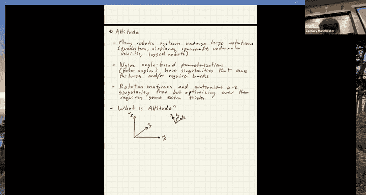

人们常用欧拉角来处理旋转，但这种方法存在**奇异性**问题（例如，当俯仰角为90度时，方向余弦矩阵映射角速度到欧拉角导数的雅可比矩阵会奇异），可能导致数值计算失败甚至系统崩溃。因此，我们不推荐使用欧拉角。

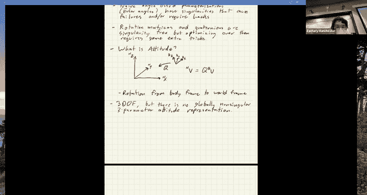


常见的无奇异性替代方案是**旋转矩阵**和**四元数**。
*   **旋转矩阵**：总是有效，但用9个（或6个独立）参数表示3个自由度，存在冗余。
*   **四元数**：用4个参数表示3个自由度，只有1个约束（单位范数），在动力学和最优控制中更高效，是计算机图形学、航空航天和机器人领域的常用选择。

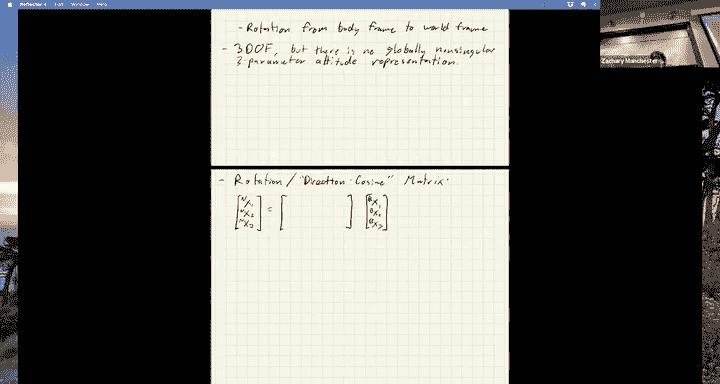

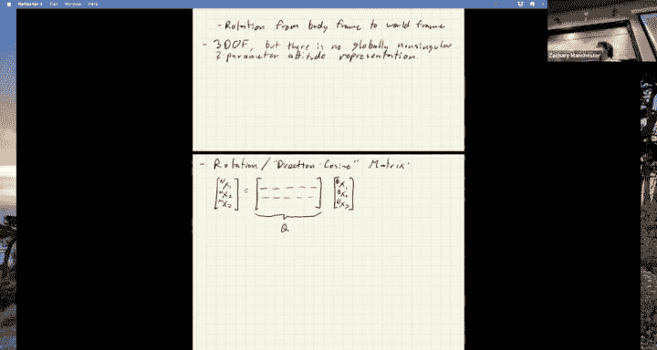

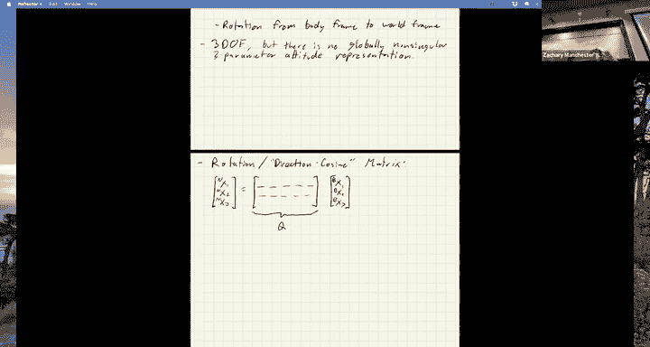

---

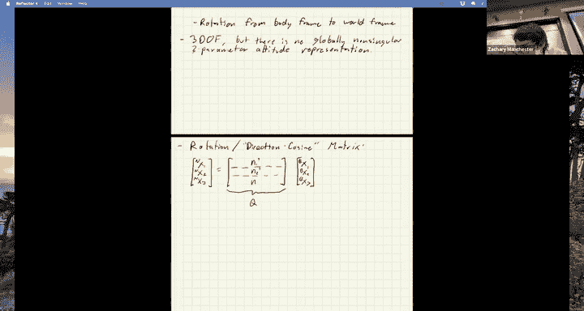

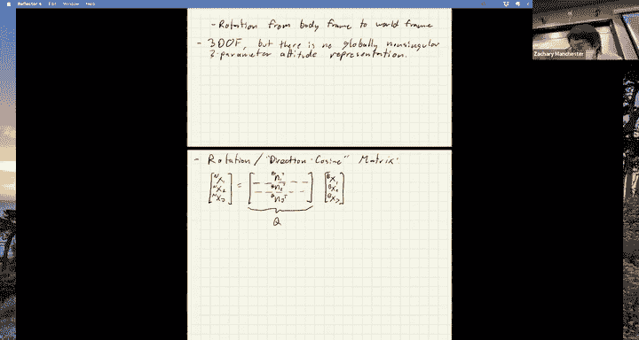

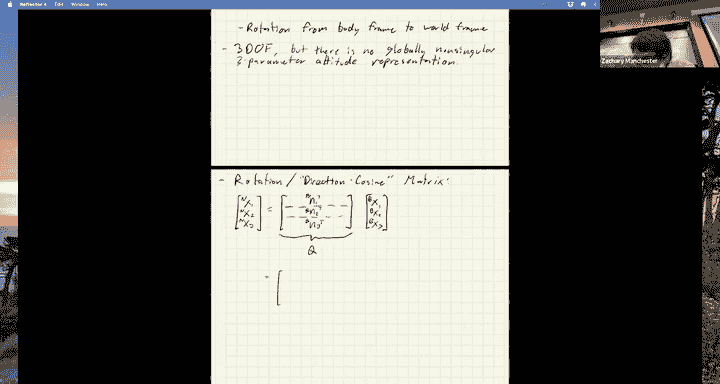

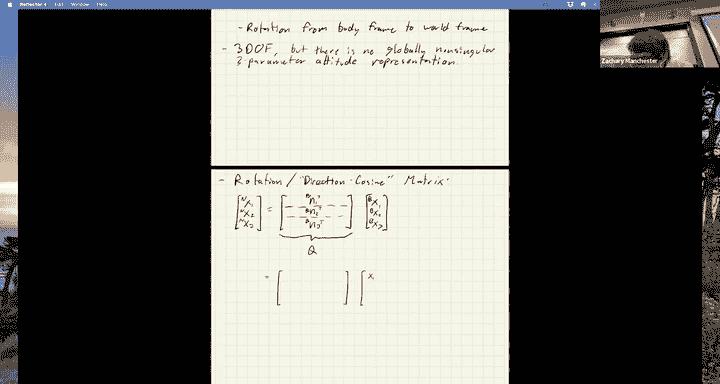

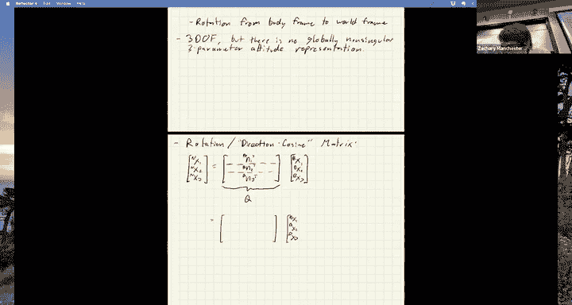


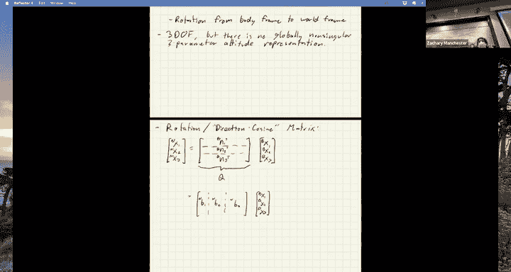

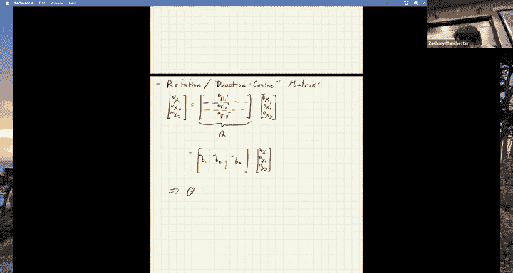

## 📐 旋转矩阵基础

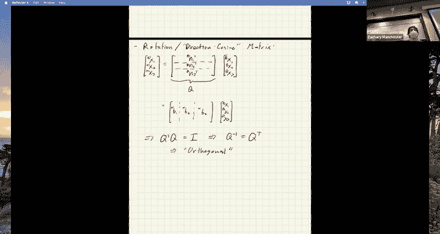

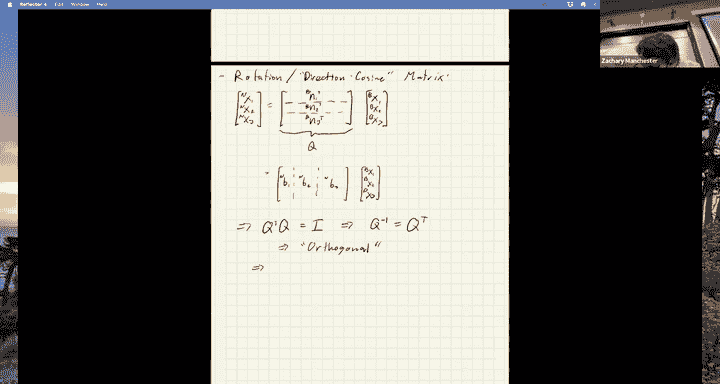

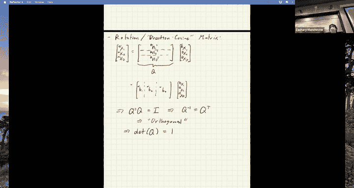

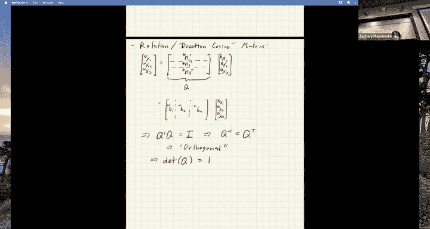

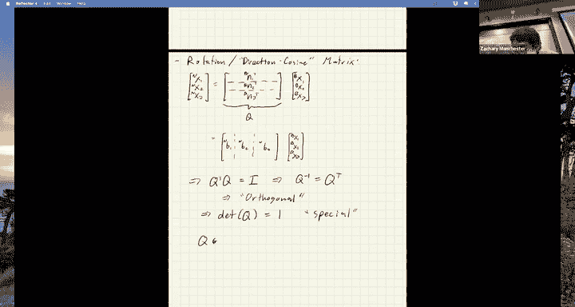

**姿态** 通常定义为物体坐标系（B系）到惯性世界坐标系（N系）的旋转。设旋转矩阵为 `Q`，则有：
```
v^N = Q * v^B
```
其中 `v^B` 是物体坐标系下的向量，`v^N` 是世界坐标系下的同一向量。

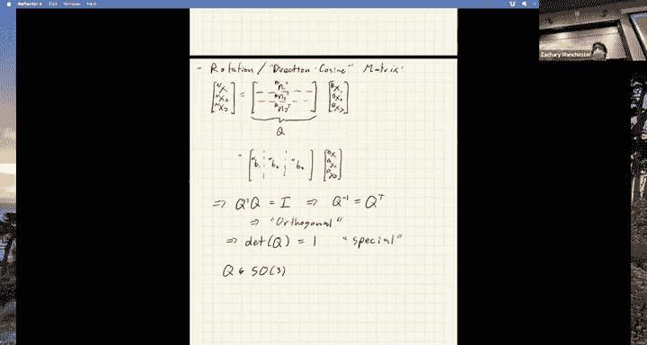

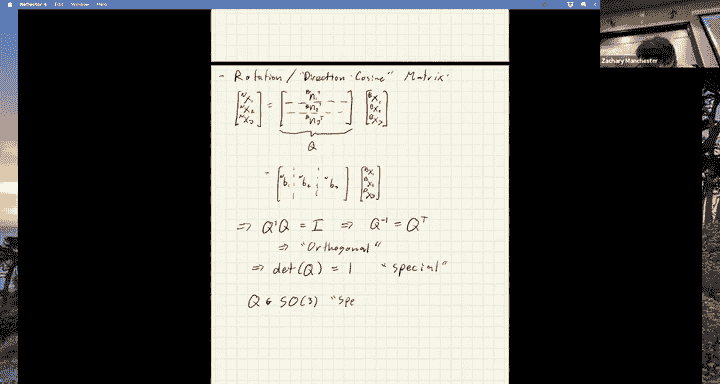


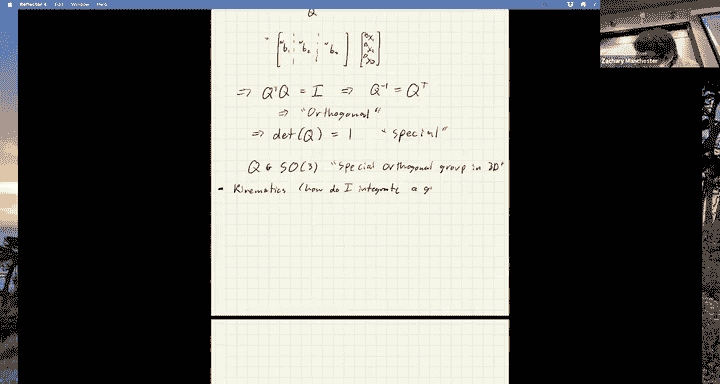

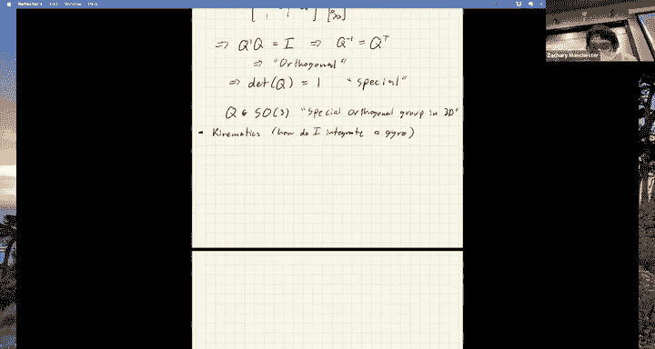

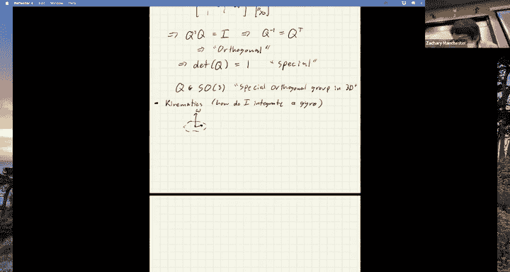

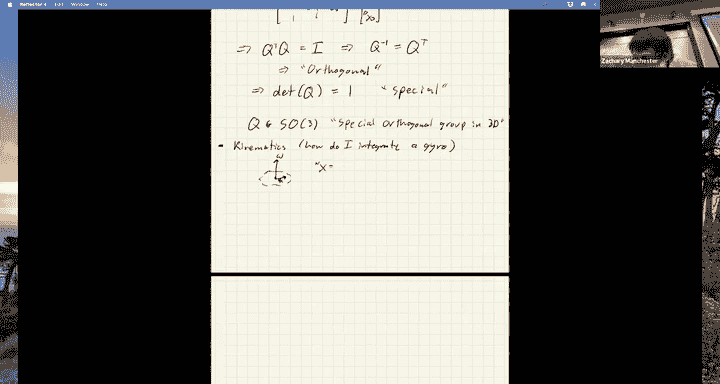

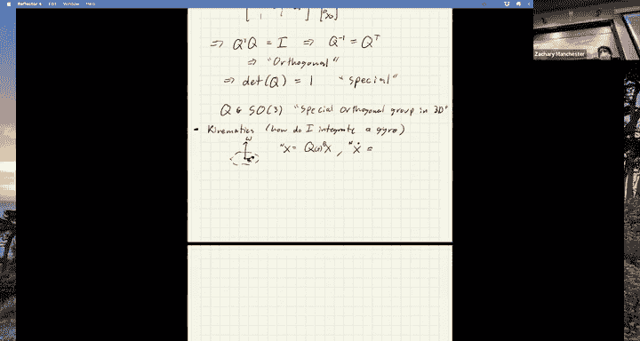

旋转矩阵 `Q` 属于**特殊正交群 SO(3)**，满足：
```
Q^T * Q = I
det(Q) = +1
```
这意味着 `Q` 的逆等于其转置，且其列（或行）是两两正交的单位向量。

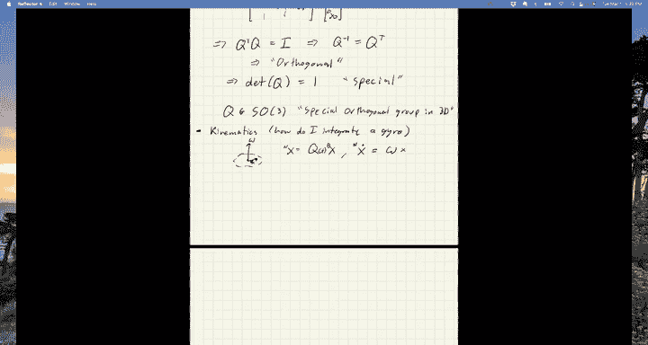

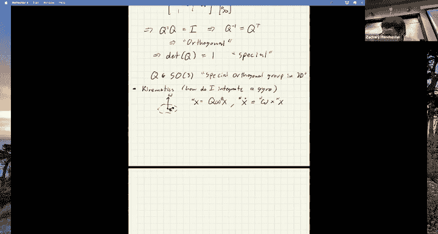

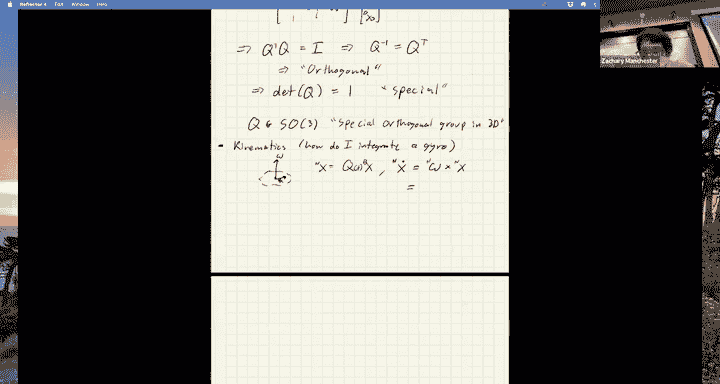

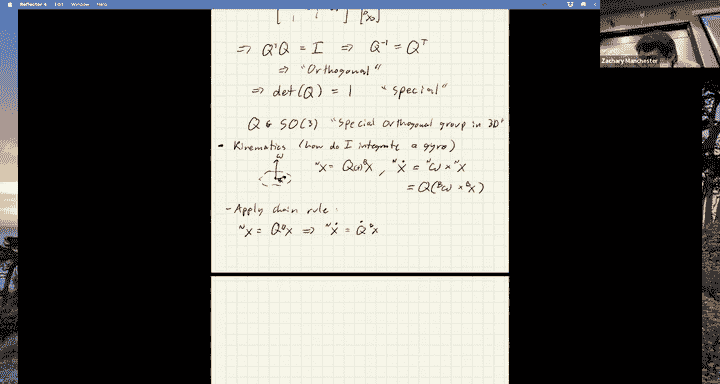

**旋转运动学** 描述了如何将角速度 `ω` 积分得到旋转矩阵。推导可得：
```
Q_dot = Q * ω_hat
```
其中 `ω_hat` 是角速度向量 `ω` 对应的叉乘矩阵（反对称矩阵）：
```
ω_hat = [ 0,    -ω_z,  ω_y;
          ω_z,   0,    -ω_x;
         -ω_y,   ω_x,  0 ]
```
通过此式，结合来自陀螺仪的 `ω` 测量值，可以对姿态 `Q` 进行积分（航位推算）。

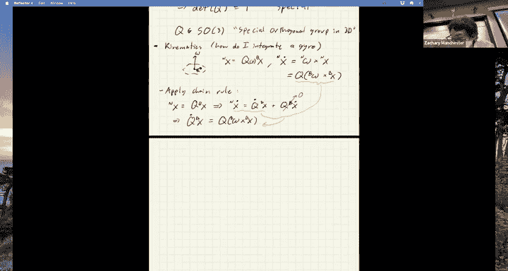

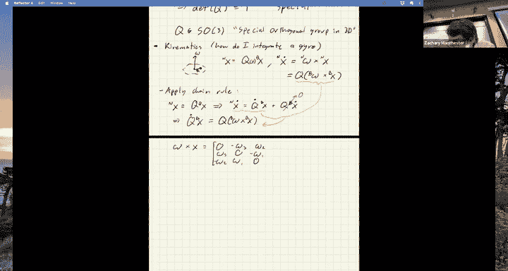


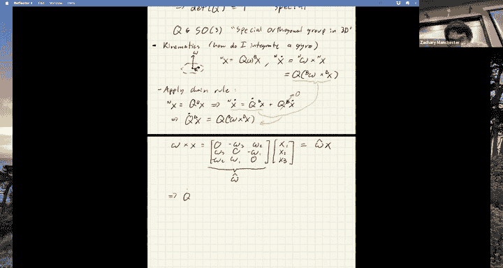

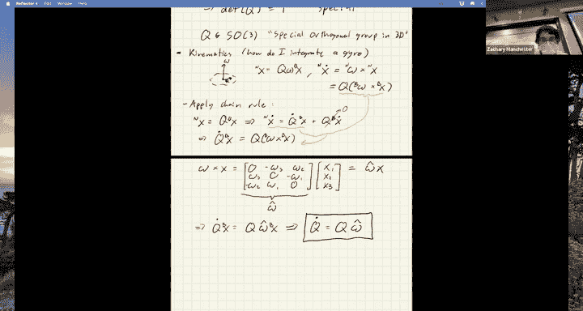

---

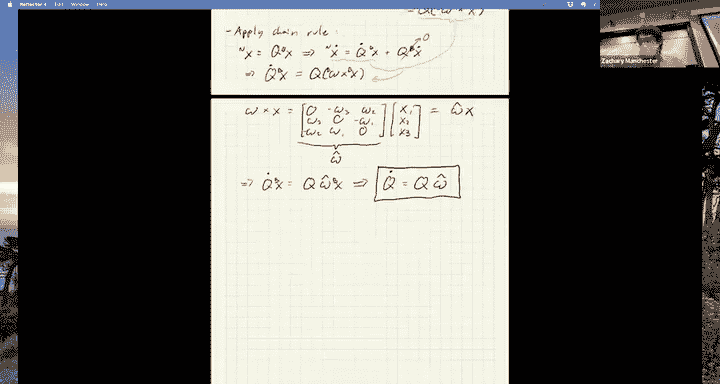

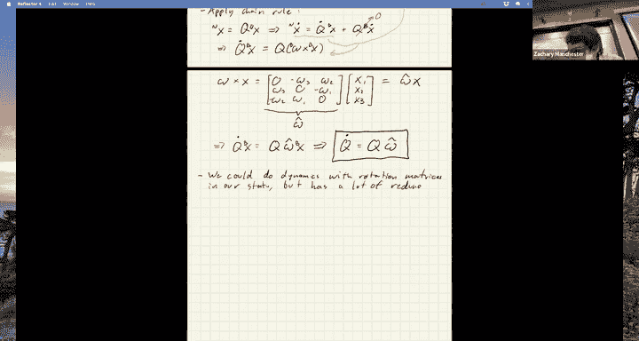


## 🧮 四元数：更高效的表示


四元数 `q` 是一个四维向量，可以看作由一个标量部分和一个向量部分组成：
```
q = [s, v]^T = [cos(θ/2), a * sin(θ/2)]^T
```
其中 `a` 是单位旋转轴向量，`θ` 是绕该轴旋转的角度。


**重要性质**：
1.  **单位范数**：有效的旋转四元数满足 `||q|| = 1`。数值上很容易进行归一化。
2.  **双覆盖**：`q` 和 `-q` 代表同一个物理旋转。这是因为将 `θ` 增加 `2π` 后，`cos(θ/2)` 和 `sin(θ/2)` 会变号。
3.  **四元数乘法**：对应旋转矩阵的乘法。对于两个四元数 `q1 = [s1, v1]^T` 和 `q2 = [s2, v2]^T`，其乘积定义为：
    ```
    q1 * q2 = [ s1*s2 - v1^T*v2,  s1*v2 + s2*v1 + v1 × v2 ]^T
    ```
    这个运算可以写成矩阵形式，定义左乘矩阵 `L(q)` 和右乘矩阵 `R(q)`，使得：
    ```
    q1 * q2 = L(q1) * q2 = R(q2) * q1
    ```
4.  **单位四元数**：对应于无旋转，`q_identity = [1, 0, 0, 0]^T`。
5.  **共轭四元数**：对应于逆旋转，`q† = [s, -v]^T`。可以定义矩阵 `T` 使得 `q† = T * q`。
6.  **用四元数旋转向量**：要将物体坐标系下的向量 `v^B` 旋转到世界坐标系，可以构造一个纯向量四元数 `[0, v^B]^T`，然后进行运算：
    ```
    [0, v^N] = q * [0, v^B] * q†
    ```
    这等价于 `v^N = (R(q)^T * L(q)) * v^B`，其中括号内的部分就是对应的旋转矩阵。
7.  **四元数运动学**：四元数随角速度变化的微分方程为：
    ```
    q_dot = (1/2) * q * [0, ω]^T = (1/2) * L(q) * H * ω
    ```
    其中 `H` 是一个将3维向量提升为4维纯向量四元数的矩阵。这个方程用于结合陀螺仪数据进行姿态积分。


---


## 🎯 本节课总结


本节课中我们一起学习了：
1.  对**线性/局部控制**和**非线性轨迹优化**的各类算法进行了系统回顾和比较，梳理了它们各自的适用场景和优缺点。
2.  引入了机器人学中至关重要的**三维旋转**问题，解释了为什么欧拉角存在缺陷。
3.  详细介绍了**旋转矩阵**的数学定义、性质及其运动学方程 `Q_dot = Q * ω_hat`。
4.  引入了更高效的**四元数**表示，解释了其几何意义、核心性质（单位范数、双覆盖）、乘法运算以及运动学方程 `q_dot = 0.5 * q * [0, ω]^T`。


这些关于旋转的数学工具是描述和优化具有三维旋转自由度系统（如无人机、人形机器人）的基础。下一节课，我们将继续探讨如何在优化问题中处理四元数这类带有约束的状态变量。