# 19：随机最优控制与LQG 🎯

在本节课中，我们将首先完成上节课关于迭代学习控制的讨论，然后深入探讨随机最优控制的基本理论，并重点学习著名的线性二次高斯问题。

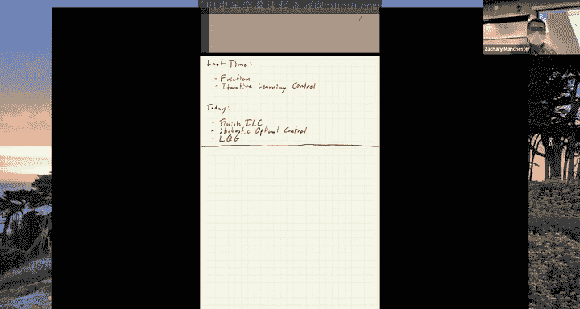

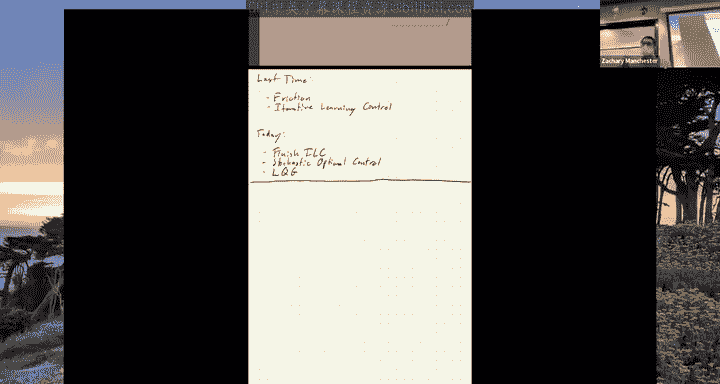

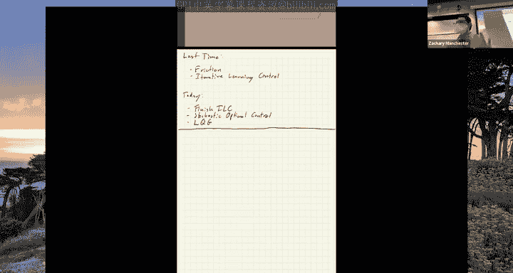

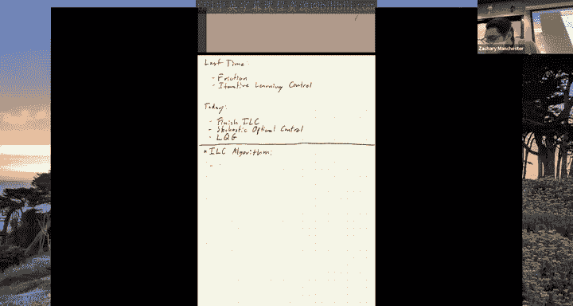

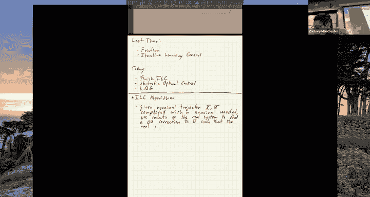

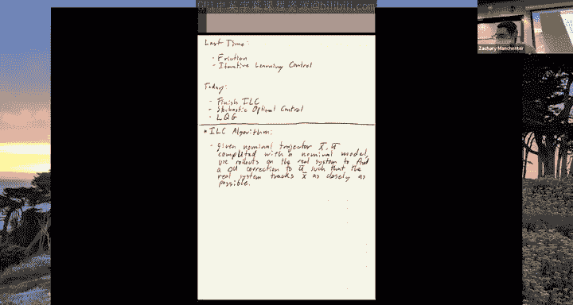

---

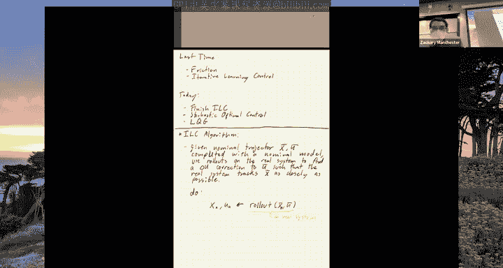

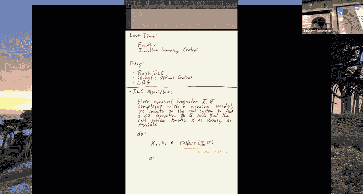

## 回顾：迭代学习控制

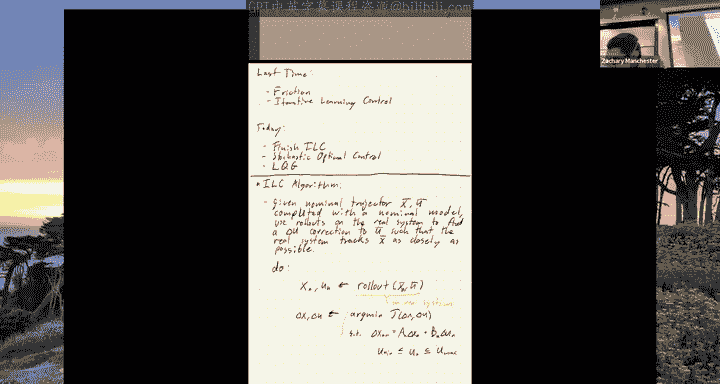

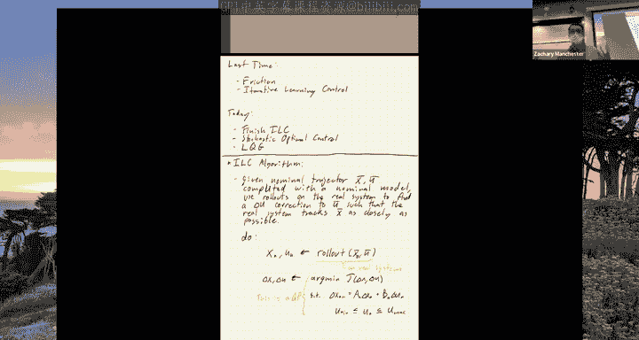

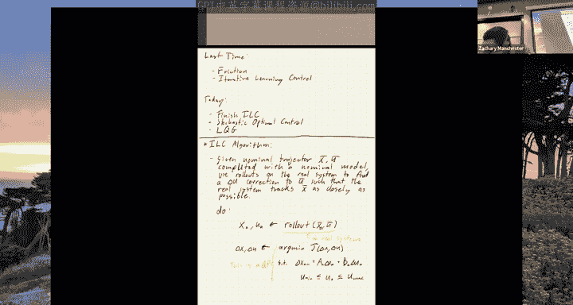

上一节我们讨论了摩擦和迭代学习控制。由于时间关系，我们未能完成最后几个要点，因此今天先快速回顾并完成这部分内容。

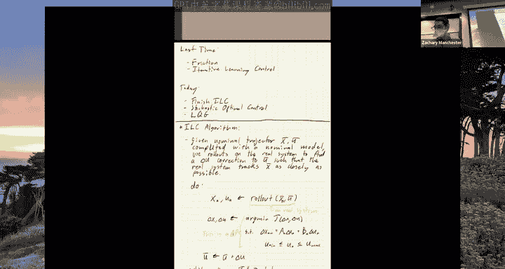

迭代学习控制是一种非常酷的算法，大约十年前人们用它做出了一些非常出色的成果。虽然随着深度强化学习的兴起，这个领域像许多其他控制理论主题一样不再那么流行，但我认为它仍然很酷，并且还有一些有趣的事情可以做。

### ILC算法总结


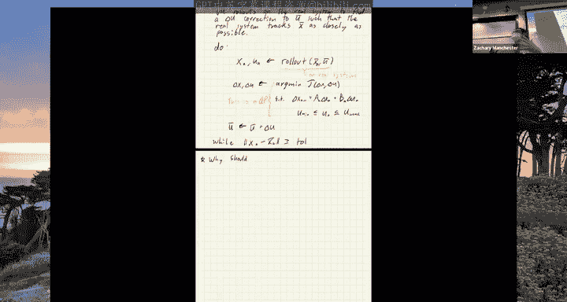

以下是ILC算法的伪代码级总结，并讨论其为何有效。

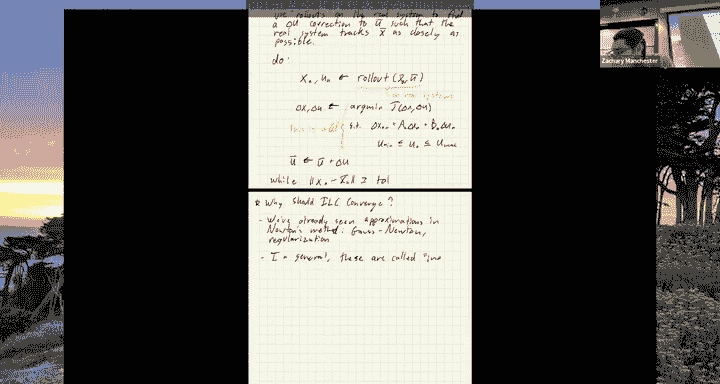


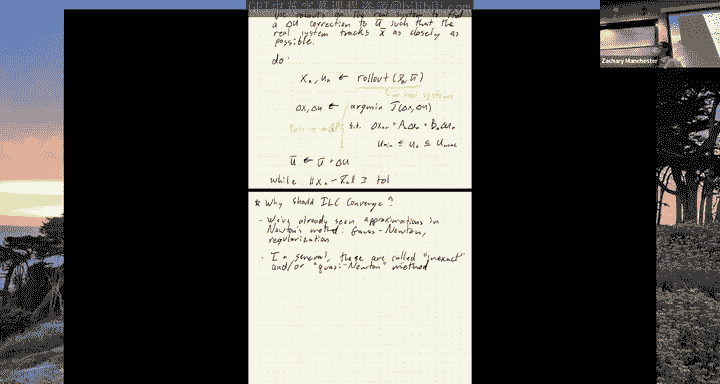


**算法目标：**
给定一条由名义模型计算出的名义轨迹 `X_bar` 和 `U_bar`，我们希望在真实系统上通过多次“试运行”来更新控制输入 `U`，即计算一个增量 `ΔU`，使得真实系统能够跟踪上名义轨迹 `X_bar`。

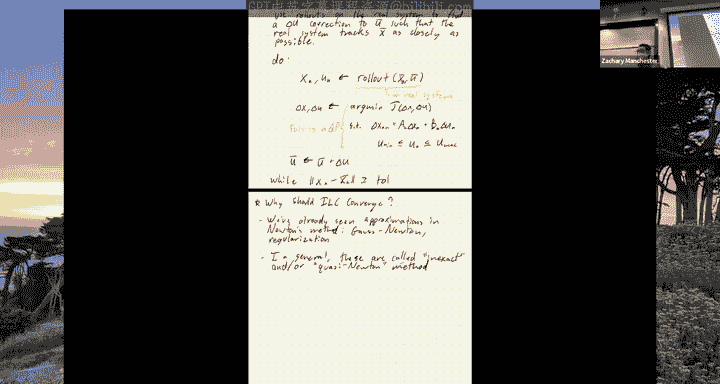


**算法步骤：**
1.  **在真实系统上进行试运行：**
    在每次迭代中，从初始状态 `X0_bar` 出发，使用当前的开环控制序列 `U_bar` 在真实系统上进行一次完整的轨迹运行，得到实际状态序列 `X_k`。
    ```
    X_k = rollout_real_system(X0_bar, U_bar)
    ```


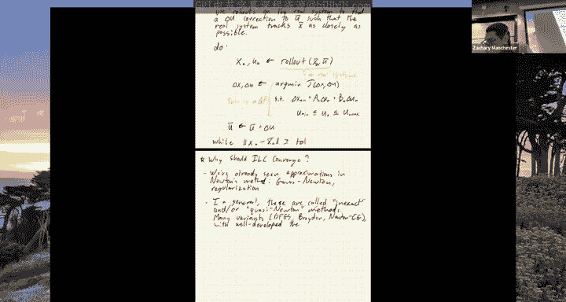

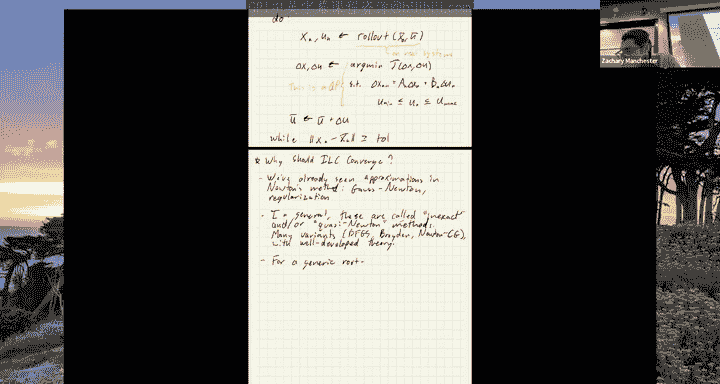

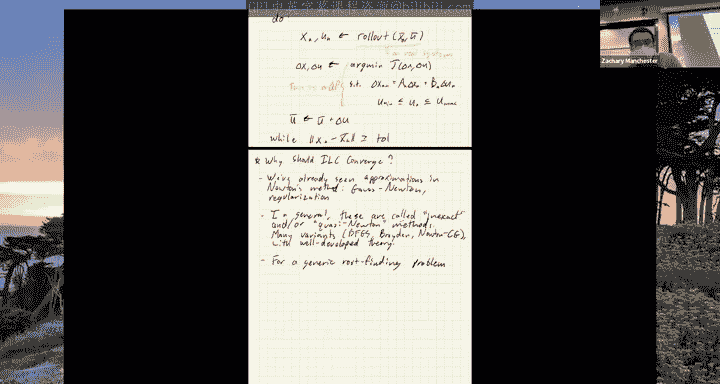


2.  **求解局部最优控制问题（QP）：**
    基于名义模型和实际运行得到的误差，求解一个二次规划问题，计算状态和控制输入的增量 `ΔX` 和 `ΔU`。
    代价函数 `J` 是 `ΔX` 和 `ΔU` 的二次型，通过对原代价函数在参考轨迹处进行泰勒展开，并代入实际运行误差得到。
    约束包括基于名义模型线性化的动力学方程，以及可能存在的其他约束（如扭矩限制）。
    ```
    min_{ΔX, ΔU} J(ΔX, ΔU)
    s.t.  ΔX_{k+1} = A_k ΔX_k + B_k ΔU_k  (线性化动力学)
          其他约束（如 U_bar_k + ΔU_k 在扭矩限内）
    ```

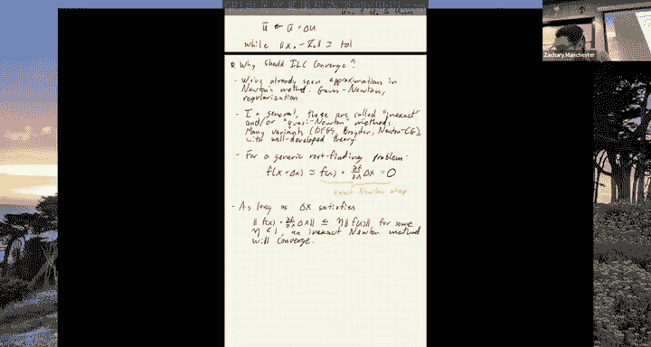

3.  **更新控制序列：**
    使用求解得到的 `ΔU` 更新名义控制序列。
    ```
    U_bar_new = U_bar_old + ΔU
    ```

4.  **循环：**
    重复步骤1-3，直到跟踪误差 `X_k - X_bar_k` 小于某个容差。

这个循环看起来非常像序列二次规划，唯一的区别在于“试运行”步骤是在真实硬件系统上进行的，而不是在仿真中使用某个动力学模型。实际上，你可以用SQP、动态规划等任何我们讨论过的轨迹优化方法来求解内部QP问题，关键区别在于用真实硬件试运行替代了动力学模型。

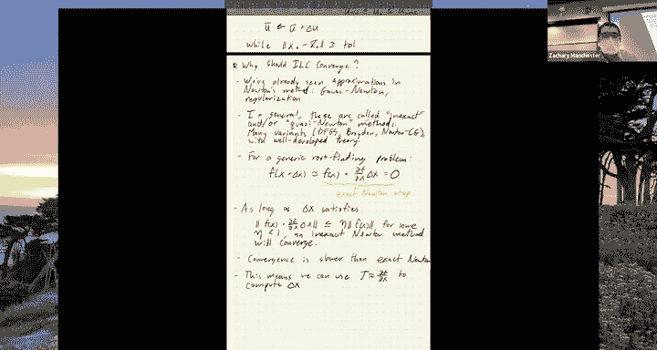

### 关于收敛性的讨论

一个自然的问题是：我们使用已知有误的名义模型来计算雅可比矩阵等信息，为什么算法仍然能收敛？

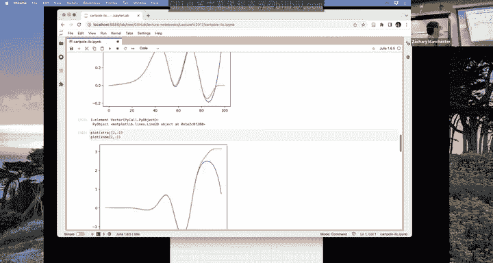

答案在于，牛顿法即使在KKT矩阵中的信息存在相当大误差时，通常仍然有效。这类似于拟牛顿法（如BFGS、L-BFGS）背后的理论。这些方法以各种方式近似海森矩阵，虽然无法达到使用精确导数的完整牛顿法的收敛速度，但仍然可以实现相当快（甚至是超线性）的收敛。即使雅可比矩阵存在较大误差，它们仍然比梯度下降法好得多。

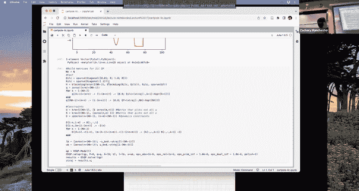

更形式化地说，存在一系列“不精确牛顿法”和“拟牛顿法”。只要计算出的增量步长 `Δx` 满足某个与收敛速率相关的不等式，算法就能收敛。这意味着，只要名义模型没有偏离真实系统太远，使用它计算的牛顿步长仍然能提供一个下降方向，并最终收敛。

### 演示：ILC在倒立摆上的应用

我们通过一个倒立摆摆起任务的演示来直观理解ILC。
1.  **离线规划：** 首先使用名义模型进行离线轨迹优化，得到一个摆起的开环轨迹和LQR跟踪控制器。
2.  **引入模型误差：** 我们创建一个“真实”模型，其中改变了小车和摆的质量、摆长，并添加了一个复杂的非线性摩擦项来模拟库仑摩擦。
3.  **开环执行：** 在真实模型上执行名义开环轨迹，任务失败。
4.  **加入LQR反馈：** 加入LQR跟踪控制器后，摆起成功，但违反了执行器的扭矩限制（因为模型变重且有摩擦，需要更大扭矩）。
5.  **强制执行扭矩限制：** 在仿真中强制执行扭矩限制后，LQR控制器再次失败。
6.  **运行ILC：** 移除LQR，运行ILC循环。算法在每次试运行后求解QP来更新控制序列。经过大约5-8次试运行后，系统能够在严格遵守扭矩限制的前提下，完美地完成摆起任务。

这个演示表明，ILC能够用很少的几次真实系统试验，补偿模型误差和未建模动态，实现高性能跟踪。

### 实际应用与考量

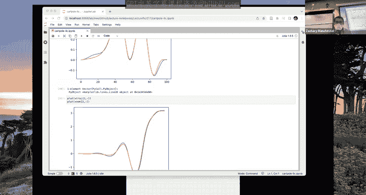

ILC非常适用于任务确定且可重复的场景（如工业机器人执行固定任务）。只要系统动态在多次试验间保持一致，通过几次学习就能获得完美跟踪性能，之后便可一直使用。

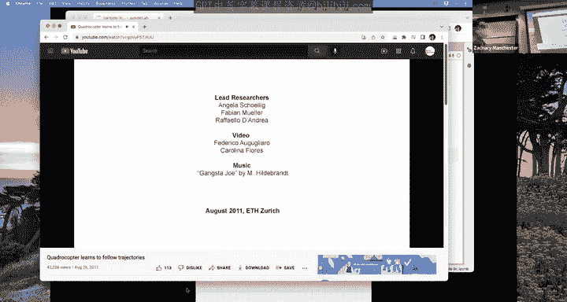

如果环境发生变化（如恒定的侧风），ILC也能通过学习新的开环控制量来进行补偿。对于更复杂的随机扰动或动态时变的情况，可能需要结合在线自适应策略。

ILC本质上也可以看作一种策略梯度方法，其中策略参数就是开环控制序列 `U_bar`。它使用拟牛顿更新而非梯度下降，因此收敛速度更快。

---

## 随机最优控制与LQG 🎲

现在，我们完全切换话题，开始讨论随机最优控制。

到目前为止，我们一直假设系统是确定性的，并且我们完全知道系统状态。现在我们要放松这个假设。在实际中，我们通常无法直接测量所有状态，只能得到与状态相关的噪声测量值 `y`，例如 `y = g(x)`。

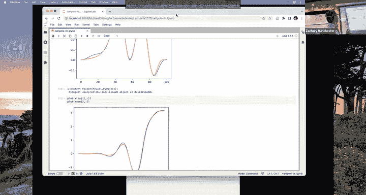

### 问题设定

在随机设定下，我们无法获得确切的状态 `x`，只能获得基于实际测量 `y` 的状态概率分布，即条件概率密度函数 `p(x|y)`。

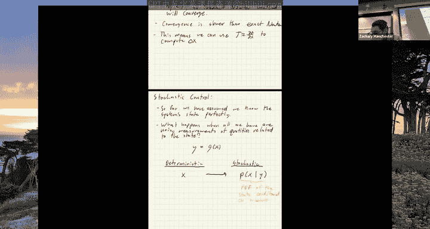

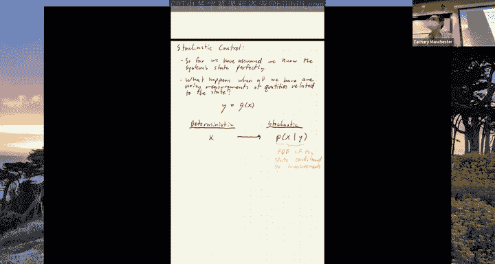

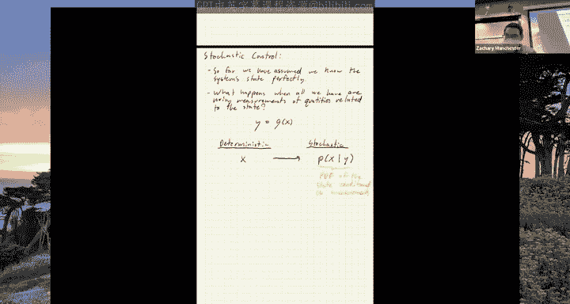

我们可以写出随机最优控制问题的一般形式，即在我们之前求解的最优控制问题基础上，给代价函数加上期望算子：
```
min_u E[ J(x, u) ]
```
理论上，我们可以像以前一样用动态规划求解这个问题，但对于一般情况，这非常困难，会遭遇“维数灾难”。

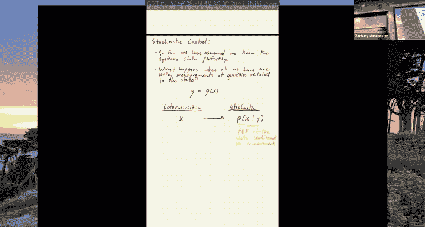

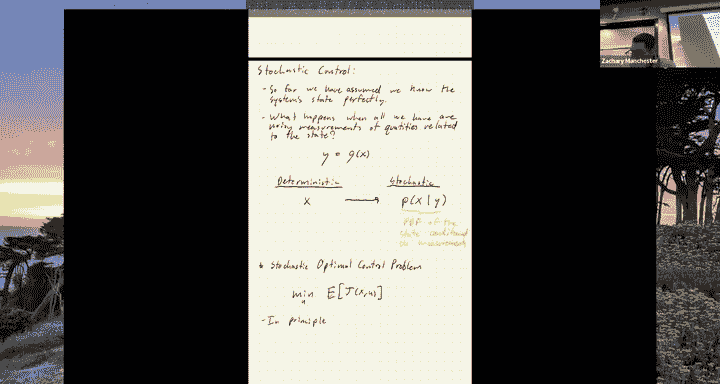


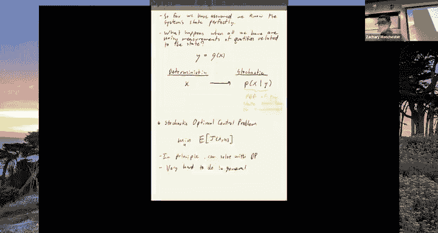

### 线性二次高斯问题


LQG是随机最优控制中一个可以解析求解的特殊案例。
*   **L** 代表 **线性** 动力学。
*   **Q** 代表 **二次** 代价。
*   **G** 代表 **高斯** 噪声。


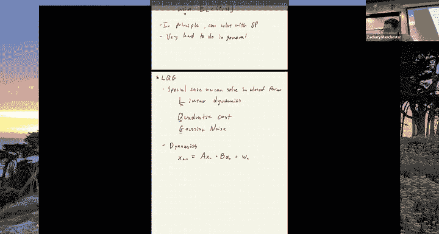

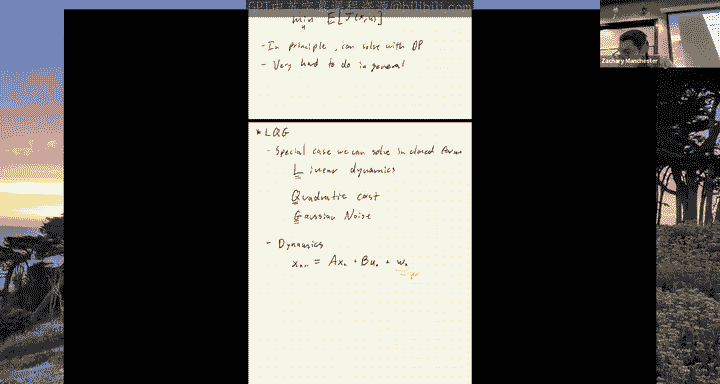

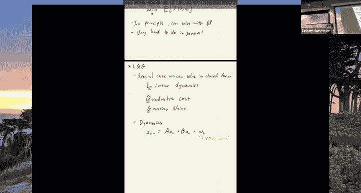

这基本上是我们已经讨论过的LQR问题的随机版本。

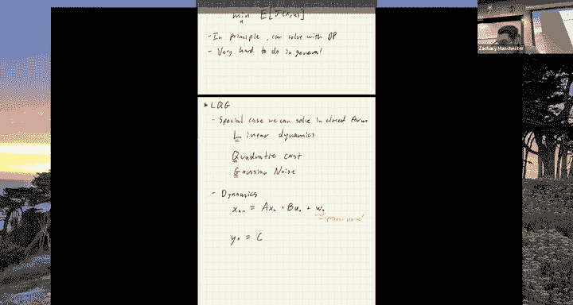


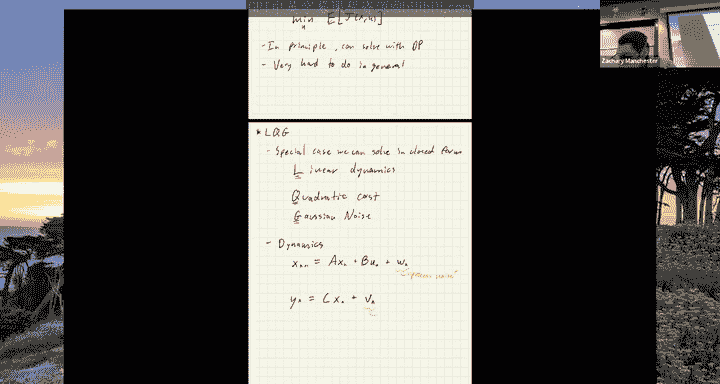

**系统模型：**
*   **动力学（过程噪声）：** `x_{k+1} = A x_k + B u_k + w_k`，其中 `w_k ~ N(0, W)` 是过程噪声。
*   **测量模型（测量噪声）：** `y_k = C x_k + v_k`，其中 `v_k ~ N(0, V)` 是测量噪声。
*   噪声序列 `{w_k}` 和 `{v_k}` 假设是零均值、白噪声，且彼此不相关。


**目标：** 最小化期望代价 `J = E[ Σ (x_k^T Q x_k + u_k^T R u_k) + x_N^T Q_N x_N ]`。

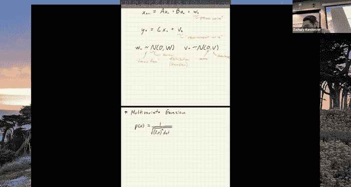

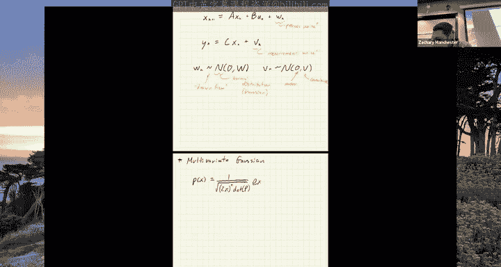

### 动态规划求解

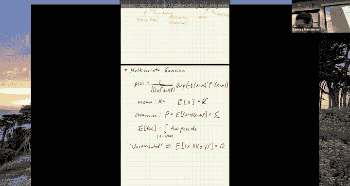

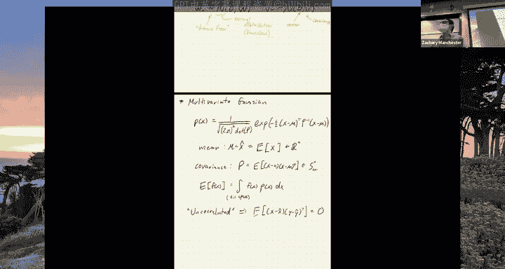

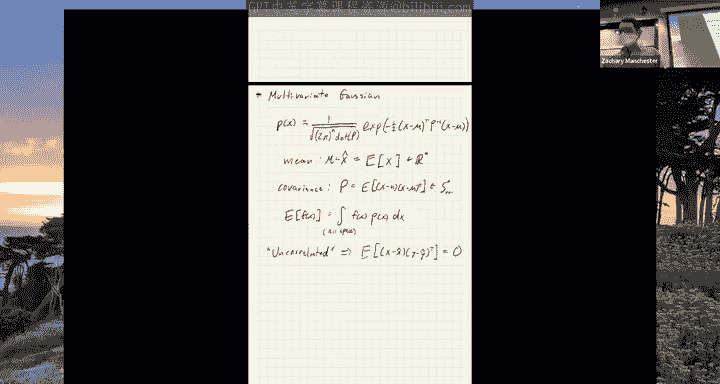

我们尝试用动态规划求解。从终端代价 `V_N(x) = E[ x_N^T Q_N x_N ]` 开始，向后递归。


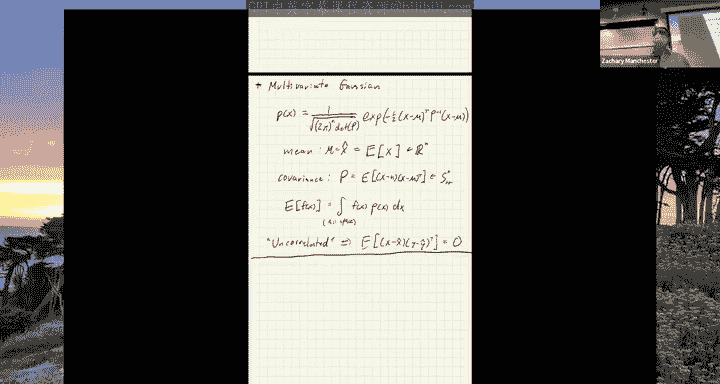


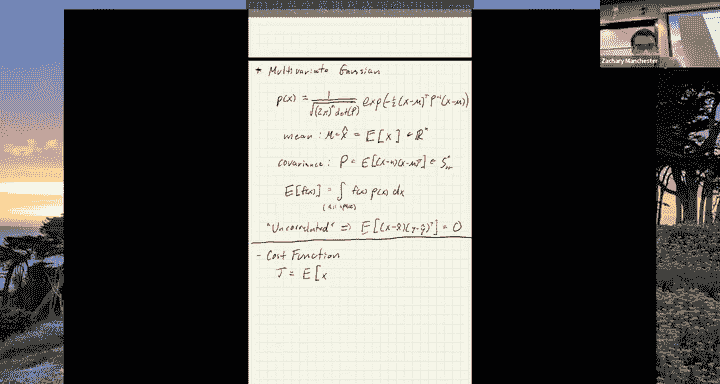

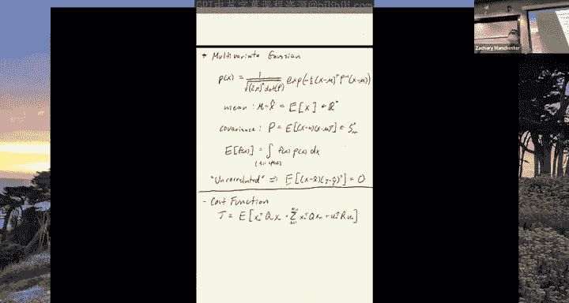

计算 `V_{N-1}(x)` 时，我们会得到包含标准LQR项和噪声项的表达式。关键步骤在于分析噪声项：
1.  由于噪声 `w_k` 与当前状态 `x_k` 和控制 `u_k` 不相关，且均值为零，因此所有形如 `E[ x_k^T * w_k ]` 或 `E[ u_k^T * w_k ]` 的交叉项期望值为零。
2.  形如 `E[ w_k^T P w_k ]` 的项是一个常数，等于 `trace(W * P)`。


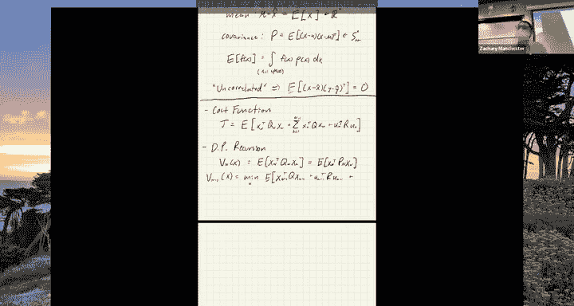


**结论：** 在LQG问题中，所有噪声项要么期望为零，要么为常数。这意味着**噪声的存在并不影响最优控制器的形式**，它只是使总代价增加了一个常数偏移量。因此，**随机LQG问题的最优控制器与确定性LQR问题的最优控制器完全相同**。

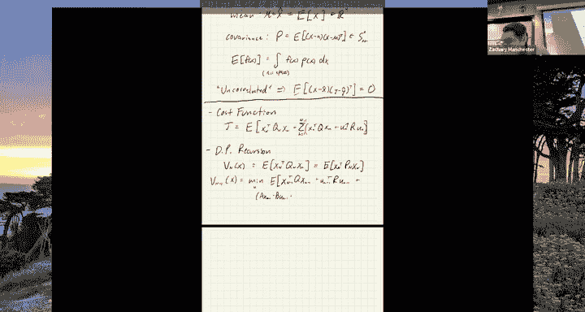

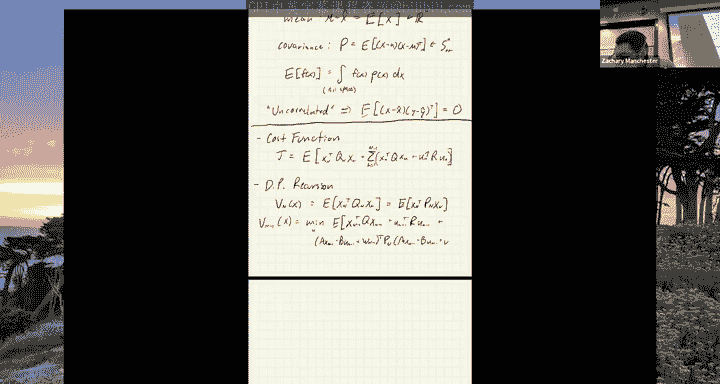

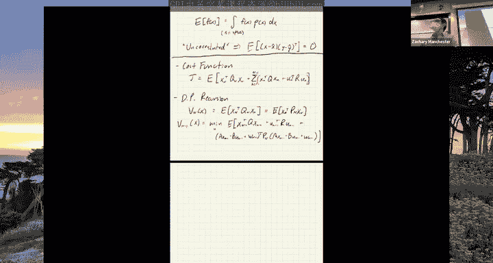

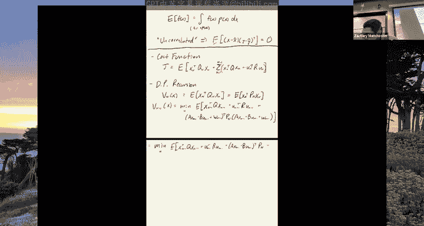


### 确定性等价原理与分离原理


上述结论引出了两个经典的控制理论结果：


1.  **确定性等价原理：** 对于LQG问题，最优控制器就是在确定性LQR控制器中，用状态的条件期望 `E[x|y]` 替换真实状态 `x`。
    ```
    u*_k = -K_k * E[x_k | y_{0:k}]
    ```


2.  **分离原理：** 对于LQG问题，我们可以**独立地**设计两部分：
    *   **一个最优状态估计器（卡尔曼滤波器）：** 根据测量 `y` 产生状态估计 `\hat{x}_k = E[x_k | y_{0:k}]`。
    *   **一个最优反馈控制器（LQR）：** 将上述状态估计视为真实状态，计算控制量 `u_k = -K_k \hat{x}_k`。
    将这两部分组合起来，就构成了原随机最优控制问题的最优解。


**重要提示：** 这两个原理仅在**线性系统、二次代价、高斯噪声**的假设下严格成立。对于一般的非线性、非高斯问题，这些原理不再成立。此时，估计器和控制器会紧密耦合（例如，为了更好估计状态，可能需要执行特定的控制动作）。然而，在实践中，我们通常仍然采用这种“估计+控制”的分离架构，只要状态估计足够准确，并且噪声分布是单峰的，它通常能取得很好的效果。


---


## 总结 🎉


本节课中，我们一起学习了两个重要主题。

首先，我们完成了对**迭代学习控制**的探讨。ILC是一种利用真实系统多次试验数据来补偿模型误差、优化开环控制序列的方法。其核心在于在真实硬件上“试运行”，然后基于名义模型求解一个局部二次规划来更新控制量。即使模型不精确，算法也能快速收敛，是实现“仿真到现实”转移的强大工具。

随后，我们深入研究了**随机最优控制**，并重点分析了**线性二次高斯问题**。我们推导发现，在LQG的假设下，过程噪声和测量噪声并不改变最优控制器的结构。由此引出了**确定性等价原理**和**分离原理**，即最优解可以分解为一个独立的最优状态估计器（卡尔曼滤波器）和一个独立的最优反馈控制器（LQR）的级联。虽然这些原理在更一般的非线性随机控制问题中不成立，但分离架构仍然是实际工程中广泛采用且非常有效的范式。